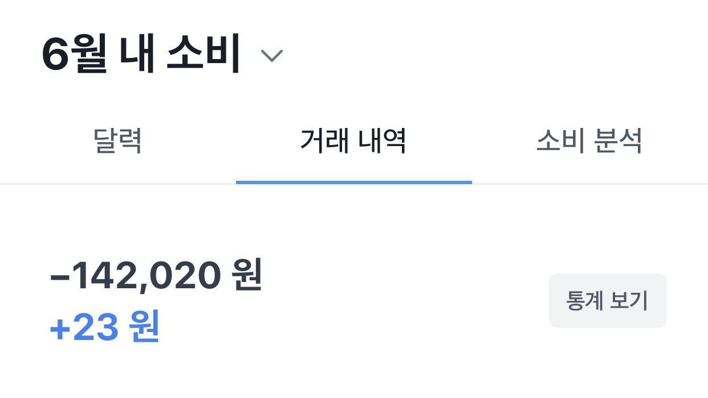

## 인생 역대급 고난과 그걸 버텨낸 이후의 방향성 

2017년, 11월, 친구와 사업을 시작했다. 망했고, 회사에 들어갔다. 
2019년, 1월 2일, 입사 첫 날에 만난 나의 직속 상사는 초등학교 도덕시간에 잠을 많이 잔듯 했다.

2019년의 여름은 내 인생에서 가장 힘든 시기였다. 주변에서는 취업난에 일을 할 수 있음에 감사하라고 했다. 하지만 나에게 출근은 지옥이었다.

출근한 지 6개월도 되지 않아 스트레스로 임파선에 문제가 생겼고 정말 진지하게 죽음에 대한 고민을 시작했다. 가까운 한강대교에서 아래를 내려다볼 때 나한테 드는 생각은 억울함이었는데, 나름 열심히 살아온 내가 왜 이렇게 고통받아야 하는지 당췌 이해할 수 없었다.

퇴사를 결심하고, 퇴사를 하고는 혼자서 부산에 갔다. 서울에는 아는 사람들이 너무 많았기 때문이다. 아무도 나를 모르는 도시에 숨어버리고 싶었다. 당시에 식욕이 너무 없었다. 하루에 한 번 편의점 도시락을 먹어서 몸무게가 많이 줄었다. 소비행위를 거의 하지 않았다. 피우는 담배와 밥을 제외하곤 하루종일 집에 틀어박혀 아무 의미 없는 동영상을 보며 웃는 것이 나의 유일한 기쁨이었다.

<em>지금봐도 참 먹먹해지는 월간 소비내역이다.</em>

 
19년의 여름은 정말 더웠고 가만히 있어도 숨이 막혔다. 하지만 나는 그때가 겨울이었더라도 숨을 제대로 쉬지 못했을 것이다. 사업과 직장 적응에 모두 실패한 그 때의 나는 정말 불쌍했었다. 어찌저찌 버텨 살아남은 나는 9월에 서울로 올라왔고 사랑하는 가족들과 존경스러운 친구들 덕에 현재는 몸과 마음의 건강을 되찾았다.

다시 살아 가야겠다는 생각이 들었다. 정상적인 생활, 일과 관계를 회복하는 것이 가장 중요했다. 열심히 노력했고, 살이 좀 쪘다. 또, 운이 좋게도 배울 것이 많은 회사에 들어왔다. 내가 지금 일하는 기업은 실물을 기반으로 하는 사업을 영위한다. 그래서 다행히 도덕적으로 빻은 사람들이 살아남기 힘들다. 연락이 없어 걱정해주던 친구들은 고생했다며 카카오톡 기프티콘을 보내주었다.

몸과 마음이 괜찮아진 **나는 다시는 2018년과 2019년의 경험을 반복하고 싶지 않다.** 그래서 나는 내가 힘들었던 이유를 분석해보았다. 

## 왜 힘들었나?

- **내가 (세상에 도움이 되지는 못할 망정) 세상에 악을 키우는 행위를 하고 있다는 생각이 들었다. **
나는 세상에 도움이 되는 사람이고 싶다. 
&rarr; 세상에 도움이 되지는 못하더라도, 내가 행복하려면 최소 내 기준에서 도덕적으로 옳지 않은 일을 하면 안된다.

- **세상에 부가가치 창출을 하고 있지 않았다. **
회사 사무실은 지대가 아주 비싼 빌딩 안에 있었다. 한강이 보이는 멋진 빌딩이었다. 다만 문제는 내가 그 안에서 아무것도 하지 못하고 있다는 것이었다. 
&rarr; 나는 내 주변 자원을 낭비하면 죄책감을 느낀다.

- **성장하지 못했다. **
그 회사에 오래 근속하는 나를 상상했을 때, 성장은 고사하고 정말 나중에 굶어죽을 수도 있을 것 같다는 위기감이 들었다. 
&rarr; 나는 지속적으로 성장하고 싶고, 배움과 깨달음이 없는 시간은 아깝다고 생각한다.

- **같이 일하는 사람들이 너무 싫었다. **
내가 무엇이 되든 나는 앞으로 일을 하며 살아야 하고, 어떤 일을 하든 혼자서는 하기 어렵다. 내가 2018년과 2019년 당시 만난 나의 동료들 중 몇은 도덕적으로, 또 인간적으로 매우 나쁜 사람이었다. 여기까지만 해도 정말 힘든데, 그들은 실력까지 딸려서 외부 미팅을 나갈 때마다 같이 일한다는 사실이 너무 부끄러웠다. 동료를 증오하는 것보다 괴로운 일은 손에 꼽을 것이다. 
&rarr; 정말 나쁜 사람과 일하게 되는 것을 지양해야 한다.

이 분석에 따르면 나는 **'도덕적 문제 없이'**, **'부가가치 창출을 하며'**, **'성장해야'** 한다. 물론, **'좋은 사람들과 함께'**. 내 삶에 이 네 가지 요소가 결핍된다면 나는 스트레스를 받으며, 심해지면 삶의 의욕을 잃을 수도 있다. (내가 삶의 의욕을 잃을 수도 있다는 건 정말 충격적이긴 했다.)

따라서 나는 위와 같은 삶의 자세를 견지하기 위해 2개월간 러닝맨이 되어보고자 한다.

## 왜 러닝맨인가?

일단 나는 러닝맨의 구성원인 eddy와 jesse가 삶을 사는 방식을 매우 긍정한다. 특히 eddy의 [조언](https://www.learningman.co/knowyourvalue/)은 내가 깊은 우울증에서 벗어난 후, 빠르게 에너지 레벨을 회복하는 데 큰 도움이 되었다. 기존 러닝맨들은 좋은 사람들이다.

러닝맨에 글을 쓰는 것은 부가가치 창출이 된다. 솔직히 러닝맨의 수익화 가능성은 잘 모르겠지만, 일단 컨텐츠를 생산한다는 것은 분명한 부가가치가 있다.

또한 러닝맨에 글을 기고하는 것은 도덕적으로 전혀 문제가 없으며(사실 세상에 도움이 될 아주 적은 가능성도 있다), 성장에 대한 글을 쓴다면 성장의 가능성도 높아지지 않을까?

## 앞으로 러닝맨에 어떤 글을 쓸 것인가?

나 개인의 2020년 목표는 총 4가지인데, 그것들은 아래와 같다.

1. 새 직장 적응
2. 과거 창업 법인 및 투자금 청산
3. 사업/투자 실험 5가지
4. 운전면허 취득

2개월 간의 러닝맨은 분명 짧을 것이기에, 다음 글 부터는 올해 목표를 어떻게 지켜가고 있는지, 앞으로는 어떻게 그것들을 고도화할 것인지에 대해 서술하고자 한다. 러닝맨에서 쓰는 글이, 내가 성장하는 과정 속에서 2주마다 돌아오는 나침반이 되었으면 좋겠다.

또한 나는 러닝맨을 통해 나 자신과 대화할 수 있는 시간이 더 많아지기를 바란다. 러닝맨에 글을 쓰는 과정을 통해 다른 사람들과 소통하는 것도 물론 좋겠지만, 나는 글을 씀으로써 내가 나 자신에 대해서 더 잘 이해할 수 있었으면 좋겠다.  

지루한 개인사와 하잘 것 없는 목표를 읽어주신 모든 분들께 감사의 인사를 전한다.
다음 글은 더 좋은 글로 돌아올 수 있도록 하겠다!

