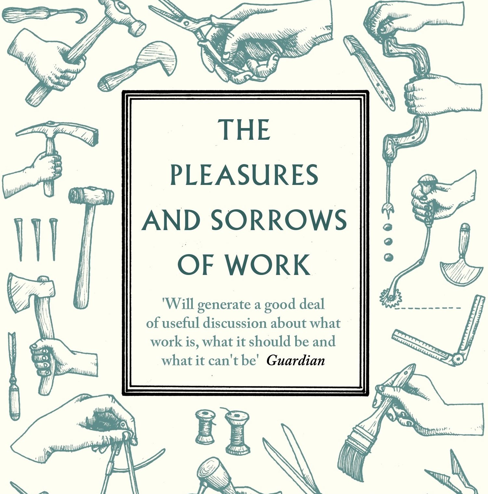

# (최종) 개발의 기쁨과 슬픔
개발로 커리어 전환을 하게 되면서, 나에게 수없이 물었다.

> 개발이 나한테 맞을까? 재미있을까? 개발이라는 선택이 옳았을까?  

막막할 때마다 항상 나에게 되물었다. 
일단 내 머릿속에서 여태까지의 답은 YES다.

하지만 그러면서도 정확히 왜 YES인지 대답하기는 힘들었다. 개발이 재미있고 계속 하고 싶다고 생각하지만, 그렇다고 항상 즐겁고 신나기만 한 것도 아니다. 때로는 힘들어서 때려치고 싶기도 하다.

주변 사람들은 '너가.. 개발을? 갑자기 왜..?'라는 반응을 보인다. 그럴 때마다 다양한 감정들이 떠오르면서 뭐라고 대답해야할지 말문이 막히곤 한다.

그래서 오늘은 그 대답을 정리해보려고 한다. 무엇이 재미있고, 무엇이 힘든지.

## 개발의 기쁨

1. 세상이 필요로 하는 것을 만들고 있다는 느낌.

나는 대학교에서 경제학을 전공했다. 내가 선택한 전공이었다. 하지만 경제학을 별로 좋아하진 않았다. 배우면서 경제학은 문제를 해결하는 학문이 아니라, 그저 설명하려고 노력하는 학문이라고 느꼈기 때문이다. 

나는 실용주의자라서, 어떤 것의 가치를 판단할 때 쓸모가 있는가를 많이 따진다. 하지만 경제학은 단순화된 이론 속에서 균형 상태를 설명하려고 했다. 

이론적으로 맞을지 몰라도, 현실에서 쓸모가 굉장히 없어보이는 학문이었다. 한국은행이나 기획재정부에 가서 뭐 나라 예산이나 통화량 조절하는 일을 한다면 모를까.내가 맞닥뜨리고 풀고 싶은 현실 세계의 문제와는 동떨어져있다는 느낌이 강하게 들었다.

그 후 IT업계에 와서 좋았던 점은 바로 그 지점이었다. 이론이 아니라 실제로 사람들이 무언가를 만들고 바꾸고 있다는 점. 

오히려 이전 세대의 경험과 이론이 다들 안된다고 하는 것을, IT기업과 스타트업들은 기를 쓰고 시도해서 (많은 경우 실패하지만 어떤 경우에는) 실제로 무언가를 바꿔냈다.

IT 스타트업 씬은 사람들이 '필요로 하는 것'을 만들기 위해서 치열한 경쟁을 벌이는 전쟁터였다. 나는 그 다이나믹함과 현실성이 좋았다.

그런데 업계에 몸을 담고 있을수록, 한 가지 생각이 강하게 들었다. IT스타트업이 하나의 스포츠라면, '실제로 필드에서 뛰지 않고, 입으로 경기를 하는 사람이 되고 싶지 않다.'라는 마음. 

불확실성을 실제로 뚫어내고 결과를 만드는 건 '실행'이다. 거기에 이러쿵저러쿵 해석과 설명을 붙이는 게 의미없게 느껴질 때가 많았다. 그리고 그런 사람은 이미 충분히 많았다.  

소프트웨어 개발은 그래서 깊은 만족감을 준다. 실제 IT업계에서 필드를 뛰고 있다는 느낌을, 매일 내가 '유용한 무언가를 창조'하고 있다는 느낌을 받을 수 있다. 

개발의 이론적인 측면을 배우면서도, 결국에는 좋은 퀄리티의 소프트웨어를 만든다는 현실의 쓸모와 명확히 연결돼있다는 느낌이 든다.

2. 추상화, 구조화의 즐거움.

소프트웨어 개발의 핵심은, 복잡한 문제를 쪼개서 구조화하고, 세부적인 내용을 추상화해서 이해할 수 있도록 만드는 과정이다. 나는 이 과정을 무척 좋아하고 즐기는 편이다.

예전에 경영학회에서 컨설팅 회사의 전략적 사고 방법론을 배웠다. 그 때도 나는 회사의 전략이라는 복잡한 문제를, 단순한 프레임워크로 쪼개서 해결책을 도출해내는 방식에 무척 매력을 느꼈다. 실제로 잘하기도 했고.

글을 쓸 때도 개요쓰기, 즉 구조화하는 단계를 좋아한다. 오늘의 글도 어떻게 구조화할까. 내가 하고 싶은 말을 어떤 소제목으로 추상화할 수 있을까. 꽤나 고민한 결과다.

뜬금없지만 난 고등학교 시절 언어 영역, 그 중에도 비문학 영역을 잘하고 좋아했는데 아마 이런 성향 때문이 아닐까 싶다.

프로그래밍도 굉장히 비슷한 측면이 있다. 소프트웨어 공학은 복잡성을 관리하는 학문이다. 라는 말이 있다. 그만큼 복잡하고 큰 문제를 잘 쪼개서 구조화해야 한다. 

동시에 프로그래머라는 인간이 명확하고 쉽게 이해할 수 있도록 잘 묶어서 추상화해야 한다. 그걸 위해 끊임없이 머리를 굴리고 해결해나가는 과정이 개발의 중요한 부분이다.

나는 마음에 드는 구조가 나오고, 그게 딱딱 논리적으로 맞아들어가면 굉장히 희열을 느낀다. 내가 몰입하고 재미를 느끼는 부분이다.

3. 학습 능력이 곧 생존 능력

내가 가장 재밌어하고, 잘할 자신이 있는 게 새로운 지식을 배우고, 나 자신을 발전시키는 일이다. 원래부터 배우는 걸 좋아했고 자기계발에 관심이 많았고, 그게 나한테는 숙제가 아니라 취미다. 러닝맨 블로그와 스터디를 만들고 2년 반 동안 유지할 수 있었던 이유이기도 하고.

소프트웨어 개발만큼 학습하는 능력, 적응하는 능력이 중요한 곳도 없다. 기술과 환경이 엄청난 속도로 바뀐다. 이 바닥에서는 배우지 않으면 바로 도태된다는 말이 있을 정도로. 끊임없이 배우지 않으면 살아남을 수 없는 업계다. 

학습 = 생존.  내 성향과 정말 잘 맞는 환경이다. (물론 스트레스를 안 받는다고 할 순 없지만) 내가 좋아하고 중요하게 생각하는 게 항상 '성장', '잘하기보다 자라기'이기 때문이다. 그런 역량이 높게 평가될 수 있는 영역이라는 게 좋다. 내가 업계에서 잘하는 사람들 사이에 낀다면, 그런 역량을 가진 사람들과 어울릴 수 있다는 말도 된다.

게다가 학습을 하기도 되게 좋다고 느낀다. 여러가지 이유가 있지만, 가장 마음에 드는 건 피드백이 굉장히 빠르고 명확하다는 점. 

0과 1의 세계에는 어정쩡한 게 별로 없다. 되면 되고 안 되면 안 되고. 컴퓨터는 꽤나 빠른 답을 준다. 좋은 소프트웨어의 기준이라는 것도 다른 분야에 비하면 비교적 명확하다.

내가 연습을 통해 더 나아지고 있다는 느낌을 굉장히 좋아하는데, 프로그래밍은 비교적 좋은 피드백을 많이 받을 수 있기 때문에 그런 욕구를 만족시키는 순간이 많다.

## 개발의 슬픔

1. 내가 만들고 싶은 걸 만드는 게 개발이 아니다.

개발은 나름 창의적인 작업이다. 하지만 거칠게 요약하면, 결국 현실 개발자의 임무는 회사에서 주는 요구사항을 소프트웨어로 구현해내는 것이다. 

개발을 하면서 더욱더 느끼는 게, 개발은 절대 혼자서 할 수 없고, 더 나아가 제품을 만드는 것, 고객에게 가치를 전달하는 것은 개발만으로 할 수 없다. 어쨌든 소프트웨어의 최종 목적은 고객 가치를 만들어내는 것이다. 

그래서 '내가 개발하고 싶은 것을 마음껏 개발할 수 있다'는 말은 거짓말이다. 취미 프로젝트면 몰라도. 

개발은 자기가 만들고 싶은 걸 만들거나, 자기 자신을 표현할 수 있는 예술 같은 종류의 일은 아니다. 개발은 고객과 비즈니스 가치를 위한 일이니까.

나는 이전에 글을 쓰고 콘텐츠 만드는 일을 업으로 했다. 창작자/기획자로 일을 한다는 것도 결국은 독자를 위한 일이기는 하다. 

그러나 개발과는 조금 느낌이 다르다. 콘텐츠는 오리지널리티가 굉장히 중요하고, 자신이 좋아하고 하고 싶은 것을 할 때 퀄리티로 이어지는 경우가 많다. 그래서 내가 기자/PD일 때는 비교적 내 관심사와 내가 말하고 싶은 메시지를 많이 반영할 수 있었다.

하지만 개발을 하면서는 그런 욕구를 접어둬야겠다는 생각을 했다. 무엇을 개발하느냐 뿐만 아니라, 어떻게 개발하느냐 또한 수많은 개발자들이 합의해야 하는 영역이다. 내가 원한다고 그냥 '채신기술' 써보자라고 할 수 없다. 

항상 하고 싶은 코딩만 하는 게 개발자의 삶은 아니다. 사실 대부분의 시간은 지겹고 괴로운 일을 한다. 그래야 다른 사람에게 가치를 전달할 수 있기 때문이다. 사용자에게 소프트웨어로 가치를 전달하는 일 자체를 즐기지 못하면 힘들 수 있다.

2. 광대한 추상적 개념의 바다

개발을 배우는 건 스트레스의 연속이다. 처음 코딩을 경험하고 나서, 본격적으로 소프트웨어 개발의 세계에 들어오면, 멘붕이 한번쯤은 온다. 인터페이스, 프로토콜, 의존성, 함수형, 반응형, 객체, 타입, 인스턴스, 프로세스... 무슨 소린지 모르겠는 수많은 용어와 개념들이 덮쳐오기 때문이다.

물론 모든 분야가 배워야할 개념이 많겠지만, 컴퓨터 공학은 정보를 다루고, 추상화를 굉장히 많이 쓰기 때문에 더욱더 어렵다고 느껴진다. 마치 수학처럼. 

소프트웨어는 복잡한 컴퓨터 시스템을 다루기 위해서 추상화와 구조화를 사용한다.  우리가 쓰고 있는 가장 간단한 앱도, 간단한 앱들도 CPU와 메모리부터 사용자가 누르는 버튼까지, 저수준부터 고수준까지 수많은 추상화를 층층히 쌓아서 만들어진다. 모두 엄청나게 많은 추상적 개념들로 묶여있고, 구조화되어있다.

요리, 디자인, 음악 같은 영역은, 어떤 개념이 가리키는 것을 보통 사람들도 보고 듣고 맛볼 수 있다. 반면, 개발은 내가 한번도 느껴볼 수 없는 추상적인 개념, 그리고 그 추상 개념을 추상화한, 그 개념을 또 추상화한... 그런 개념들의 바다다.

흔히 회사에서도 '마케팅 부서가 하는 말 못 알아듣겠다'라고 하는 사람보다 '개발자가 뭐라고 하는지 못 알아듣겠다'라고 하는 말이 더 많은 이유인 듯 하다. 개발을 모르는 사람에게 개발자는 외계어로 말하는 사람 같다. 하지만 개발을 배우는 사람도 그렇게 느끼기는 마찬가지다. 

게다가 추상적인 개념을 배웠다고 끝이 아니다. 실제로 경험하고 적용도 해봐야 한다. 실제로 소프트웨어를 만들어내기 위해선 단순히 이론에서만 머물러서는 안되기 때문이다. 그 개념과 이론을 내것으로 만들기까지, 많은 시간이 필요하다. 정말 똑똑한 사람이라 하더라도 상당한 노력과 시간이 걸린다.

3. '미지'와 '불확실성'이 주는 스트레스

아마 이쯤 되면 여러분도 느꼈을 것이다. 기쁨과 슬픔이 하나의 사실을 다르게 표현하고 있을 뿐이라는 것을.

앞서 이 업계해서는 빠르게 변화하고, 항상 학습해야 살아남을 수 있다고 말했다. 빠르게 변화한다는 것은 불확실하다는 뜻이다. 내가 뭘 배워야할지도 바뀔 수 있고, 내가 만들어야하는 소프트웨어도 금방금방 바뀔 수 있다. 소프트웨어와 개발자의 핵심적인 능력은 유연성과 변화에 적응하는 능력이다.

하지만 인간의 뇌는 사실 내가 모르는 것, 불확실한 것을 굉장히 싫어한다. 수렵 채집 시절부터 우리는 본능적으로 불확실성과 미지에 대한 거부감과 공포를 느껴왔다. 마치 높은 곳을 무서워하는 것처럼 자연스러운 일이다.

하지만 개발을 배우다보면 '미지'와 '불확실성'에 항상 마주해야 한다. 남들이 되게 중요하다고 하는데, 내가 모르는 게 '항상' 있다. 10년이 넘은 시니어 개발자라 해도 마찬가지다. 

많은 개발자들이 사실 자기는 지식과 능력이 부족한데 사람들이 아직 그걸 모르고 있다, 들킬까봐 두렵다 그런 생각을 하면서 가면 증후군을 앓는다고 한다. 

개발을 배워보니 왜 그런지 알 거 같다. 알아야할 게 정말 많고, 피드백이 꽤나 명확하기 때문에 하루에도 몇번씩 내가 아직 모자라다는 것을 계속해서 깨닫게 된다.

이 스트레스가 꽤 크다. 비유하자면, 암벽등반가가 높이라는 공포를 계속 맞닥뜨려야 하는 것처럼. 암벽등반가도 분명 높은 곳에 올라가면 무서울 거다. 하지만 그걸 끊임없이 극복할 뿐. 

개발자도 마찬가지로 '미지'와 '불확실성'에서 오는 스트레스를 안고 갈 수 밖에 없는, 말은 쉽지만 참으로 피곤한 직업이다.

## 결론

써놓고 보니 결국 기쁨과 슬픔은, 한 끗 차이. 내가 보는 관점의 차이일 뿐이다.

기쁨만 주는 완벽한 일은 세상에 없다(고 믿는다). 결국 내 선택이다. 나는 커리어를 고민하면서 이 질문을 스스로에게 많이 던졌다. '내가 무엇을 할 때 행복한가'가 아니라, '그 행복을 위해서 어떤 고통을 감수할 수 있느냐' 

그 결과로 개발을 선택했기 때문에, 기쁨과 슬픔이 둘 다 있음에도 불구하고, 그 선택에 굉장히 만족하고 있는 거 같다.

