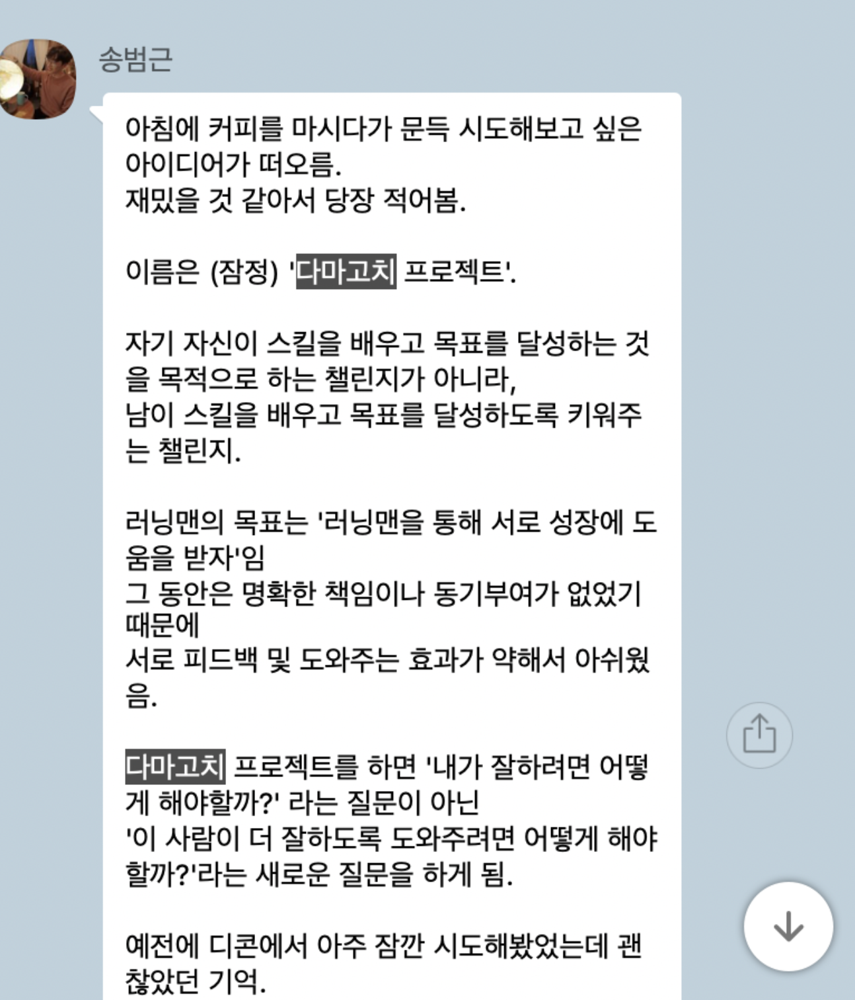

# 발단은 하나의 카톡이었다.

예전에 애지중지 키우던 다마고치처럼.
다른 사람이 성장하는 과정을 코치 해주자는 아이디어.
일방적으로 코치 하는 게 아니다.
기르고 싶은 스킬을 각자 정해 서로 피드백해 준다.

### 결론부터 말하면 이 프로그램은
강한 자극이 온다.
그리고 많은 책임감도 느껴진다.
마지막으로 코치 당하면서, 그리고 하면서 두 번 배운다.

다시 처음 시작부터.
우선 이 프로그램을 해보고 싶다 느꼈고.
어떤 스킬을 기를지 생각해봤다.

그러다가 떠오른 "글쓰기"
사실 난 글로 관심받기를 좋아한다.
하지만 부끄러워서 주로 익명 글을 쓰기를 선호했다.
그러니까 여태까지 본케는 놔두고 부케만 키운 샘.
이제는 본케를 키울때다!
그래 일단 글쓰기로 어그로를 끌어보자.

마침 알아보고 싶은 주제도 떠올랐다.
"디파이"
내 관심사는 인간이 모여있는 다양한 크기의 커뮤니티인데.
어쩌면 이 물건이 사회를 바꿀 수 있다는 상상에 미치니.
조금 더 흥미가 생겼다.
그래서 나는 "디파이 글쓰기"로 다마고치 프로젝트를 시작하기로 했다.

그런데 난 무얼 코치 해주지?
다마고치 버디인 Eddy는 추상적인 목표가 있었다.
이 친구는 그동안 기사도 써보고. 리서치도 해보고. 컨설팅 창업도 해봤다.
그러나 아직 스스로 무언가 갈증을 느끼고 있었고.
더 재미있는 일을 찾고 싶었다.
그중에서 특히 제품을 만드는 일이 얼마나 재미있는지 알고싶어했다.

### 드디어 첫 번째 미팅 시간.
Eddy는 바로 나에게 글쓰기에 관한 팁을 쏟아냈다.
그중에서 가장 강조했던 건 매일 쓰기.
글쓰기는 습관을 들여 꾸준히 해야 는다는 코치의 말씀.
곧 "일주일에 2개 페이스북에 글쓰기", "매일 글 써서 보내기" 같은 목표가 세워졌다.
나머지 문체 등은 본인이 피드백을 해줄 테니 신경 쓰지 말란다.

반면 아직 Eddy는 "제품 만들기"가 얼마나 재미있는지 검증할 방법부터 알아봤다.
그래서 우선 제품을 처음부터 만들기보다는.
가설을 세우고 프로토타이핑해서 인터뷰로 제품이 팔릴 것 같은지 확인해보기로 했다.

우선 내가 선수로 뛰는 글쓰기.
일단 매일 아침 8:30부터 30분간 글을 써서 Eddy에게 보내기로 했고, 비교적 잘 지켜졌다.
페이스북 글쓰기는 반면 1, 2 번 정도 밀렸다.
아무래도 좀 더 잘 써야 한다는 부담감이 커서 속도가 안 났다.
Eddy는 나에게 "똥을 싸도 되니까 힘을 빼서 쓰자"라고 조언했다.

그리고 감독으로서 제품 만들기 과정 피드백.
우선 첫 번째 제품 아이디어를 같이 정했다.

주로 프로토타이핑 해볼 만 한지에 초점을 맞춰서 피드백했고.
"과거 메모를 다시 떠오르게 하는 앱"이라는 아이디어를 검증해 보기로 했다.
후에 PPT로 제품을 프로토타이핑했고, 고객에게 물어볼 설문지를 만들었다.
이 과정을 거치고 나니 생각보다 과거 메모를 다시 떠올리고자 하는 니즈가 없음을 발견했다.

###프로그램 시작 4주 정도 지났지만 몇 가지 느낀 점이 있다.

일단 글쓰기의 경우 매일 매일 피드백을 해주니 peer pressure가 확실히 느껴졌다.
하프 마라톤의 페이스 메이커처럼.
지속해서 짧은 방향성을 제시해주니.
글쓰기 마라톤을 포기하지 않고 계속할 수 있었다.

그리고 단순히 피드백을 받는 게 아니라 해주기도 하니.
더욱 강한 책임감이 들었다.

마지막으로 코치 받을 때 뿐 아니라 코치 할 때도 실력이 는다.
스스로 제품을 기획하고 검증하고 싶은 사람으로서,
제품을 미리 발견하고 설계하는 Eddy에게 가르치면서.
앞으로 내가 제품을 만든다면 어떻게 하면 할지 그려볼 수 있었다.

아직 4주 정도 더 남았기에 이 프로그램이 어떻게 끝날지는 알 수 없다.
일단 끝까지 완주하고 한 번 더 기록을 남겨보겠다.

