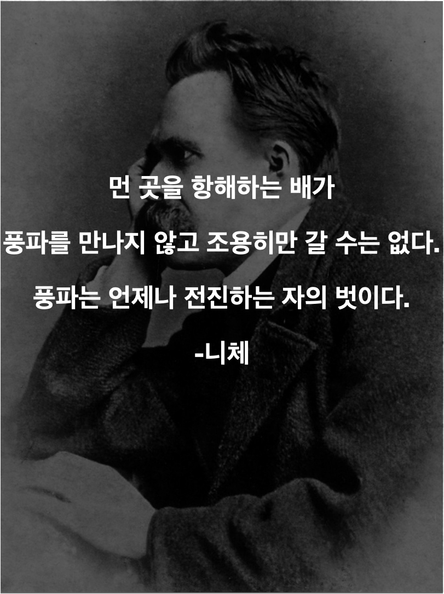

>살다 보면, 잘 안될때도 있는 법이다. 실패 했다는건 도전했다는 증명이니 자랑스럽게 여기자.

## 불합격

될 거라고 강하게 믿던 알고리즘 테스트에 불합격 했다. 여러가지 이유나 핑계를 대려면 댈 수 있겠지만, 결국 내가 시험에 통과할 실력이 되지 못 했기 때문이다. 당시에는 최선을 다해 준비했다고 생각했지만, 되돌아 보니 나의 최선은 나를 기만하는 마약이었을 뿐이다.

혹시 미래의 나와 이걸 보는 독자님께 도움이 될 지 몰라 어떻게 하다 불합격 하게 되었는지 짧은 변명을 하자면, 알고리즘이 어려웠던 것이 아니라 시험이라는 특성에 맞춘 준비를 하지 못했음이 큰 패착 이었다. 

시험은 알고리즘 3문항, SQL1문항, 웹 프로그래밍 1문항으로 이루어져 있었다. 나의 전략은 일단 무조건 풀수 있을 것이라 확신하는 웹프로그래밍을 먼저 풀고 나머지를 처리하는 것 이었다. 하지만 웹 프로그래밍에서 fetch요청을 하는데 알 수 없는 이유로 계속해서 오류가 났다. 이걸 고치려고 많은 시간을 사용했고 정신을 차려보니 다른 문제를 여유있게 풀 수 있는 시간이 남아 있지 않았고, 시간에 쫒겨 날려푼 다른 문제들은 보기 좋게 틀려 버렸다.

솔직히, 라인 코딩테스트에 합격하고 나서 자만하는 마음이 있었다. 라인 코테도 붙었는데, 이 시험에서 떨어질 것 이라고 생각하지 않았고, 시험을 시험다운 긴장을 가지고 준비하지 않았다. 시간은 많이 썼지만 밀도가 현저히 떨어졌다. 자만이 시험 자체를 전략적으로 공략해야 한다는 경각심을 지워 버렸다.

내 자존심을 위해 몇마디 더 보태자면, 솔직히 알고리즘 문제들은 시간만 조금더 있었으면 다 풀수 있었다. 알고리즘 공부가 헛된 것은 아니었다.

## 넘어진 김에 돌맹이라도 줍고 일어나 보자

실패에 관해 가지고 있는 원칙이 하나 있다. **실패했다는 사실 조차 잊어버려 버리거나 실패에서 무언가를 배우자**고 생각하며 산다. 실패를 반성하는 것 만으로도 너무 힘들고 괴롭다면 아예 실패에 대해서 생각 하려 하지 않는다.

배움보다 괴로움이 크면 오히려 손해보는 장사다. 이를테면, 내가 학창시절 빵셔틀로 지냈던 경험에 대해서는 별로 생각도, 반성도 하려 하지 않는다. 이 괴로움이 다음번 내 도전의 발목을 잡게 해서는 안된다. 하지만, 반성할 만한 실패라면 거기서 뭐라도 배우려고 노력한다.

이번 경험은 충분히 반성할만 하기에 몇가지 포인트를 짚어 보는 것이 나와 독자님들의 미래에 도움이 될 것 같다. 

- **자만하지 않는다.** 
    - 행운에 속으면 안된다. 내가 진짜로 엄청난 사람이 되었는지, 아니면 그저 행운의 변덕 이었는지는 시간이 한참 지난 뒤에야 알 수 있다. 시간이 증명해 주기 전까지 스스로를 너무 대단하다고 생각하지 말고 행운의 선물에 감사며 해야 할일에 집중하는 편이 지혜롭다.

- **여유가 있을 수록 최악의 상황을 대비한다.**
    - 어떤 것에 대해서 충분히 준비 한 것 같다면, 중요한 것들을 모두 한 것 같아 여유롭다는 느낌이 든다면, 그때가 최악의 상황에 대비할 때다. 어떤 상황이 발생해도 이상할게 없는 세상이다. 평범한 상황에서 잘 할 거 같다는 생각이 든다면, 최악의 상황이 와도 잘 할 수 있을지 생각해 보자. 
    - 나는 알고리즘 이외에 다른 것들을 상대적으로 무시했고, 웹프로그래밍에서 막힌다는 생각을 해보지 못하고 당연히 그에 대한 대처를 생각해 놓지도 않아서 망했다.

- **중요한 일을 하는데 힘들지 않으면 뭔가 잘못 되지 않았는지 진지하게 점검해 본다.**
    - 시험전 몇 일간 준비 과정이 너무 쉬웠다. 별로 긴장하지 않았고 자신에 차 있었다. 자만에 눈이 멀어 있던 나는 그냥 실력이 늘어 쉬운 거겠지 생각하고 여유를 즐겼다. 별로 힘들이지 않고 시간만 축내며 공부했다.
    - 세상에 노는 것 말고 쉬운일은 그리 많지 않다. 뭔가 중요한 일을 하는데, 너무 쉽다고 생각된다면 여유를 즐기기 전에 뭔가 잘못된 것은 없는지 **진지하게, 진지하게**생각해 보자.   

## 뒤는 조금만 보고 앞을 보고 가야할 때

애시당초 알고리즘테스트에 도전한 이유였던 시험에서 떨어졌지만, 그동한 공부한 나의 실력이 어디 가는건 아니다. 이미 합격해서 면접을 앞둔 회사도 있고, 여러곳에서 알고리즘 테스트로 나의 실력을 증명할 기회가 많다. 실망스럽고 후회스럽지만, 어쩌겠나 살다보면 실패도 하고 그런거지. 그저 이번 실패에서 겪은 실수를 다시 반복하지 않기 위해 노력할 뿐이다.

