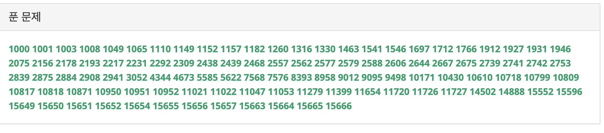

> 제행 무상, 이 우주의 모든 것은 변한다는 말이다. 만물은 끊임 없이 흘러가고 또 변한다. 변하는 것을 붙잡으려 하는 것 보다는 변화에 순응하는 편이 더 지혜롭다.

## 세상에 변하지 않는 사실이 하나 있다면, 바로 모든 것은 변한다는 사실이다. 

계획을 세울때 우리가 흔히 하는 실수중 하나는 그 계획이 차질 없이, 처음 생각한 대로 이루어질 것이라 기대하는 것이다. 

인간은 부족하기에 처음 계획을 세울 때 충분한 고려를 하지 못한다. 만약 충분히 고려를 했더라도, 주변의 모든 상황을 통제할수는 없기에, 계획에 변화는 필연적으로 발생한다.

이때 고집을 부리고 계획을 변경하지 않으면 오히려 내가 얻고자 하는 목적에 다다르지 못할수도 있으니, 지혜롭게 대처할 필요가 있다. 

나의 알고리즘 공부도 외부적으로, 내부적으로 변화가 생겼다.

## 코로나 19가 나의 수험 기간을 부쩍 늘려 버렸다.

코로나때문에 오프라인 시험을 보기가 어려워 졌다. 

때문에, 원래 오프라인 시험을 보는 일정에 온라인 시험을 보고 거기에서 합격한 사람에게만 오프라인 시험 자격을 주는 방식을 택하게 되었다고 한다.

이럴거면 그냥 일정을 미루면 될 것을 굳이 온라인을 한번 본 뒤 오프라인 시험을 한번 더 보게 하는 이유가 뭔지 이해가 잘 되지는 않지만, 이를 바꿀수 있는 힘이 있는 것도 아니니 여기에 순응해야 한다. 

온라인 테스트를 합격한다는 전제 하에 알고리즘을 대비해야 하는 기간이 약 1달 가량 늘어나 버렸다. 1달만 빡세게 고생하자는 심점으로 임하던 나의 멘탈에 조금 충격이 왔다. 

하지만, 이 고민은 온라인 테스트를 합격한 다음에 해야 할 고민이다. 일단은 다음주 토요일에 예정된 테스트에 집중해야 한다. 
 

## 학습에서 레이스로 노선을 바꾸기로 했다. 

코딩 테스트 숙련자들의 피드백을 받고 실행계획이 조금 바뀌었다. 이전 기수를 수료한 친구와 코딩테스트 시험을 자주 본적 있는 친구들과 이야기를 할 기회가 생겼다. 그 친구들의 공통된 의견은, 이번 시험에서는 어려운문제를 풀줄 아는 것보다 적당한 문제를 빠르게 풀 줄 아는 것이 더 전략적으로 옳은 판단 이라는 점 이었다.

피드백을 받고 생각해 보니, 그동안 수행한 복습 빙식, 사고의 약점을 분석하는 방식은 더 어려운 문제로 가는데 보탬이 될수있는 것 같았지만, 적당한 문제를 빨리푸는데 최적화된 방식은 아니었던 것 같다. 

그래서 나의 마인드를 좀더 스포츠 스럽게 바꾸었다. 더 빨리, 더 많이 푸는 것을 초점에 두고 있다. 지난주 월요일 부터는 백준에 있는 유형별 문제들을 많이 접하고 빨리 푸는 훈련을 하기 시작했다. 

많이 풀면서 많은 유형에 나를 노출되게 하는 것이 목표이기에, 매일 저녁 하는 백지 복습도 하지 않고 다양한 문제를 풀고 이해하는 것에 초점을 두고 있다. 

 
##### 기존에 풀었던 20여개의 문제를 재외하고는 이번에 새로 푼 문제들이다.

백준에 있는 유형별 문제를 풀고 있자니, 내가 이전에 생각했던 **사고의 약점을 파악하는 일보다 문제의 유형별 대처 능력을 기르는 편이 테스트에 훨씬 효율적 일 것이라는 판단을 하게 되었다.** 비슷한 유형의 문제를 모아서 풀다보면 뇌에 인이 박히는 느낌이다. 

## 이전의 계획이 체력을 길러 놓았기에 뛰는 연습을 할 수 있게 된 것 같다. 

계획을 다소 과격하게 바꾸긴 했지만, 나는 이전의 계획이 잘못되었다고 생각하지는 않는다. **처음에 느리게 반복적으로 문제를 풀며 나를 훈련시키는 과정이 없었으면 새로운 방식의 훈련을 시작도 못했을 것 같다.** 

이전까지 1달간 공부 방식은 기초 근육을 기르는데 매우 효과적이었던 것이었다. 그 과정이 없었으면 지금처럼 죽어라 달리기 연습을 한다는 결정을 내리지 못 했을 것이다. 

## 많은것이 변하지만, 변하지 않도록 지켜야 할 것은 이루고자 하는 마음이다.

상황도 바뀌고 계획도 바뀌었지만, 이루고야 말겠다는 마음가짐은 변해서는 안된다. 

지난번에 나를 다독이는 시간을 가지기로 결심한 뒤 매일 명상을 하고 있다. 5~10분 호흡 명상을 하고 나 스스로에게 할수있다고 반복적으로 말해준다. 별거 아닌 일 같지만, 마음을 지키는데 아주 강력한 효과를 보고 있다. 

많은 것이 변하지만 하려는 마음을 가지고 있으면 어떻게든 목표 근처에는 갈 수 있지 않을까 생각 한다. 

불교 경전으로 시작했으니 성경구절로 마무리를 지어 균형을 맞추며 글을 끝내고자 한다. 

다음 글은 시험 후기로 찾아오겠다. 마음에 여유가 있다면 나의 합격을 기원해 주시길 바란다.

>무릇 지킬만한 것보다 더욱 네 마음을 지키라 생명의 근원이 이에서 남이니라.  
-잠언 4:23

---
글쓴이: 이새
