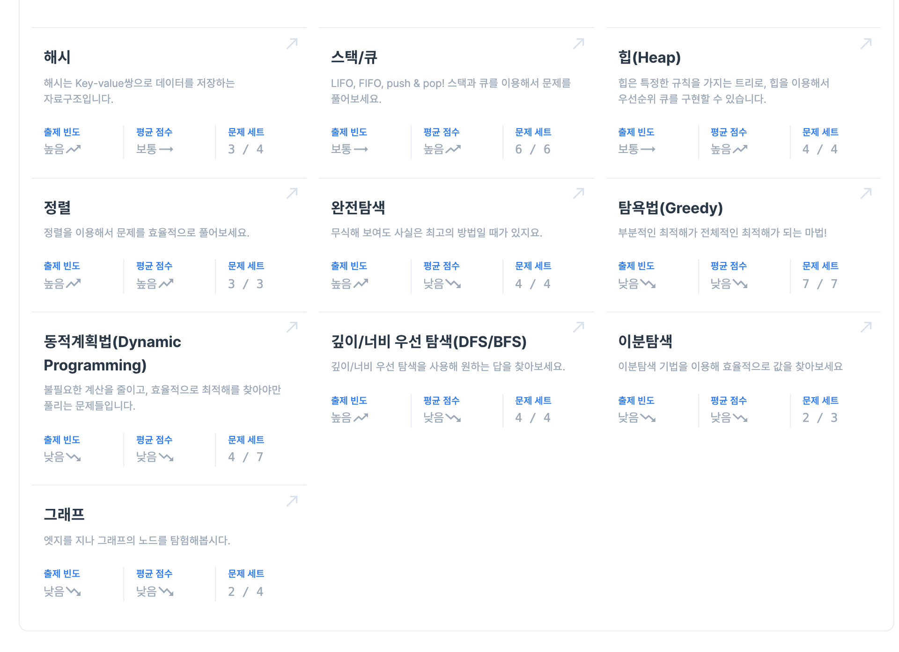
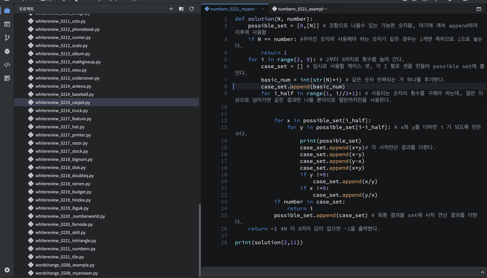
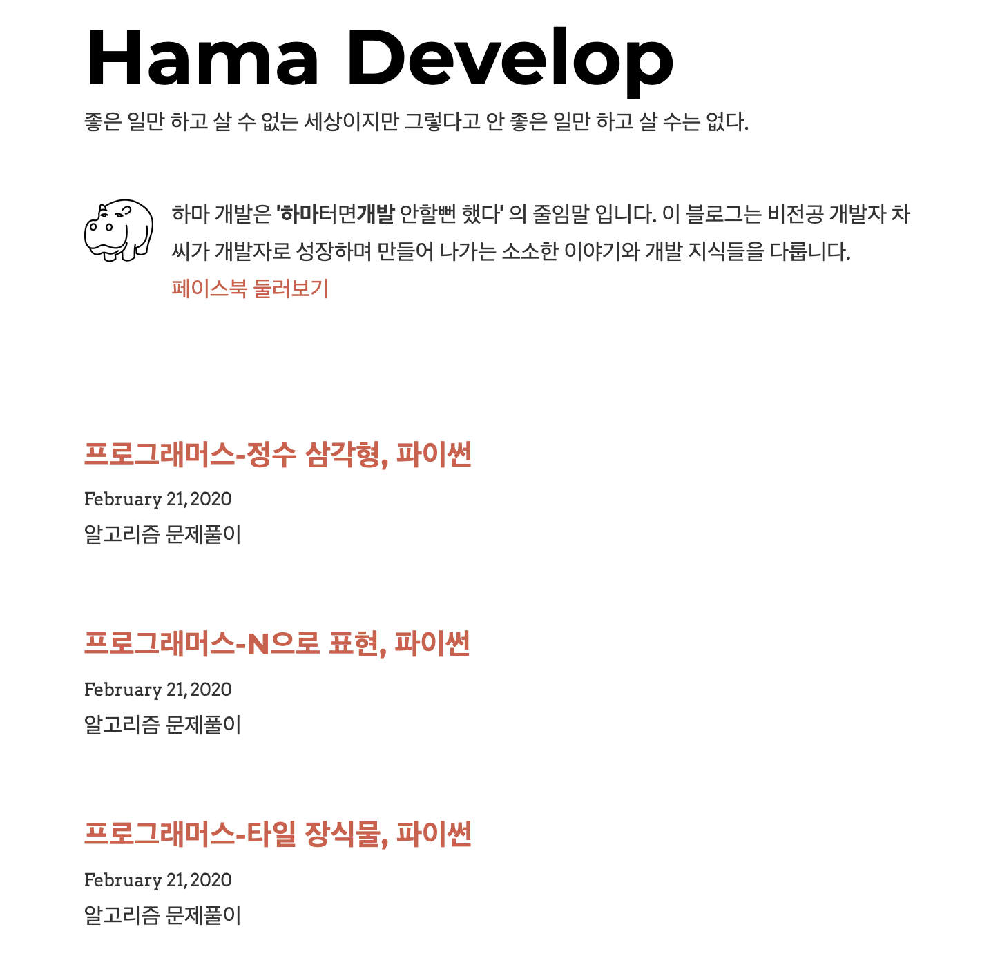

> 사람은 누구나 계획이 있다. 쳐맞기 전까지는

## 계획과 실천은 다르다. 나도 예외가 아니었다. 

우리는 타이슨과 스파링을 하지는 않지만, 우리를 둘러싼 세상과 한판 붙고 있다. 

끝없는 세상과 스파링속에서 한방 얻어맞고 나면, 우리가 세운 계획은 휘청휘청 그로기 상태에 빠지기 일수다. 

소프트웨어 마에스트로에 합격하기 위한 알고리즘 첼린지 시작한지 2주가 지났다. 계획대로 되는 것도 있고 아닌 것도 있다. 세상의 펀치에 다운되기 전에 중간점검을 통해 스스로를 다시 다잡을 필요가 있다. 

## 현재 진척 사항 

### 프로그래머스 고득점kit 레벨1~3을 모두 다 풀었다.

이렇게 문제들을 풀고 나면 뭐가 약점인지도 몰랐던 상황에서 뭐가 약점인지 알 수 있는 상황으로 한 단계 진화 할 수 있을 것으로 생각했었다. 

하지만, 약점 파악 이라는 것이 그렇게 쉽게 파악이 되는 종류의 것이 아니었다. 알고리즘 문제풀기는 특정 알고리즘에 약하다는 식으로 정의를 내리기가 어려운 분야다.

잘 풀었다는 풀이들을 보면 내가 그걸 할줄 몰라서 못했다기 보다는 센스가 모자랐다는 생각 밖에 할 수가 없었다. 일정 수준 이상의 지식은 분명 필요하지만, 그 이후로는 센스의 영역이다. 

다양한 문제를 풀고 틀리면서 파이썬 문법에 익숙해지고 활용하기 좋은 모듈도 알게 되었지만, 센스의 영역에서는 약점을 정의하기 정말 힘들었다.

**개선점**

접근을 다른 식으로 해야할 듯 하다. 문제가 어떤 유형이었는지를 보는게 아니라 나의 사고 과정에 좀더 집중해서 약점을 찾아내야 할 것 같다. 내가 왜 그렇게 생각하지 못했을까에 대한 반성을 추가적으로 하기로 결심한다. 

### 매일 복습을 빼먹은 적이 없다.

한 문제를 풀면 그 문제를 3번은 풀었다. 맨 처음 내 생각으로 한번 풀어보고, 남들의 풀이를 통해 한번 풀어보고, 그날 저녁 그날 그날 풀었던 문제를 다시 처음부터 풀었다. 

백지복습은 철저히 하고 있지만 애빙하우스의 망각곡선은 제대로 따르지 못하고 있다.

애빙하우스의 망각곡선이 제시하는 최적 복습주기는 10분, 1일, 1주일, 1달 이었다. 이 중 1일, 1주일 복습만을 실시하고 있다. 1달이 안되었으니 1달짜리 복습을 못하는 건 당연한 일이다. 10분 복습을 못하고 있는건 문제다. 

문제를 풀고 나서 10분뒤에 다시 그 문제를 볼 생각이 들지 않는다는 문제가 있다. 문제를 풀고 잠깐 쉬고 나면 아예 이전 문제 다시 볼 생각이 들지 않는다. 

사실 이글을 쓸 때까지도 내가 10분 복습을 하지 않고 있다는 걸 인지하지 못하고 있었다. 

**개선점**

돌이켜 생각해 보면, 10분 전에 푼건 이미 풀줄 안다고 생각하기에 그걸 복습하는 것을 시간 낭비라고 생각하는 것 같다. 다시 보는것이 기억 강화에 도움이 된다는 것은 이미 증명된 사실이다. 건방떨지 말고 10분 뒤에도 꼬박 꼬박 다시 보자 

## 효과

### 성장이 느껴지긴 한다. 생각보다는 조금 

위의 방법들의 효과는 확실히 있다.

알고리즘 공부를 처음 시작할때는 레벨 1짜리 문제도 제대로 풀지 못하는 상태 였지만 지금은 1을 왠만하면 풀수 있고 2짜리의 30%정도는 풀수 있는 수준이라고 스스로를 평가한다. 

실력이 확실히 늘고는 있다. 하지만, 생각보다 빨리 늘지는 않는다. 레벨 2~3수준이 출제되는 시험은 점점 다가오는데, 이정도 속도로 시험때 까지 충분할지 걱정이 된다. 

초조함이 나의 집중력을 갉아 먹고 있다. 코딩이 재밌어서 프로그래머 전향을 했는데, 초조하니까 동기부여가 줄어들고 코드를 짜는게 점점 재미가 없어지는 것이 느껴졌다. 

그런데 다른식으로 공부를 했어도 이것보다 더 빠른 성장을 할 수 있었으리라고 생각하지는 않는다. 지난번 글에서 말했듯이 내가 할 수 있는 일은 내가 할수 있음을 믿고 묵묵히 하는 것 뿐이다. 

## 추가된 계획

### 나를 더 재밋게 하기 위해 블로그 쓰기를 하기로 했다.

나는 내가 쓴 글이 나의 자산이 되는 것에 뿌듯함과 재미를 느낀다. 그래서 이렇게 블로그에 글을 쓰는 것이다. 

알고리즘 풀이라고 그렇게 못할 이유가 없다. 문제를 열심히 풀고 그걸 글로 남겨 나의 자산으로 만든다면, 문제를 푸는 것을 더 재밋게 할수 있을 것 같다. 

그래서 나의 개발 블로그에 알고리즘 풀이 글을 연재하기 시작했다. 실제로 글쓰기로 나의 자산이 늘어난다고 생각하니 더 재미있게 공부를 할수 있게 되었다. 

알고리즘 해설글은 [이 블로그](https://hamadevelop.me)에서 확인할 수 있다. 

### 동기 부여를 위해 스스로할 수 있다고 다독이는 시간을 가지기로 했다.

>"He who says he can and he who says he can't, are both usually right." - Henry Ford

그냥 할수 있다고 믿기만 하는 것과 스스로의 믿음을 유지하기 위한 행동을 하는 것은 다르다. 

종교인이 매일 기도를 하는 것처럼, 믿음을 유지하고 강화하기 위한 행동이 수반될때 그 믿음이 지속될 수 있다. 

매일 10분은 나 스스로를 되돌아 보고 할수 있다고 다독이는 시간을 가지며 자신감을 유지하는 시간을 가져보려고 한다. 

아무리 계획이 좋아도 스스로 할수 없다고 믿으면 아무 의미 없는 탁상 공론에 불과하다.

