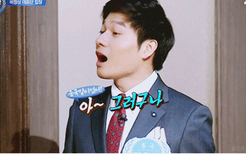
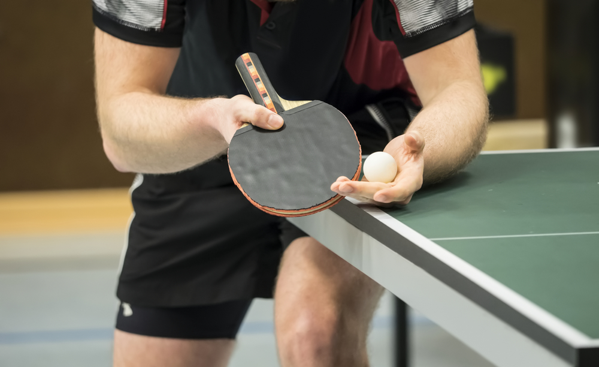

## 인터뷰 잘하는 법을 배우다

난 인터뷰를 많이 한다. 직업 때문이기도 하고. 그냥 새로운 사람과 얘기하는 거 좋아한다. 그래서 잘하고 싶다. 대화하면서 상대방 진심을 듣고, 통찰을 얻어내는 데 관심이 많다.

최근 인강 하나를 사서 들었다. '대화도 과학이다! 정보수집대화법'이라는 강의다. 정보수집대화는 인터뷰를 포함해서, 정보를 얻을 목적으로 하는 대화를 이르는 말이다. 

인강으로 뭘 배운다는 게 참 어렵긴 하다. 그래도 내가 잘 아는 강사님이었기 때문에 믿고 질렀다. 오늘은 이 강의에서 배운 것, 실제로 적용해보고 느낀 걸 정리해보려 한다.

## 리액션으로 대화 이어가기

강의엔 많은 내용이 나온다. 그 중 가장 핵심을 하나 꼽아보자면, '리액션으로 대화를 이어가야 한다'는 것.

우리는 질문을 많이, 날카롭게 해야 인터뷰를 잘 하는 거라고 생각한다. 하지만 인터뷰 고수는 질문 수가 많지 않다. 너무 많은 질문은 상대를 수동적으로 만든다. 사람은 수동적인 자세에선 진심이 잘 나오지 않는다. 

인터뷰가 끝났을 떄 상대방이 '답을 잘 했다'고 느끼기보다 '즐거운 대화였다'고 느껴야 좋은 인터뷰다. 테니스로 비유하자면, '내가 서브할 테니 받아봐' 식으로 하면 안된다. 상대가 공을 넘기면 그걸 부드럽게 리시브로 받아주면서 원하는 쪽으로 보내는 느낌이랄까?

처음에는 가볍고 캐주얼한 얘기로 시작한다. 상대방이 긴장하거나 방어적이 되지 않도록. 그리고 상대방 말에 리액션을 하면서 원하는 대화주제로 자연스럽게 이어간다.

**예시1) 식사 얘기를 하고 있는데, 요즘 상대방의 컨디션에 대해 알고 싶다.**

> "식사 어떠셨어요?"
>
> "아, 제가 이가 안 좋아서... 차가운 걸 먹으니 확 시리더라고요"
>
> "아 시리셨구나... 이도 안 좋고 그러셔서 요즘 생활에서도 전체적으로 에너지가 다운되시겠네요."
>
> "네, 그렇죠. 요즘 묘하게 피곤하네요."

**예시2) 근황 얘기로 시작해 이 사람의 업무 전문성에 대해 알고 싶다.**

> "요즘 바쁘시겠어요"
>
> "네. 요즘 저희 신제품이 나와서... 그거 대행사 프로젝트를 시작했거든요. 따로 온라인 광고도 돌리고요"
>
> "마케팅에 시간을 많이 쓰시네요. 마케팅 일 중 대행사 관리가 큰 부분이군요."
>
> "그렇죠."
>
> "대행사 관리를 잘해야 좋은 마케터가 될 수 있겠어요."
>
> "아, 그런 건 아니에요. 사실 대행사 관리란 건 크게 차이날 건 없고... 실무에서는... 우리 대표가 사람을 안 뽑아줘서... (블라블라)"

**두 예시문을 보면, 모두 질문을 하지 않는다.** 

"요즘 컨디션은 어떠시죠?"나 "좋은 마케터가 되기 위한 가장 중요한 역량은 무엇입니까?"라고 묻지 않는다. 대신 **리액션을 통해서 상대방이 상황과 맥락을 말하게 한다.** 

다소 두서없게 느껴질 수 있다. 하지만 원래 인간의 머릿속이 그렇다. 잘 반듯하고 구조화되어있지 않다. 오히려 '마케팅을 하면서 가장 중요한 역량 3개를 뽑아주세요' 같은 구조화된 질문을 하면, 질문을 받은 사람은 무의식적으로 답을 지어내게 된다. 

최대한 상대방이 비공식적으로 얘기하도록 이끌자. 나중에 중요한 포인트는 인터뷰어가 퍼즐 조각을 맞춰 구조화하는 게 좋다. 상대방이 '어휴, 제가 근황 얘기하다가 여기까지 왔네요?' 라고 말하면 잘한 거다.

## 미러링과 레이블링

그렇다면 리액션을 어떻게 해야하는가. 가장 기억에 남는 스킬이 2개 있다. 미러링(Mirroring)과 레이블링(Labeling)이다.

### 미러링

미러링은 상대가 한 말을 반복하는 거다.  

예를 들어 대화 상대가 " (...) 결국 안했어요. 애매해서요."라고 했다고 하자. 그러면 "아, 애매해서 안하셨셨구나" 라고 따라하는 거다. 

그렇다. 자연스러운 버전의 복명복창이다. (너무 앵무새 같으면 안됨)

강의에서 말하길, 미러링을 하면 상대의 마음을 여는 데 도움이 된다고 한다. 

'상대방이 내 말을 따라하네? 얘가 내 말을 경청하고 있구나.'이런 느낌을 받는다. 물론 어색하면 안 되겠지만.

### 레이블링

레이블링. 이름 붙이기. 상대방의 대답으로 느껴지는 상대 감정이나 생각을 언급해보는 거다. 살짝 '넘겨짚어' 본달까?

예를 들어, "인터뷰가 조금 긴장되시는 게 아닌가 싶네요" 라고 짚어준다. 그런데 이런 부정적인 얘기도 편하게 언급되면, 그 감정이 약화된다. 상대방이 자신의 속마음이 '받아들여졌다'고 느끼는 거다.

**예시1) 강의 수강생과 인터뷰할 때**

> "이번 강의 어떠셨어요?"
>
> "아니 강사님이, 저 화장실 가는데 그렇게 얘기하시더라고요. 이런 식으로 하면 인생 성공할 수 있겠냐고요."
>
> "어휴... 화가 많이 나셨겠네요" (레이블링)
>
> "그쵸. 진짜 그랬죠"

강의에서 말하길, 이렇게 자신의 감정을 상대방이 언급해줬을 때 뇌영상을 찍어본 연구가 있다. 흥분한 감정 신호가 사라지고, 친밀감이 올라간다고 한다.

조금 더 감을 잡았다면, 상대방이 할 말을 더 과감하게 넘겨짚어보면서 리액션을 해줘도 좋다.

**예시2) 강의 수강생과 인터뷰할 때**

> "아니 강사님이, 저 화장실 가는데 그렇게 얘기하시더라고요. 이런 식으로 하면 인생 성공할 수 있겠냐고요."
>
> "아무리 수강생이라도 강사한테 인격적으로 존중을 받아야 한다고 생각하는데 그게 아니셨나봐요" (레이블링)
>
> "그렇죠. 존중은 해줘야 하는 거잖아요"
>
> "아... 인격적인 존중이 없었떤 거군요." (미러링)

좀 더 많이 넘겨짚어서 틀리면 어떻게 하냐고? 그래도 좋다. 상대가 틀린 내용을 교정해주면서 정보를 많이 줄 수도 있다는 거다.

만약 내가 "존중 받아야하는 데 그게 아니셨나봐요."라고 말했다. 만약 실제로 그렇지 않다면, 상대방이 "아 그런 것까진 아니었고요. 제 생각은..." 이러면서 더 속마음을 얘기해줄 수 있다. 

## 연습해보고 느낀 점

미러링 레이블링 말고도 다양한 내용이 있었다. 하지만 대화하면서 필기 보고 대답할 수 없는 만큼, 이런 종류의 스킬은 연습을 통해 익히는 게 중요하다. 

일단 써먹어보기로 했다. 가장 쉬운 미러링부터. 어색함을 참고 취재차 사람을 만날 때 미러링을 계속 시도했다. 1~2주 해본 결과 2가지를 느꼈다.

### 첫째, 생각보다 나는 상대방 말을 잘 안 듣는다.

나는 나름 경청하는 타입이라고 생각했다. 그런데 미러링을 하려고 생각해보니 다음과 같은 패턴을 발견했다. 상대방 말에서 어떤 키워드를 듣는다. 그러면 나도 할 말이 떠오른다. 상대방 말을 한 귀로 흘리면서 내 이야기를 준비한다.

예를 들어, 상대방이 이렇게 말했다고 하자.  

> 저는 강북에 살아서 출근길마다 지하철 때문에 힘들어요.
>
> (강북?) 아, 강북 사세요? 저도 강북 사는데. 강북 어느 쪽 사시는데요?  (어쩌구저쩌구)

이런 식으로 대답이 가버린다. 

만약 미러링을 했다면, 해야할 말은? 

> 저는 강북에 살아서 출근길마다 지하철 때문에 힘들어요.
>
> 아 출근길 지하철 진짜 힘드시구나.

생각보다 이게 쉽지 않다. 사람은 다 자기 중심으로 생각하는 경향이 있나 보다.

### 둘째, 미러링만으론 대화가 이어지지 않는다.

미러링은 뭐랄까, 기본 자세 같다. 

탁구를 예로 들어보자. 탁구 기본 자세는 몸을 낮추는 거다. 시작하면 몸을 낮추는 것부터 배운다. 하지만 몸을 낮춘다고 날아오던 공이 저절로 반대편으로 넘어가진 않는다. 특히 상대방이 까다로운 공을 보내면 더 그렇다. 다만 실수를 막아주는 기본 자세인 거다.

미러링도 그렇다. 생각보다는 상대방이 알아서 대화를 이어가긴 하지만, 뻘쭘한 정적도 종종 온다. 아무래도 상대방은 내가 기자니까 리드를 할 거라고 생각했는데. "아 그러셨구나-" 이러고 앉아있으니 뭐지? 싶었을 수도 있다. 

반대로 말이 많아 혼자 달려가는 사람도 있다. 신나서 자기 얘기만 한다. 인터뷰가 산으로 간다. 질문을 하면서 적절하게 본론으로 다시 이끌어줄 필요도 있다.

## 결론

미러링, 레이블링을 활용해 리액션으로 대화 이어가기. 꼭 기억할만 하다. 꾸준히 연습해야겠다. 쉬워보이지만 쉽지 않다. 더 익혀야할 기술이 많지만, 지금은 이 정도만 해도 유용할 것 같다. 뭐가 되었든 좋은 대화는 듣는 자세가 기본이다.

