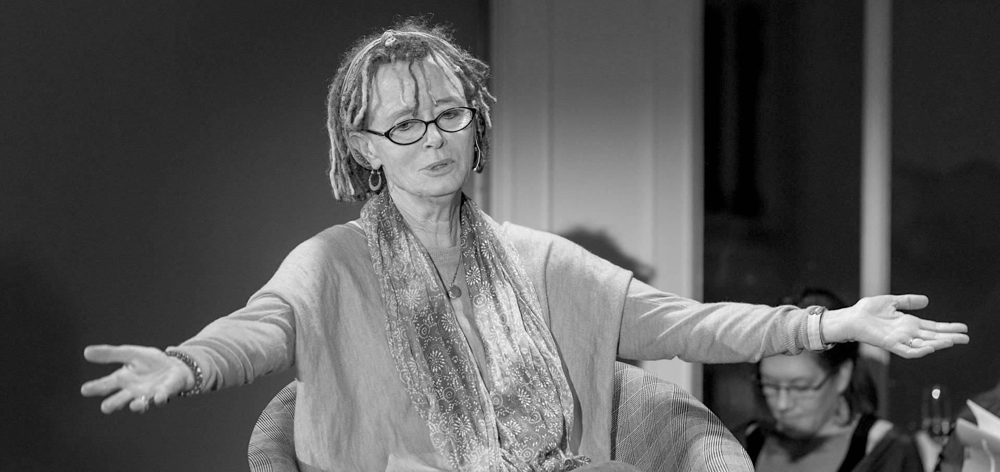
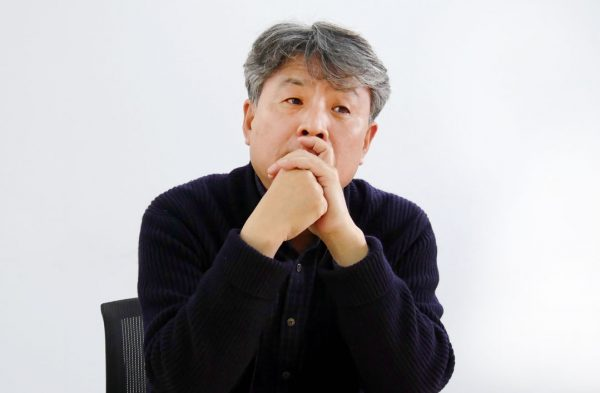

**벌써 2주가 돌아왔다.**

주말은 즐겁지만 한편으로 마음이 무겁다. 올해 러닝맨을 시작하고부터 그렇다. 2주에 1번. 글을 써야하기 때문이다. 묵직한 무게추 하나가 마음속을 지긋이 누르는 느낌. 그 무게추에는 이렇게 써있다.

> "이번엔 뭘 써야 하지?"

러닝맨은 잘 알겠지만, 자기계발과 성장에 대한 블로그다. 다른 누구도 아니고 내가 그렇게 정했다. 

그게 이 압박을 만드는 원인인 것도 같다. 그냥 무슨 일이 있었는지 일기처럼 쓴다면 좀 쉬울 것도 같은데. '지난 2주간 경험한 성장과 자기계발에 관한 인사이트를 써라' 이러면... 머릿속이 막막해진다. 

2주는 회사 일 정신없이 처리하고, 매일 글쓰기를 하고, 운동을 하고, 여자친구를 만나고, 유튜브를 보다보면, 별 생각없이 금방 지나가버리는 시간인데. 

> '없는 쌀독을 박박 긁는 느낌이야.' 

오늘 글을 쓰려고 자리에 앉으며 생각했다. 이미 내가 쌓아두었던 축적된 글감은 다 동나버렸다.

물론, 뭐라도 쓰라고 하면 쓸 수 있다. 진짜 못 쓰는 이유는 그게 러닝맨에 써야할만한 글인가? 라고 검열하는 나 자신이다. 러닝맨에 꼭 진지하고 유용하며 새로운 지식만 쓰라고 한 사람은 아무도 없다. 내 에고가 그렇게 느끼는 것일뿐. 

분명히 소재는 있다. 쥐어짜면 나올 것이다. 웨이트 트레이닝할 때도 그렇잖아. 힘들어서 더는 바벨을 못 든 다고 생각하지만, 어찌어찌 해보면 생각보다 몸에 힘이 많이 남아있다. 다만 그 과정이 고통스럽긴... 하지.

잘 드러나진 않았겠지만 여태까지 쓴 글에도 그런 고통스러운 시간들이 있었다. 글이 나오지 않는 괴로움, 뭘 써야하지 싶을 때의 압박감. 줄어드는 시간을 볼 때의 조급함.

오늘은 '뭘 써야하지'라는 답답함을 주제로 글을 쓰기로 했다. 재미있게 읽은 3권의 글쓰기 책에서 '쓰기의 말들'을 가져와봤다. '뭘 써야할지 모르겠어요!' 라는 고민은 만국공통이니까. 여기에 대한 글쓰기 고수들의 답이다. 여러분도 글쓰기의 고통을 겪고 있다면, 이 말들이 당신의 마음을 달래고, 상황을 이겨낼 수 있게 도와주기를 바란다.

## "아무것도 쓸 게 없다는 것을 쓰는 수밖에 없겠다"

무라카미 하루키, <직업으로서의 소설가>에서

 

- 처음에 소설을 쓰자고 마음먹었을 때, 대체 어떤 이야기를 써야할지 전혀 아무 생각도 떠오르지 않았습니다. 나는 부모님 세대처럼 전쟁을 체험한 것도 아니며, 한 세대 이전 사람들처럼 전후 혼란이나 굶주림을 경험한 것도 아니고, 딱히 혁명을 체험한 적도 없고, 치열한 학대나 차별을 당한 기억도 없습니다. (...)
- 주위를 아무리 둘러봐도 이것만은 꼭 써야겠다! 라는 게 보이지 않았습니다. 뭔가를 쓰고 싶다는 표현 욕구는 있지만, 이거다 싶은 실속 있는 재료가 없었던 것입니다. 그래서 스물아홉살이 되기까지 소설을 쓴다는 건 생각도 못했습니다.
- 첫 소설 <바람의 노래를 들어라>를 쓰려고 했을 때, **'이건 뭐, 아무것도 쓸 게 없다는 것을 쓰는 수밖에 없겠다'라고 통감했습니다. 아무것도 쓸 게 없다는 점을 거꾸로 무기 삼아서 소설을 써내려가는 수밖에 없겠다, 라고.**
- 써야할 것이 아무것도 없다라는 지점에서부터 출발할 경우, 시동이 걸리기까지는 상당히 힘이 들지만, 일단 비이클이 기동력을 얻어 앞으로 나아가기 시작하면 그 다음은 오히려 편해집니다. **왜냐하면 '써야 할 것을 갖고 있지 않다'는 것은 말을 바꾸면 '무엇이든 자유롭게 쓸 수 있다'는 것을 의미하기 때문입니다.** (...)
- 묵직한 소재에 기대지 않고 자신의 안쪽에서 스토리를 짜낼 수 있는 작가라면 도리어 편할지도 모릅니다. 자기 주위에서 자연스럽게 일어나는 일이나 매일매일 눈에 들어오는 광경, 일상생활 속에서 만나는 사람들을 소재로서 자신 안에 받아들이고, 상상력을 구사하여 그런 소재를 바탕으로 자기 자신의 스토리를 꾸며나갑니다. 
- 굳이 전쟁터에 나갈 필요도 없고, 투우를 경험할 필요도, 치타나 표범을 향해 총을 솔 필요도 없습니다. (...) 다이내믹한 경험이 없는 사람이라도 소설을 쓸 수 있다, 라는 것을 나는 개인적으로 말하려는 것뿐입니다. 어떤 소소한 경험에서라도 인간은 방법 여하에 따라 깜짝 놀랄만큼 큰 힘을 이끌어낼 수 있습니다. (...)

----

솔직히 말해 하루키 말은 길기만 하고  유용한 팁은 없다.  담담하게 자기 얘기를 할 뿐이다. 

대단한 경험이 없다는 걸 무기로 생각했습니다. 거기에 맞는 문체를 개발했습니다. 조합 방식을 깨치고 나니 얼마든지 스토리를 만들어나갈 수 있었습니다... 뜬구름 잡는 듯한 얘기다. (별로 쓸 말이 없는데 써내려고 그가 개발한 문체의 발현인지도)

그러나 와닿는 부분은 있었다. '그냥 자기도 그렇다'는 고백. 천하의 무라카미 하루키도 스물아홉이 되기전까지는 소설을 쓴다는 걸 생각도 못했다니. 소설을 쓰려면 무언가 특별한 경험이 있어야 하잖아라는 생각마처 정말 나와 비슷하잖아?

거장이라 불리는 소설가도 똑같구나. 결국은 관점을 고쳐먹고, 자기가 가진 강점을 부단히 살려낸 거구나. 이 글에서는 그런 느낌을 받았다. 그리고 '아무것도 쓸 게 없다는 것을 쓰는 수밖에 없겠다'라는 그의 말을 보고, 오늘 글의 주제를 '도대체 뭘 써야할지 모르겠을 때'으로 정했다.

## "2.5센티미터짜리 사진틀만 보라"

앤 라모트, <쓰기의 감각>

 

- "어디서부터 시작해야할지 도통 알 수가 없어요."

- 한 학생이 울먹이듯이 호소한다.

- "당신의 유년 시절부터 시작해보세요."

- 나는 그렇게 대답한다. 일단 그 시절 속으로 과감히 뛰어든 다음 최대한 진실하게 당신의 기억을 모두 적어내려가는 것이다. (...) 아마 당신의 유년 시절은 재수없고 고통스러운 것이었을 수 있겠지만, 그것도 잘 표현하기만 한다면 좋은 소재가 될 수 있다.

- 종종 책상에 앉아 글을 쓸 때, 당신의 마음에 떠오르는 것이 유년 시절에 대한 자서전이거나, 이민 경험에 대한 희곡이거나, 연애 편력 같은 것일 수 있다. 그러나 이것은 빙하를 기어오르려고 노력하는 것과 비슷하다. 그곳에 발을 들여놓기도 어렵거니와 손가락은 모두 발갛게 얼어터지고 말 것이다. 

- (...) 나는 심호흡을 시도한다. 안정을 취한다. 마침내 내 책상 위에 놓인 짧은 글 한편을 상기시키는 2.5센티미터짜리 사진틀에 주목하게 된다.

- 그 사진틀은 내가 해야할 일이 오직 2.5센티미터짜리 사진틀을 통해 바라볼 수 있는 최대한의 것을 글로 옮기는 것이라는 점을 가르쳐준다. **나는 그 사진 안에 담긴 장면만 묘사하면 된다.  2.5센티미터짜리 사진틀을 묘사할 수 있는 단 한편의 짧은 글.** 

  

----

사진 하나를 떠올리고 거기에 대해서만 쓰자고 마음먹는 것. 매일 글쓰기를 하면서 큰 도움을 받았던 방법이다. 머릿속에 떠오르는 대하소설과 장편영화를 무시할 수 있다. 당장 내 앞에 명징하게 드러난, 한 프레임의 장면에 집중하기.

원래 어떤 경험과 사건에 대해 쓰더라도, '의미'나 'So what?'을 발견하지 못하면 글감이 될 수 없다고 생각했다. 쓰기의 감각을 읽고 나서, 마음을 달리 먹었다. 

그냥 그날 있었던 일의 묘사를 쓴다. 해석은 없다. 그런 글을 올리고나면 아직도 영 부끄럽지만. 어찌되었든 쓸게 없어도 일단 쓰기에 뛰어들 수 있는 좋은 동기부여가 된다.

## "믿어라, 언젠간 써진다"

강원국, <강원국의 글쓰기>

 

- 글이 안 써질 땐, 글이 써진다고 믿어야 한다. 쓸 수 없다고 생각하는데 써지는 기적이 일어나겠는가. 시작할 때는 누구도 알지 못한다. 써가며 알게 된다. 알아서 쓰는 게 아니다. 모르니까 쓰는 것이다.
- 돌이켜보면 많은 글을 썼다. 청와대와 기업에서 1,000편 가까운 연설문과 기고글을 쓰고 다듬었다. 한번도 자신있게 시작한 적이 없다. **그러나 한 번도 못 쓴 적은 없다.**
- 못 쓰면 안 되니까, 써야하니까, 쓰다보면 써진다. 시간이 걸리지만 깜깜하던 방이 환해지는 순간이 온다. '왜 이제야 이런 순간이 찾아온 거야' 짜증과 반가움이 교차하면서 글이 써진다.
- 글이 안 써지면 이렇게 과거를 돌아본다. 과거를 돌아보는 것과 함께 주변도 둘러본다. 
- 나만 어려운 게 아니다. 책이건 칼럼이건 우리가 보는 모든 글은 완성본이다. 최종본을 보니 엄두가 안나는 것이다. 얼마나 우아하고 완전해보이는가. 하지만 미처 못 본 것이 있다. 그것이 완성되기까지 거쳐온 암중 모색의 과정이다. 얼마나 많은 단어와 표현이 생각났다 사라지고, 또 얼마나 많은 불면의 밤을 보냈을까. 그들도 처음에는 백지에서 출발했고, 완성보닝 어떻게 나올지 몰랐을 것이다.
- **쓰다보면 술술 풀리는 때가 반드시 온다.** 어둠이 지나면 대명천지가 나타난다. 그것을 믿어야 한다.   

----

글이 안 써지세요? 걱정 마세요. 언젠가는 써집니다. 

한 마디로 정리하면 참 무책임한 조언 같다. 글이 써지지 않아 몸부림 쳐본 적이 있다면, 저 말이 얼마나 큰 용기가 되는지 이해할 수 있다. 

나도 강원국씨 같은 자기 최면을 걸 때가 있다. 특히 기자로 꾸준히 마감을 해본 경험이 정말 도움이 많이 된다. 100개에 가까운 기사 중 하루 이상 넘겨서 못 쓴 적은 한번도 없기 때문이다. 매번 마감 때 아 이 기사는 망한 것 같아라고 생각했는데도. 못 쓸 것 같아라는 두려움을 안고 줄어드는 남은 시간을 쳐다봤는데도 말이다. 

'어떻게든 쓰다보면 써질거야 ' 종교같은 믿음은 꽤 힘이 된다. 어차피 글쓰기란 엉망진창이야. 모두가 그래. 글이란 설계도를 그리고 한 장 한 장 벽돌을 쌓는 건물 짓기가 아니다. 

뭘 써야하는지 모르겠다는 생각을 하면서도 일단 글에 시동을 건다. 당장 눈앞에 보이는 생각들을 잡아내 어떻게든 엮어낸다. 이게 뭐하자는 글인지 모르겠네라는 마음으로 어떻게든 마무리를 한다. 글쓰기란 이런 시간의 뒤범벅이다. 

그러니 당황하지 말고, 손가락을 놀려 뭐라도 쓰자. 