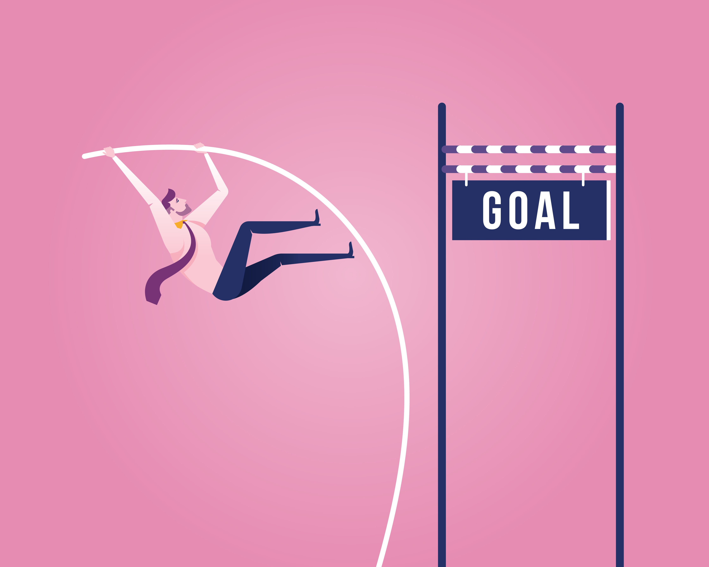
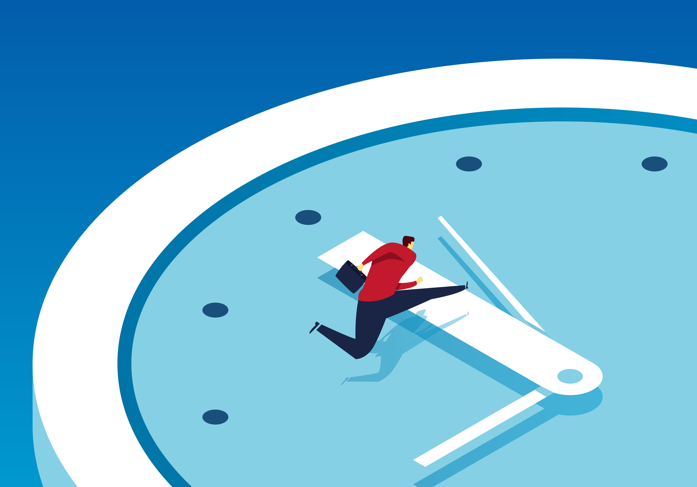
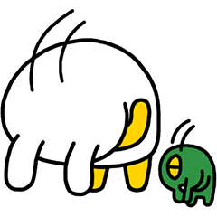

## 상반기를 돌아봤다

7월이다. 2020년 절반이 지나갔다. 러닝맨을 시작한지도 벌서 6개월 됐다. 

내 주제는 '글쓰기'였다. 더 글 잘 쓰는 사람이 되려면 어떻게 해야할까 고민했다. 여러가지를 시도했다. 6개월 동안 무엇이 남았고, 무엇은 부족했는지 곰곰이 생각해봤다. 

## 자기계발의 2가지 방식

얼마 전에 떠오른 생각인데, 자기계발엔 2가지 접근법이 있다. 
1) 목표 달성에 초점을 두는 '챌린지 방식' 
2) 습관을 꾸준히 유지하는 '루틴 방식' 

뭐 완벽하게 갈린다곤 할 수 없지만. 차이는 있다.

**챌린지 방식**은 특정 기간 내 목표 달성에 중점을 둔다. 내 능력 범위를 살짝 넘어서는 목표여야 한다. 내가 달성했다는 걸 알 수 있는 지표도 있어야 한다. 예를 들면 '6월말까지 페이스북 평균 좋아요 100개 만들기'다.  

목표를 달성하기 위해 여러 수단을 동원한다. 이렇게 해보고 저렇게 해본다. 효과가 있는지 테스트한다. 피드백을 받는다. 다시 시도한다. 

어떤 방법이 목표 달성에 가장 효과적인지 알 수 있다. 무엇을 했든 결과적으로 원했던 상태에 도달하는 데 의미를 둔다. 

**루틴 방식**은 해야할 행동을 정하고 시작한다. '페이스북에 포스팅 매일매일 올리기' 같은 거다. 물론 행동에도 궁극적으로 목표하는 바는 있다. 

하지만 루틴은 '매일매일 반복했는지'를 더 중요하게 본다. 결과적으로 '며칠 연속 해냈다'거나 '더 이상 그 행동이 어렵게 느껴지지 않는다'에 의미를 둔다.

## 챌린지를 노렸지만, 막상 남은 건 루틴이었다

내가 러닝맨을 만들 때 생각했던 건, 사실 **'챌린지 방식'에 가까웠다.** 당시 영감을 받았던 책이 '울트라러닝'이다. 울트라러닝은 도전적인 목표를 세운다. 그걸 빠르게 해킹할 수 있는 방법을 고민한다. 최단 시간 내에 빡세게 시간을 투자해 학습 목표를 달성하는 방식이다. 잠재력을 극도로 끌어올린다. 그 정도로 빡세겐 아니라도, 내 버전의 울트라러닝을 해보고 싶었다.

하지만 내 러닝맨 프로젝트는 모호하게 섞여 있었다. 챌린지도 아니고 루틴도 아니고.. 머릿속에서 둘을 명확하게 구분하지 않았기 때문이다. '어? 뭔가 이런 걸 생각했었는데?' 이런 생각에 ['페이스북 좋아요 챌린지'](https://www.learningman.co/themostpersonal/)를 시작하기도 했다.

그런데 돌아보니, **막상 더 많이 남고 뿌듯한 건, '루틴' 방식**이었다. 1일1글, 프리라이팅 같은 매일매일 습관이 가장 큰 성장을 가져다줬다. 조회수 예측과 카피라이팅 훈련 등은 좀 흐지부지하게 마무리했다. (물론 페이스북 좋아요 챌린지는 의미있는 성과가 있었지만. 이건 나중에 자세히 쓰도록 하겠다.)

## 챌린지와 루틴의 장단점

**챌린지 방식은 가장 효과적일 수 있다.** 목표 달성을 위해 무엇이 최선의 전략인지 계속 고민하기 때문이다. **다만 에너지가 많이 든다**는 단점이 있다. 이리저리 고민해보고 새로운 시도를 해야한다는게, 상당한 에너지가 드는 일이다.

'목표 기간내 달성' 자체가 중요할 떄. 에너지를 집중할 수 있을 때 적합하다. 졸업을 위해 토플 점수 100점을 만들어야 한다거나, 회사 특정 부서에서 연말까지 매출 50억을 만들어야 한다거나 등등.

안타깝게도 대부분 자기계발은 삶의 메인이 아니다. 본업이 있고, 남는 개인 시간에 미래를 위해 조금씩 투자하는 방식이다. 

그래서 챌린지 방식이 흐지부지해진다. 내가 시도했던 조회수 예측 훈련이 그런 예다. 처음 기획한 전략은 생각보다 바로 효과가 나타나지 않았다. 훈련 방법을 바꾸거나, 새로운 전략을 써야할 것 같았다. 그러나 그걸 고민하기엔 에너지가 부족했고. 그 정도로 중요한 목표인지에 대한 확신이 없었다. 결국 끝까지 밀고나가지 못했다. 

반면 **루틴 방식은 수동적이지만, 지속가능하다**. 단순한 행동을 정하고 반복한다. 가장 효과적인 목표 달성 루트는 아닐수도 있다. 하지만 방향 설정에 들어가는 정신적 에너지가 적다. 해야할 일이 단순하다. 그냥 매일매일 빼먹지 않으면 된다.

그러다보니 6개월 동안 꾸준히 할 수 있었다. 지난 반년 동안 나는 명상, 단식, 프리라이팅, 1일1글, 운동을 매일 했다. 이젠 완전히 습관으로 자리잡았다. 내 삶의 질을 극적으로 올려줬다. 생각해보면 나한텐 당장 달성해야할 목표보다는, 살면서 내가 하루하루 나아진다는 뿌듯함이 좀 더 중요했다.

어떤 게 맞다기보다는, 상황에 따라 잘 맞는 스타일이 있다. 비유하자면 액티브 투자와 패시브 투자 같은 게 아닐까 한다. 

전업투자자거나 당장 목돈이 필요하다면, 종목 선정하고 지표 봐가면서 액티브하게 투자하는 게 맞을 수 있다. 

하지만 일주일에 한번 정도 시간 나는 직장인이라면? 패시브 투자가 낫다. 기대수익률 높이겠다고 무리하게 액티브 투자를 하다가 어정쩡해지는 것보다, 지수펀드에 매일매일 적립하면서 장기투자하는 게 결과적으론 더 좋다.

## 남은 하반기도 루틴을 쌓아가자

2020년 남은 6개월. 일단 여태까지 했던 루틴을 잘 유지하려고 한다. 글쓰기 관련해서는 혼자 쓰는 프리라이팅, 인스타 1일1글, 페이스북 포스팅을 이어나가려고 한다. 

하반기에 새로 만들고 싶은 습관도 있다. 바로 메모와 지식DB의 활용이다. 

지금 '생각'을 기록하고 발전시키는 파이프라인은 어느 정도 자리잡았다. 그런데 '보고들은 정보/지식'을 기록하고, 흡수해서 활용하가는 파이프라인은 아직 잘 닦여있지 않다.

나는 항상 아쉬움을 느낀다. 평소 많은 책, 아티클, 포스팅, 동영상, 뉴스레터 등을 본다. 그런데 보고나서 충분히 내 글의 재료로 활용하지 못한다는 생각이 든다. 잘 기록해두고, 기록끼리 연결하고, 새로운 의미를 찾아내서, 영감을 얻거나 글쓰기 재료로 삼고 싶다. 

시험삼아 지난 2달 동안 '1일1사'라는 루틴을 해봤다. 책에서 인상깊게 본 구절을 필사하는 루틴이다. 그런데 해보니 잘 유지가 안 됐다. 막상 그 순간이 되면 뭘 골라야할지 고민하느라, 시동에 에너지가 많이 든다. 적고 나서 '활용'하는 과정도 고민이 부족했다. 

여기에 대해선 앞으로 좀 더 시행착오를 겪어본 뒤에, 다시 포스팅을 하도록 하겠다.

마지막으로 2020년 절반을 잘 달려온 러닝맨 동지들과,

부족한 글을 읽어주시는 독자 여러분들에게,

고생 많았고 감사하다는 말을 하고 싶다.

