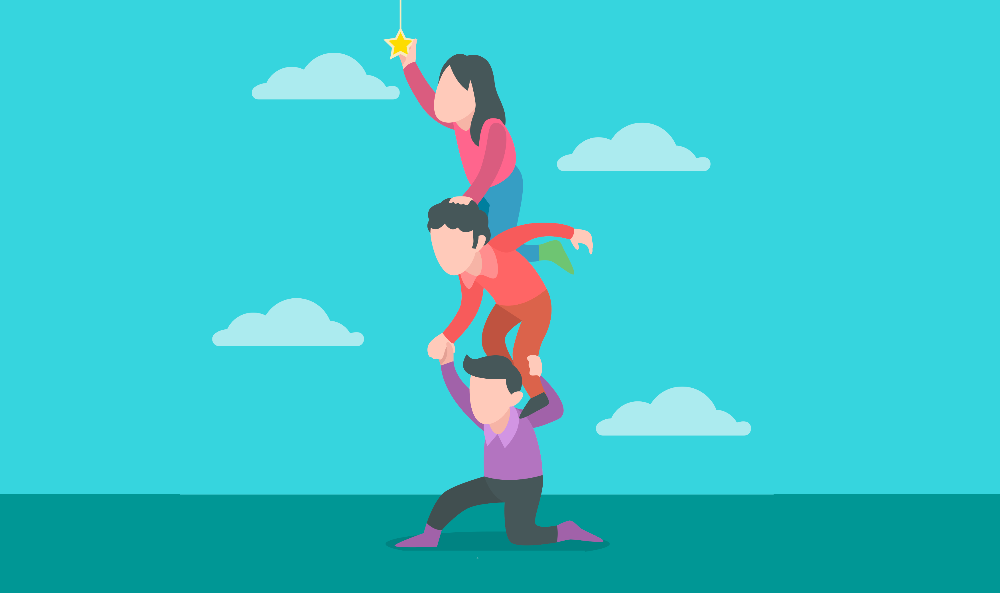

오늘 포스팅은 러닝맨 자체에 대한 이야기다.

**러닝맨은 팀 블로그인 동시에, 자기 계발을 위한 스터디 모임이다.** 4명의 멤버가 2주에 한번씩 화상으로 만난다. 

우리의 목표는 심플하다. 각자의 목표를 이루고 성장할 수 있게 돕는 것. 

러닝맨을 시작한지 1년 반 정도가 지났는데, 그 동안 여러가지 방식을 시도해봤다. 

올해 상반기에는 돌아가면서 **발표**를 했다. 자신이 관심있고, 자기 성장에 도움될만한 주제를 다른 멤버들에게 설명해준다. 그걸 정리해 글로 포스팅하는 방식이었다.

하반기부터 새로운 방식을 시도했다. 2명씩 짝을 지어서 서로가 서로의 목표 달성을 도와준다. 서로가 서로를 키워주는 이른바 '**다마고치 프로젝트**'다. 

상대방의 코치가 되어 상대방이 했는지 안했는지 검사도 하고, 피드백도 주고, 더 잘하려면 어떻게 해야할지 같이 고민한다. 

 

**7월 5일부터 8월 16일까지.** 6주간 1차 시도를 해봤다. 구체적인 방식까지 정하지 않았지만, 일단 한번 해보기로 했다.  

마지막 날 4명이 모여서 경험이 어땠는지 리뷰했다. 각자 질문에 돌아가면서 답하는 방식이었다. 오늘의 포스팅은 그 리뷰를 거의 그대로 글로 옮겼다. 

**같이 자라기 위해서 우리가 어떤 고민을 하고 있는지** 솔직하게 담겨있는 글이라고 생각한다.

## 1. 다마고치 프로젝트를 처음 시작했을 때 기대했던 점, 걱정했던 점은?

**Eddy**

내가 다마고치 프로젝트를 구상하면서 기대했던 건 2가지다. 

첫째, 내 자기계발뿐만 아니라 다른 사람의 자기계발도 도와주고 싶었다. 나는 나에게 여러가지 시도를 하고 있고, 효과를 보고 있는 것도 있다. 하지만 과연 남한테도 이게 먹힐까? 내 주변 사람들에게 한번 테스트해보고 싶었고, 그들도 효과를 느꼈으면 좋겠다고 생각했다. 

둘째, 러닝맨이라는 모임에서 좀 더 많은 걸 얻어가길 바랬다. 기존에 하던 개인별 회고는 확실히 강제력이 약했다. 딱히 다른 사람이 도와주기도 애매했다. 하지만 다마고치를 하면 좀 더 많은 투입이 들어가니까, 더 큰 결과가 나오지 않을까 생각했다. 

다만 어떤 방식으로 해야 좋을지 잘 모르겠어서 걱정을 좀 했다. 각자 상황에 따라서 원하는 바가 다를 수도 있고. 들일 수 있는 인풋이 다를 수도 있으니까. 너무 빡세지도, 너무 짜치지도 않는 그런 프로젝트를 하고 싶었다. 

그러다 생각난 게 예전에 신사임당 채널에서 봤던 '창업 다마고치' 코너다. 그래서 이름을 다마고치라고 붙여봤다. 우리는 스마트스토어 창업은 아니지만, 각자의 성장을 도와준다는 그런 의미로.

**Jesse**

큰 원대한 목표를 추구하기보다, 꾸준히 공부하고 싶다는 생각이 있었다. 

근데 진짜 꾸준히 쌓아나가는 게 쉬운 일이 아니다. 개발자로 일하면서 얻은 개발 지식들을 잘 구조화해서 정리해두고 싶었다. 기존에는 매일매일 뭔가 해야한다는 강제성은 없었다. 다마고치를 하면 그런 압박이 좀 있을 거 같아서 기대가 됐다. 

회사 일 때문에 바빠서 다 못 지키지 않을까 걱정이 되긴 했지만.

**Robbie** 

나도 꾸준함을 지키고 싶었다. 나는 주변 사람의 압박(Peer pressure)에 민감한 편이다. 다마고치 제안을 처음 들었을 때 꾸준해지기 위해 이걸 사용하면 좋지 않을까, 싶었다.

다만 처음에 시작할 때, 나도 상대방의 코치를 해줘야 한다는 점 때문에 고민이 되었다. 내가 상대방이 성장하고자 하는 분야에 대해 전문성이 없었다. 내가 건설적인 피드백을 줄 수 있을지 걱정했다. 

**Kay**

나도 비슷하다. 꾸준해지고 싶었다. 나는 되게 즉흥적이고 감정적인 사람이다. 올해 목표가 나를 안정화하는 것이었다. 다른 사람이 주는 압박을 활용해서 나를 안정화시킬 무언가를 꾸준히 하면 좋겠다고 생각했다.

나는 명상을 하고 싶었는데, 내가 정말 명상을 원하는가? 라는 피드백을 받아서 고민을 좀 했다. 내가 원하는 건 안정화된 삶이 아닐 수도 있다는 얘기를 듣고 좀 두려웠다. 

## 2. 다마고치 프로젝트에서 기대한만큼 효과를 봤는지?

**Jesse**

매일 최소 30분 개발 공부하고 1주일에 한번 컨텐츠를 발행하기로 했었다. 

이건 뭐 여러 말할 게 없다. 매우 효과를 봤다. 처음 생각했던 목표도 달성했고, 우려했던만큼 시간 투입이 부담스럽지도 않았다. 

**Robbie** 

다마고치 기간 동안 매일 평일에 디파이 관련 글을 번역해 올리기로 했다. 100% 달성은 못했지만, 좋은 습관이 생겼다. 

매일 리서치 사이트에 들어가서 블록체인 관련 새로운 소식, 리서치를 체크한다. 트위터에서도 팔로우하는 인물들이 생겼다. 

내가 앞으로 몰입할만한 주제를 찾는 게 가장 큰 기대였는데, 거기에도 도움이 많이 되고 있다. 관심사를 좁히면서 주제를 점점더 구체화해나가고 있다. 요즘은 AMM에 대한 보상 구조 개선에 대해 생각 중이다.

**Kay**

6주간 '캄' 앱으로 매일 명상을 했다. 기대를 사실 많이 안했다. 근데 명상 앱을 좋아하게 됐다는 게 가장 큰 수확이다. 이전에는 명상 하려고 노력해봤는데 늘 3번하고 그만뒀었다. 다마고치하니까 이제 된다. 

**Eddy**

나도 전반적으로 기대한만큼의 효과를 봤다고 생각했다. 알고리즘 공부 1시간씩 하기로 했는데 100% 달성했다. 

특히 단톡방에 매일매일 올리는 게 꾸준히 하는 데 큰 도움이 되었다. 다른 사람이 올리는 걸 보면 리마인드하는 효과도 있고. 덕분에 술 먹은 날도 빠지지 않고 했다.

## 3. 목표의 난이도는 적절했는지?

**Kay**

너무 적절해서 더 할말이 없다. 다음번에도 갑자기 난이도를 올리는 것보단, '주말 포함' '데일리캄 말고 다른 컨텐츠 듣기' 정도로 올려볼 수 있을 거 같다.

**Jesse**

어렵지 않은 목표로 잡았다. 그래서 오히려 좋았다. 바쁠때도 30분 정도는 충분히 투자할 수 있으니까. 다음 번에도 이렇게 하고 싶다.

**Robbie** 

빡세게 하는 것보다 가랑비에 젖듯이 오래 하는 구조가 좋은 거 같다. 다만 가끔 어떤 주제를 번역하거나 공부할지 찾는 게 어려울 때가 있었다.

**Eddy**

난이도 적절했다. 다음 번에 한다면 좀 더 난이도를 올려보고 싶다.

## 4. 주간 리뷰는 어땠는지?

*(주간 리뷰는 매주 따로 만나서 각자 현황에 대해서 체크하고 피드백하는 시간인데, 한 팀도 있고 안한 팀도 있었다.)*

**Jesse**

매주 일요일 밤 10시에 화상으로 만나서 주간 리뷰를 했다. 각자 다마고치 프로젝트 목표에 대해 잘 되고 있는 점, 안되고 있는 점. 새로 시도해볼 것 등을 공유했고 의견을 나눴다. 

주간 리뷰가 있어서 확실히 좋다고 느꼈다. 카톡보다 화상으로 이야기를 하니까, 지금 내가 하는 노력을 누군가 계속 지켜보고 있다는 게 더 실감이 난다. 굳이 길게 할 필요까진 없고.

**Eddy**

주간 리뷰를 하기 전에 서로 충분히 생각 정리를 하고 만나야 효과가 좋았다. 그 주 한 걸 시트에 적고, 그걸 기반으로 얘기하는 방식. 그냥 수다를 떠는 것처럼 변할 수도 있기 때문에 효율적으로 하면 사전 노력이 있어야 한다. 

특히 내가 상대방한테 의견을 듣고 싶은 질문, 주제를 미리 정해놓는 게 가장 효과가 좋은 거 같다.

**Robbie** 

정기적으로 리뷰는 하지 않았다. 가끔 통화로 피드백을 주었다. 사실 했는지 안했는지 체크하는 것 외에 '기분이 어떠냐' 질문하는 정도여서, 잘했는지 모르겠다.

**Kay**

전화로 하니까 확실히 공사 구분이 안되는 느낌이었다. 다음번에는 주간 리뷰에 좀 더 우선순위를 둬서 해보고 싶다.

## 5. 코치가 나에게 어떤 식으로 피드백, 자극을 줄 때 좋았는지?

**Robbie** 

글이라는 건 독자가 있어야 쓸 맛이 나는데, Kay가 글을 보고 궁금한 점을 자주 질문을 해줬다. 누군가 내 글에 관심을 가지고 있다는 느낌이 도움이 됐다.

**Kay**

명상하니까 기분이 어때? 라고 물어봤을 때 좋았다. 누군가 체크업해준다는 게 기분이 좋더라.

**Jesse**

처음에 빡세게 할지 말지 고민하고 있었다. 그런데 Eddy가 원대한 목표보다 습관을 만드는 게 좋겠다고 해준 피드백이 좋았다. 

또 이번주에는 그거 보다 좀 더 할 수 있지 않냐? 라고 자극을 물었는데 그것도 좋았다. 

**Eddy**

두 가지였던 거 같다. '잘 하고 있네' 랑 '그거 굳이 해야 되나?' 이것도 해야하나, 저것도 해야하나? 이런 방황을 많이 했는데 비슷한 경험을 한 코치가 있어서 좀 더 안심할 수 있었다. 

다만 내가 공부한 내용 자체에 대해 좀 더 피드백이 있었으면 좋았을 듯.

## 6. 자신은 상대방을 도와주기 위해서 어떤 일을 했는지? 어떤 일을 더했다면 좋았을지?

**Jesse** 

개발 공부에 대한 전반적인 경험을 공유하고 공부 방향성을 조언해줬다. 컨텐츠를 좀 더 깊게 읽고 피드백을 해줬다면 더 좋았을 뻔했네. 나도 코드를 보면서 좋은 코드란 무엇인지 생각해볼 수 있어서 좋았다. 

**Robbie** 

명상했는지 체크하기. 기분 어떤지 체크하기. 이 질문 2개만 했다. 명상을 통해서 안정이 되고 있는지 위주로 체크를 했다. 

좀 더 자주자주 명상에 대해서 물어봤다면 더 낫지 않았을까 생각이 든다. 이렇게 계속 다들 명상을 하고 추천하니까 진짜 명상이 효과가 있나? 하는 흥미가 동했다.

**Kay**

리서치 계정을 줬고, 최신 디파이 아젠다 같은 것들 알려줬다. 그리고 글 안 썼을 때 계속 재촉했다. 

만약 더 할 수 있었다면, 아예 해당 주제에 대해 같이 공부를 했다면 좋을 거 같다. 나도 관심이 있는 분야여서 올려준 참조 링크나 이런 걸 더보고 내용에 대해 토론했다면 더 좋았을 텐데. 그래도 덕분에 디파이의 원리나 이론적인 부분에 대해서 많이 접했다.

**Eddy**

했는지 체크하고, 칭찬하고 따봉 눌러줬다. 좀 더 읽기 쉬운 글로 만들기 위한 가벼운 피드백을 줬다. 

생각해보니 단순히 내용 정리가 아니라 어떻게 리마인드해줄 수 있을지에 대한 팁. 퀴즈나 SRS 앱 같은 아이디어를 던져주었다면 좋았을 듯. 더 좋은 개발 아티클을 쓰기 위한 팁이 담긴 포스팅 같은 걸 공유하는 것도 충분히 가능했을 거 같다.  Jesse 자기계발을 도와주면서 배운 점이 있다면, 1. 꾸준함을 위한 사이클과 2. 아웃풋을 만들고 공유하기 위한 사이클은 분리해서 생각하는 게 좋다는 점이다.

## 7. 본인이 하려는 분야를 잘 아는 사람이 코치를 해야한다고 생각하는지?

**Jesse**

물론 알면 좋지만, 필수는 아닌 거 같다. Eddy가 해준 피드백은 개발 지식을 잘 알아서 해준 게 아니다. 자기계발 분야에 관심이 많고 잘 아는 것만으로도 충분히 도움이 됐다.

**Robbie** 

다마고치를 한번 해보니 가장 큰 얼개는 습관 만들기인 거 같다. 내용을 아는 사람이 하면 더 도움이 되겠지만, 습관에 관한 피드백은 비전문가도 충분히 할 수 있다.

**Kay**

분야가 어디냐에 따라 다른 거 같지만. 운동을 하거나 명상을 하는 거면 돕는 데 큰 전문성이 필요 없겠지만 영어 공부라든지 개발은 코치가 전문가이면 훨씬 좋을 거 같다.

**Eddy**

들어보니 하려는 분야에 전문성이 있으면 훨씬 좋다'는 건 다 이견이 없다. 하지만 전반적으로 좋은 독자 수준의 역할만 해도 효과는 충분하다는 점에도 동의하는 거 같다. 사실 70% 정도는 꾸준함이 가져오는 효과인 거 같다. 우리가 좀 더 관심을 가지면 코칭을 하는 것도 더 배워서 잘하게 될 수 있을 거 같다.

## 8. 6주간 '다마고치'를 하면서 기억에 남았던 순간은?

**Jesse**

어제 쓴 글을 페이스북에 퍼블리시했는데, 그게 가장 기억에 남는다. 예상치 못하게 공유가 엄청 됐다. 

그리고 나서 Eddy와 주간 리뷰를 하는데, '이렇게 매주 해볼 수 없나?'라는 피드백을 받았다. 미처 생각해보지 못했는데, 생각해보니 할 수 있겠다 싶었다. 덕분에 내 한계를 한발짝 벗어날 수 있는 기회가 만들어졌다.

그 전에는 내가 하기로 한 일을 했나 안했나 점검하는 정도였는데, 이 피드백은 내 행동의 변화를 일으키는 조언이었다. 그 점이 무척 기억에 남는다.

**Eddy**

매일 꾸준히 하긴 했지만 너무 어려워서 좌절한 경우가 많았다. 근데 계속 시도하다보니 내 힘으로 문제를 처음으로 풀게 됐다. 그 때 짜릿한 느낌이 기억에 남는다. 내 노력과 성취에 대해서 자랑할 수 있고 그걸 축하해주는 사람들이 있어서 좋았다.

**Kay**

'데일리 캄'이 끝나면 나오는 문구가 있다. 나를 관찰하라는 그런 내용이었는데, 그게 무척 나에게 필요한 내용이어서 좋았다. 그게 기억에 남는다. 그 문구를 인스타에 올리기도 했다. Jesse가 박수 이모티콘을 보내줬는데, 그런 리액션, 칭찬을 받은 것도 기분 좋았다. 

아 그리고, 회사에서 안 좋은 일이 있었는데 3분 명상 3번 연속해서 극복한 것도 기억에 남는다. 그때 감정을 잘 다스리지 못했으면 하루종일 안 좋았을 텐데. 덕분에 잘 보냈다. 

**Robbie** 

맨 처음에 페이스북에 글 올렸을 때가 기억에 남는다. 디파이 관련 글을 페이스북에 올린다고 선언하기만 했는데, 좋아요가 60개인가 찍혔다. 내가 공부하기 위해서 한 건데, 그거에 피드백을 받고, 결과물을 올리면서 큰 자극을 받았다. 덕분에 갑자기 사람들이 연락이 많이 오기도 하고. 결과물을 공유하는 경험의 특별함을 느낀 거 같다.

또 상대방이 다마고치를 하면서 진로를 결정하고 성장하는 과정을 보는 게 재미있었다. 내 조언이 도움이 되었을 수도 있고, 그걸 그냥 지켜보는 것만으로도 나에게 자극이 되기도 했다. '다른 사람이 성장할 수 있는지 지켜보고 싶다'라는 마음을 이해하게 됐다. 

