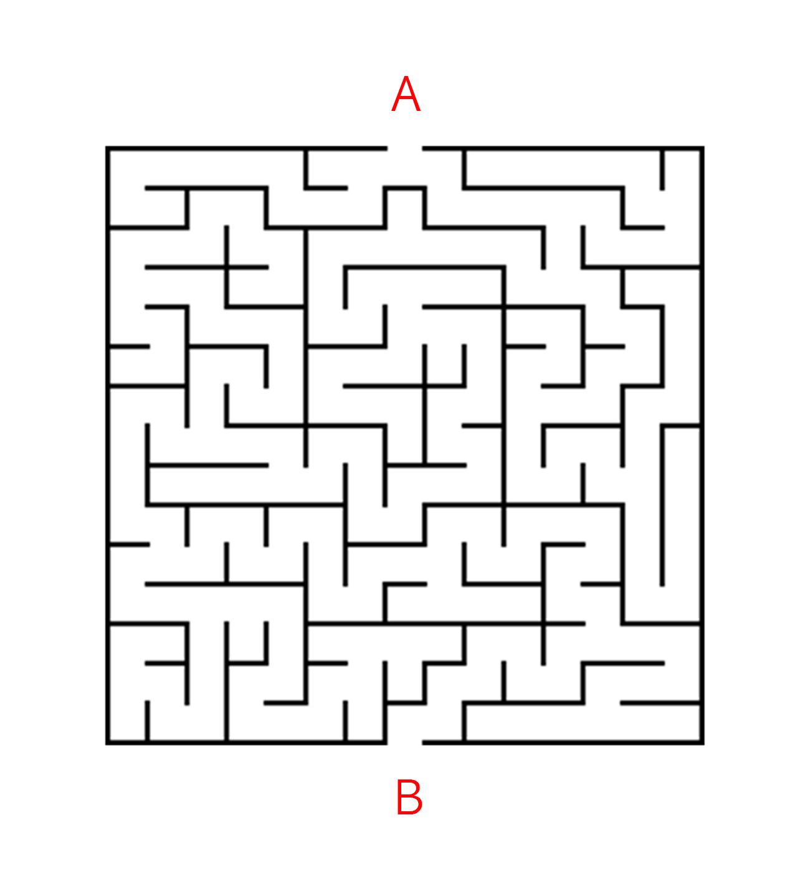
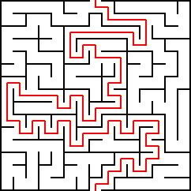
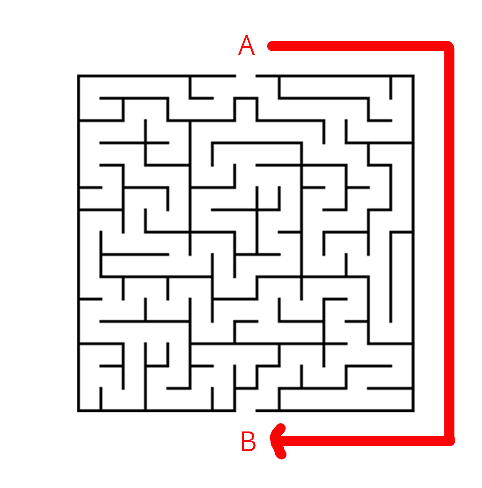
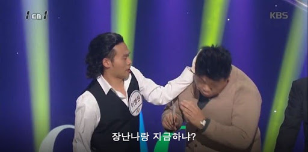
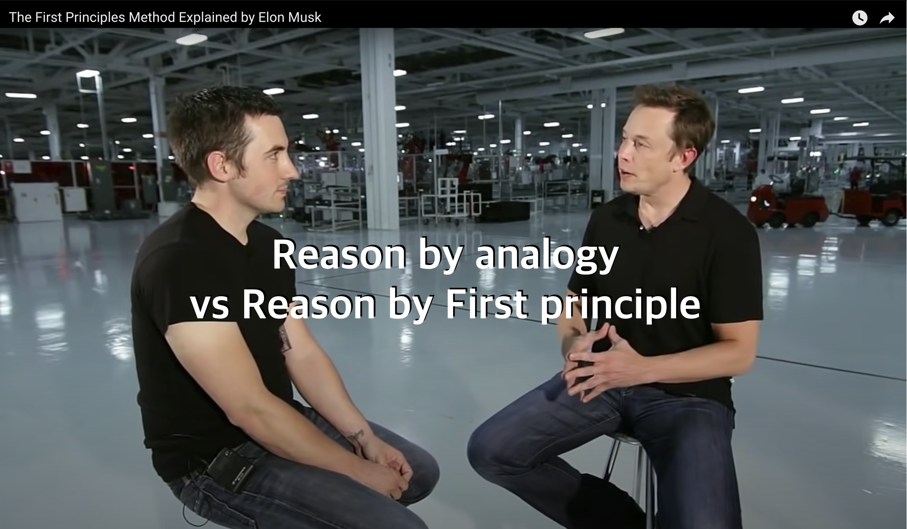
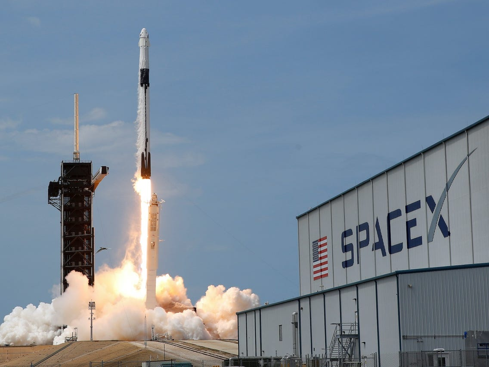

이 미로 그림을 보자.

지금부터 30초 동안, 

눈으로만 이 미로의 답을 풀어보자.

A 지점에서 시작해 B 지점에 도착하면 된다.

.

.

.

밑으로 바로 내리지 말고,

한번 눈으로 풀어보자. 30초다.

.

.

.

풀 수 있었는가?

.

.

자, 그럼 답을 공개하겠다.

본인이 생각한 답과 같은가?

시간이 모자랄 수도 있었겠지만, 

어쨌든 이 답은 어렵지 않게 찾을 수 있었을 것이다. 

하지만, 이러한 답을 생각한 사람이 있을까?

아마도 없을 것이다.

어떤 사람들은 그건 반칙이잖아! 라고 생각한다.

하지만 앞에서 문제를 낼 때, 규칙을 말한 적은 없다.

이런 말장난 같은 퀴즈를 던진 이유는,골탕을 먹이기 위해서가 아니다.

다만 우리는 평소 **이미 당연하게 여기는 전제 속에서 생각하고 있다**는 것을 말하고 싶었다.

우리는 미로에 대한 상식을 알고 있다. 미로를 풀어보세요라는 말을 듣자마자, 미로 안으로 들어가야한다는 '전제'를 떠올린다. 너무나 당연한 일이다. 

그런데 이 숨은 전제들은 우리가 의식하지 못하는 사이에, **남들과 다르게 생각하는 것을 막는다.**

이미 그래야 하는 것, 그래왔던 것들이 머릿속에 깔려있기 때문에, 사람들은 결국 다 같은 미로의 답을 말하게 되는 것이다.

일론 머스크의 생각법으로 유명한 '1원칙 사고'는 바로 이것과 관련이 있다. 

우리가 가진 불완전한 가정과, 전통적인 규칙을 의식적으로 거부하는 태도다.

## 일론 머스크의 1원칙 사고

1원칙 사고는 아래의 인터뷰에서 일론 머스크가 얘기하면서 유명해졌다.

일론 머스크는 인터뷰에서 유추(Reason by Analogy)와, 1원칙에 기반한 추론(Reason by First principle)을 대비 시킨다.

> "우리는 유추를 활용해 인생을 살아갑니다. 다른 사람이 하고 있는 것을 살짝 바꿔서 똑같이 하는 걸 말하죠. 그리고 그건 필수적입니다. 아니면 정신적으로 너무 힘들어서 하루를 헤쳐나가기도 힘들겠죠."

> "하지만 당신이 뭔가 새로운 걸 하고 싶다면, 1원칙을 통해 생각해야 합니다."

2002년 일론 머스크는 화성에 로켓을 보내겠다고 다짐한다. 그러나 로켓을 구매하고 발사하는 비용은 말 그대로 천문학적이었다. 

일론 머스크는 문제를 다시 생각해본다. "좋아, 로켓을 만드는 것의 1원칙은 뭘까?" 머스크가 생각한 1원칙은 "로켓을 구성하는 가장 기본적인 재료들"이었다. 알루미늄, 티타늄, 탄소 섬유 등등. 

그 모든 원재료 값을 더해보니 시장에서 얘기하는 로켓 값의 2%였다고 한다. 

**일론 머스크는 다른 모든 것을 무시하고, 정말로 변할 수 없는 사실만 봤다.** 그러자 충분히 가격을 낮출 여지가 있어보였다. 

머스크는 회사를 세우고, 원재료를 사서 직접 로켓을 만들기로 한다. 그는 항공우주업계의 전통적인 믿음, 상식을 하나도 신경쓰지 않고, 오로지 자신이 알고 있는 가장 확실한 것에만 집중해서 문제를 해결해나갔다. 그 생각은 결국 '재사용가능한 로켓'이라는 방법론에 도달하게 된다. 

여러분이 잘 알고 있듯이, 머스크가 세운 회사는 스페이스X다. 스페이스X는 수없이 많은 시도 끝에 재사용가능한 로켓의 비전을 실현시켰다. 결국 로켓 발사 비용을 10분의 1까지 낮췄다.

수학/물리학에서 1원칙이란, '혼자서 성립할 수 있는 근본 명제'를 말한다. 

일론 머스크 이전에도 위대한 사상가, 과학자들이 '1원칙 사고'를 말했다. 아리스토텔레스, 니콜라 테슬라, 리처드 파인만 등등. 이들이 말하는 1원칙 사고를 들어보면 약간씩 핀트는 다르긴 하다. 

하지만 내가 이해하기에 1원칙 사고의 핵심은 결국 이거다. 

우리는 어렴풋하게 알고 있는 사실들, 무의식 중에 전제하고 있는 믿음이 다르게 생각하는 것을 제한한다.\

 인간이라면 누구나 갖고 있는 그 본능이다. 

하지만 새롭고 혁신적인 아이디어는 그걸 무시해야 나온다. 

그러기 위해서, 우리가 알고 있는 것들을 의심하고 파고 들어간다. 

그 밑에 깔려있는 가장 보편적이고 근본적인 진실을 찾는다. 

거기서부터 거꾸로 연역 추론을 해나간다. 

우리 마음속에 숨어있는 전제들을 부수는 과정이다.

물론 현실적으로 모든 문제를 물리학적 공리 수준까지 파고들어갈 수는 없다. 다른 사람들보다 한 뎁스, 두 뎁스 더 내려가는 게 중요하다. 

우리가 마음 속에 이미 그어놓은 선들을 조금씩 지워나가다 보면 새로운 가능성의 영역이 보인다. 다른 사람들이 보지 못한 기회를 볼 수 있다.

## 빌리 빈의 1원칙 사고

1원칙 사고를 생각하면서, 나는 <머니볼>이 떠올랐다. 오클랜드 애슬레틱스의 전략은 1원칙 사고를 너무나 잘 보여주는 사례다. 

머니볼을 보지 않은 사람을 위해 간단히 요약하자면, 오클랜드 애슬래틱스는 가난한 야구 구단이고, 늘 하위 성적을 면치 못하고 있다. 야구에서 이기려면 좋은 선수가 필요한데, 오클랜드는 많은 연봉을 줄 수 없었다. 좋은 선수를 키워내더라도, 곧 양키스 같은 구단이 거액을 제시하면 선수들이 떠나버렸던 것이다. 

이 구단에 빌리 빈이라는 새로운 단장이 부임한다.

**빌리 빈**: “이 방 안에서 뉴욕 양키스처럼 생각한다면, 우리는 이 방 밖에서 뉴욕 양키스에게 질거에요. 우리는 이제 그들과 다르게 생각해야해요.”

**스카우터**: “그런 말은 누구나 하겠어, 꼭 포츈 쿠키 같은 말이네.”

**빌리 빈**: “아니요, 이건 당연한 논리에요.”

빌리 빈은 전통적인 스카우터가 아닌, 데이터 분석가와 엔지니어들로 팀을 꾸려서 새로운 전략을 짠다. 강팀이 되려면 어떻게 해야하는가. 이 질문에는 누구나 자기만의 이론을 댈 수 있다. 수많은 변수와 가정과 믿음들이 얽혀있는 문제였다. 

빌리 빈은 그걸 싹 무시한다. 그리고 1원칙을 생각한다.

야구에서 가장 중요한 가치는 뭐야? '승리'지. 

승리하기 위해 가장 필요한 것은? '뛰어난 선수'야. 

그런데 우리는 예산이 매우 적어. 그걸 바꿀 수 없는 사실이지. 

그렇다면 적은 예산으로 뛰어난 선수를 데려오려면? 저평가된 좋은 선수를 찾아야해. 

저평가된 좋은 선수를 찾으려면, 저평가받는 통계 지표를 봐야 해. 남들이 다 보는 지표는 가격에 반영되니까. 

가장 저평가되면서 승리에 기여하는 통계 지표가 뭐지? 출루율. 

우리는 **출루율**만 본다.

내 맘대로 정리해보자면 이런 생각의 흐름이었을 것이다. 

그래서 오클랜드는 철저하게 저평가된 선수에 집중하는 전략을 세웠다. 외모, 타율 같은 전통적인 지표를 무시하고, 오직 출루율만 봤다. 결국 오클랜드는 예상을 뛰어넘는 성적을 거둔다.

약팀은 남들과 다르게 게임을 해야한다. **다르게 게임을 하려면, 전통적인 가정을 무시해야 한다. 가장 기본으로 돌아가서, 거기서부터 추론해낸 것을 기반으로 생각한다.** 그러면 남들이 보지 못한 기회를 발견할 수 있다.

## 그래서 어떻게 1원칙 사고를 할 수 있는가

오케이 알겠고. 남들과 다르게 생각하라. 기존의 믿음을 무시해라. 잘 이해했어. 

> **그런데 그걸 어떻게 내 문제에 적용해볼 수 있지?** 

아마 이런 생각이 들었을지 모른다. 나도 1원칙 사고에 대해 조사하고 생각하면서 계속 이런 생각이 들었다. 많은 사람들이 추천하는 방법으로는 다음과 같은 것들이 있다.

- **5 Why** - '왜지?'를 5번씩 물으면서 근본적인 원인을 파고드는 방법.
- **소크라테스식 문답법** - 내가 어떤 생각을 하고 있지, 왜 그 생각을 하고 있지? 그 생각의 증거는 무엇인가? 상황이 바뀌어도 그것은 진실인가? 등을 물어보고 답하는 것.
- **Working Backward** - 우리가 달성하고자 하는 목표를 상상하고, 그것이 이루어졌다는 것을 어떻게 알 수 있는지 생각한다. 그러기 위해 필요한 요소를 나열하고, 그걸 이루려면 어떤 조건이 필요한지 역순으로 생각해보는 것. 
- 흔한 가정을 의심하기 - "세상엔 정보가 너무 많아" "모든 좋은 아이디어는 다 나왔어" "1등이 성공해" 등등 사람들이 습관적으로 말하는 가정들이 정말로 그런지 의심해보기. 

좋은 방법들이지만, 이것들도 사실 추상적이기는 마찬가지다. 

내 생각에 1원칙 사고는 엄밀한 개념이 아니며, 이러이러하게 따라하면 된다는 공식 같은 건 없다.

**1원칙 사고란 방법론이라기보다는, 태도다.** 

무슨 태도냐 하면, **'당연하게 여기는 것'을 최대한 피하는 태도.** 그게 핵심이다. 

일론 머스크와 빌리 빈은 세상이 그래야 한다고 믿는 것에 'Fuck you'를 외쳤다. 

이건 정말 쉬운 일이 아니다. 영어엔 '**Unlearning**'이라는 단어가 있다. 한번 배운 것을 버린다는 뜻이다. 하지만 인간은 살아가면서 수많은 지식과 믿음과 이야기를 흡수한다. 이미 머릿속 깊이 체화되어있어서, 의식하기도 어렵고 그것과 반대로 생각하기도 무척 어렵다.

**거꾸로 자전거 배우기**라는 [영상](https://youtu.be/MFzDaBzBlL0)을 본 적 있는가? 엄청 유명한 유튜브 영상이다. 

자전거는 핸들을 왼쪽으로 꺾으면, 바퀴가 왼쪽으로 돌아간다. 그런데 이걸 바꿔서 핸들을 왼쪽으로 꺾으면, 바퀴가 오른쪽으로 돌아가는 거꾸로 자전거를 만든다. 

자전거를 한번 배운 사람은 이걸 도저히 타지 못한다. 왜냐하면 이미 자전거가 쓰러지려고 할 땐 그 쪽으로 꺾어야한다는 지식이 무의식중에 박혀있기 때문이다. 거꾸로 자전거에서는 반대로 해야하는데도 말이다. 

이 영상을 보면 'Unlearning'이 참 쉽지 않다는 걸 알 수 있다. 우리는 본능적으로 이미 배운 것을 그대로 따라하도록 진화해왔다. 그 편이 가장 효율적이기 때문이다. 

그러나 이건 확실하다. 그러려고 노력했을 때 우리는 독창적인 생각을 해낼 수 있다. 우리가 '당연하게 여기는 것'들은 사실 뉴턴의 법칙처럼 당연한 것이 아니다. 사실 자연 법칙 외에는 모두가 인간이 만들어낸 이야기이고, 모두가 공유하는 믿음일 뿐이다. 

그냥 봤을 땐 **꽉 막힌 벽**처럼 보인다. 가까이 다가가서 들여다보면 그냥 발만 들어올리면 **넘어갈 수 있는 선**에 불과하다. 그러니 일론 머스크나 빌리 빈처럼 되고 싶다면, 그 선을 무시할 용기가 있어야 한다. 

그어져있는 선을 의심하고, 무시하려고 의식적으로 노력하자. 그것이 1원칙 사고다.

