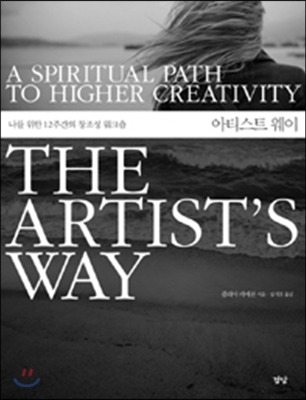
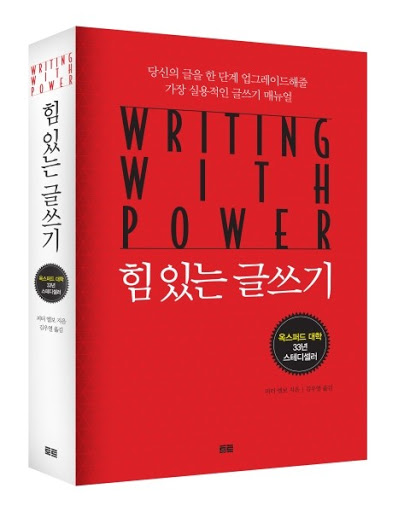
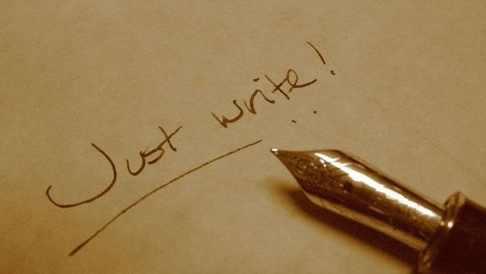

단순히 기술이 뛰어나다고 좋은 글을 쓰는 건 아니다. 좋은 글을 결정하는 많은 부분은 마음가짐과도 관련 있다. 

글쓰기는 두려운 일이다. 번지점프를 하기 전에 누구나 움츠러들듯이. 

글쓰기를 시작하면 (또는 시작해야한다고 생각하기만 해도) 부정적인 감정이 몰려온다. 내가 형편없는 글을 쓴다는 두려움. 빈 페이지의 공포. 쓰고 싶지 않은 기분 

'이게 말이 돼?' '쓸 말이 없는데?' 같은 글쓰기의 두려움은 본능에 가깝다. 그래서 글쓰기는 누구에게나 쉽지 않은 일이다. 키보드를 치는 일이 힘든 게 아니다. 두려움을 이기는 일. 생각을 꺼내놓는 일. 거침없이 밀고 나가는 게 어렵다. 정신력 싸움이다.

그래서 내가 매일 하는 루틴이 있다. 그중 하나는 이미 소개한 매일 글쓰기다. 다른 하나는 '프리라이팅'이다. 

이 프리라이팅은 그냥 글쓰기와는 좀 다르다. '모닝 페이지'와 '프리라이팅'이라는 유명한 연습법을 짬뽕한 루틴이다. 먼저 모닝 페이지와 프리라이팅이 뭔지 알아보자.

## 모닝 페이지

<아티스트 웨이>는 유명한 베스트셀러다. 특히 작가들 사이에선 필독서로 꼽힌다. 작가, 크리에이터가 어떻게 자신의 창조성을 끌어낼 수 있는지 알려준다. 아티스트 웨이에 나오는 창조성 트레이닝의 핵심. 그게 바로 '모닝 페이지'다.

모닝 페이지 하는 방법은 단순하다. 매일 아침 일어나, 공책을 편다. 머릿속에 떠오르는 의식의 흐름을 적는다. 절대 고치지 않는다. 뒤로 돌아가지도 않는다. 그냥 흐름을 따라 떠오르는 대로 쭉 적는다.

예를 들면 이런 식이다.  "어휴, 또 월요일 아침이다. 모닝 페이지를 시작했다. 정말 쓸 말이 없다. 참 이불을 빨아야지. 그건 그렇고 오늘 서점에 가야 하나? 그 책 읽어봐야 한다. 어쩌고저쩌고...."

아무런 평가나 판단도 하지 않고 쓰는 게 핵심 규칙이다. 잘못 쓴 모닝 페이지는 없다. 멋있게 쓸 필요도 없다. 남에게 보여줄 글이 아니다. 그냥 의식의 흐름을 쓰면서 매일 아침 3페이지를 채운다.

일반적인 글쓰기와는 좀 다르다. 대신 매일매일 의식처럼 꾸준히 해야한다. 구성이 갖춰진 글을 쓰는 게 아니니까 마음을 편하게 먹으면 된다.

간단한 방법이다. 하지만 이 모닝 페이지를 꾸준히 실천한 수많은 아티스트들이 효과를 봤다고 한다. 더 많은 영감을 얻고, 창작에 힘을 받았다. 그래서 유명해진 방법이다.

## 프리라이팅

프리라이팅(Freewriting)은 피터 엘보의 <힘있는 글쓰기>에서 본 방법이다. (글쓰기에 관심 있다면 꼭 추천하는 책이다) 말 그대로 '자유롭게 쓰기'다. 시간을 정해놓고 생각나는 대로 쓴다. 다만 쓰는 동안 내용에 대한 판단을 절대 미뤄둔다.

>자유롭게 쓰기는 내가 아는 한 최고의 만능 연습법이다. 그저 10분간 멈추지 않고 강제로 쓰면 된다.
>
>때로는 좋은 글이 나오겠지만, 그건 우리의 목표가 아니다.
>
>때로는 가속이 붙겠지만 속도는 우리의 목표가 아니다.
>
>쓸 게 아무것도 생각나지 않으면 그게 어떤 느낌인지 써라. 쓸 게 없다는 말이라고 반복해 써라.
>
>**요점은 계속 쓰는 것이다.**
>
>-- 피터 엘보

## 검열관을 무시해라

모닝페이지와 프리라이팅은 규칙과 목적이 조금 다르다. 하지만 본질은 같다.

이 두 연습법의 기본 전제는 이렇다.

1) 우리가 글을 쓰는 데 필요한 창조성이나 아이디어는 이미 내 안에 쌓여 있다

2) 하지만 우리 머릿속의 비판하는 마음이 그걸 억압한다.

3) 이 마음은 본능에 가깝지만, 억지로 무시하고 글을 쓰는 연습을 꾸준히 한다면 극복할 수 있다.

나는 여기에 100% 동의한다. 글을 쓸 땐 항상 머릿속에서 나를 비판하고 평가하는 마음이 등장한다. 모닝페이지에선 이걸 좌뇌에 사는 '검열관'이라고 부른다. 논리적이고, 앞뒤가 맞는 글을 쓰게 도와주는 친구다.

하지만 글을 처음 쓰거나, 아니면 자기도 아직 무엇인지 잘 모르는, 내면의 아이디어(그런 게 보통 창의적이다.)를 꺼낼 땐 이 친구 때문에 괴롭다. "그걸 글이라고 쓰냐?" "이건 앞뒤가 안 맞는 말인데"  이런 식으로 계속 머릿속에서 딴지를 걸기 때문이다. 

글을 멈추고 끙하고 신음을 낼 때가 있다. 대부분은 생각이 멈추어 서가 아니다. 이 검열관의 비판에 걸려서 무의식적인 아이디어가 적당한 말로 바뀌지 못하기 때문이다.

모닝페이지와 프리라이팅은 엄격하게 이 검열관을 무시하는 연습법이다. 마음속 비판을 옆으로 치워놓고 무시하는 거다. 그냥 자유롭게 쓰자. 그러면 우리 안에 쌓여있는 아이디어를 퐁퐁 솟아오르게 만들 수 있다.

나는 이 두 책의 조언을 따라서 프리라이팅을 꽤 오랫동안 하고 있다. (모닝페이지랑 프리라이팅의 짬뽕이지만, 일단 그냥 프리라이팅이라고 부르고 있다) 남들에게 보여주는 매일 글쓰기와는 별개다. 누구에게도 보여주지 않는, 나만 보는 프리라이팅을 매일 한다.

정말 효과가 좋고, 글 쓰는 사람이라면 꼭 추천하고 싶다. 뭐가 좋냐고? 난 3을 좋아하는 3층이니까 3가지로 정리해봤다.

## 정신 건강에 좋다

프리라이팅을 하면 일단 기분이 좋다. 묘한 해방감을 준다. 가끔 고민이 많을 때 하면 상쾌한 느낌까지 든다.

프리라이팅은 명상과 무척 비슷하다. 명상의 핵심은 반응하거나 판단하지 않으면서 내 생각과 감정을 바라보는 것이다. 이걸 글로 한다고 생각하면 된다. 생각과 감정을 그대로 적는다. 글을 판단하고 평가하지 않는다. 흐름을 따라 그냥 쭉 써 내려간다.

'내가 이런 생각을 하고 있었다니?' '내가 이런 기분이었나?'라는 생각이 들 거다. 내 머릿속에 둥둥 떠다니던 생각이 형태를 갖추어 눈앞에 나타나기 때문이다. 나도 몰랐던 무의식을 알아차리게 된다.

대부분 스트레스는 나도 잘 모르는 무의식에서 생겨난다. 보통 원인은 깊은 의식 속에 있다. 그러니 팔을 걷어붙이고 길어올려보는 거다. 보이지 않는 밑에 뭐가 있는지 들여다본다. 그러면 정체가 드러나고, 저절로 치유되곤 한다.

셀프 심리 상담이랄까. 내가 내 말을 들어주면서 위로받는 느낌이다.

## 글감이 떨어지지 않는다

'뭘 써야 하나?'. 글쟁이의 가장 큰 고민거리다. 하지만 프리라이팅을 꾸준히 하면 어느 정도 해결이 된다.

검열하지 않으면서 30분 동안 의식의 흐름을 써보면 어느 정도의 양을 쓸 것 같은가? 생각보다 엄청 많은 양의 글이 나온다. 아마 해보면 놀랄 거다.

물론 이 중 대부분은 두서없고 조각난 말들일 수 있다. 나는 다 써놓고 나서 이걸 한번 쭉 읽어본다. 이 중에 분명히 1~2개는 좋은 글감이 눈에 띈다. 조금만 다듬고 요리하면, 맛있는 글이 될 법한 소재가 항상 있다.

이를테면 오늘 아침에는 프리라이팅을 하는데, 머릿속에서 ' 엘론 머스크…. 엘론 머스크가 하는 회사... 뇌끼리 서로 소통할 수 있는 기계... 사람들의 의사소통이 어떻게 바뀔까... 의사소통이 잘 안 되어서 일어나는 조직의 흔한 문제......' 뭐 이런 생각 흐름이 떠올랐다. 그러면 나중에 이 중에서 골라내서 의사소통과 조직에 대한 내 생각을 쓸 수도 있다. 아니면 뇌간 통신 기술을 좀 더 조사해서 정리할 수도 있고.

그래서 나는 프리라이팅을 꼭 30분 하고 나서, 매일 글쓰기를 한다. 그날 생각의 흐름에서, 적당한 것을 골라 다듬는 거다. 이게 내 아침 루틴이다. 이러면 빈 종이를 쓰면서 '뭘 쓸까?' 고뇌하는 것보다 훨씬 쉽게 글을 쓸 수 있다.

## 글에 힘이 생긴다

프리라이팅으로 캐낸 재료는 **신선하다**. '오리지널리티'가 있다고 해야 할까? 온전한 내 생각이기 때문이다. 묘하게 그런 재료로 글을 쓰면 글에 힘이 더 실린다.

구글 검색으로 찾아서 그냥 정리한 글. 내 머릿속에 있는 아이디어를 담아서 쓴 글. 이렇게 2개가 있다고 하자. 문장력은 똑같아도, 후자가 훨씬 더 매력 있다.

경험상, 읽는 사람의 반응도 확실히 다르다. 독자들은 눈썰미가 좋다. 원재료가 좋은 글은 귀신같이 알아차린다.

## 결론

글쓰기가 어렵게 느껴지는가? 기술보다 정신력 훈련이 먼저일 수 있다. (마음속 검열관은 프로작가에게도 어렵고 매일매일 극복해야 하는 대상이다.)

만약 그렇다면 프리라이팅이나 모닝페이지를 해보자. 아마 1달 정도로는 이게 뭔가 싶을 거다. 하지만 2~3달 꾸준히 해보자. 매일 글 쓰는 습관과 연결하자. 정말 큰 변화가 있을 거라 확신한다. 

