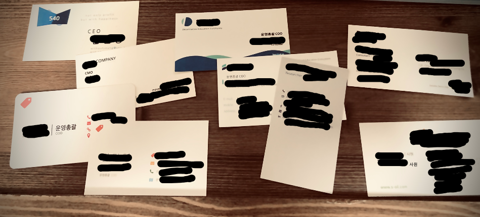
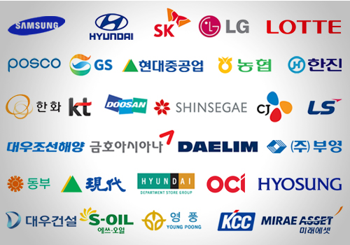

## 글쓴이의 지자랑 

22살, 군입대도 하기 전 개발자 친구들과 오프라인 소셜 게임을 만드는 작은 사업을 했다. 처음으로 사업해서 돈을 벌어봤다. 
하다가 애들이랑 안맞아서 군대로 갔다.  
<strong>직함 : CEO</strong> 
 
25살, 전역 후 좋은 콘돔을 패키징해서 모텔에 B2B로 파는 작은 프로젝트를 했다. 
열심히 했더니 꽤 성공적인 결과를 얻을 수 있었다. 
적은 금액이지만 엑싯도 했다.  
<strong>직함 : CMO</strong> 
 
26살, 대학가 주변 음식점/술집/카페/헬스장 등의 가격 데이터를 모아 인터넷에 올리고 모은 데이터를 기반으로 오프라인 가격 검색엔진 사업을 했다. 
처음으로 VC의 투자 제안을 받았다. 
공동창업자들과 뜻이 달라서 지분 양도하고 나왔다.  
<strong>직함 : COO</strong> 
 
28살, 블록체인에 빠져 백서 전문 번역사를 차리고, 
교육 산업을 혁신하겠다는 목표로 ICO를 시도했다. 
잘 안돼서 정리했지만 컨설팅펌에서 콜이 왔다.  
<strong>직함 : CEO</strong> 
 
돈을 꽤 벌었을 것 같은가? 희망에 차서 일하며 다음 사업을 준비하고 있을 것 같은가? 
전혀 그렇지 않다. 
 
나는 마지막 사업에서 크지도 않지만 적지도 않은 빚(직원들 밀린 임금, 엔젤 투자금 등)을 지게 되었다. 

나는 부채 상환을 하고 싶었다. 그래서 블록체인 TF를 새로 만들었다는 컨설팅펌에 컨설턴트로 들어갔다. 일하다가 우울증에 걸렸다. 이런 썰이야 한가득이지만 ([이런 썰 맛보기](https://www.learningman.co/3rdlearningman/)) 결론적으로는,

<strong>30살 현재,  
하루 대부분의 말이 ‘넵!’인 중고신입사원이다.  
직함 : 사원</strong>

<em>명함들, 10년 동안 9개나 만들었다니…  대부분 다 쓰지도 못했다.</em> 
<em>최우측 하단 명함이 현재의 사원 명함이다.</em>

## 과거 vs 현재

- 자유도 
<strong>과거</strong> 예전에는 내가 맞다고 생각하는 전략이 회사의 사업 방향성이었다. (물론 공동창업자들과의 심도 깊은 논의가 있었다.) 적절한 경영전략과 빠른 실행에 따른 성과는 사업을 하는 이유일 정도로 아드레날린이 솟는 경험이었다.
 <strong>현재</strong> 지금? 담배 피우러 갈 때 눈치보인다.

- 같이 일하는 사람들 
<strong>과거</strong> 내가 같이 일하고 싶은 사람들에게 자리를 제안하고, 그들과의 협상을 통해 팀에 모셔올 수 있었다. 보통 나이차가 크지 않은 또래들과 함께 일했다.
 <strong>현재</strong> 내가 같이 일하고 싶은 사람은 무슨... 그냥 회사가 하라는대로 해야한다. 내 바로 위 대리님 나이는 내 나이 +8.

- 일의 중요성 
<strong>과거</strong> 일 하나 하나가 핵심업무. 내가 무너지면 회사의 상당한 전력이 무너졌다. 신체와 이성, 마음을 모두 철저히 관리해야 했고, 그러지 못했을 때에는 중대한 문제들이 생겼다.
 <strong>현재</strong> 나 지금 무슨 일하지..?

- 일의 강도 
<strong>과거</strong> 회사에서 밤새는 건 부지기수, 퇴근해도 일은 끝나지 않는다. 잠이 잘 안온다. 출근길 지하철 바닥에 앉아서 핫스팟 키고 일했다.
 <strong>현재</strong> (18시 30분) "부장님, 들어가보겠습니다." "어 그래, 오늘 아주 수고 많았어~"

스타트업과 대기업은 다르다. 달라서 겪은 난관들에 대해 조금 더 깊이 들어가보자.

## 난관1: 회사 마음 부서배치

예전에는 내가 하고 싶고, 잘하는 일을 팀원들과 논의하여 자주적으로 결정했다. 대기업에 지원할 때도 '해외영업'이라는 세부 직무에 지원했다. 그러나 웬걸, 신입 지원 당시 세부 직무는 큰 고려 대상이 아니며, <strong>부서배치는 인사팀 마음이라는 충격적인 소식을 들었다.</strong>

사실 대기업은 정말 부서 by 부서이다. 리더가 누구냐에 따라 주 40시간 일을 할 수도 있고, (회식 포함) 주당 7-80시간 일하게 될 수도 있다.

물론 우선은 내가 할 업무가 어떤 업무인가가 중요했다. 나는 영어를 활용하는 업무가 하고 싶다. 재무/인사/총무와 같은 경영지원과 회사의 전략을 책임지는 업무도 재밌지만 영업과 같이 공헌도가 눈에 보이는 업무만큼 재밌기는 어렵다. 

특히 나는 개인적으로 술을 잘 못하는 체질이지만, 즐거운 술자리에서는 또 신나게 노는 편이다. 하지만 술 먹어야 승진할 수 있는 구조나, '회식도 일이야'라는 식의 프레임은 극혐이다. 또, 회사 일은 회사의 일이니까 나의 개인 시간도 조금은 갖고 싶다. 

이런 모든 조건들을 고려하여 부서 배치를 잘 받기 위한 팁을 모았다. 재직하고 있는 학교 선배, 어쩌다 알게 된 회사 선배들 등 가리지 않고 물어봤다. 결론적으로 도출된 부서배치의 핵심변수는 '인사팀 (과장님+상무님) 마음'.

그냥 부서배치 희망조사표 쓰고 기다렸다. 운이 좋게도 1지망이 되었다... 휴...
이거 나중에 인사부문에 물어보고싶다. 어떤 로직이었는지. 기억은 하실까?

<strong>&rarr; 극복 함 - 방법: 순전히 운빨</strong>

## 난관2: 느린 업무 속도, 적은 업무량

창업할 때도, 컨설팅 펌에서도 업무의 속도는 꽤나 빠른 편이었다. 특히 창업할 때는 외부 업무에 치이다 보면 팀 내에서 정한 데드라인보다 먼저 무언가를 해내는 경우가 거의 없었던 것 같다. 그래서 중요도에 따른 업무 순서도 많이 망가졌었다. 근데 여기 업무 속도는 굼벵이보다 더 느린 것 같다.

어느 날은 차장님이 보고서 업무를 주시길래 어디까지 미뤄져도 되나 보려고 그냥 한번 눈치보면서 안해봤다. 뭉개고 뭉개다 보내드렸다.  
기억을 못하시는 것 같았다...

이런 루즈한 분위기로 인해 3월의 어느 날, 나는 신입사원이 가장 하지말아야 할 것을 했다. 그것은 바로 '졸기'. 그날 따라 팀회식에서 먹은 점심 참치가 어찌나 맛이 있던지 엄청 많이 먹었다. 커피를 원래 안마시는 체질인 나는 점심을 가볍게 먹어야 하는데, 그 참치는 가볍게 먹을 수가 없었다.(츄릅)

일이라도 많았으면 정신없이 업무를 했겠지만, 아무것도 할 게 없었던 나는 졸아버렸다. 옆 자리 대리님 눈에서 레이저가 나왔고 그 때 이후로 커피를 마신다. 

물론 요새도 가끔 위기가 있는데 요샌 꽤나 훌륭하게 극복하고 있다. 얼음과 허벅지 찌르기를 적절히 활용하면 아주 괜찮은 것 같다. 여튼 이 업무속도와 업무량으로 졸지 않으려면 그것도 노력이 필요할 것 같다. 어서 적응이 되었으면... 아니 일을 좀 주시면... 좋겠다.

<strong>&rarr; 극복 중 - 방법: 커피 + 얼음 + 허벅지 찌르기 </strong>

## 난관3: 상사의 도덕성 부재

이건 대기업에서의 난관이라기 보다는 그 전, 컨설팅펌 퇴사 이유이다. 블록체인 산업은 워낙 초기이기에 산업의 체계가 없다. 체계 없는 거야 뭐 그렇다 치지만 착하고 똑똑한 팀도 분명한 성과를 만들기 어렵다보니(성과에 대한 좋은 기준이 불분명하다.) 온갖 사기꾼이 난립한다.

아직도 분명히 기억나는 2019년 1월 2일, 여의도 모 회사 빌딩에서는 신입사원 교육이 시작되었다. 블록체인 TF를 담당하는 이사(직급은 부장인데 이사로 불렸다.)는 아주 자랑스레 이렇게 말했다.

> "저희 팀 자문 변호사 분들을 소개하죠. (중략) 이 분은 P모사 회장의 살인청부 관련 사건을 형사 사건에서 민사로 끌어내린 아주 능력있는 변호사입니다. (중략) 또 이분은 국내 C모 거래소의 유사수신 및 사기 행위 판결 과징금을 최소화한 멋진 분이죠."

X발? 이건 뭔 ㄱ소리지? 내가 방금 잘못 들은건가? 나는 그날 신입사원 교육을 들으면서 계속 이런 생각을 했다.

물질만능주의가 여의도에서는 당연한거고 성공을 바라는 신입은 이를 받아들여야 한다는 그 논지는 정말 역겨워서 토가 나올 지경이었다. 

게다가 블록체인 프로젝트를 제대로 런칭하고 싶어 자문을 요청하는 고객들은 그 비싼 빌딩에 들어와서 진짜 말도 안되는 소리들만 해댔다.

어떻게 하면 코인을 발행해서 일반투자자들의 뒤통수를 후려갈길 수 있을지 물어보는 그 질문들은 말에서 냄새가 느껴질 지경이었다.

내 업무는 이러한 인간들을 전폭적으로 지원하는 것이었다. 나는 최소한 세상에 해악을 끼치면서 살고 싶지 않았다. 근데 이건 극복이 불가능했다. 그래서 임파선에 염증이 생길 때까지 고민하다가 극복 안하고 퇴사했다. 

아마 내가 나를 지키면서 이 난관을 극복하긴 어려웠을 거고, 내가 나를 버렸다면 나는 내가 정말 싫었을 것이다.

나는 그 뒤로 여의도에 잘 가지 않는다. (물론 여의도의 모든 기업들이 이렇진 않다.)

<strong>&rarr; 극복 안 함: 퇴사</strong>

<em>국내 대기업들, 연간 영업이익 다 합치면 아주 눈이 부시다.</em>

## 그럼에도 불구하고 현재에 감사한 이유

나는 <strong>난관3</strong>을 겪은 이후 '실물을 판매하는 기업'에 가겠다고 결심했다. 실물 기반 회사들에서 도덕성이 아작난 사람들은 아마 살아남기 힘들거라는 판단에서 였다. 지금 돌이켜보면 이 판단을 한 과거의 내게 참 감사한다. 

특히 현재의 회사는 높은 도덕성 기준을 전직원에게 강조한다. 이는 부서배치가 지 마음대로고, 업무 속도가 느려도 내가 현재 나의 회사를 좋아하는 이유다. <strong>당당하게 일하는 것만큼 소중한 것이 또 있을까.</strong>

또 같은 부서의 선배들을 보면 꽤 중요하고 나름 재미있는 업무를 맡아 훌륭하게 수행하고 있다. 최근 국제 유가 급락으로 에너지 산업에 큰 충격이 오고있다. 하지만 '이번에도 버틸 수 있다'는 선배들의 자신감과 상황에 따라 변하는 팀의 임기응변은 꽤 멋지다는 생각이 들기도 한다.

게다가 내가 마음만 먹는다면 날아다니는 업무 이메일을 뜯어보면서 실력도 키울 수 있다. 핵심 업무 중에 하나를 잡고 잘근잘근 씹어보았더니, 해당 업무 담당하시는 차장님이 일간보고 업무와 관련된 보고서 차트 만드는 업무를 지난 주에 주셨다. 빠르게 성장하는 신입으로.. 인정받는 듯한 느낌적인.. 느낌이 조금 드는 것 같기도.. 하다.. 하하..

마지막으로 가장 중요한 건 이거다. 나는 창업으로부터 도망쳤다. 이 사실을 전제로 한 취업은 솔직히 자랑스럽지 않다. 하지만 이 취업난에 나를 고용해준 회사에 감사하다. 내가 나중에 또 튀어나갈지, 나가면 뭐하고 먹고 살지는 1도 모르겠지만, <strong>감사한 건 감사한 거다.</strong>

## 직장에 적응한다는 것

내 생각에 직장에 적응한다는 것은 크게 둘로 나눌 수 있는 것 같다. 몸이 적응하는 것과, 마음이 적응 하는 것. 군대랑 비슷하다. 일정한 시간에 일을 시작하고 일정한 시간에 일을 마친다. 또 나는 개인으로 존재하지 않고 팀의 일원으로 해석된다. 개성과 감정은 중요치 않다. 업무만이 가장 중요할 뿐이다.

내가 좋아하는 어떤 멋진 선배가 그랬다. <strong>대기업은 군대 같은 곳이라고.</strong> 이등병이라고 생각하고 일하면 된다고. 그래서 그렇게 하고 있다. 나는 요새 아주 잘 적응하는 것 같다.

또 나는 아직 창업과 컨설팅 경험을 통해 배운 업무 스킬들을 아주 잘 써먹는다. 모르면 네이버보단 구글이다. MS Office는 무조건 마스터 해야한다. VBA나 Python으로 업무자동화를 할 수 있으면 최고다.

이번 달에는 엑셀 책 하나를 씹어먹었고 다음 달엔 회사에서 제공하는 Python 교육을 시작할 예정이다. 요새 아무 걱정없이 공부하고 일하다보면 시간이 휙휙 간다.

폭풍에서 성장해온 잡초에겐 온실이 너무 덥다. 
하지만 자세히 들여다보면 온실도 분명히 좋다. 
나는 이 거대한 온실에서 살아남는 법을 고민한다. 
<strong>잡초들이여, 온실에서도 쑥쑥 자라보자!</strong>