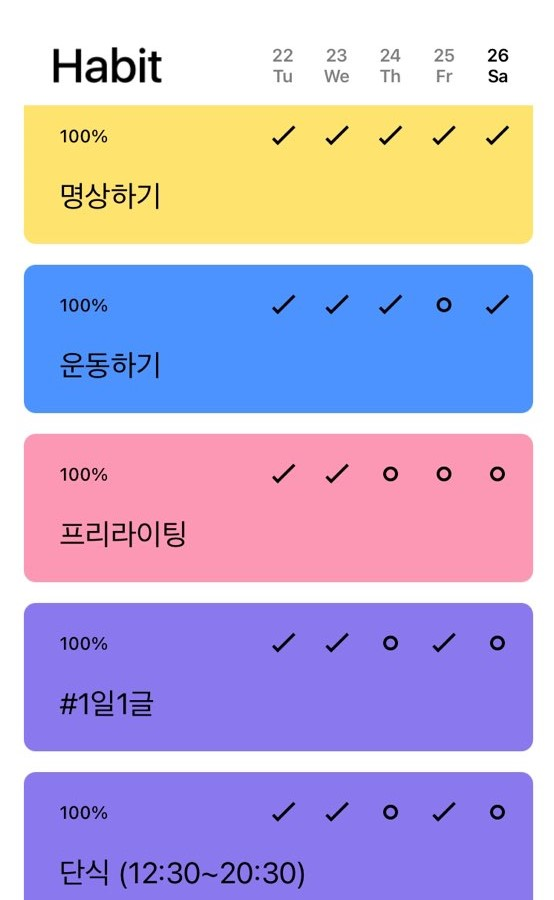
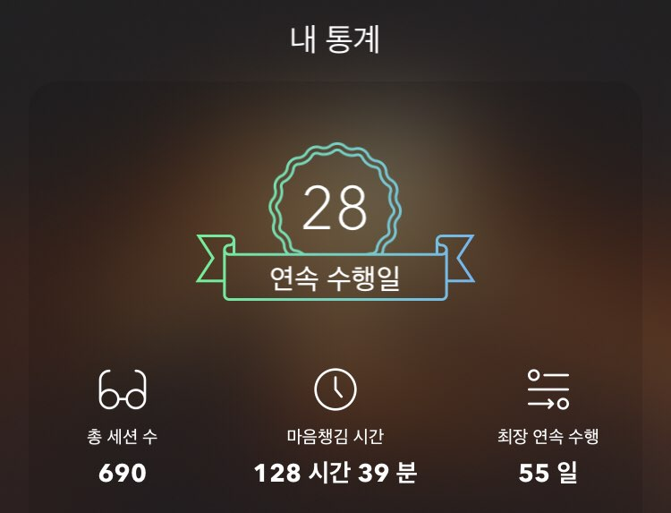

## 2020년을 마무리하며

2020년이 끝났다. 무슨 주제로 글을 쓸까 고민한다. 올해 나에게 있었던 사건? 올해 썼던 글? 올해 본 콘텐츠? 올해 다짐했던 목표? 

그러다 우연히 내 Habit 앱을 켰다. 했는지 안했는지 체크해 둔 여러 습관들이 보였다. Habit에 습관을 기록한 게 아마 올해 2월부터였을 거다. 올해는 뭐든지 꾸준히 하고 싶어 부단히 애를 썼다. 

사실 루틴, 습관이란 게 눈에 잘 띄진 않는다.  매일 매일 하는 일이 거창할 수는 없으니까. 나조차도 '올해 무슨 일을 했지?' 생각할 때 깜빡 잊을 정도였다. 

하지만 사실 나란 **인간을 바꾸고 성장시키는 힘은, 그 사소한 [습관에 달려있다.](https://www.learningman.co/challengeroutine/)** 거대한 변화는 하루 아침에 일어나지 않는다. 아주 작은 반복의 연속으로 만들어진다. 그만큼 매일 매일 하는 일은 중요하다. 

그래서! 2020년 리뷰 주제는 **'올해 나와 함께한 습관들'**이다. 

## 1. 매일 명상하기

### 설명

매일 아침, 운동을 하고 커피를 한 잔 내린 다음 자리에 앉는다. (회사에서는 조용한 폰 부스로 들어간다.) 그리고 하루를 시작하기 전 15분 동안 명상을 한다. 

'캄(Calm)'이라는 앱을 켠다. 올해 초 1년 구독을 끊었는데 완전히 본전 뽑았다. 캄에는 '데일리 캄'이라고 매일매일 업데이트되는 명상 가이드가 있다. 배경 사운드는 내가 가장 좋아하는 모닥불 타는 소리다. 그걸 들으며 의자에 앉아 10-15분 간 명상을 한다.

### 횟수

**총 325회. / 월 평균 27일**

### 느낀 점 / 변화

> 명상하면 좋아요?

내가 명상하는 걸 아는 사람들이 자주 묻는다. 그저 가만히 앉아있는 듯한 명상이라는 게 진짜 효과가 있는지 믿어지지 않기 때문이다. 나도 처음에는 그렇게 생각했다.

대답을 하자면, '네, 진짜 좋아요'다. 

나는 **명상은 마음으로 하는 헬스**라고 항상 설명한다. 명상의 효과를 의심할 순 있지만, 운동의 효과를 모르는 사람은 없겠지? 명상하고 나면 상쾌하고 차분해지는데 운동을 하고 났을 때 개운함과 비슷한 느낌이다. 

마찬가지로 운동 한번 했다고 갑자기 힘이 세지지 않듯이, 명상 한번 했다고 갑자기 달라이 라마가 되진 않는다. 하지만 가랑비에 젖듯이 꾸준히 하다보면, 조금씩 잔잔한 효과가 나타난다.

명상의 효과는 집중력 향상, 행복도 상승 등 과학적으로 증명된 것만도 한 트럭이다. 그럼에도 개인적으로 하나만 꼽자면, **나는 명상을 하면 불안이 줄어든다.** 

난 미래 걱정을 정말 많이 하는 스타일이다. 내일 무슨 일 해야하지? 내가 오늘 시간을 낭비한 건 아닐까? 등등... 그 외에도 사람마다 다양한 불안의 원인이 있을 거다. 

명상을 하다보면 그런 불안한 마음을 알아차린다. '아, 내가 이런 생각을 하고 있구나' 그 사실을 있는 그대로 받아들인다. 조금만 차분히 생각해보면 별 거 아니라는 사실을 깨닫는다. 거기서 좀 더 나아가면, ''지금 이대로도 나는 문제없구나.' 라는 마음까지 도달한다. 그러면 정말로 마음이 평온해진다.

## 2. 운동하기

### 설명

아침에 일어나면 가장 먼저 헬스장에 간다. 회사 근처 헬스장을 계속 다녔다. 재택근무를 이후부터는 집 근처 헬스장을 끊었다. 아예 헬스장이 닫아버린 요즘은 어쩔 수 없이 홈트레이닝을 한다. 어떻게든 한다. 운동을 끝내고 회사로 가면 그렇게 상쾌할 수 없다. 

여태 꾸준히 다녔지만, 올해는 주 4회 이상 가장 꾸준하게 다닌 것 같다. 특히 운동 가짓수를 줄이고, 고중량 운동을 많이 했다. 보통 40-50분 정도 한다.  

### 횟수

**총 168회 / 월 평균 17일**

### 느낀 점 / 변화

운동의 중요성이야... 뭐 설명할 필요가 있을까. 

사실 기대만큼 몸이 좋아지진 않았다. 매일매일 몸 좋아지는 거 체크하면서 집착했으면 스트레스 받았을 거다. 그렇지만 이젠 운동이 정말 습관이 되어서 가는 느낌이라, 스트레스는 안 받는다.

예전에는 굳이 가야하나, 오늘은 쉬어도 되지 않나. 이런 생각과 싸우면서 힘들게 갔다. 그런데 올해는 정말 아무 생각없이 그냥 간다. 안 가면 몸이 찌뿌둥해서 오히려 못 견딜 정도다. 

게다가 글을 쓰다보면 정말 운동의 재충전 효과를 느낀다. 하루는 종일 글을 쓰다가 머리가 멍해졌다. 써야할 글이 있는데 도저히 앉아있기 싫었다. 마음속 한 구석에선 운동할 시간이 어딨냐, 라는 생각도 들었지만. 맘 먹고 운동을 하고 왔다. 머리가 맑아지면서 막혀있던 원고가 술술 풀렸다. 

## 3. 16시간 단식 

### 설명

16시간 동안 칼로리가 있는 식음료를 먹지 않는다. (아메리카노는 마신다.) 보통 저녁 8시부터 다음날 12시까지 안 먹는다. 그리고 점심과 저녁은 양껏 먹는다. 이게 끝이다. 쉽게 말해, 아침을 거르는 습관이다.

### 횟수

**총 225회 / 월 평균 23일**

### 느낀 점/변화

처음 시작했을 때는 2-3KG 정도 체중이 줄었다. 소화기관이 쉬면서 몸이 가벼워진 느낌도 든다. 올해 살 빠졌냐는 얘기를 많이 들었다. 

하지만 그 이후로는 몸무게나 체지방량은 크게 변화가 없었다. 아무래도 점심, 저녁을 마음껏 먹고, 기름진 음식도 많이 먹기 때문에 엄청난 다이어트 효과까진 기대하기 힘들다. 하지만 지방량이 잘 늘진 않는다.

하지만 아침을 한번 안 먹는 버릇이 드니까, 별로 힘들지 않았다. 저녁을 안 먹는 건 진짜 힘든데, 아침은 습관이 되면 어렵지 않다. 아침에 운동하고, 명상하고, 글쓰는 시간을 벌 수도 있다.  적은 노력 대비 충분히 만족스러운 효과다. 실패한 경우는 대부분 밤에 야식을 먹은 경우였다...

## 4. 매일 프리라이팅

### 설명

명상이 끝나면, 30분 타이머를 맞춘다. 내가 애용하는 메모 앱, 구글 킵을 켠다. 타이머가 끝날 때까지 자유롭게 쓴다. 지우기 버튼을 최대한 누르지 않고, 떠오르는 것을 모두 적어내려간다. 비판하지 않고, 남들한테 보여주지 않고, 내 머릿속에 있는 것들을 끄집어낸다.

###  횟수

**246회 / 월 평균 21일**

### 느낀 점/변화

**올해 프리라이팅이 없었다면 이만큼 많은 글을 쓰지 못했을 거다.** 

프리라이팅은 '시동 효과'가 있다. 마치 일이나 글쓰기에 시동을 거는 느낌이다. 뭐든 시작이 어렵고, 백지가 가장 무섭다. 하지만 프리라이팅은 글을 시작하는데 아무런 걸림돌이 없기 때문에 일단 마구 적어내려가기 시작한다. 그러다보면 가속도가 붙는다. 마치 운동 선수가 매일매일 몸을 풀듯, 프리라이팅을 통해 글쓰기 근육을 풀어주는 느낌이랄까.

그리고 [이 글](https://www.learningman.co/freewriting/)에서도 말했듯이, 프리라이팅은 글로 하는 명상 같다. 나도 몰랐던 내 감정과 생각들을 무의식 밑에서 그물로 긁어올리는 듯한 경험을 할 수 있다. 부정적인 감정을 알아차리기도 하고, 새로운 글감을 찾기도 한다.

아쉬운 점이 있다면, 완벽주의를 극복하지 못한 적이 많다. 프리라이팅을 남에게 보여주지도 않고, 정해진 주제도 없는 이유는, 글쓰기의 최대적인 완벽주의를 떨쳐내기 위해서다. 하지만 올해 프리라이팅을 하면서 나는 나를 많이 깠다. 이게 뭐야. 두서가 없잖아. 진지하고 추상적이잖아. 이런 글이 무슨 가치가 있어. 등등. 이런 비판을 조금 더 내려놓고 썼으면 좋았을 텐데.

## 5. 1일1글

### 설명

매일 인스타그램에 글을 올린다. 글에 맞는 이미지를 고르고, #1일1글 태그를 단다. 분량과 내용은 자유. 계정은 비공개기 때문에 친한 친구들만 볼 수 있다.

###  횟수

**총 217개 포스팅 / 월 평균 20일**

### 느낀점/변화

프리라이팅이 내 머릿속 완벽주의와 싸움이라면, 1일1글은 타인의 시선을 두려워하는 나와의 싸움이다. 일부러 인스타그램을 고른 이유도 더 개인적인 글을 편하게 쓰고 싶어서였다. 인스타그램의 특성도 그렇고, 공적인 느낌의 페이스북과 달리 비공개 계정이기 때문이다.

나의 모자란 모습, 유치한 생각을 보여주는 게 참 힘들었다. 이 문장은 너무 유치하지 않아? 내 이런 모습을 모르는 사람도 있을텐데 이런 말까찌 써야할까? 너무 진지해서 사람들이 비웃는 건 아닐까? 이런 생각에 몇번 썼다가 지우고 올리지 않은 적도 많다. 

그러나 조금씩, 조금씩 무뎌지고 있다. 반응에 크게 신경쓰지 않았다. 글쓰기는 끊임없이 두려움을 이겨내는 과정인 것 같다.

횟수는 조금 아쉽다. 1일1글이라면 적어도 300개는 채웠어야 하는데. 중간중간 쉬거나 거른 날이 많았다. '쓰는 것' 자체가 어려운 건 아니다. 진짜 어려운 건 마인드 컨트롤이다. 늘 다른 상황, 다른 컨디션에서도 평정심을 유지하는 능력. 아무도 보지 않는다고 생각하며 그냥 쓰는 것. 하지만 멘탈이 약했던 3일 중 하루는 그러지 못했다. 

## 시도했지만 자리잡지 못한 습관

나름 성공적으로 유지한 게 5개고, 사실 시도했지만 했다고 하기 부끄러운 것들도 있다. 

**첫째, 제텔카스텐.** 좋은 글감을 잘 저장해두고, 서로 다른 아이디어를 충돌시키기 위해서 하루에 하나씩 제텔카스텐을 만들기로 했었다. 

**둘째, 매일 스트레칭.** 나의 최대 건강 과제는 거북목 탈출이다. 그러려면 자주 일어나서 목, 어깨 스트레칭을 해줘야 한다. 매일 16시에 10분 스트레칭을 목표로 잡았다. 하지만 한번 집중하면 잘 일어나지 못해서, 끝내 습관으로 자리잡는데 실패했다.

**셋째, 1일1그림.** 예전부터 그림을 배워보고 싶었다. 글과 그림이 잘 섞이면 내가 말하고자 하는 바를 더 재미있게 사람들에게 전달할 수 있을 거라 생각했다. 또 인스타그램에서는 시각 이미지가 중요하다. 그래서 1일1글이 자리가 잡히자, 업그레이드해서 그림 하나까지 같이 올리자! 목표를 세웠다. 하지만 그림은 아직 글만큼 손에 익지가 않아 시간이 너무 많이 들었다. 이 때쯤 에너지와 시간이 부족해 결국 포기했다.

**넷째, 1일1사.** 책에서 인상깊었던 부분을 메모해놓는 습관이다. 하지만 어느 구절을 골라야할지 고민하느라 시간이 너무 많이 들었다. 적고 나서 활용하기 위한 고민이 부족했다. 결국 상반기에 접었다.

## 마무리하며

솔직히 돌아보면 아쉬운 점이 더 많이 보인다. 1-8월에 잘 된다 싶어서, 여러 습관을 더 가득 담아보려 욕심을 내다가 몇개를 떨어뜨리기도 하고. 이직과 재택 근무 등 일상의 변화를 겪으며 몇 개를 빼먹기도 했다. 

하지만 확실한 건, 조금씩 좋은 습관을 쌓아가고 있다는 것이다. 좋은 습관들은 앞으로 평생 사라지지 않을 자산이다. 

속도가 느리다고 느낄 수 있다. 하지만 복리로 쌓여가고 있다면, 맘처럼 빠르지 않아도 괜찮다. 지금 내가 느끼는 속도는 하루에 평균 0.1% 정도? 하루로 봤을 때는 정말 정말 미미하다. 그래서 가끔 힘이 빠질 때도 있다. 1년간 0.1%를 꾸준히 쌓았다면, 1년에는 44% 밖에 늘지 않는다. 

하지만, 5년엔 6.2배, 10년 뒤엔 39배가 된다. 지금은 느려도 언젠가는 커다란 변화로 돌아올거라 믿는다.  내년에도 마라톤 페이스를 유지하며, 좋은 습관을 조금씩 업그레이드하기로 다짐해본다.  

**마지막으로 하나 더 뿌듯한 습관을 리뷰하자면, 바로 러닝맨이다.** 올해 2월부터 러닝맨을 시작해 2주마다 한번씩 글을 썼다. 사실 이게 가장 힘든 습관이었다. 글이 안 써지는 날이 정말 많았다. 올해 내 주말을 괴롭게한 주범이다.

어쨌든 "죽이 되든 밥이 되든 1년은 해보자"라던 초심을 지켰다. 특히 3명이서 꾸준히 진행한 회고는 나를 되돌아보고 다잡는 좋은 자극이 됐다. 끝까지 해낸 나와, Jessy, Kay에게 따봉을 주고 싶다. 

> 읽어주신 독자 여러분들께도 감사드립니다. 내년에 더 나은 모습으로 찾아뵙겠습니다. 새해 복 많이 받으세요 :)

