>두들리가 받은 생일 선물의 개수는 몇개일까? 
>정답은 37개이다.

그럼 나는 이번 생일에 몇 개의 선물을 받았을까? 
며칠 전, 내 생일에 나에게 생일 선물을 보내고 축하를 해준 사람은 (기프티콘 포함) 112명이다. 
참고로 나는 작년 생일에 10명 내외의 사람들에게 축하를 받았었다.  이번 글에서는 어찌보면 미친 짓일 수도 있었던, 생일 선물 받기 프로젝트의 도입-발단-전개-위기-절정-결말을 적어보려고 한다.
 
이 글이 수많은 관종들과, 처음 온라인 마케팅을 시작하는 사람들에게 
<strong>재미를 주는 글이 되었으면 좋겠다.</strong>

## 도입

나는 원래 주변 사람들을 챙기는 것을 좋아한다. 설날, 추석 당일에 내가 좋아하는 사람들에게 새해복과 한가위 인사를 전했고, (지갑 사정이 좋으면) 주변 사람들의 생일에 소소한 기프티콘으로 생일을 축하해주었다. 또 고등학생 때부터 열심히 경조사를 챙겼고, 내가 사람들의 기쁜 일과 슬픈 일에 도움이 조금이라도 된다는 사실이 행복했다.

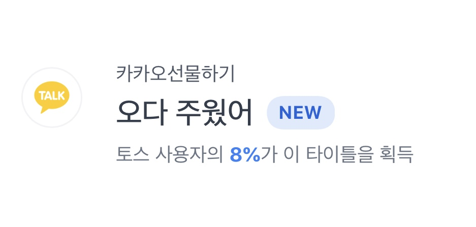

<em>카카오선물하기에 쓰는 돈이 꽤 된다.</em>

  

나는 왜 이렇게 열심히 주변사람들을 챙겼을까. 
<strong>내 주변 사람들을 좋아하기 때문이다. </strong>
나는 ‘사람은 혼자 살 수 없다’, ‘사람은 사회적 동물이다’ 등의 명제를 신봉한다. 특히 나의 몇몇 친구형누나동생들은, 나에게 무언가를 가르쳐주었다. 내게 힘든 일이 일어났을 때 도움을 주었다. 내게 즐거운 일이 생겼을 때 같이 축하해주었다. 비록 짧은 순간일지라도 <strong>내 삶의 한 부분을 밝은 빛으로 밝혀준 사람들</strong>은 나의 관심과 존경을 받기에 충분한 사람들이라고 생각한다.

또, 나는 꽤나 사람 챙기기에 변태적인 성향을 가지고 있다. 나는 사람들을 잘 챙기고 싶다. 근데 그들이 나에게 해준 것보다 ‘더’ 잘해주고 싶다. 그래서 사람들의 생일을 열심히 챙기면서도 카톡에 내 생일은 올려두지 않았었다. 

## 발단

때는 2019년 3월 30일, 지옥같은 회사 생활에 고통받는 와중에 생일이 되었다. 그래서 더더욱 '생일이 행복했으면 좋겠다’라는 생각을 하고 있었다. 하지만 슬프게도, 또 당연하게도 카톡이 내 친구들에게 나의 생일을 알려주지 않았다. 그래서 나는 생일날 더 많이 우울해졌다. 평소라면 허허 그럴수도 있지 하고 넘길 수도 있었겠지만 당시 내 상태는 별로 좋지 않았고, 나한테는 꽤나 분명한 기억이자 작지만 꽤 깊은 상처가 되었다.

그래서 올해 2020년 3월이 되자 나는 내 생일에 ‘회수’를 하고 싶다는 생각을 하게 되었다. 너무 비인간적인 표현이지만 계속 이 단어가 머리 속을 맴돌았다. ‘어떻게 이걸 회수하지?’라는 생각을 하며 3월이 되자마자 카톡에 내 생일을 업데이트 해두었다. 3월 3일, 퇴근하고 집으로 막 출발하려는데 한 친구에게 카톡이 왔다.

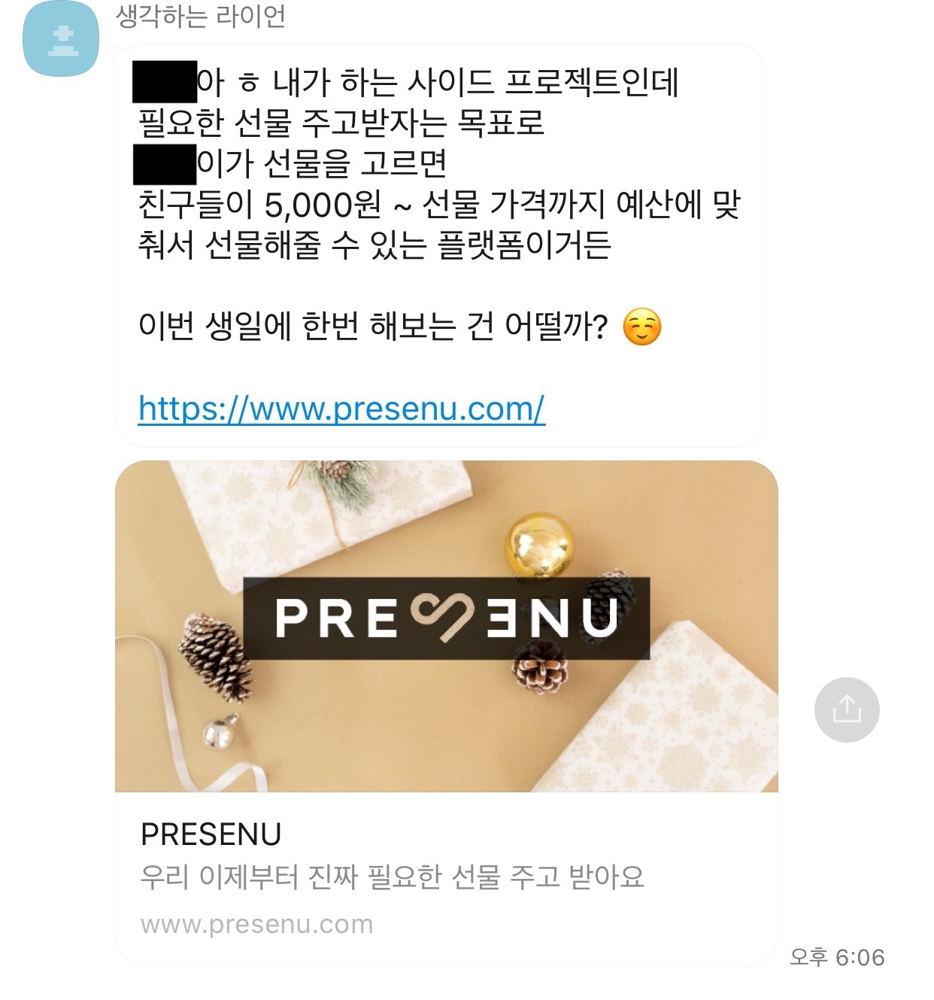

‘이거다!’ 싶었다. ‘생일 선물 투자금(…) 회수에 이만큼 적당한 방법이 있을까?’라는 생각이 우선 들었다. 두 번째로는 이 사이드 프로젝트를 진행하는 (그리고 작년에 내가 힘들 때 전화해서 챙겨준)친구가 <strong>내 생일을 재료로 자신의 프로젝트를 조금이라도 더 알릴 수 있으면 좋을 것 같다</strong>는 생각이 들었다. 과거의 창업 경험과 넘치는 아이디어를 조합해서 이 플랫폼을 조금이라도 더 유명해지게 만들어보고 싶다는 생각이 들었다. 프로젝트와 관련된 영감들이 폭발했고, 그 날 퇴근길이 참 행복했다.

집에 가자마자 가지고 싶은 선물을 골랐다. 책 몇 권과 블루투스 키보드, 그리고 에어팟 프로(;;)를 올려달라고 친구에게 요청해두었다. 작년에 꽤 실망한 터라 ‘설마 달성되겠어?’라는 생각이 들었지만 내심 ‘되면 참 좋겠다’라는 생각도 들었다. 몇 가지 디테일을 수정해달라고 요청하면서 프로젝트를 운영하는 친구를 괴롭(?)히고는 침대에 누워서 카톡을 하며 잘 준비를 했다.

## 전개

올린지 두 시간이 안된 익일 12시 반 쯤, 친구는 에어팟이 달성 완료라고 전해주었다. 누가 에어팟을 샀는지는 분명했다. 당시에 카톡하던 좀 이상한 (그리고 역시 내가 힘들 때 아주 잘 챙겨준)형 한 명만 이 프로젝트가 런칭된 걸 알고 있었으니까! 

진짜 눈물이 났다. 액수가 커서는 아니었다. 작년에 못 느낀 사랑받는 느낌, 감사함, 올해는 작년과 다를 거라는 생각 등이 스쳐갔다. 물론 바로 티는 안냈다. 그리고 조용히 그 형의 생일이 언제인지 알아봤다. 고작 며칠 후(!)였던 이 형의 생일에 에어팟보다 큰 선물을 해줬다. 통장에서 피는 흘렀지만 그래도 기분이 정말 좋았다.

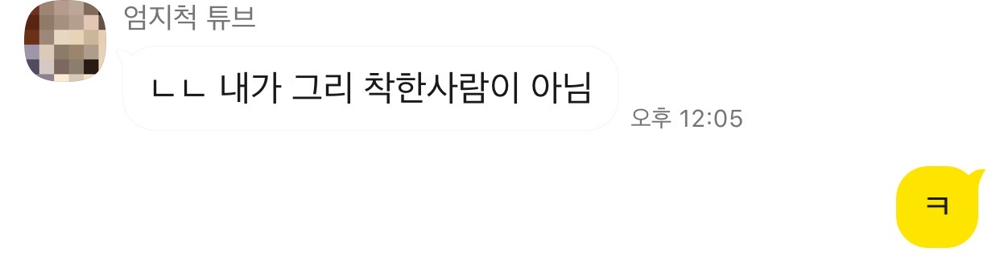

<em>ㅋ</em>

 

생일까지 20일이 넘게 남았는데 프로젝트는 거의 달성 완료였다. 스멀스멀 욕심이 솟아올랐다. 나는 2012년형 맥북을 쓰고 있었다. (ㅋㅋ…) 그리고, 어차피 나는 나한테 생일 선물 펀딩 해준 사람들에게 최소 그들이 해준 것 이상의 선물을 해줄 예정이었다. 이런 욕망과 계획들이 뒤엉킨 머리 속에 최종 정리된 생각은 다음과 같았다.

<strong>‘친구들 생일 할부로 맥북 한번 질러볼까…?’</strong>

맥북은 꽤 금액이 컸다. 그래서 나는 Action Plan을 만들었다.

1. 내 생일 축하 펀딩 프로젝트에 이름을 붙이고 Feed형 SNS 채널(ex.페북, 인스타)을 활용한 마케팅 캠페인을 만들기
2. 네이버 실시간 검색어에 도전하고, 성과(검색량)만큼을 코로나 구호 활동에 기부하기
3. 유명한 사람들에게 2.를 홍보하여 프로젝트 인지도를 높이기
4. 대화형 SNS 채널(ex. 단체카톡방, 슬랙, 디스코드 등)에 홍보하기
5. 모든 Action(1/2/3/4)에 프로젝트 펀딩 사이트 주소를 삽입하기

목표는 크게 두 가지, **나를 아는 사람들한테 펀딩 받아서 맥북 채우기**와 **나를 모르는 사람 3명으로부터 펀딩을 받기**! 2주는 맥북을 달성하기에는 조금 짧은 기간이라고 생각했다. 있는 관종력과 없는 인싸력을 모두 끌어모은다고 해도 솔직히 달성할 수 있을지 미지수였다. 또, 모르는 사람이 나의 생일 축하해주는 것은 정말 쉽지 않은 목표였다. 프로젝트의 공익적인 목적을 강조하고 마케팅을 통해 최대한 Public 노출을 강화해야했다.

마케팅의 기본은 [AAARR](http://www.wisetracker.co.kr/blog/스타트업을-위한-aarrr해적지표-개념잡기/)이다. 미국 스타트업 액셀러레이터인 500 Startups의 설립자 Dave McClure가 개발한 이 깔대기(Funnel) 모양의 프레임워크는 마케팅의 각 목적에 맞는 지표 측정으로 효율을 극대화하려는 목적에서 만들어졌다. AARRR은 Acquisition - Activation - Retention - Referral - Revenue로 구성되어 있고 각 단계에서의 수치 측정과 단계별 Conversion Rate를 개선하는 방식으로 작동한다.

사실 AARRR은 IT 서비스에 특화되어 있는 프레임워크이고, 나는 그냥 단순 생일 축하 펀딩이니 굳이 Activation이나 Retention을 측정할 필요는 없었다. 이건 나의 지인을 중심으로 하는 프로젝트였다. 따라서 이 프로젝트에 대한 긍정적인 경험을 제공하는 것(Activation)은 사실 과거의 내가 주변 사람들에게 한 행동들이 이미 결정해두었다. 또, 일회성 프로젝트이므로 재사용률(Retention)은 측정할 필요가 없었다. 따라서 나는 ARR - Acquisition/Referral/Revenue 극대화에 집중하기로 했다.

각각의 목적에 맞게 Action Plan을 Align한 결과는 다음과 같았다.

1. 내 생일 축하 펀딩 프로젝트에 이름을 붙이고 Feed형 SNS 채널(ex.페북, 인스타)을 활용한 마케팅 캠페인을 만들기 
<strong>&rarr; Acquisition/Referral </strong>
2. 네이버 실시간 검색어에 도전하고, 성과(검색량)만큼을 코로나 구호 활동에 기부하기 
<strong>&rarr; Referral </strong>
3. 유명한 사람들에게 2.를 홍보하여 프로젝트 인지도를 높이기 
<strong>&rarr; Referral </strong>
4. 대화형 SNS 채널(ex. 단체카톡방, 슬랙, 디스코드 등)에 홍보하기 
<strong>&rarr; Acquisition/Referral </strong>
5. 모든 Action(1/2/3/4)에 프로젝트 펀딩 사이트 주소를 삽입하기 
<strong>&rarr; Revenue </strong>

<strong>이 정도면 생각은 충분히 했고, 이제는 실행을 할 차례였다.</strong>

우선 조잡한 디자인으로 페이스북 페이지와 인스타그램 비즈니스 계정을 만들어서 친구들에게 좋아요와 팔로우를 요청했다. 두 채널에 계정을 만들자마자 2번 Plan(검색어만큼 코로나 기부)의 내용을 설명한 게시물을 올리고 광고를 태웠다. 

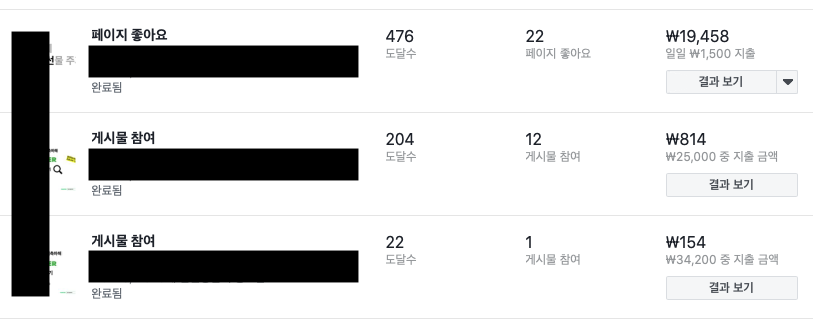

<em>결과</em>

 

각 광고 마다 일예산 3-5,000원을 잡고 광고를 돌렸는데, 장애물이 있었다. 페이스북/인스타그램 광고는 <strong>광고 안에 너무 많은 텍스트가 있으면 광고 승인을 잘 해주지 않는다.</strong> 이는 페이스북 자체의 [광고 정책](https://www.facebook.com/policies/ads)에 기인한 것인데, 마케팅을 직접 한 경험이 꽤 오래되어서 까먹고 있었다. ‘키워드 검색 - 검색량에 따른 기부’라는 내용을 좀 더 단순하게 설명했어야 하는데 그것에 실패해서 첫 번째 광고는 도달과 참여가 매우 낮았다. 

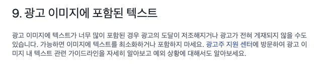

<em>나는 바보다</em>

 

‘페이지 좋아요’, ‘게시물 참여’ 등과 같은 광고의 목적이 가장 중요했고, 각 목적에 맞는 광고 운영이 필요했다. 시간이 조금 길었고 개인의 프로젝트가 아니었다면 더 다양한 실험을 해볼 수 있었을 테지만 너무 대대적으로 광고하는 것도 조금 부담스러웠다. 

그나마 인스타그램 계정 게시물 광고에 조금 성과가 있었는데, 사람들이 긴 내용을 싫어한다는 것에 착안하여 코로나 기부 내용을 아주 단순화한 특정 인스타그램 게시물이 상대적으로 높은 광고 시청자 참여를 기록했다. 

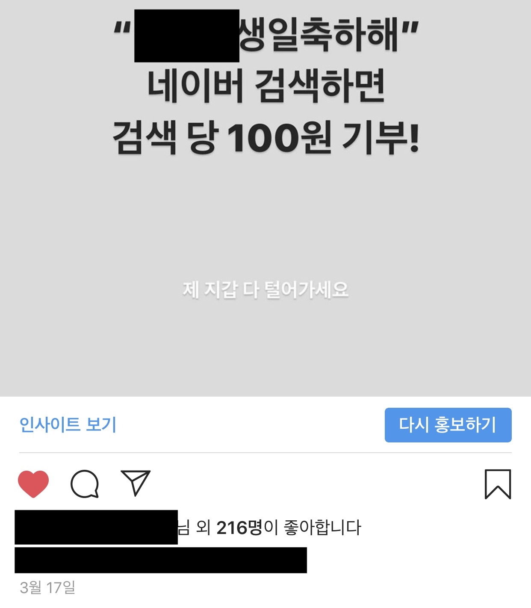

네이버 검색 후 재유입을 위해 네이버 블로그도 만들어두었고, 검색량을 늘리기 위해 홍보 게시물에 광고비를 추가로 집행하기도 했지만 사용자들에게 <strong>‘검색어를 검색하게 유도’</strong>하는 것은 매우 어려운 작업이었다. 네이버 검색에 대한 검색엔진최적화 작업도 거의 하지 못했다. 지금 회고해보면 좀 더 궁금증을 유발하는 게시물을 좀 더 자극적(?)으로 게시하고, 더 많은 광고비를 투입한 후에, 블로그가 검색어에 상위 노출되게 했었더라면 결과가 조금 더 좋지 않았을까 라는 생각이 든다.

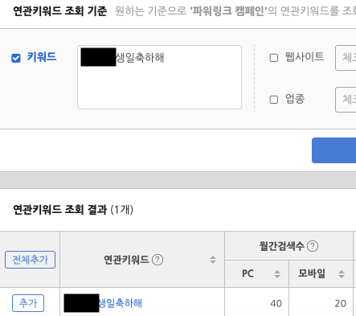

<em>결과, 60명에게 감사를!</em>

 

2번 Plan보다 더 실패한 것이 3번 Plan이었다. 당시에는 좀 정신이 없어서 유명인들의 인스타그램에 DM을 보내는 것이 전부였는데, 지금 생각해보면 진짜 재미도 의미도 없는 또라이짓이었던 것 같다. 너무 유명한 사람들을 타게팅한 것이 문제였던 것 같고, 그 채널이 인스타그램이라는 것도 좀 별로인 것 같다. 주변에 존재하는 적당히 유명한 사람들에게 부탁해봐도 괜찮았을 것 같다는 생각이 든다. 

나는 겨우 10명 남짓한 연예인에게 프로젝트를 홍보하는 DM을 보내보았을 뿐이지만, 인플루언서 마케팅은 정말 쉽지 않은 것 같다는 생각이 들었다. 그들과의 네트워크를 만들기가 어렵고, 네트워크를 만든다 해도 그들의 생각이나 이미지에 부합하는 프로젝트를 제시해야하기 때문이다. <strong>3번 대실패.</strong>

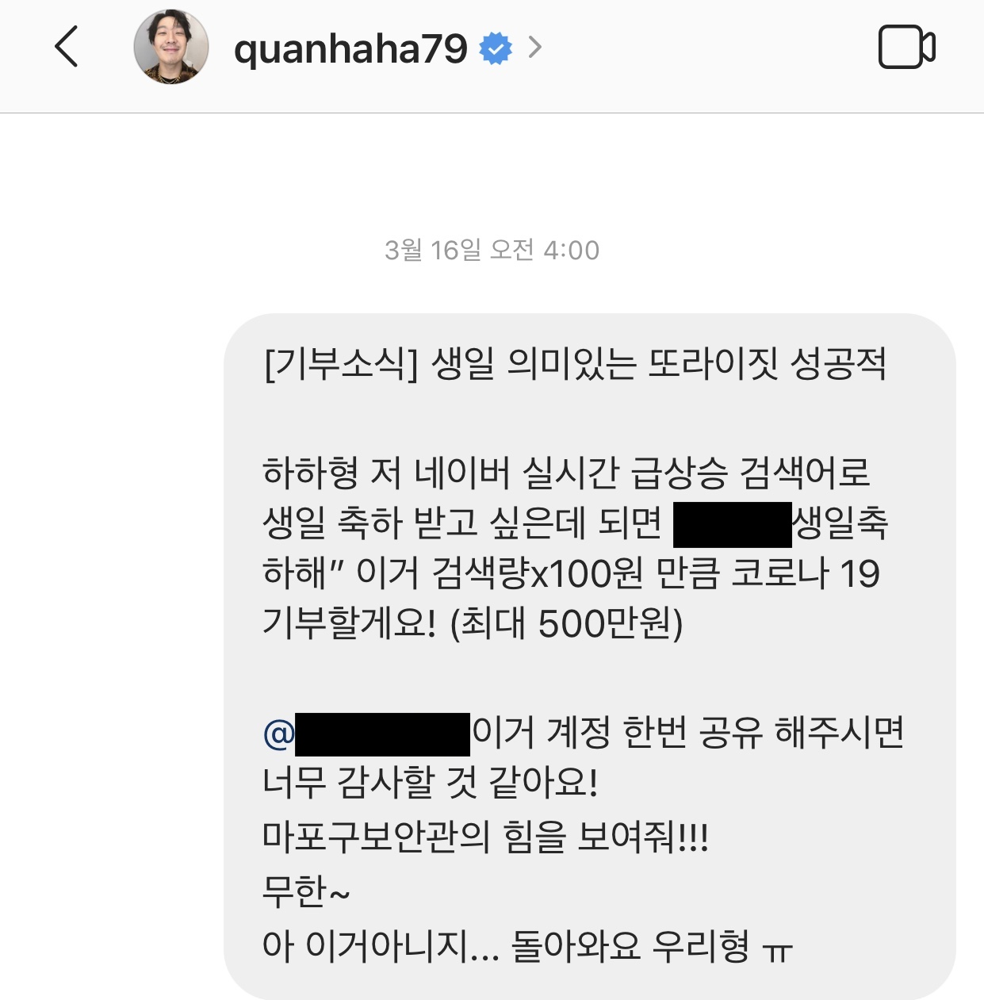 
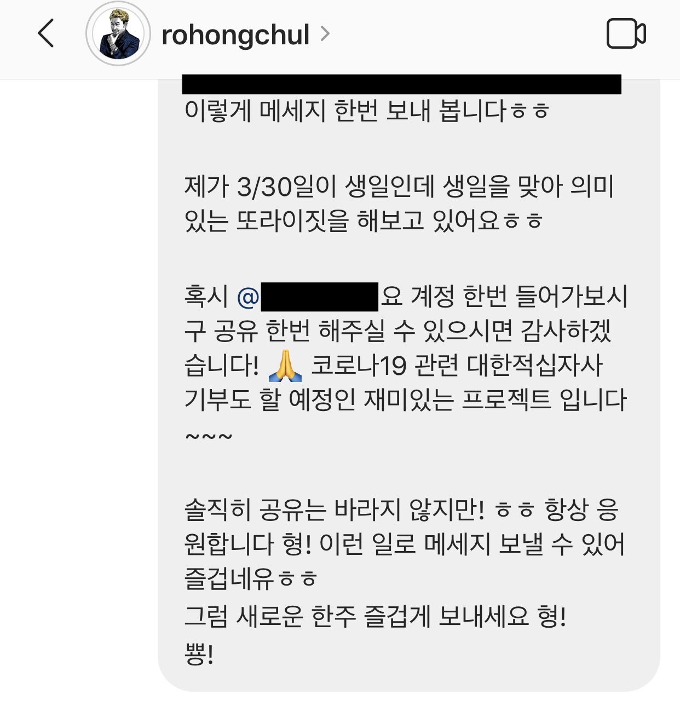 
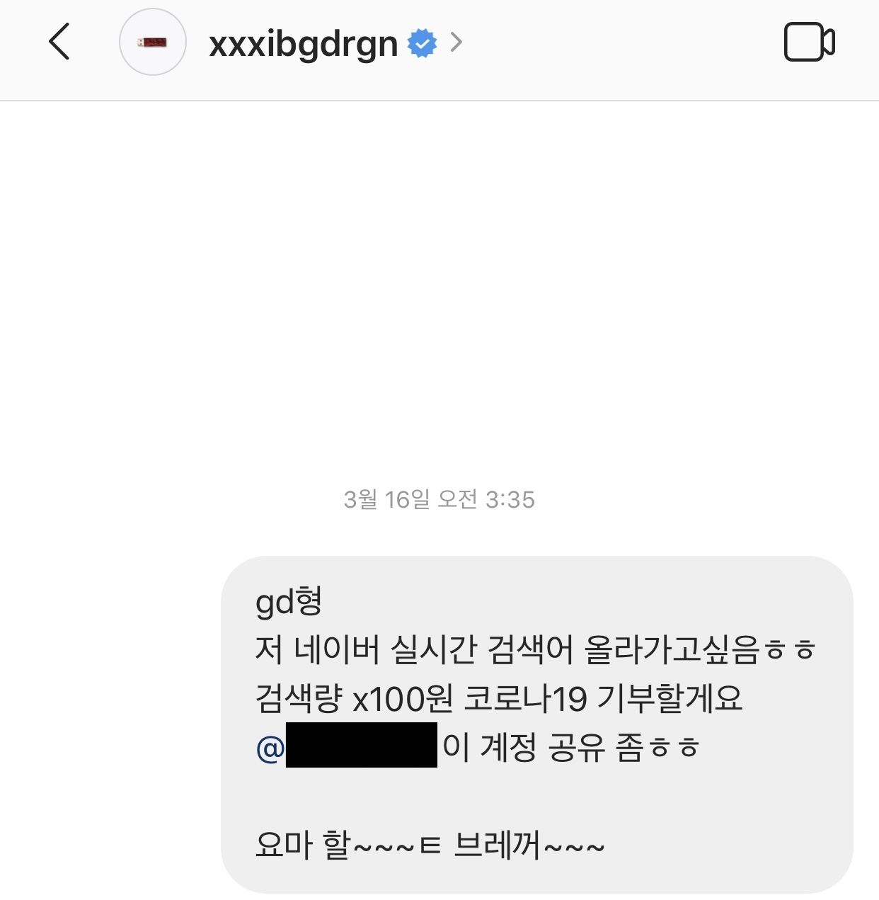 

<em>나는 또라이다</em>

 

그나마 세운 계획 중에서는 4번 Plan이 가장 성공적이었는데, 이 글을 빌어 펀딩에 참여해주신 모든 분들께 진심으로 감사하다고 말하고 싶다. 4번을 실행하면서 깨달은 것은 나랑 단체카톡방이 많이 겹치는 사람일수록 더 많은 금액을 펀딩하는 경향이 있다는 것이었다. 함께 소속되어 있는 단톡방 수와 펀딩 금액은 비례한다. <strong>역시 단순노출효과가 짱이다.</strong>

## 위기

생일이 다가오면서 펀딩 금액은 조금씩 올라가고 있었는데, 아무래도 맥북은 금액이 크다보니 다른 카테고리가 다 찬 생일 전날에야 달성률이 올라가기 시작했다. 특히 IT 서비스를 많이 이용해보지 않은 친구들은 이 프로젝트가 크라우드 펀딩 방식이라는 것을 모르고 ‘300만원은 좀 부담스럽다 ㅠㅠ 미안해’하며 카톡 기프티콘을 우당탕 보내주었다…(ㅠㅠ)

이 때 내가 <strong>‘축의금 장사’</strong>를 하고 있나? 하는 생각이 들어 주변 사람들에게 많이 미안했다. 부담을 느낀 친구들에게 개인메세지로 일일이 사과하고 프로젝트의 취지를 설명하는 내 모습이 아주 좋아보이지는 않았다. 그래서 좀 현타가 왔었다.

하지만, 일단 시작한 프로젝트는 달성되어야 했다. 시작했으면 최선을 다해야하는 것이 러닝맨의 자세 아니던가. 광고에 추가 비용을 태우고 카톡방에 '나 생일이다'라고 광고를 하고 다녔다. 펀딩이 안 될 것 같아 이 과정에서 노이즈를 좀 만든 것 같다. 이 글을 빌어... 죄송합니다...

## 절정

다른 위시 아이템들은 다 채워졌지만 결국 당일 저녁까지 맥북의 달성 비율은 95.8%에 멈춰있었다. 생일 저녁 쯤, 한참 모자르는 맥북 달성을 위해 사상초유의 파워 오브 블러드(!)가 등장하기도 했지만 100%를 달성하는 것은 아주 힘든 일이었다. 

프로젝트를 제안한 친구가 이 정도 된 것 만으로도 역대 펀딩 금액 최대라고 위로해주었지만 목표를 달성하지 못한 자에겐 씁쓸함이 있을 뿐이었다.

자기 전까지 계속 숫자만 봤던 것 같다. 펀딩을 대부분 달성하고도 완료를 못했다는 찝찝한 기분이 좀 있었다. 그래도 뭔가 생일 당일에 잠자리에 들며 좋은 친구들이 주변에 있어 감사하다는 생각에 행복하게 잠들기는 했다.

다음날, 나름 행복하게 회사에서 일을 하고 있는데 이런 카톡이 왔다.

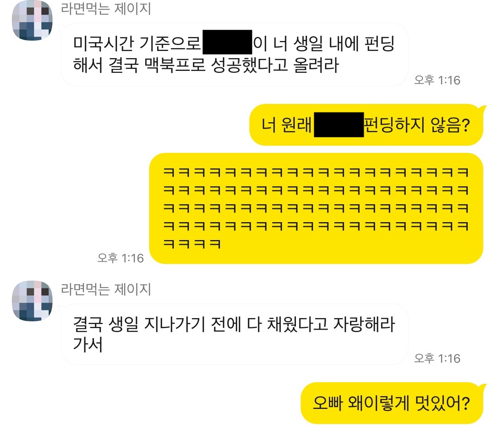

<em>오빠 왜이렇게 멋있어?</em>

 

## 결말

그래서 1년 전 슬펐던 한 관종은 올해 비로소 행복해졌다. 비록 모르는 사람 3명한테 펀딩 받기는 실패했지만 말이다.

이 프로젝트를 진행하면서 느낀 점은 크게 네 가지이다.

1. 물질적인 가치를 행복의 척도로 삼으면 불행해지기 쉽다.(특히 생일에는 더더욱)
2. 적절한 마케팅과 조화를 이룬 크라우드 펀딩은 꽤나 강력한 효과를 가질 수 있다.
3. '사람들에게 진짜 원하는 선물을 받게 해주는 것'은 꽤나 재미있는 일이다.
4. <strong>주변에 사랑하는 사람들에게 더 잘하자.</strong>

JY, YT, YS, 그리고 프로젝트에 참여해준 분들 모두 감사합니다. 
엑셀에 모두 적어두었습니다. 
잊지않고 생일 챙겨드릴게요! 헤헤 
 

이상 자랑 끝.

p.s.
받고 싶은 생일 선물이 있을 때는?
[presenu.com](https://www.presenu.com)!

