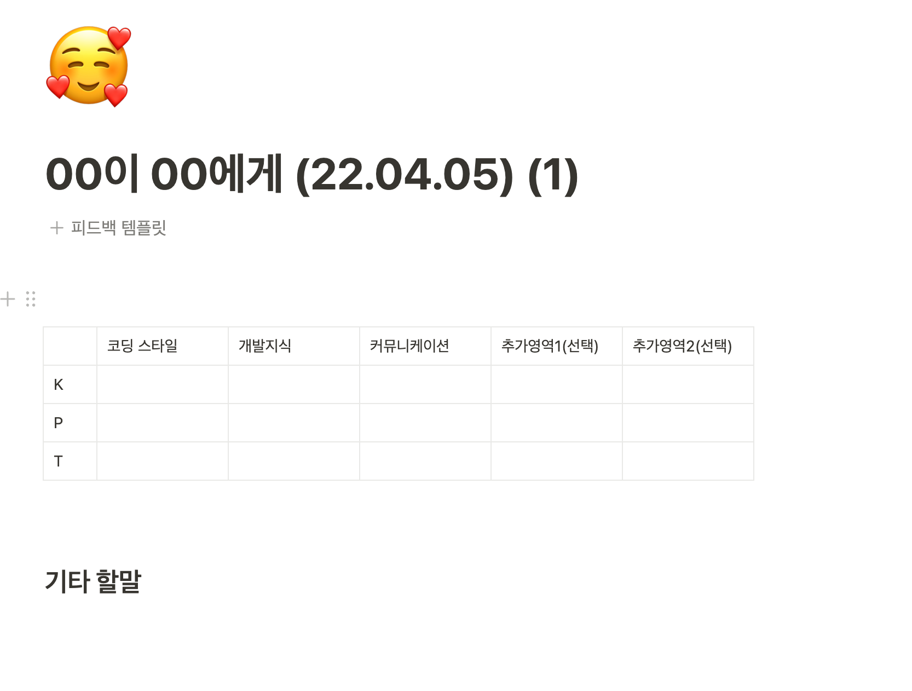

>부정적인 피드백은 반드시 필요하다. 사람들은 대부분 맹점을 가지고 있다. 다른 사람이 지적하지 않으면 자신의 맹점을 결코 알 수 없을 것이다. 사람은 누구나 개인적인 성장을 위해 맹점 부분, 우리가 지키려고 하는 아픈 약점 부분에 대한 피드백이 필요하다. - 스티븐 코비

## 올바른 성장에는 피드백이 필요하다
나는 피드백 받기를 두려워 하는 사람이다. 나에 대한 부정적 평가를 듣기가 싫기 때문이다. 
    
인간의 뇌는 부정적인 것을 더 중요하게 받아들인다. 생존과 직결 되었기 때문이다. 10마디의 칭찬을 들어도 1마디의 부정적 말을 들으면 기분 나쁜게 사람의 마음이다.
그래서 나는 사람들이 나에 대해 어떻게 평가하는 지를 듣는 것이 두렵다.

그렇지만 피드백은 성장에 있어서 굉장히 효율적인 도구이기에 피드백을 받지 않기는 너무 아깝다.

같은 고등학교에서 모의고사를 보는데 학생 A에게는 6달 뒤에 모의고사 성적을 알려주고 학생 B에게는 바로 다음날 모의고사 성적을 알려준다면, 당연하게도 학생B의 실력상승이 더 가파를 것 이라는 걸 상상해 볼수 있다.

사회에 나와서 많은 사람들은 학생 A의 상황에 처해 있는듯 하다. 짧으면 6개월 길면 12개월에 한번 성과 평가라는 피드백을 받고 행동을 수정할 기회를 얻는다. 

나는 그렇게 하고 싶지 않았다. 내가 올바른 방향으로 가고 있는지에 대한 증거를 수집하고 그렇지 않다면 방향을 가능한 빠르게 바꾸고 싶었다. 다른 사람의 지혜를 나의 성장을 위해 사용하고 싶었다. 

실제로 러닝맨 친구들에게 주기적으로 피드백을 받고 행동을 개선해 나가는 경험들이 많은 도움이 되었다. 잦은 피드백이 성장에 도움이 된다는 확신을 가지고 있다.

근데, 어떤 회사를 다녀 보아도, 짧은 주기의 좋은 피드백을 주는 회사는 없었다.

## 내가 원하는 피드백 만들어서 받기로 했다

그래서 이번에는 내가 회사에서 피드백 시스템을 만들어 보기로 했다. 갑작스럽게 피드백을 요청도 해봤는데, 피드백을 주는 사람도 준비가 안된 상태에서 의미 있는 피드백을 받기가 어려웠다. 

시스템을 만들고 구성원에게 이해 시키고 피드백을 받으러 다니면 더 나은 피드벡을 받을수 있을것 같았다. 

팀 구성원들과 논의를 거쳐 피드백 시스템을 만들었다. 1대1 기반 대면 피드백이 좋을것 같다는 사람들의 의견을 받아들여서 노션으로 템플릿을 만들어 진행시켰다. 

무작정 피드백을 하자고 하면 의미있는 피드백을 받지 못한다. 사람들 에게는 어떤 피드백을 어떻게 주어야 하는지에 대한 최소한의 프레임워크가 필요했다. 코딩스타일, 개발지식, 커뮤니케이션 세개의 영역을 나누어 각각에 대한 KPT(Keep: 계속 했으면 좋겠는점, Problem: 문제로 생각되는점, Try: 시도해 보았으면 좋겠는 점)을 적도록 했다. 추가적으로 본인이 피드백을 받고 싶은 영역과 추가적인 질문사항에 대해서는 본인이 영역을 추가할 수 있도록 따로 공간을 두었다.

내가 받고 싶은피드백을 채워서 상대방에게 공유하면 피드백 프로세스는 시작된다. 상대방도 나에게 본인이 받고 싶은 피드백영역 및 질문을 적어서 공유해야 한다. 만나서 피드백을 주고받기 전에 해당 템플릿을 작성하고 읽어본 뒤, 서로에 대한 피드백을 주제로 짧게 이야기 하는 식으로 진행했다.

내가 먼저 사람들에게 피드백을 요청했다. 의미 있는 피드백을 많이 들었다. 다른 사람이 모르겠지 했던 나의 단점이 다른 사람들에게 보인다는 것을 깨닳았고 고쳐야겠다는 결심을 하는데 많은 도움이 되었다. 내가 모자란 지식으로 이야기할때 티가 나는 편 이라는 걸 알았고, 코드리뷰의 방향성이 일관되지 않다는 것을 알았다. 이후로 이에 의식을 하니 좀더 개선된 행동을 하고 있다고 스스로는 느끼고 있다.

피드백을 한다는 것에 대한 공감대를 마련하고 절차를 마련해 두었기에 피드백 퀄리티가 만족스러웠던 것 같다.

## 귀찮은일을 하면 결국 장기적 보상이 쌓인다

피드백을 열심히 받고는 있으나 여전히 피드백을 요청하는 일은 귀찮은 일이다. 하지만 아주 짧은 그 순간의 귀찮음을 이기고 피드백을 신청하고 개선해 나갈점을 알아내는 일은 보람차다.

세상의 많은 일들이 그렇다고 생각한다. 운동을 하던, 명상을 하던, 영양재를 챙겨먹든, 피드백을 요청하던, 막상 하면 좋지만, 하기 귀찮은 것들이 많다. 이런 작은 귀찮음을 이겨내고 그 열매를 차곡 차곡 쌓아두면 복리로 불어난다. 

개인을 넘어서 조직 전체에 장기적 보상이 쌓이게 할 수 있도록 지속적 노력을 기울일 예정이다.

