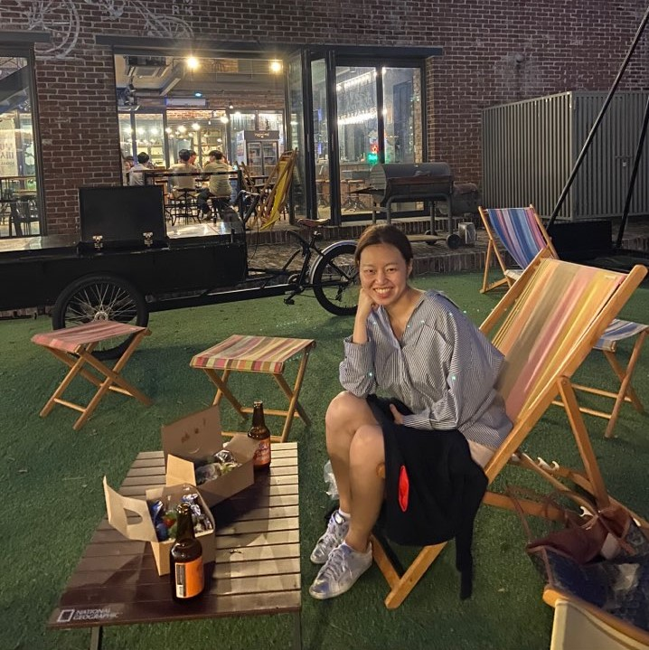
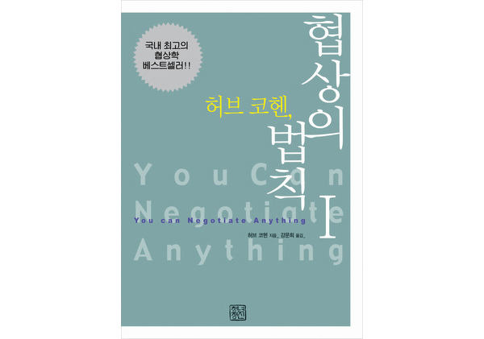
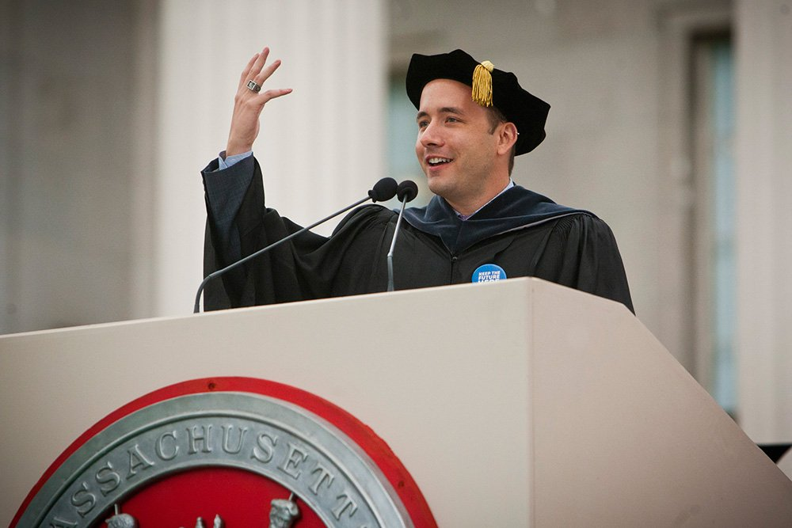

---

여태까지 러닝맨은 대부분 자기 경험을 주제로 글을 써왔다. 하지만 너무 당연하게도, 세상에는 우리보다 뛰어난 고수들이 많다. 심지어 멀지 않은 곳에 있다. 성장과 배움의 고수를 만나, 인생 교훈을 배우는 런터뷰(Learn+interview) 시리즈.

---

## 인터뷰이 소개

1년쯤 전인가, 스타트업 주니어를 위한 [행사](https://event-us.kr/svengers/event/8871?fbclid=IwAR0mbXTjFSnIzGmk9cQzGHLnbJ0TBwyuTM8SpRAIeHLQMHlMKsoyVS1cUUY)에 간 적이 있다. 거기 발표자로 나온 [지현님](https://www.instagram.com/jihyun_sophie/)을 처음 봤다. 스타트업 주니어를 위한 커리어 성장 팁을 알려주는 강연이었다. 

엄청 열성적으로 발표하던 모습이 기억에 남는다. 하고 싶은 말이 많은데 시간이 모자랐나보다. 말이 와다다다 쏟아졌다.

그 모습에서 2가지가 느껴졌다. 첫째는 자신을 성장시키기 위한 방법을 진짜 많이 고민하고 공부하는 사람이구나. 둘째는, 그걸 꼭 하나도 빼놓지 않고 다른 사람들에게 나눠주고 싶어하는구나. (물론 알아듣기는 좀 힘들었지만.)

 

그걸 보고 '저 사람이랑 친하게 지내야지' 생각했다. 그 후 같이 독서모임도 하고 커피 한잔하며 수다떠는 사이가 되었다. 이 글을 쓰려고 생각했을 때, 가장 먼저 떠오르는 사람 중 하나였다.

지현님은 여행 플랫폼 마이리얼트립에서 4년 반 정도 일했다. 요즘 퇴사 및 결혼을 마치고 재충전하는 중이다. (결혼 축하축하!) 덕분에 근황 토크도 할 겸, 인터뷰를 요청했다. 많은 내용이 나왔지만, 다 옮기지는 않는다. 핵심만 정리해보자.

## 예전의 나에게 한 가지만 알려줄 수 있다면

인터뷰라고 말해뒀다. 하지만 정해놓은 건 딱 두 가지 질문이었다. 

1) 자신이 가장 많이 성장했다고 생각하는 경험. 

2) 그리고 그 경험을 통해 배운 원칙

러닝맨은 성장과 자기계발 이야기를 하는 곳이다. 그러니 이야기 주제는 이거면 충분할 것 같았다. 

딱 이 두 개만 던졌는데 지현님은 많은 이야기를 해줬다. 미리 노션으로 한바닥 글까지 정리해왔다. 얼마나 할말이 많은지. 

그러다 내가 물었다. 예전의 자신한테 돌아갈 수 있다면, 알려주고 싶은 딱 하나의 원칙이 뭐냐고. 

그러자 지현님 대답.

> 세상 일은 처음부터 끝까지 '사람'이다. 
>
> 인생을 보는 축에 '사람'과 '관계'를 넣어야 한다는 걸 알려줬을 것 같아요.
>
> 하, 이건 진짜 인생의 진리 같은 거라서.

흠... 왠지 꼰대 부장님이 자주 할 것 같은 말인데? 

"어허... 다 사람이 하는 일인데... 회식도 나오고 그래야지!" 

물론 그런 뜻은 아니다. 두루뭉술한 말을 조금 더 자세히 풀어보자.

## 1. 생각보다 많은 고급 기회와 정보가 사람을 통해 나온다

> 사람을 알아야, 얻을 수 있는 기회와 정보가 정말 많아요. 겉으로는 되게 좋은 회사라고 알려졌는데 사실은 투자 간신히 받은 거고 사업 상황은 굉장히 안 좋다라든지. 
>
> 그게 자신이 성장할 수 있는 커리어 환경을 고르는 데 굉장히 큰 정보잖아요. 
>
> 그뿐만 아니라, 업계에서 여태까지 쌓여온 히스토리. 실제 일해봐야 배울 수 있는 스킬. 일하는 방식. 문제를 풀어가는 사고법. 
>
> 이런 것들은 책이나 인터넷이 아니라, 내가 가지고 있는 인적 네트워크에서 얻을 수 있는 거거든요.

 

맞다. 사실 **관계자본이 있다면 객관적으로 자기 실력이 부족해도, 얼마든지 더 큰 성과, 성취를 낼 수 있는 기회가 많다.** 

한 마디로 내 힘이 부족해도, '레버리지' 삼아 더 큰 바위를 들어올릴 수 있다는 뜻이다. 

지현님은 실제로 현업에서 일을 하면서 그런 경험을 여러번 했다. 필요한 도움이 있다면, 자기가 직접 콜드 메일을 보내서라도 도와줄 사람을 만나고 오는 타입이다. 그러면서 얻은 좋은 기회와 정보의 덕을 많이 봤다.

## 2. 생각보다 세상 일은 규정과 합리로 돌아가지 않는다.

> 처음 마이리얼트립에서 일을 시작했는데, 사업개발팀이었어요. 플랫폼 공급자들과 소통하고 조율하는 일인데.  플랫폼과 파트너의 이해관계를 잘 맞춰가야하는데, 되게 어렵더라고요.
>
> 그 때 '협상'을 배워서 정말 잘 써먹었어요. 하다보면 느끼는 게, 정말 이런 일은 규정이나 합리로 돌아가지 않는 부분이 많아요.
>

지현님은 협상 전도사다. 다른 사람들한테 협상 배워야 한다고 맨날 말하고 다닌다. 

추천하는 책은 허브 코헨의 <협상의 기술>. 정말 도움이 많이 된 인생 책이라고 한다. 

내가 실력이 있고, 가진 게 많아야 꼭 원하는 걸 얻을 수 있는 건 아니다. 지현님 말처럼 세상에는 사람의 재량에 따라 결정되는 것이 많다. 다 사람이 하는 일이다.  

**그러므로 관계와 협상으로 풀어나갈 수 있는 영역도 생각보다 크다.** 그렇게 잘 풀려면 어떻게 해야하는지 전문적으로 다루는 분야가 바로 '협상'이다. 

> 저는 모든 게 협상이라고 생각해요. 지금 범근님과의 관계도 협상이고, 심지어 제 남편과 관계도 협상이에요. 
>
> 그게 나쁜 의미가 아니라, 우리 모두는 관계에서 서로 주고받는 거니까요. 그걸 알고 서로 윈윈하는 방법을 찾고 싶다면, 협상의 기술이 진짜진짜 도움 많이 돼요.

## 3. 생각보다 주변 사람에게 받는 영향이 크다.

> 예전에는 아버지가 골프 치러 다니시는 거보고 이해가 안 됐어요. 왜 저렇게 쓸데없는 거에 주말 시간을 다 보내지? 
>
> (...) 예전에 컨설팅 회사 갈지 고민할 때도 이렇게 생각했어요. '내가 꼭 맥킨지 가야 돼? 난 사업하고 싶은데. 거기서 내가 배우는 게 나중에 무슨 의미가 있어.' 
>
> 근데 사회생활을 하고난 지금은 생각이 달라졌어요. 가서 일하는 의미는 없더라도, 단지 거기서 그 '끕'의 사람들을 만나는 것만으로 충분히 배울 수 있는 게 많았겠구나. 
>
> 내가 똑같이 하더라도, 내 주변에 누가 있느냐에 따라서 내 성장 곡선이 달라져요. 예전엔 몰랐죠. 이제는 그런 부분을 무시하지 않아요.

나도 항상 대학교 수업에서 배운 게 하나도 없다고 투덜거리곤 했다. 지금 돌아보고서 비슷한 깨달음을 얻었다. 대학이라는 공간에서 중요한 것은 강단의 교수님이 아니라, 내 옆의 다른 학생들이다. 그들과 관계를 맺고 이야기를 나누면서, 내 인생의 물줄기도 자연스럽게 영향을 받기 때문이다.

MIT 졸업 축사에서 드롭박스 CEO 드류 하우스턴이 한 유명한 말이 있다. **'당신이 어울리는 주변 사람 5명의 평균이 자신이 된다'**고.  

> "You become the **average** of the **five people** you hang out with." - Drew Houston

사실 이 효과는 눈에 그렇게 띄지 않고, 즉각적이지도 않다. 당장 일부러 좋은 사람들을 만나러 다니려고 애쓰지 않아도, 그렇게 큰 문제는 없다. 하지만 장기적으로는 분명히 영향을 미친다. 

가끔 나는 생각하곤 한다. 차라리 공부하던 그 시간에 (어차피 높지도 않은 학점...) 동아리나 한 2개쯤 더할 걸. 

내가 좋은 사람이 되려면 어떻게 해야할까? 못지 않게, 내 옆에 있는 친구/동료를 어떻게 좋은 사람을 채울까? 그리고 좋은 사람들과 어떻게 주고받을까도 한번 질문해보자.

## 성장에서 '사람 레버리지'를 잊지 말 것

흔히 '인간관계' '네트워킹' 같은 말은, 일이나 자기계발의 반대말처럼 느껴진다. 

내가 더 글을 잘 쓰고, 내가 더 코딩을 잘하고, 내가 더 시간을 잘 쓰는 일이 성장이라 생각하기 쉽다. 사실 나도 그런 경향이 있다. **내가 열심히 하고, 내가 잘해서 무언가 이뤄내보자는 식이다.**

**생산성에 집중하는 사람들은 '레버리지'를 놓치기 쉽다.** 하지만 세상 일은 사람이 하는 거고. **다른 사람을 레버리지하는 것은 정말 중요**하다. 인간관계와 협상으로 내 성장에 기름을 부을 줄 알아야 한다. 

> 내 생산성이 올라가는 건 너~무 한계가 있어요. 그래서 레버리지가 필요하죠. 
>
> 레버리지라는 게 막 사람 이용해먹으라는 뜻이 아니고요.
> 
> 뭐든지 사람은 서로 주고받는 게 있잖아요. 그걸 어떻게 하면 극대화할 수 있을까. 윈윈할 수 있을까 고민해보는게 중요하단 뜻이에요.

지현님은 요즘 빡세게 공부를 하고 있다. 역사를 파고 있다고 한다. 왜냐? 미래를 이해하고 싶어서. 
미래의 방향을 볼 수 있다면 알게 된다. 내가 살짝만 노를 저어도 쭉쭉 나아갈 수 있는 곳이 어디인지.

결국 미래도 '사람'이 만드는 씨줄과 날줄의 결과물이다. 역사를 보고 사람의 본성과 행동을 이해하면, 미래도 충분히 볼 수 있을 것 같다고 한다.

> 결국 인간은 세상에선 한없이 작은 존재거든요. 
>
> (...) 세상의 흐름을 보고 떠오르는 곳이 뭔지 봐야죠. 그럼 나란 인간이 거기서 꼴찌라도, 다른 분야보다 빨리 성장할 수밖에 없어요. 제가 열심히 해서 잘 되는 건 크지 않다니까요. 다른 사람을 레버리지해야하는 이유도 그런 거고요.

