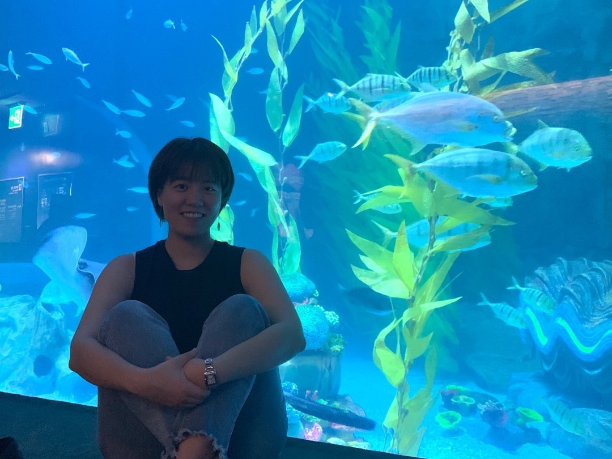
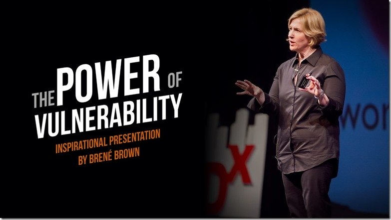

---

여태까지 러닝맨은 대부분 자기 경험을 주제로 글을 써왔다. 하지만 너무 당연하게도, 세상에는 우리보다 뛰어난 고수들이 많다. 심지어 멀지 않은 곳에 있다. 주변의 고수들을 만나, 인생 교훈을 배우는 런터뷰(Learn+interview) 시리즈.

---

## 인터뷰이 소개

소현님은 7년쯤 전 학교 다닐 때  학회에서 만났다. 그 때부터 쭉 좋은 친구로 지내고 있다. 

항상 밝고 열정적인 에너지가 있다. 주변 사람도 잘 챙기는 스타일이라, 친한 사람도 많다. 

일도 잘 한다. 내 지인 가운데 최고연봉자 중 한 명...! 이미 성공한 커리어우먼이라고 할 수 있다. 나중에 꼭 같이 일해보고 싶다.

평소에 오지게 바쁜 분이다. 하지만 마침 요즘 쉬는 시기여서, 런터뷰 2탄에 초대했다.

"안녕하세요. 저는 장소현이고, 사회 생활 이제 6년차네요. "

"경영대를 졸업했고요. 전략컨설팅 사에서 커리어를 시작했어요. 소비재, 유통, 자동차 산업 프로젝트를 많이 했는데, 굉장히 재미있게 다녔어요." 

"전 항상 사회를 거시적으로 바꾸는 일을 하고 싶었어요. 그래서 공공 영역에서 일하거나 변호사가 되는 것도 고민했었는데. 컨설턴트가 되고 나서, 그런 쪽하고 점점 멀어지는 것만 같더라고요."

"휴직하고, 민주당 경선 선거 캠프에서 일했어요. 오래전부터 정치가 세상을 바꾸는 수단이라고 생각했거든요. 그 세계를 경험해보고 싶었어요. 거기서 4달 정도 일했고, 후보가 경선에서 떨어진 후에 다시 회사로 복귀했었고요."

"그 후엔 레바논에 파견도 갔다왔어요. 또 다른, 사회적인 임팩트가 있는 일을 하고 싶어서 고민하다가 간 건데요. 엔데버라고 사회적 기업을 키우는 조직이었어요. 레바논 지부에 가서 몇 개월 일하고 왔죠."

"회사로 돌아오니 5년차가 되어있었어요. 연봉. 주변 기대치. 밑에 팀원들. 여러가지로 제 지위가 높아졌어요. 근데 오히려 불안하더라고요. 내실이 없단 생각이 들었어요. 특히 내가 특정한 산업에 전문성이 없다는 게 고민이 많이 됐고..."

"그래서 보로노이라는 제약회사로 이직했어요. 바이오/제약을 제 전문 분야로 삼고 싶었던 거예요. 제약이라는 건 정말 인류 전체에게 긍정적인 영향을 줄 수 있는 일이기도 하고요. 보로노이에서 사업개발, IR 업무 등을 1년 반 정도 하다가 퇴사했습니다." 

"퇴사 후 커리어 탐색겸 몇몇 스타트업에서 프리랜서로 일을 도와줬고, 지금은 좀 쉬고 있어요. 끝!"

## "제 인생은 이 사건 전과 후로 나뉘죠"

이번 런터뷰에서도, 질문은 단순하게 2가지였다. 

>첫째, 자신이 가장 많이 성장했다고 생각하는 경험. 둘째, 그 경험을 통해 배운 것.

소현님은 정말 자기 삶에 아주 큰 영향을 준 사건이 있다고 했다. 

> "진짜 어느 정도냐면, 제 인생은 그 사건 전과 후로 나뉜다라고 볼 수 있죠"

> "와, 그게 뭐였어요?"

(개인적인 이야기로 자세한 디테일은 생략함)

수년 전 지인과의 관계가 크게 틀어진 적이 있었다. 자신의 성격적인 단점 때문이었다. 소현님에겐 꽤나 큰 충격이었다. 그 사건이 자신한텐 큰 상처가 되었다고 한다. 

문제는 관계에 대한 불안이 매우 심해졌다는 점이다. 소현님은 자신의 단점을 정면으로 보게 되었다. 그리고 그게 다른 사람들을 힘들게 할 수 있다는 사실을 깨달았다.

> 그런데 진짜 더 무서운 건, 
>
> '아, 난 이런 성격으로 태어났구나' 
>
> '내가 이대로 바뀌지 못하는 게 아닐까?' 라는 생각이었어요.

자존감이 바닥을 쳤다. 스트레스가 심했고, 종일 우울감에 빠져지냈다. 일이 손에 잡히지 않았고, 회사를 퇴사할까 고민도 했다고 한다.

소현님에겐 좋은 관계란 인생에서 매우 중요한 가치였다. 그만큼 자신의 약점을 보는 것도 괴로웠다. 

그러던 어느날. 소현님은 걸어서 퇴근을 하고 있었다. 여의도공원에서 문래역으로 걸어오던 중이었다. 그날도 역시 자신의 단점에 대해서 생각하고 있었다. 부정적인 감정들이 마구 지나갔다.

그러다 문득. 정말 문득 갑자기 이런 생각이 들었다.

> '괜찮아. 고치면 되잖아.'

> '상담을 받든가, 책을 읽든가. 뭐라도 하자. 노력하면 바뀔 수 있을 거야.' 이런 생각이 딱 머릿속을 지나갔어요.

나는 '이런 단점을 가지고 태어났어' '이제 안 될 거야'라는 생각을 하다가, 어느 순간. '고치면 돼'라는 생각이 강하게 들었다고 한다. 그러자 마법처럼 마음이 편해졌다.

> 그리고 솔직하게 드러내면 돼. 라는 생각도 들었어요.

> 내가 단점이 있다면 솔직하게 상대방에게 말하는 거죠.
>
> 만약 다른 사람을 또 만나서, 내 단점이 들키지 않을까 전전긍긍하는 대신에, 그냥 털어놓는 거죠. 

> 나는 이런 단점이 있다. 성격상 좀 당신이 이해하지 못하는 행동을 할 수도 있다.  
> 미리 그렇게 말해야겠다는 생각이 번쩍 들더라고요.

> 사실 그전까지 그렇게 괴로웠던 이유는, 내가 문제가 있는 걸 알고 있는데, 그게 고쳐지지 않을 까봐. 
> 사람들이 그걸 알고 날 판단해버릴까봐서였어요."

약점 그 자체보다는, 내가 약점을 고칠 수 없을 것이고, 그 때문에 내가 다른 사람과 단절되지 않을까? 라는 마음이 진짜 불안의 원인이었다.

 

> 그런데 앞으로 고치면 된다고 생각하고, 정 안 되면 미리 말하면 된다고 생각하니까. 뭔가 엄청 해방된 느낌이 들더라고요.
>

> 상처는 드러내야 치유된다는 말이 있잖아요. 그런 내용들이 확 깨달음으로 오는 느낌이었어요.
> 내가 숨기지 않고 인정해버리면. 그 순간에 나는 그 두려움에서 자유로워진다는 사실을 깨달은 거죠.

신기했다. 그런 깨달음이 갑자기 오다니.

> 저도 되게 신기해요. 왜 그랬는지 아직도 모르지만. 그 때 당시 제 자존감이 밑바닥까지 내려갔었기 때문에. 변화가 되게 절박해서 그랬는지도 모르겠어요.

## 건강해진 멘탈

그 후로는 멘탈이 강해졌고, 삶의 많은 부분에서 태도가 바뀌었다고 한다.

실제로 그 다음부터는 솔직하게 자신의 단점을 모두 털어놓았다. 그랬더니 그 단점이 드러나는 일도 오히려 줄어들었다. 사람들과의 관계에도 아무런 문제가 없었다.

> 그 사건 이후로, 삶의 다른 부분에서도 이런 태도가 생겼어요.

> 예를 들면, 사람들이 내가 어떤 일을 되게 잘할 거라는 기대가 있을 수 있잖아요?  근데 사실 내가 그걸 못해요. 그럼 막 불안하고 숨기고 싶겠죠. 
> 근데 그런 일이 있으면, 솔직하게 말해요. 나 잘 못한다.

> 적어도 아픈 데 건강한 척은 하지 않게 됐다는 뜻이에요. 이 마인드셋이 내 인생에 가장 큰 성장이었던 것 같아요.

## 취약성을 드러내는 것의 힘

이 이야기를 들으면서, 한 테드 영상이 떠올랐다.  브레네 브라운의 **'취약성의 힘'(Power of Vulnerability)**. 2천만회 이상의 조회수를 기록한 유명한 영상이다. 

브레네 브라운은 관계에 대한 연구를 하려고 사람들과 인터뷰를 했는데, 그 때마다 사람들은 '수치심(Shame)'에 대해 얘기했다고 한다. 그 수치심이란 '단절당하는 두려움(fear of disconnection)'이다. 아까 소현님이 느꼈던 다른 사람들과 더 이상 잘 지내지 못하면 어떻게 하지? 와 비슷한 느낌이다.

브레네 브라운은 그 기저에는 취약성(Vulnerability)이 있다고 한다.

**나는 날씬하지 않아**

**나는 돈이 많지 않아**

**나는 예쁘지 않아**

**나는 똑똑하지 않아**

같은 생각 말이다. 이런 취약성이 수치심이 되고, 두려움이 된다. 

브레네 브라운은 '취약성'을 연구하면서 600명이 넘는 사람들과 인터뷰를 했다. 

그 중에는 취약성을 가지고 있으면서도, 자존감이 높고 소속감을 느끼는 사람들이 있었다. 또 그렇지 못한 사람들도 있었다. 

하지만 두 집단의 지위, 능력이 차이나는 건 아니었다... **이 둘의 차이는 뭐였을까?** 

아마 앞의 이야기를 읽었으니 답을 맞출 수 있을 것이다. 잘 모르겠다면, [TED 영상](https://youtu.be/H7Wd_6mFrjk)을 보길 추천한다.

## 나의 두려움은 뭘까

이 이야기는 나에겐 굉장히 의외였다. 소현님은 잘 나가는 커리어우먼이라고만 생각했고, 주변 사람들과의 관계도 항상 좋아보였다. 그렇게 깊은 고민이 있을 줄은 몰랐다. 

동시에 그럴 수 있다는 생각이 들었다. 사실 그 **어떤 인간이든 자기만의 불안, 두려움, 결핍을 여럿 숨기고 살아갈 테니까.** 

> '괜찮아. 고치면 돼.' 

사실 이 말 자체는 그리 특별하지 않아보인다. 물론 나는 그저 짧은 이야기로만 들었을 뿐이라 와닿지 않을 수 있다. 누군가에게 인생을 바꿔놓은 깨달음은 그 때 자신이 겪었던 경험들과 같이 맞춰져야만, 온전히 이해할 수 있을테니까.

**나의 마음 속 깊은 불안은 무엇일까?** 

소현님과 인터뷰를 하고 나서 궁금해졌다. 여자친구, 부모님에게도 물어봤다. 서로가 '두려워하는 단점'에 대해 얘기를 나눴다. 각자의 숨기고 싶은 단점이 뭔지, 어떤 집착이 있는지 말이다. 나의 경우, 얘기하다보니 이런 감정들이 나왔다. 

- 시간을 생산적으로 보내지 못하는 것에 대한 두려움. 
- 중요하지 않은 일에 시간을 흘려버리고 났을 때 불안함. 
- 성취감에 대한 집착. 내가 발전하고 있다는 느낌이 들지 않을 때 초조함. 
- 사람들이 경력을 보고 내 능력을 안 좋게 평가하지 않을까 두려움. 

한 마디로 말하면, **'난 충분히 발전하고 있지 않아**'라는 두려움이 컸다. 혹시 다른 사람이 나를 그렇게 보게 만들 수 있는 모습은, 가능하면 숨기고 싶다. 

**솔직히 이야기를 하고 나서야, 나도 내 두려움이 무엇인지 조금이나마 파악한 느낌이다.** 생각보다 나는 정말 성취와 발전에 집착하는 인간이었구나. 신기하다. 알고 있었지만, 몰랐던 묘한 느낌이다.

소현님이 그랬듯이 갑자기 마법처럼 그 두려움이 사라진 건 아니다. 하지만 그 실체를 바라보고 나니, 내가 그 두려움과 감정적으로 분리된 느낌이 들었다. 

## 당신의 '아픈 손가락'

**이 글을 읽고있는 당신은 어떤지 궁금하다.**

절대 남들에게 말하고 싶지 않은. 어떻게든 숨기고 싶은. 

남들이 나를 그렇게 평가한다고 생각하면 너무나 두려워지는 나의 단점.

그런 아픈 손가락이 있는지?

없진 않을 거라 생각한다.

한번쯤 곰곰히 생각하고, 말이나 글로 표현해보면 어떨까. 

더 나아가 가까운, 믿을 수 있는 사람과 터놓고 공유해보면 어떨까.

당신의 멘탈이 훨씬 더 건강해질 거라고 생각한다. 

 

