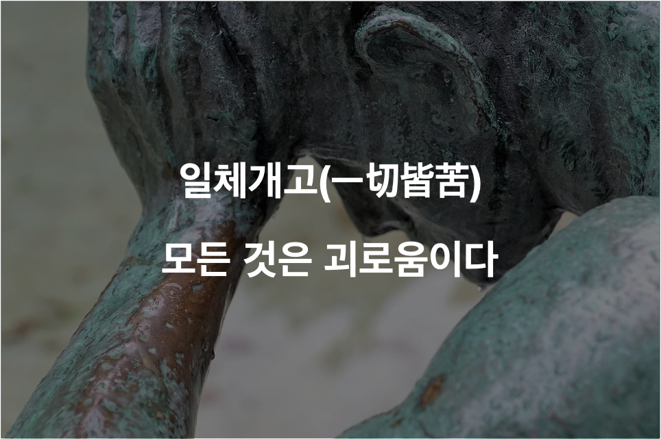

## 인생에서 피할수 없는 것, 고통

고등학교 윤리시간이었다. 부처는 삶을 고통의 연속이라고 정의했다. 당시에는 이 말이 별로 와닿지 않았다. 행복을 위해 노력하지 않는 찌질한 자기 위안이라고 생각했다. 노력하면 고통 없이 행복하기만 한 천국에 살 것이라 생각했다. 

대학 졸업 후 증권사 취직, 창업, 개발자 전향 등 나름 다양한 경험을 했다. 진짜 내가 되어 살아가기 위한 도전 이었다. 내가 사랑하는 일을, 주도적으로 하면 고통 없이 행복하기만 할 수있지 않을까 생각했다. 하지만 어떤일을 하던지 고통이 없는 일은 없었다. 증권사는 증권사 나름대로, 창업은 창업 나름대로, 개발자 인생도 나름의 고통이 있다. 

그러다 문득, 행복한 인생이란 고통이 없는 인생이 아니라는 생각이 들었다. 행복한 인생이란 내가 충분히 견딜만 한 고통을 짊어지고 가는 인생이었다. 

고통은 사람마다 상대적이다. 사람을 만나 제품을 파는 일이 나에게는 큰 고통이지만 다른 누군가에게는 작은 고통 일 수 있다. 아이를 기르는 것이 나에게는 감당할 만한 고통이지만 다른 사람에게는 결코 감당할수 없는 고통일 수 있다.

따라서 행복하기 위해서는 내가 어떤 고통을 즐겨낼 수 있는지를 잘 파악하고 그걸 선택해 나가는게 중요하다는 생각을 한다. 고통이 없는 행복한 천국을 상상하고 그걸 얻으려 한다면 아무것도 얻지 못할 가능성이 크다. 

이런 점에서 내가 개발의 고통을 선택한 것은 잘한 선택이다. 하루에 10시간 넘게 앉아서 코딩을 하고 공부를 해도 힘들긴 하지만 충분히 즐겨봄직한 고통만이 느껴진다.

## 어차피 지불해야 한다면 선불로 지불할 것 

고통은 세상에 육체를 입고 살아가는 서비스를 받기 위해 지불하는 비용과 같다. 육체를 지니고 살아가는 이상 고통은 언젠가는 지불해야하는 비용이다. 시기가 빠르던 느리던 결국에 어떠한 방식으로 라도 고통을 지불하게 된다. 

그런데 이 비용은 선불로 지불할 수록 더 싸게 먹힌다는 특징을 가지고 있다. 시험을 보기 전에 미리 공부하는 고통을 지불한다면 시험이 끝나고 후회하는 고통을 지불하지 않아도 된다. 어렵지만 꼭 해야 할말을 하는 커뮤니케이션 비용을 미리 지불하면 나중에 오해로 생긴 큰 고통을 지불하지 않아도 된다. 어렵지만 하고 싶은 일을 선택하고 처음부터 시작하는 고통을 선택하면, 나중에 살고싶지 않은 인생을 사는 엄청난 고통을 지불하지 않아도 된다. 

사실 나의 이런 깨닳음은 미리미리 하는 것이 좋다는 것을 다른 언어로 표현한 것 뿐이다. 미리미리 하는게 좋다는 걸 모르는 사람이 어디있겠는가. 하지만, 이렇게 나의 언어로 표현해 보면 좀더 그 중요성을 마음 깊숙히 새겨볼 수 있는 장점이 있기에 이렇게 정리해 보았다. 

## 고통을 빨리 지불하기 위한 실험, 아침형 인간

내 인생에서 미리 지불할 수 있는 고통은 미리 지불해 놓으려는 노력을 하고자 한다. 매일 운동을 하는 것도, 커리어를 바꾸는 것도 모두 고통을 미리 지불하려는 노력의 일환이다. 

더 할 수 있는게 없는지 생각을 해 보았다. 일전에 읽었던 책 '오늘 또 일을 미루고 말았다.'의 내용이 떠올랐다. 이 책의 핵심은 '라스트 스퍼트 보다 로켓 스타트'로 요약할 수 있다.

마지막에 가서 열심히 하지말고 처음에 달리고 나머지 시간을 여유롭게 사용하며 디테일과 창의성을 더하라는 말이다. 윈도우 95를 개발한 개발자가 쓴 책이라 개발자인 나에게 큰 인상을 남겼다.

책의 저자는 뭐든지 미리한다.새벽 4시 30분에 일어나서 오전 중으로 중요한 일들을 모두 처리하고 오후시간을 버퍼로 사용한다. 프로젝트 시작후 전체 기간의 20% 기간동안 80%의 중요 업무량을 처리하고 나머지 시간에 예상치 못한 문제들을 해결한다. 이러한 삶의 습관이 본인의 성공 비결이라고 이야기 한다. 

고통을 빨리 지불의 달인을 만난 기분 이었다. 나도 더 효율적인 인생을 살기 위해, 더 실력있는 개발자가 되기 위해 이 도전을 한번 해볼까 한다. 일단 아침일찍 하루를 시작하는 것 부터 해 보겠다. 

내가 아침형 인간과 너무 맞지 않을 것을 대비하여 1주일간 실험을 해 보고 결과를 바탕으로 더 할지 말지를 결정하도록 하겠다. 

1주일간의 실험 방식은 아래와 같다. 

- 전날 저녁, 다음날 오전 중에 할 일을 구체적으로 정해 놓는다. 가능한 한 일찍 잔다.
- 아침 6시 30분에 일어나서 할일을 처리해 나간다.
- 그날 집중해서 일을 처리한 시간을 기록한다.(측정해 보니, 나는 평상시에 쉬는 시간을 제외하고 7시간에서 8시간 반 정도 집중한다. 이것보다 시간이 늘어나는 지 확인해 볼 것이다.)
- 그날 저녁 하루의 효율성을 1점에서 10점 척도로 주관적으로 점수를 매긴다.

일찍 일어나는 고통을 미리 지불한다면, 해야할 공부나 일이 밀려 있는 고통을 피할수 있을 것으로 기대한다.

