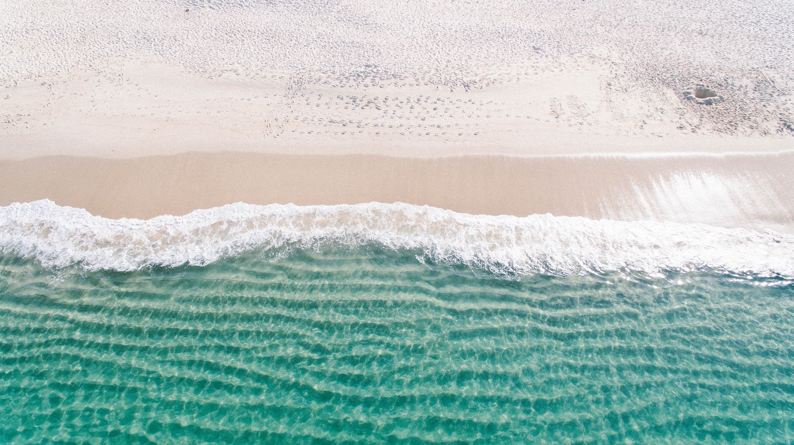

휴가다. 눈앞에는 파도가 치고 햇살은 따듯하다. 고양이들은 백사장을 뛰어다니며 놀고 있다. 올해 해야 할 일들은 모두 마쳤다. 상당히 개운한 기분일 줄 알았는데, 마음 한쪽이 불편하다.

이렇게 있어도 되는 건가? 잘하고 있는 건가? 내 친구들이 나보다 너무 잘 나가 버리는 것은 아닐까? 무시당하고 살 게 되는 것은 아닐까? 근거 없는 불안이 스멀스멀 올라온다.

주변에 멋진 사람을 많이 두는 것은 정말 좋은 일이지만, 때로는 그들의 제일 빛나는 부분과 나의 가장 어두운 부분을 비교해 가며 쓸데없는 에너지를 소모해 버린다.

마냥 행복해지고 싶은데 이상한 비교의식, 남들에게 인정받고 싶다는 의식, 남들보다 잘나고 싶다는 마음이 마음을 번잡하게 한다.

식상한 비유지만, 바다를 보고 있으면 자연의 역사가 얼마나 긴지, 그 길이에 비하면 인간의 삶은 얼마나 짧은지 새삼 깨닫는다. 인생은 정말로 짧다.

인생은 정말로 짧기에 의미 없는 것에 에너지를 낭비하기는 너무 아깝다. 다른 사람과 비교를 위해 에너지를 쓰는 일은 인생에서 별로 쓸모가 없는 일이다.

인생은 레이스가 아니고 여행이기 때문이다. 승자도 없고 패자도 없다. 잘한 여행과 못 한 여행을 구분하는 방법은 단 하나다.  여행을 하는 당사자가 행복했다면 잘 한 여행이다. 누구보다 잘 한 여행, 누구보다 못한 여행 그런 거 없다.

모두의 인생은 전인미답이다. 누구도 가보지 못한 길을 걸어가는 여행객일 뿐이다. 나보다 돈을 많이 버는 사람들은 있겠지만, 그 사람의 인생이 나보다 좋은 인생이라고는 절대 말할 수 없다.  인생간의 비교는 사과와 숫자 1중 어떤 게 큰지를 묻는 것만큼 불가능한 비교다.

절대적으로 나에게 필요하다고 생각이 되는 일을 하자. 빨리 돈을 많이 벌고자 한다면, 그게 내 친구들보다 돈을 적게 벌고 있어서가 아니라, 내가 빨리 벌어서 좋아하는 일을 많이 하고 싫어하는 일을 적게 하기 위함이어야 한다.

내가 부동산을 가지고자 한다면, 남들이 집이 있어야 한다고 말해서가 아니라, 내 가족이 편하게 머무를 보금자리가 필요해서 여야 한다.

절대적 목표를 염두에 두고 살자, 내가 필요하다고 생각하는 생각을 하도록 생각에 주의를 기울이자. 절대적 목표를 세워두지 않으면, 상대적인 목표를 쫓아가게 되기에 십상인 것 같다. 그런 의미에서 내 생각으로 만들어진 목표를 잘 가지고 있는 것은 중요하다.

남들과 비교하며 정상에 오른다고 해도 경치를 즐기지도 못하고, 내가 오르고 싶은 산을 오르지도 못하면, 그 여행은 불행한 여행이고 절대적으로 실패한 여행이 된다. 내 옆에 사람이 어디로 가는지 얼마나 갔는지는 전혀 쓸데없는 고려 사항일 뿐이다.
