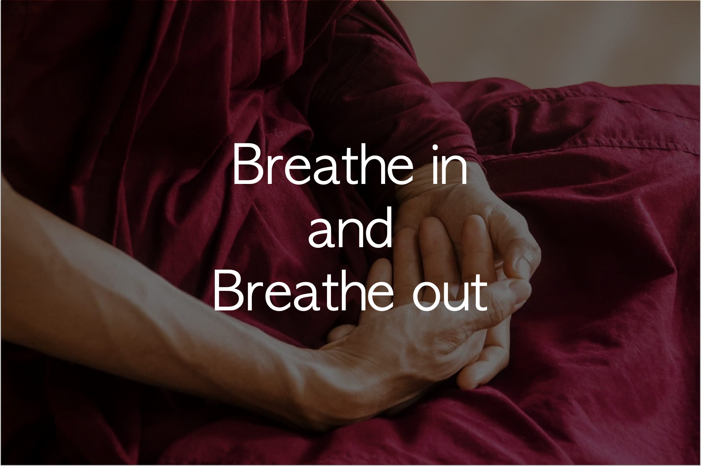

## 내 삶이 조금 아깝게 느껴지기 시작했다.

나는 잘살고 있다. 사실 굉장히 행복하다. 직장도 괜찮고, 개발도 재밌다. 이전에 보지 못하던 것들을 볼 정도로 실력이 는 것을 느낀다. 외주 작업도 하는데 힘들지만 재밌다. 운동도 꾸준히 하고 있어서 나날이 몸도 좋아진다. 운동하러 가면 칭찬 받는다.

그렇다고 해서 완벽하게 사는 것은 아니다. 내 소중한 시간을 완벽하게 활용하고 있다는 생각이 들지 않는다. 출퇴근 시간을 그냥 허비하고 있고, 하루가 끝날 때 반성을 하지 않고 있으며, 명상도 하지 않고 있다. 투자 데이터를 모으는 일도 대충이다. 개발 블로그 글도 퇴고를 안 해서 도저히 못 올리고 있다. 일을 하는 중간중간에도 카카오톡을 너무 자주 보는 것 같다.

위기의식은 사람을 움직인다. 저런 것들 때문에 뭔가가 잘못되고 있었으면 위기의식을 느끼고 바꾸었을 것이다. 단지 조금 아깝다. 더 인생을 충실하게 음미할 수 있을 텐데.... 하는 아쉬움 말이다.

그렇다고 해서 위기의식을 느끼면서 시간을 아껴 쓰고 싶지는 않다. 나라는 사람은 머릿속에 비상벨이 울리고 있으면 아무리 많은 성장을 한다고 해도 행복하지가 않다. 빨리 가기 위해서 내 행복을 포기할 마음은 없다.

## 명상이 답이 될 수 있지 않을까?

명상을 좋아하고 자주 했었다. 그런데 요즘 별로 하지 않고 있다. 다시 명상할 때가 되었다.

나는 명상을 꾸준히 하다가 안 하다가를 반복적으로 하는 편이다. 3~4달 정도 1주일에 4번 이상은 명상을 하다가 다시 3~4달 정도는 명상을 전혀 하지 않고 지낸다. 명상을 자주 해서 어느 정도 평온한 마음 습관이 들면 명상할 필요를 잘 못 느끼게 된다. 그 뒤로 명상을 또 한참 안 한다. 그 뒤로 다시 명상이 필요한 순간이 오면 꾸준히 명상하고는 한다.

명상하면 더 평온한 상태에서 나를 되돌아볼 수 있고, 마음을 다스리는 힘이 강해진다. 마음을 다스리는 힘이란, 내안에서 날뛰는 원숭이를 달래는 실력이 늘어난다는 말이다. 이 원숭이를 잘 달래면, 귀찮은 일들을 해내는 것이 꽤 수월해진다.

그래서 그런지 명상을 할 동안은, 위기의식 없이 충실하게 인생을 사용하는 일이 더 쉬웠던 것 같다. 사실 이 주장은 가설일 뿐이다. 이번 기회에 실제로 그런지 좀 비교해 보려 한다. 명상을 안 하기 시작한 시기와 반성을 안 하기 시작한 시기가 거의 일치하는 것을 보면 아주 상관이 없지는 않을까 기대를 건다.

## 하루 4회 5분 이상 명상을 해보자

원래 명상은 한 번에 20분씩 하는 게 정석이라고, TED에서 어떤 뇌과학자가 말했다. 일반적으로 20분이 넘어가야 뇌파가 완전히 바뀐다나 뭐라나.

하지만, 20분 미만의 명상도 효과가 있다는 연구자료도 많은 만큼, 짧게라도 자주 하는 것을 목표로 삼아보자. 나의 명상 체력과 환경에서 한 번에 20분은 꽤 버거울 수 있다.

사실 중요한 건 시간도, 횟수도 아니다. 요즘 운동을 하면서 느끼는 건데, 한번을 하더라도 제대로 내 근육에 느낌이 오도록 하는 것이 중요하다. 그래야 근육이 큰다. 명상도 마찬가지다. 내가 mindfulness를 얼마나 잘 느끼는지, 마음을 얼마나 잘 관찰하고 잘 다스리는지에 더 집중해야 한다.

그리고 더 중요한 건, 안 하는 것보다는 무조건 하는 게 더 좋다는 사실을 잊지 않는 것이다. 운동이나 명상이나 제대로 못 할 거 같아서 안 하는 것보다는 어떻게라도 하는 게 무조건 좋다.

## 프로그래머는 명상과 궁합이 잘 맞는 직업

감사하게도 나의 직업은 프로그래머다. 프로그래머는 명상하기 좋은 직업이다. 혼자 작업하는 시간이 많기에 명상할 짬을 내기도 좋다.

무엇보다 작업 자체를 명상으로 만들 수 있는 가능성이 있다. 최근에 읽은 명상 책 [당신의 삶에 명상이 필요할 때]의 저자 앤디 퍼디컴은 모든 일이 명상이 될 수 있음을 알려준다. 어떤 일을 하든지 오롯이 그 일 하나에 집중하여 마음을 다스릴 수 있다면, 그 일은 명상이 될 수 있다.

개발자가 되기 전에는 이런 말을 속 편한 소리라고 생각했다. 일하려면, 다른 사람과 쉴새 없이 커뮤니케이션해야 하는데 어떻게 한 가지에만 집중 할 수 있겠는가?

하지만 개발일은 한 가지 일에만 집중할 수 있는 환경을 조성하기 쉽다. 롤이 제대로 분배가 된 이후 리뷰 및 테스트를 거치기 전까지는 오롯이 혼자만의 시간이다. 프로그래밍을 하나의 명상이라고 생각하고 마음을 다스리는 데 사용할 수 있다. (물론 개발 task의 성격마다 다르기는 하겠지만, 명상으로 활용할만한 수준의 작업을 찾을 수 있을 것으로 기대한다. )

## 매일 할 일, 명상체크

다른 것은 따로 확인하지 않는다. 그저 오늘 하루 명상 횟수를 채웠는지만 아침저녁으로 체크해 보자.
