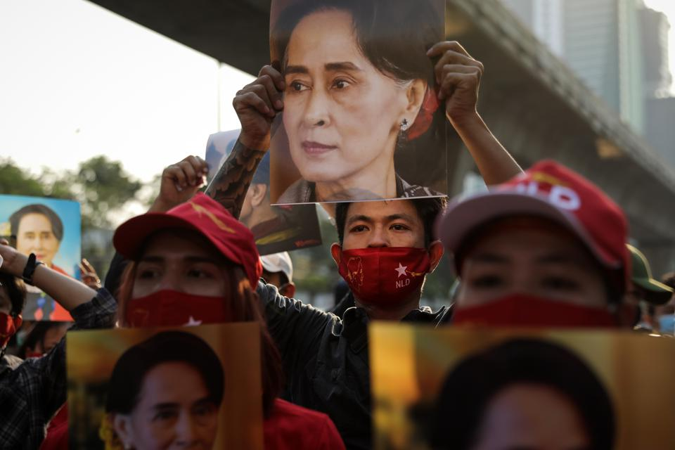

---
title: 미얀마 갈등, 왜?
date: "2021-04-21T00:00:00.000Z"
description: 커뮤니티 갈등 알아보기-1
ogimage: './burma-conflict.jpg'
tags: ["essay", "robbie"]
---**

# 왜 커뮤니티 갈등을 알아보려고 하는가?
러닝맨 지면에 처음 등장하기 때문에 간단히 자기소개를 하겠다. 평범한 3년 차 개발자다. 평범하게 강아지를 좋아하고, 먹고 자는 걸 좋아한다. 평범한 가정에서 자랐고. 그렇게 고생하며 자라지 않았다. 이렇게 갈등과는 거리가 먼 삶을 사는 사람이 왜 지금 전 세계에서 가장 갈등이 심한 곳에 대해 알아보게 됐을까?

어릴 때부터 온라인 커뮤니티 눈팅하기를 즐겼다. 특히 익명 커뮤니티에서 다양한 사람들의 행동을 보고 관찰하는 것을 즐겼다. 처음에는 단순히 눈팅하다가. 어느새 최전방에서 키보드 워리어짓을 하는 자신도 종종 발견할 수 있었다. 사람들의 날것의 목소리를 그대로 관람하는 게 옛날부터 지금까지의 내 포기할 수 없는 취미이자 욕망이다.

그러면서 점점 사람들이 모이는 공간에 대해 관심을 두게 됐다. 아주 작은 범위(동아리, 반, 과)부터 아주 큰 범위(국가, 국제연합)까지. 실제 존재하는 지역부터 온라인에 이르기까지 사람들이 모이는 커뮤니티에 관심을 두게 됐다.

약간 다른 얘기를 하자면(글 전체에서 중요하지도 않은 내용이고 사실상 TMI에 가깝다), 내 롤모델은 은하영웅전설이라는 소설(및 만화)에 나오는 양 웬리라는 자유행성동맹 장군이다. 양은 군인인데 전쟁을 싫어한다. 전쟁 영웅이지만 과도한 관심을 극도로 경계한다. 오히려 은퇴하고 싶어 한다. 다만 전장에서는 마치 자신이 아닌 다른 사람의 싸움을 보듯 전체를 조망하면서 적장의 심리를 꿰뚫는다. 라이벌인 은하제국군의 원수 라인하르트 폰 로엔그람은 패도를 위해 싸우지만, 양은 사람들의 자유를 위해 싸운다. 세상을 지배하기 보다는 있는 그대로를 바라보는 역사가가 양 웬리다.

그런 양 웬리가 보면 즐거울 정도로. 최대한 많은 사람이 자연스럽게 얘기할 수 있는 커뮤니티를 만들어보는 것이 내 로망 중 하나다. 하지만 문제가 있다. 인간은 뭉치기보다는 반목하기를 더 좋아한다. 그래서 커뮤니티가 커지는 데에는 한계가 있다.

자 이제 왜 미얀마를 알아보게 됐는가? 에 대한 질문에 대한 답을 하려고 한다. 그 이유는 커뮤니티의 크기를 결정하는 가장 중요한 척도가 바로 이 갈등이라고 생각하기 때문이다. 연인은 종종 싸운다. 하지만 헤어지는 건 다른 문제다. 결국, 헤어지지 않을 정도로 싸우면서 최대한 확장 가능한 커뮤니티의 구조는 어떤 형태일까? 그 질문에 대답하기 위해서는 다양한 커뮤니티에서 발생하는 갈등을 조사할 필요가 있다고 느꼈다.

국가는 사람이 형성할 수 있는 아주 큰 단위의 커뮤니티이다. 물론 종교, 국제연합 등 조금 더 크게 포괄하는 단위가 없다고 할 수는 없지만. 거의 없다고 할 수 있을 정도로. 그리고 우리 삶에서의 영향력은 가장 강력하다 할 수 있을 정도의 커뮤니티다. 즉 가장 큰 커뮤니티의 갈등 양상을 미얀마라는 곳에서는 적나라하게 드러내고 있다.

# 미얀마 갈등 개요 

미얀마는 21년 2월 1일에 군부가 아웅 산 수 치 국가 자문역이 구속하면서 쿠데타가 시작됐다. 4월 20일 현재 738명의 사람이 죽었다(https://aappb.org/). 왜 이렇게 많은 사람이 죽을까?

우선 표면적으로는 부정 선거를 탓한다. 미얀마 군부는 20년 11월 총선거가 부정선거였다고 주장한다. 하지만 항상 그렇듯, 우리는 이 갈등의 이면을 봐야 한다.

미얀마는 21년을 포함해 총 3번의 쿠데타가 일어났다. 62년 네 윈 장군. 88년 소 마웅 장군. 그리고 21년 흘라잉 장군.

미얀마는 군인의 나라다. 현재도 헌법상 25%의 국회의원을 군부가 선출한다. 경찰도 군인이 장악하고 있고. 국부 아웅 산도 군인이다.

아웅 산 장군은 32세 젊은 나이에 암살당한 미얀마의 영웅이다. 미얀마는 영국과 일본에 각각 식민지배를 당한 역사가 있고. 이 식민 지배 해방 운동을 하며 결국 독립에 이르게 한 국가의 창시자이다.

하지만 영웅이 너무 요절하는 바람에 나라는 구심점을 잃는다. 모든 소수 민족들의 권리가 적혀있는, 영국과 맺은 독립 협약인 팡롱 협약은 62년 쿠데타로 종잇조각이 되어버렸다.

88년 8888항쟁 등 크고작은 민주화 운동이 있었지만. 군부는 권력을 잃은 적이 없었다. 민주 정권이 투표에서 승리해도 부정선거라는 핑계로 계속 탄압해왔다.

아웅 산 수 치 여사는 영웅 아웅 산의 딸이다. 군부조차 함부로 할 수 없는 존재고. 따라서 시민의 목소리를 대변하기에 적합했다. 계속 투쟁했고 노벨상도 받았다. 15년에는 총선에 승리해서 군부 독재를 끝내는 듯했다.

하지만 미얀마는 인종이 너무 다양했다. 그래서 서로 다른 종족끼리 크고 작은 반목이 잦다. 특히 로힝야족과의 갈등은 최근까지 뜨거운 화두였다. 식민지 시절 영국이 식민 통치를 쉽게 하기 위해 원주민인 버마족 등을 쫓고 로힝야족에게 농장을 맡긴 것이 화근이었다. 그 당시 로힝야족은 우리나라로 치자면 친일파와 같은 포지션이다.

독립되고 나서 버마 등 식민지 시절 핍박받던 부족이 로힝야 족을 어떻게 봤을지는 안 봐도 뻔하다. 최근에도 수천 명 이상이 학살당하는 등. 노벨 평화상을 받은 아웅 산 수 치 여사도 국민의 원수를 어찌할 수는 없었다.

오히려 “친일파"를 보호하지 못한 아웅 산 수지의 국제 사회에서의 인기는 날이 갈수록 식었고. 결국 군부 입장에선 외부와 고립된 수 치 여사는 좋은 쿠데타의 먹이였다. 현재까지도 국제 사회는 대놓고 개입을 자제하는 분위기다. 미국은 아예 무력 개입을 하지 않겠다고 선언했다.

혹자는 훌라잉 장군이 올해 만 65세 정년을 앞뒀기 때문에 쿠데타를 했다고 한다. 또 어떤 사람은 미얀마 군부가 마약 반군 세력을 효율적으로 제압 하므로 국제 사회가 함부로 치울 수 없는 존재라고도 한다.

# 이 커뮤니티의 문제는 무엇일까?

리더의 부재? 우선 국부가 일찍 요절한 것은 사실이나. 그 정통성을 그대로 물려받은. 서방에서 수학한 민주주의를 제대로 알고 있는 국민이 사랑하는 리더가 있었다. 하지만 식민지 시절 상처. 서로 다른 민족끼리의 갈등을 막지 못했다.

너무 다양하기 때문이었을까? 똑같이 다양한 미국과 미얀마의 차이는 무엇일까? 전자는 먹을 것이 너무 많아서 싸우지 않는 것일까? 그렇다면 근대화론자들처럼 미얀마가 더 부유해지면 이런 갈등은 없는 것일까? 부유한 아랍 국가들의 싸움은 어떻게 그러면 설명할 수 있을까?

주변 친구들이 너무 불량했나? 접경 국인 태국 역시 군사 독재 국가다. 중국 베트남은 1당 독재 국가고. 브루나이는 군주제 국가이다.싱가폴, 캄보다아, 방글라데시도 민주주의와 거리가 가깝다고 할 수는 없다. 사실 이건 오히려 질문이 더 발산한다. 그리고 싱가포르 같은 경우는 실질적으로 민주주의라고 할 수는 없지만, 갈등은 잘 없다. 갈등과 정치 체제는 엄밀히 말하면 별개의 문제다.

한 가지 분명한 사실은. 아직 갈등은 진행 중인데, 해결책은 요원하다는 것이다. 미얀마의 사례만 본다면 역사가 꼭 발전하고 있는가에 대한 회의감이 든다. 어쩌면 커뮤니티는 첫 단추가 잘못 끼워져 있으면. 꽤 오랫동안 요동칠 수도 있는 것 같다.
