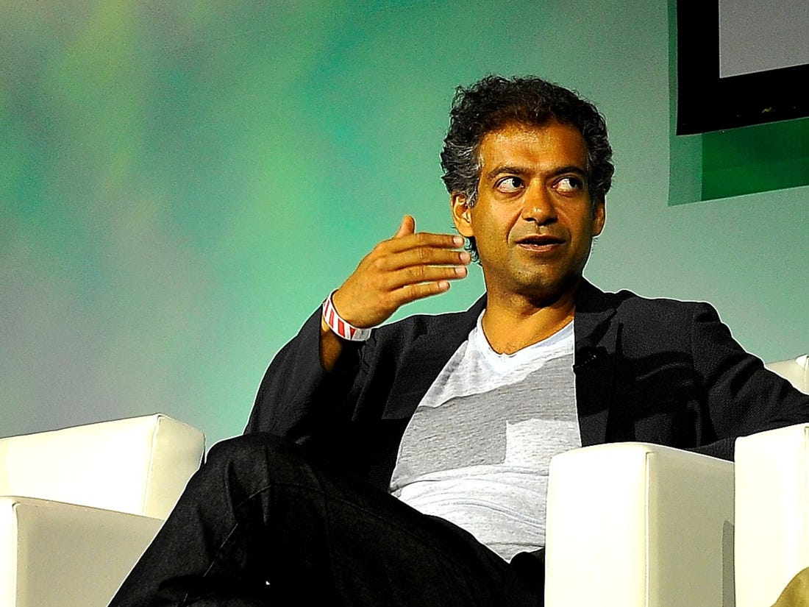
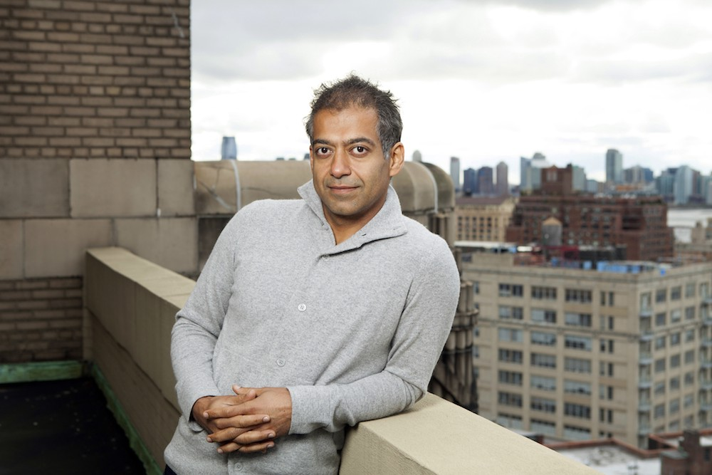

```
---
title: 내가 세상을 보는 관점을 심어준 사람
date: "2020-03-29T19:40:32.169Z"
description: 실리콘밸리의 소크라테스, 나발 라비칸트(Naval Ravikant)
ogimage: './naval_thumbnail.jpg'
tags: ["essay", "habit", "wealth", "happiness" "eddy"]
---
```


나발 라비칸트는 실리콘밸리의 핵인싸이자 오피니언 리더다. 엔젤리스트(Angelist)라는 성공한 스타트업을 창업했고, 우버나 트위터 등 유명 기업 초기투자자이기도 하다. 

나발에게는 팬이 무척 많다. 화려한 이력도 이력이지만, 그가 하는 말마다 정말 깊은 통찰이 담겨있기 때문이다. 말을 듣고 있으면 빨려들어가게 만드는 능력이 있다. 본질에 대해 다시 생각하게 만든다. 철학자라는 별명으로 자주 불리는 이유이기도 하다.

난 블록체인 관련 트윗으로 나발을 처음 알게 되었다. 그 트윗스톰도 블록체인의 본질을 꿰뚫고 있단 느낌을 받았다. 덕분에 '외계어 없이 이해하는 암호화폐' 쓸 때 도움을 많이 받았다. 

시작은 그랬는데, 이후 나발이 인생, 습관, 행복 개인의 성장에 대해 한 말들을 찾아보게 됐다. 거기서 더 큰 영감을 받았다. 에버노트에 여러번 메모해두곤 했다. 내가 세상을 보는 관점의 많은 부분은 나발의 말에 영향을 받았다.

특이하게도 나발은 트위터와 팟캐스트에만 나온다. 블로그나 책이 없다. 구어체 형태로만 말을 한다. 소크라테스 같은 느낌이랄까. 소크라테스의 말을 받아적는 플라톤의 마음으로, 그의 어록을 정리해봤다. 입말을 살리기 위해 의역과 편집이 많이 들어갔음을 밝혀둔다. 만약 영어가 편하다면, 반드시 원문을 듣거나 읽어 보길 추천한다.


[팟캐스트 파남 스트리트: 나발 라비칸트와 대화](https://fs.blog/knowledge-project/naval-ravikant/)

[나발 라비칸트의, 행운 없이 부를 얻는 법](https://nav.al/rich)

[블록체인은 네트워크를 시장으로 대체한다: 트윗스톰](https://medium.com/@mr_ed/naval-ravikants-blockchain-tweetstorm-a18a9a0ed08f)


```

```


## 1. 뭘 하는지보다 매일 하는지가 더 중요합니다

저는 책을 많이 읽습니다. 제가 이룬 물질적 성공, 지적인 역량은 다 독서에서 왔다고 생각합니다. 사람들은 무엇을 읽고, 얼마나 오래 읽는지를 물어보는데요. 사실 진짜 읽는 사람들은 1시간씩 안 읽어요. 고작 몇 분일수도 있습니다. 그 대신 매일 꾸준히 읽습니다.

운동이랑 비슷해요. 어떤 운동을 하는지는 그렇게 중요하지 않습니다. 웨이트 트레이닝을 하는 게 좋을까, 테니스를 하는 게 좋을까, 필라테스를 하는 게 좋을까... 이런 데 집착하는 사람들은 핵심을 놓칩니다.

뭘 하는지 보다 '매일 하는지'가 더 중요합니다. 독서도 매일 조금씩 하는 게 중요해요. 뭘 읽는지는 중요하지 않습니다. 시간이 지나면, 충분히 많이 읽을 거에요. 흥미가 가는 분야를 읽으면 됩니다. 당신이 재밌어하는 분야에서, 가장 좋은 책을 고르세요. 그리고 매일매일 읽으세요. 그게 당신의 삶을 완전히 바꿔놓을 겁니다. 


## 2. 쌓인 습관을 버릴 수 있어야 합니다

습관의 중요성을 말하는 거냐고요? 그럴 수도 있죠. 인간은 습관의 동물입니다. 살아가면서 습관이 꼭 필요하죠. 우리는 무의식적으로 습관을 만듭니다. 그 습관은 수십년을 갑니다. 그 습관은 켜켜이 쌓여 자신의 정체성, 자아가 되죠. 우린 그 정체성을 소중히 여깁니다. '난 셰인이야. 이게 내가 인생을 사는 방식이지'

우리가 인생을 대하는 태도, 일상적인 기분, 행복 수준, 우울 수준 다 어느 정도 습관의 영역입니다. 사람을 판단하는지, 어떻게 먹는지, 어떻게 움직이는지, 어떻게 운동하는지... 다 습관이죠. 잘 의식하지 못할 뿐.

> 자기 자신도 모르게 생겨버린 습관을 나와 분리해서 생각할 수 있어야 합니다. 

"자, 이건 내가 어릴 때, 엄마한테 관심받고 싶어서 생긴 습관이야. 나는 그걸 계속 강화하면서, 내 정체성의 일부로 받아들여버린 거지."

그 다음 묻습니다. "이 습관이 정말 나에게 도움이 되고 있나? 나를 행복하게 만들고 있나? 나를 건강하게 만들고 있나?" 저는 다른 사람보다 습관을 많이 만들려고 하지 않습니다. 다만 **내 습관을 의식하려고 노력하죠. 단순히 우연의 결과로 축적되도록 두지 않고요.**


```

```


## 3. 지금, 여기에 집중하는 마음 습관

요즘 가장 의식하고 있는 습관이요? 원숭이 마인드를 끄는 겁니다. 설명하기 어려운데, 이렇게 말해보죠. 

처음 태어난 아이들은 현재에 집중합니다. 내 주변 환경에 몰입하죠. 거기에 본능적으로 반응하면서 살아갑니다. 그러다 사춘기가 되면, 무언가를 원하게 되고, 그것을 성취하기 위한 장기 계획을 세우는 능력이 생겨요. 고민을 하고, 자아와 정체성을 쌓아나가죠.

정상입니다. 사람의 본성이죠. 하지만 이 생각은 어느 순간 통제를 벗어나기 시작합니다. 머릿속 대화가 멈추지 않는 거죠. 실제로 일어나지 않는 일에 대해서요.

여러분이 길거리를 걷고 있을 때, 옆에 같이 걷고 있는 사람들은 모두 자신의 머릿속에서 자신과 대화를 하고 있을 거에요. 내가 보는 것을 계속 판단하고, 예전에 있었던 일을 떠올립니다. 앞으로 있을 가상의 미래를 상상하죠. 즉, 우리가 있는 현실에서 빠져나와 있는 겁니다.

이 능력은 장기 계획, 문제 해결에는 좋은 능력입니다. **하지만 당신의 '행복' 관점에서 보면, 전혀 좋지 않은 습관입니다.** 마음이 생각의 하인, 도구가 되는 거에요. 내 생각에 끌려가는 겁니다.

통제하지 못하는 생각을 끄는 것. 물론 어렵습니다. "코끼리 생각을 하지마"라고 하면 코끼리가 바로 생각나잖아요. 저는 제가 제 생각에서 빠져나오게 해주는 활동, 경험을 꾸준히 하고 있어요.

사실 모든 사람은 이런 욕구를 어느 정도 갖고 있어요. 스릴러, 액션 영화를 보는 사람들. 스포츠에 빠지는 사람들. 몰입 상태나 오르가즘을 원하는 사람들. 다 결국엔 머릿속 생각을 끄고 빠져나오고 싶어하는 겁니다. 과잉발달한 자아에서 벗어나려는 노력이죠.

저는 제 자아가 커지는 걸 원하지 않습니다. 나이가 들수록 제 자아를 약하게, 더 조용하게 만들고 싶어요. 제가 지금, 여기에서 살 수 있도록요.


## 4. 행복은 모자람이 없다고 느끼는 것

행복이란 무엇인가. 정답이 없는 질문이네요. 사람마다 다 답이 다르겠죠. 어떤 사람은 몰입 상태(flow state)라고 할 거고. 어떤 사람은 만족감(feeling of contentment)라고 할 거에요. 제 대답도 계속 바뀝니다.

> 지금 전 행복이란 디폴트 상태(default state)라고 생각해요. 내 인생에서 무언가 모자라다(something is missing)는 느낌이 없는 상태를 말합니다. 

인간은 판단, 생존, 번식을 목적으로 설계되어 있어요. 살면서 '이게 필요해, 저게 필요해' 하면서 무언가 모자라고 무언가 필요하다는 욕망의 그물에 갇히죠.

제 기준에서 행복은 그런 게 없는 상태에요. **아무것도 모자람이 없는 상태죠.** 마음은 조용해집니다. 미래를 향해 달려가지도, 과거의 후회를 끄집어내지도 않습니다. 

사람들은 행복이란 긍정적 생각, 긍정적 행동이라고 생각합니다. 하지만 긍정적 생각은 기본적으로 부정 상태를 전제합니다. 내가 행복하다고 말하면, 어느 순간에는 내가 슬픈 거게요. 내가 매력적이라고 하면, 어떤 사람은 매력적이지 '않은' 거죠. 부정적인 것이 있어야만 긍정적인 것도 존재해요.

> 제게 행복은 긍정적 생각도, 부정적 생각도 아닙니다. 그냥 "욕망의 부재"죠. 욕망이 없을 수록 내 마음이 덜 흔들립니다. 내 마음이 지금, 여기에 있게 됩니다.

저는 '자신이 우주적 스케일에서 봤을 때 하등 중요할 게 없다'고 믿는 게 도움이 되는 것 같아요. 내가 세상에서 제일 중요한 존재라면, 뭔가 내 맘대로 되지 않는 것은 문제가 있는 거거든요. 

하지만 내가 하는 모든 일이 그냥 물에 글씨 쓰는 거나 다를 바 없다는 걸 인정하면, 기대가 없어집니다. 인생은 그냥 인생이에요. 행복과 불행이 없어지죠. 그럼 우리는 아이가 됩니다. 아이를 보면 보통 되게 행복하죠. 자기 주변의 환경과 순간에 몰입하기 때문이에요.


```

```


## 5. 부를 얻는 법: 특수 지식, 책임, 레버리지

부자가 되려면 1) 다른 사람들이 만들 줄 모르지만 사회가 원하는 것을 2) 확장가능한 형태로 주면 됩니다. 당신이 줄 수 있는 상품을 찾으세요. 그걸 어떻게 확장할 수 있는지 알아내세요.

> 특수 지식(Specific knowledge)과 책임(Accountability), 레버리지(Leverage)를 갖춰야 합니다.

'특수 지식'이란 자동화되거나 아웃소싱할 수 없는 능력입니다. 아주 기술적(technical)이거나, 아주 창의적(Creative)이죠. 특수 지식은 가르칠 수 없는 스킬입니다. 만약 사회가 당신에게 가르쳐줄 수 있는 스킬이라면, 그걸 배운 다른 사람에게 쉽게 대체될 수 있습니다. 하지만 특수 지식은 학교에서 배울 수 없습니다. 직접 하면서 배워야 하죠.

특수 지식은 자신의 호기심을 끝까지 추구할 때 찾을 수 있습니다. 자기에게 맞는 게 있습니다. 진짜 특수 지식은 당사자에게 마치 놀이처럼 느껴지죠.

부자가 되려면 레버리지가 필요합니다. **레버리지를 얻으려면 책임(Accountability)가 필요합니다.** 자기 이름을 걸고 무언가를 책임지십시오. 그래야만 누군가 나를 따르거나, 누군가 나에게 투자를 해줍니다.

> 우리는 공개적으로 실패하는 것을 두려워합니다. 하지만 대중들이 비판할 수 있고, 공개적으로 실패할 수 있는 사람은, 곧 거대한 힘을 가진 사람입니다. (People who can fail in public have a lot of power)

하는 모든 일에서 책임을 추구하세요. 마치 내가 하는 일의 지분을 가지는 것과 마찬가지입니다. 내가 책임을 지지 않으면 결과를 누릴 수도 없습니다. 정해진 보상만 받게 되죠. 스킨 인 더 게임이 필요합니다.

**레버리지에도 여러 종류가 있습니다.** 자본(Capital)과 노동(Labor)은 허락을 받아야 쓸 수 있는 레버리지입니다. 누군가 당신에게 줘야 하죠. 

노동은 남이 나를 위해 일해주는 겁니다. 가장 전통적이고, 가장 경쟁이 치열한 레버리지죠.  자본도 꽤 오래된 형태의 레버리지죠. 지난 몇 세기 동안 부자들은 자본 레버리지를 썼습니다. 

> 요즘 시대의 부자들은 코드(Code)와 미디어(Meida)라는 레버리지를 씁니다. 

코드와 미디어는 허락이 필요없는 레버리지입니다. 인터넷 이후 새로운 레버리지로 떠올랐습니다. 우리 뇌는 이런 새로운 레버리지를 잘 이해하지 못합니다. 자본과 노동을 과대평가하고, ("와 네 밑에서 50명이나 일한다고?") 코드와 미디어를 과소평가합니다. ("그깟 앱이 얼마나 벌겠어?") 

소프트웨어를 만드세요. 코딩을 못한다면, 블로그나 유튜브나 팟캐스트를 하세요. 그게 이 시대의 레버리지입니다.

