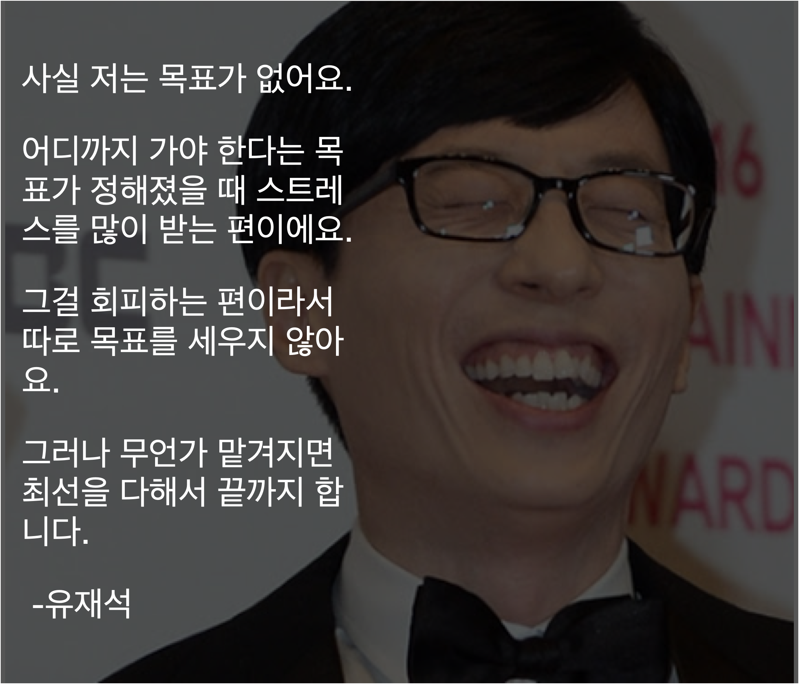

## 왜 사냐고 묻거든...

“이새야 너는 왜 사니?”

아버지가 물었다. 우리 아버지는 평생을 하나님께 헌신해온 뚝심 있는 목사님이다. 과거의 나였다면 주저 없이, 하나님의 영광을 세상에 드러내기 위해서라고 대답했을 것이다.

하지만 나의 대답은 많이 달라졌다.

“태어났으니까 살지 뭐.”

삶의 목적은 더는 나에게 중요한 일이 아니게 되었다. 나는 태어났으니까 산다. 사는 김에 행복하게 살고 싶다.

꿈을 꿔라. 가슴 뛰는 꿈을 가지고 그걸 이뤄나가야 한다. 생생하게 꿈꾸면 그대로 이루어진다……. 등등등 구체적인 목표를 가지고 성취해 나가는 삶이 정답인 것처럼 많은 사람이 이야기한다.

나도 그렇게 믿고 지난 26년 정도를 살아온 것 같다. 하나님의 영광, 세상을 바꾸는 투자자, 성공한 사업가 등 내가 미래에 되어야만 하는 상을 그려 놓고 그 상에 나를 맞춰 가려 했다.

지금은 내 인생이 어떻게 되어야만 한다고 생각하지 않는다. 뭔가를 해야만 하던지, 뭔가가 되어야만 한다는 생각은 나의 부족함에만 초점을 맞추게 한다. 인생은 하나의 여행인데, 여행이 아니라 경주로 만들어 버리기에 십상이다.

이 부족함을 원동력 삼아 열심히 사는 사람도 있다. 그러면서도 행복해하는 사람을 여럿 봤다. 하지만 나는 그런 사람이 아니다. 스트레스만 받고 더 열심히 살기 어렵다. 왠만하면 내 생각대로 안되는 게 인생이다. 부족함에 집중하고 살기에는 내 인생이 너무 소중하다. 어차피 다들 열심히 살다 죽을 인생이라면, 나는 하루하루를 행복한 여행으로 채우고 싶다.

## 열심히 사는 거랑 목표가 있는 거랑은 별 상관이 없더라.

어렸을 적 보았던 만화영화에서는 어려서부터 간직해 온 꿈을 위해 자신의 모든 것을 바치는 주인공을 멋지게 그려낸다. 루피는 해적왕이 되기 위해 몇십 년째 바다를 떠돌고 있고 그 과정에서 엄청난 성장을 했다. 나루토는 살을 깎는 노력을 거쳐 결국 호카게가 되었다. 꿈이 있기 때문에 이들은 엄청난 성장을 했다. 꿈이 없으면 이렇게 까지 못했을 것이라는 생각이 든다.

그래서 뚜렷한 목표가 없으면 열심히 살지 못하는 것이 아닐까 불안한 적도 있다. 나도 내가 그동안 열심히 살았던 것이 뚜렷한 꿈이 있기 때문이라고 생각하고 있었다. 그런데 꿈 없이 살아보니 웬걸, 그런 게 아니더라.

사업을 접은 이후부터는 원대한 목표를 가지고 살지 않았다. 개발이 좋아서 개발 공부를 했고 개발자가 되었다. 반드시 세계 최고의 개발자가 되어야 한다거나, 실리콘밸리에 가야만 한다고 생각하고 있지는 않다. 물론 그렇게 되면 좋겠지만, 지금 나는 그저 나의 책임인 일에 할 수 있는 모든 노력을 다하고, 실력을 높이기 위해 공부를 한다.

부족함에 집중하기보다는 내가 더 나아지고 있는 느낌에 집중한다. 이전에 못 하던 일들을 할 수 있게 되는 즐거움을 느끼려 열심히 한다. 이전보다 더 열심히 사는지는 모르겠지만 하나는 더 확실하다. 이전보다 더 행복하고 여유롭다. 예전에는 일이 마음대로 안 풀리면, 나 자신을 때리면서 "너는 병신이야"라며 욕을 하기도 했다. 지금은 한 번 더 하면 된다고 생각하고 넘어가는 마음의 여유가 있다. 내 인생 꽤 괜찮다고 생각한다.

## 그럼 어떻게 살지?

이제 나는 무엇이 되겠다는 목표를 가지기보다는 어떻게 살겠다는 생각으로 산다. 어떻게 살아야 내가 재미있고 행복한지, 장기적으로 별 탈이 없는지를 이제는 안다. 나란 인간은 어차피 고통스러우면 오래 못한다. 행복하게 꾸준히 하는 게 나 같은 인간에게 적합한 생존 전략이다.

주어진 기회에 감사하고 최선을 다해 노력하면서 살 거다. 개발을 잘하게 되는 일은 재미있으니까 계속 노력할거고 내 몸값을 올릴 기회가 있으면 적극적으로 도전할거다. 행복함을 잘 누릴 수 있도록 운동도 꾸준히 할거고 명상도 꾸준히 할거다. 내 행복을 해치지 않는 선에서 주변 사람들에게 내가 가진 것을 나눌 거다. 이렇게 살다가 좋은 기회가 오면 잡고 안좋은 일이 들이닥치면 최선을 다해 피하거나 이겨낼 거다.

이게 전부다. 나머지는 그때 그때 내 마음이 시키는대로, 진짜 나로서 살수 있는 선택을 하면서 살 생각이다. 인생 딱히 거창하게 살필요 있나 행복하게, 사회에 폐 안끼치면서 살면 된다고 생각한다.

인생이 어떻게 끝날지는 아무도 모른다. 목표를 이루는 것 뿐만 아니라 과정에서도 지속 가능한 행복을 누리는 편이 현명하다.
