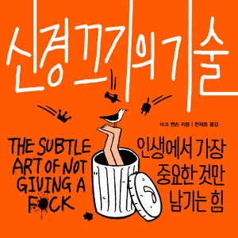

책 추천을 받았다. 제목은 '신경끄기의 기술'

요새는 하도 기술이 많다. 그래서 제목이 안끌렸다. 근데 [eddy](https://www.learningman.co/tags/eddy)가 극단적으로 찬양을 해서 그냥 한번 사봤다.

## 포기, 그리고 인생의 의미

얼마 안 읽었는데 내 뒤통수를 존x 세게 후리는 문장이 있었다. 

>'인생의 의미를 찾아 헤맨다면 결코 인생을 살아갈 수 없다.'

난 회사 망하고 직장 적응 실패했다. 그래서 요샌 왜 사나 맨날 생각한다. 삶의 의미 찾아 도덕경 읽고 라틴어 공부하려고 했다. 근데 나보고 인생의 의미 찾아 헤매면 인생을 살 수 없다고 말하네? 하...

이 의미는 책을 읽어야 전달받을 수 있다. 사실 나는 지금 독후감을 쓰는게 아니라 책 내용을 타이핑하고 싶다.

>'해피엔딩이란 동화에나 나오는거야'

>'행복으로 가는 길에는 똥 덩어리와 치욕이 널려있다'

>'우리가 삼키기를 꺼리는 알약은 다음과 같다. 우리는 이 세상에 궁극적인 행복이라는 것이 존재하며 우리가 그것을 얻을 수 있다고 믿고 싶어한다. 우리가 느끼는 모든 고통을 영구적으로 완화할 수 있다고, 성취감과 만족감으로 가득한 삶이 영원히 계속될 수 있다고 믿고 싶어한다. **그러나 이 모든 것은 현실과 거리가 멀다**'

이 책에 따르면, 모두가 위대한 사람이 될 수 있다는 명제는 헛소리다. 작가는 독자들을 좌절하게하고 포기하게 한다.

근데 사실 이때부터가 시작이다. 나는 작년에 살면서 가장 큰 자살충동을 느꼈다. 이는 요새 내 삶의 에너지를 가져다준 원천이다.

나는 요즘 제 2의 인생을 살고 있는 것 같다. 근데 이건 내가 포기하고 좌절했기 때문이다. 

나는 아주 특별해지고 싶었는데, 그게 실패했다. 그래서 죽고 싶었는데, 일단은 살아있다. 뭔가 좀 억울했거든. 나는 착하게 살았는데 왜 나한테 시련이 왔을까. 이 생각에서 벗어나지 못했다.

뭐 다양한 계기가 있었는데, 어찌됐는 나는 죽지 않는 것을 선택했다. 나를 죽이지 않는 모든 고통은 나를 강하게한다고 했던가.

그래서 그냥 나는 내가 병x이라는 걸 인정하기로 했다. 기존에 갖고 있던 삶의 목표에 최선을 다하되 너무 내 마음을 괴롭히지 않기로 했다. 아니, 삶의 목표를 재설정하기로 했다.

**그러니까 빠르게 좋아지더라.** 포기는 슬프지만 동시에 매력적인 선택지인 것 같다.

## 고통을 피하는 법과 좋은 가치들

이 책에 따르면 고통을 피하는 법이 없다. 삶은 고통이고 인간은 벗어날 수 없다. 불교의 사성제, 고집멸도 느낌? 

그래서 인간은 어차피 고통을 받는다. 어차피 고통을 받을거라면? 좀 더 좋은 가치를 추구하면서 사는게 낫다고 글쓴이는 말한다.

좋은 가치와 나쁜 가치의 구분법은 이렇다.

>좋은 가치는 1) 현실에 바탕을 두고 2) 사회에 이로우며 3) 직접 통제 가능하다.

>나쁜 가치는 1) 미신적이고 2) 사회에 해로우며 3) 직접 통제할 수 없다.

그래서 글쓴이는 정직, 혁신, 유연함, 자립, 후원, 자존감, 호기심, 너그러움, 겸손, 창조 등을 좋은 가치라고 말한다.

반면 속임수나 폭력에 의한 지배, 무분별한 섹스, 늘 즐기며 살기, 항상 주목받기, 혼자 있지 않기, 모두에게 사랑받기, 부자가 되기 위해 돈 벌기, 사이비 신을 위해 작은 동물을 제물로 바치기 등은 나쁜 가치로 분류된다.

**나는 사실 이 부분을 정말 감명깊게 읽었다.** 나는 좋은 가치와 나쁜 가치를 모두 추구하고 있는데, 좋은 가치는 가지고 있다보면 뿌듯하다. 나쁜 가치는 나를 자꾸 공허하게 만든다. 

## 자기 계발

저자는 이러한 가치를 기반으로 **책임감**을 갖고 살되, 끝없이 자신을 **의심**하며 자신이 좋은 방향성으로 나아가고 있는지를 물어보라고 한다. 또, **실패**를 받아들이고 **거절**을 두려워 말되, 언젠가 예정된 자신의 **죽음**을 숙고하며 살라고 말하고 있다.

마지막에 폼을 너무 잡는 책이기는 하다. 그러나 위에서 말한 책임감 / 의심 / 실패 / 거절 / 죽음에 대한 저자의 생각과 근거는 아주 단단한 작가의의 경험과 재미있는 소재들을 기반으로 한다. 

나 역시 영원과 소멸에 대한 많은 생각을 했었다. 영원 앞에서 인간은 작아진다. 그럼에도 불구하고 우리는 모두 내일 죽을 거라고 생각하지 않고 영원히 살 것처럼 살아간다. 근데 그러면 좀 힘들어지는 것 같다.

나는 솔직히 많은 일을 겪으면서 영원히 살고 싶다는 생각을 아주 강렬하게 했다. 하지만 일련의 사건들을 겪고, 영원히 살고 싶어하는 나를 받아들이되 너무 내 자신을 이 생각으로 괴롭히지 않기로 했다. 이 책은 나의 결론과 매우 유사한 인사이트를 제공해주어서 괜찮았던 것 같다.

만약 당신이 너무 많은 일들에 신경을 쓰고 있고, 넘치는 야망에 못이겨 무리한 일을 하다 지친 상태라면 이 책은 꽤 괜찮은 서포트를 제공할 것이다. 

이 책은 정말 숙독했다. 힘들 때 읽으면 좋은 책인 것 같다.