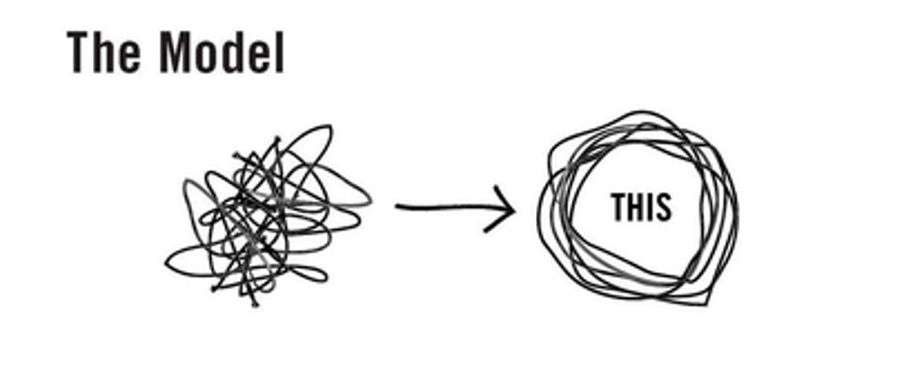
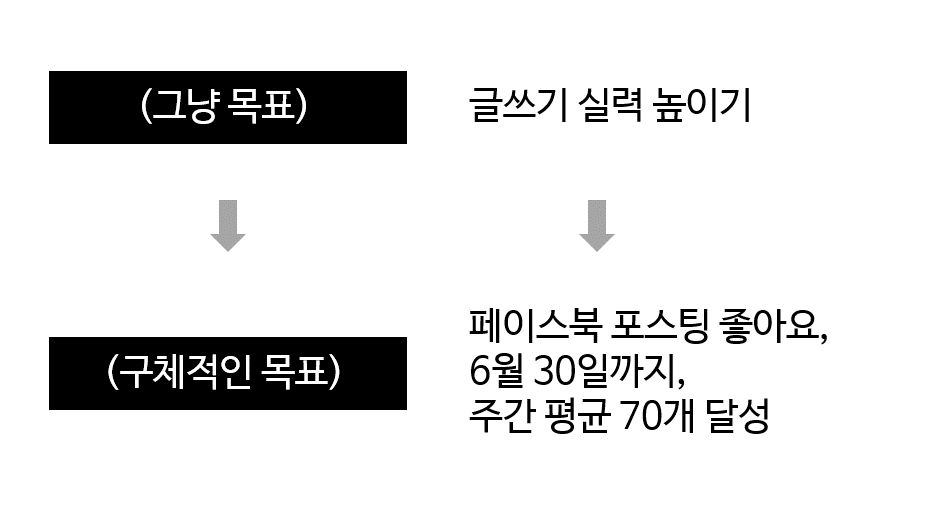

## 목표는 명확해야 한다

내 올해 목표는 '글쓰기 실력 높이기'다. 올해 내 고민은 '글을 잘 쓰려면 어떻게 해야할까?'였다. 그 고민이 러닝맨을 낳았다. 매일 프리라이팅, 인스타 1일1글 포스팅, 조회수 예측력 트레이닝 등 다양한 노력을 했다.

얼마 전 러닝맨 회고를 할 때였다. (우린 2주마다 각자 현황을 공유하고 피드백하는 회고를 한다) 나는 늘 그랬듯이 '2020년 목표 - 글쓰기'라고 써놓고, 내가 하고 있는 프로젝트를 쭉 설명했다. 이건 잘 진행되고 있고.. 이건 좀 더 준비가 필요하고.. 등등.

문득 '이게 정말 내 올해 목표를 달성하는 데 도움이 되는 일인가'하는 생각이 들었다. 벌써 4개가 넘는 프로젝트를 하고 있었다. 회사 업무도 있었다. 그런데도 나는 계속 글을 잘 쓰기 위해서 무언가 '더' 하려고 했다. 하지만 진짜 중요한 건 언제나 몇개 안된다. 정말 임팩트를 내려면 선택과 집중이 필요하다.

퍼뜩 정신이 들어, 고민을 해봤다. **흐릿한 목표가 2가지 문제를 일으키고 있었다.**

## 첫째, 선택과 집중이 흐트러졌다.

나는 여태 새해 목표를 항상 4-5개씩 잡았다. 하지만 올해는 달랐다. 올해 목표는 딱 하나로 잡았다. 그게 글쓰기였다. 선택과 집중을 해서 의미있는 결과를 내고 싶었기 때문이다.

하지만 2020년의 3분의 1이 지나가면서, 선택과 집중은 점점 약해졌다. ''글을 잘 쓴다'는 결과 범위가 상당히 넓었기 때문이다. 굉장히 다양한 해석을 불러일으키는 목표였다. 잡다하게 시도하기 시작했다. 관심사는 다시 넓게 퍼졌다. 투두리스트는 화려해졌다. 해볼까 고려하는 옵션도 너무 많아졌다.

이렇게 계속 간다면, 정말 올 한해 이것만 조졌다고 말하기 민망하다. 다시 선택과 집중해야 한다.

## 둘째, 측정이 안 된다.

여러가질 시도하는 건 좋다. 하지만 그 중 가장 효과있었던 시도를 골라내야 한다. 하지만 측정할 잣대가 없었다.

'글쓰기 실력'은 매우 추상적이고 수치화하기 어려운 목표였다. 내가 매일 글을 쓰고, 조회수 예측 트레이닝을 해서 1월 1일의 나보다 글을 더 잘 쓰게 되었나? 사실 알 길이 없다. 

목표로 삼을 구체적인 지표가 필요하다.

## 범위를 좁히고 기준을 잡는다

측정가능한 잣대를 포함하고, 내 글쓰기 실력과 관련이 있으며, 좀 더 구체적인 목표를 잡기로 했다. 고민 끝에 이렇게 결정했다.

**1) 왜 좋아요인가?** 

첫째, 객관적이다. 따봉은 남이 주는 거니까 주관적인 평가보다 더 좋은 지표다.

둘째, 비교적 정확하게 글 퀄리티를 반영한다. 공유나 댓글 수는 대부분 10개 이하다. 모수가 적어서 정확하게 퀄리티 반영하기에는 편차가 클 수 있다. 조회수와 비교해봐도 따봉이 좀 더 퀄리티와 연관성이 높다.

셋째, (당연하게도) 측정 가능하다.

**2) 왜 페이스북인가?**

좋아요를 측정할 플랫폼은 페이스북으로 정했다. 인스타그램과 비교해 텍스트 기반 콘텐츠를 유통하기에 더 좋다. 브런치나 독립 블로그와 비교해 도달 범위가 넓다. 아웃링크가 가능하니, 다른 매체에 올린 콘텐츠도 활용가능하다. 

개인 계정이라는 한계는 있다. 하지만 내가 구매 전환을 바라거나 마케팅 실력을 키우고 싶은 건 아니기 때문에 큰 문제는 없을 것 같다.

**3) 왜 주간 평균 70개인가?**

1주일은 개선 과정을 자주 측정할 수 있을만큼 짧다. 동시에 1주일에 2-3개 정도 포스팅이 올라가므로, 평균이 편차를 줄여준다. 한 포스팅이 갑자기 터졌다고 해서 글의 퀄리티가 그와 똑같이 올라갔다고 말하기는 어렵다. 이런 예외값이 보정된다.

2020년 4월 주간 평균 좋아요는 54개다. 나름 열심히 페북을 하면서 높아진 수치다. 8개월 전인 기자 생활을 처음 시작했을 때 좋아요 평균은 28개였다. 약 2배 상승한 거다.

타임라인은 6월 말로 정했다. 사실 연말로 하려했는데, 여자친구님이 더 빨리 잡으라고 했다. 2달간 54개에서 70개로 높이는 건, 충분히 해볼만하다 싶었다.

## 그래서 앞으로 계획은?

목표를 아주 더 구체화하고 보니, 해야할 일이 더 명확해졌다.

짧게 향후 할 일을 생각해봤다.

- 경험상 따봉이 가장 많이 찍히는 콘텐츠는 '내 이야기', '에세이'다. 주로 에세이 소재가 되는 프리라이팅과 1일1글 중요도를 높여야 한다.
- 기사 공유는 좋아요가 눈에 띄게 적다. 유료 기사이기도 하고, 딱딱한 어투라서 그럴 거다. 기사 공유는 빈도를 줄이거나, 개인적인 글로 포장해서 올려야 한다.
- 벤자민 프랭클린 따라잡기는 기사 소재 발굴 능력과 제목 짓기 역량을 키우는 프로젝트였다. 하지만 페이스북 포스팅과는 약간 거리가 있다. 프랭클린 프로젝트는 투입 시간을 줄여야겠다.
- 타인 글에 댓글, 좋아요 등 인터랙션을 늘려야 한다. 페이스북은 소셜 미디어이기 때문에 내가 반응해주는만큼 돌아오는 반응도 커진다.

앞으로 회고를 하면서, 평균 좋아요가 얼마나 늘었는지, 더 높이려면 어떻게 해야하는지, 어떤 시도가 의미있었는지 계속 점검해나가야겠다. 

명심할 것. 더 많은 일을 해서 잘하려고 하지 말자. 무엇을 줄이고 포기해서 본질에 집중할지부터 생각하자.
