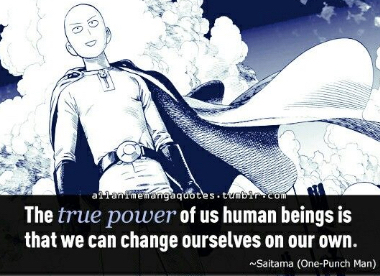
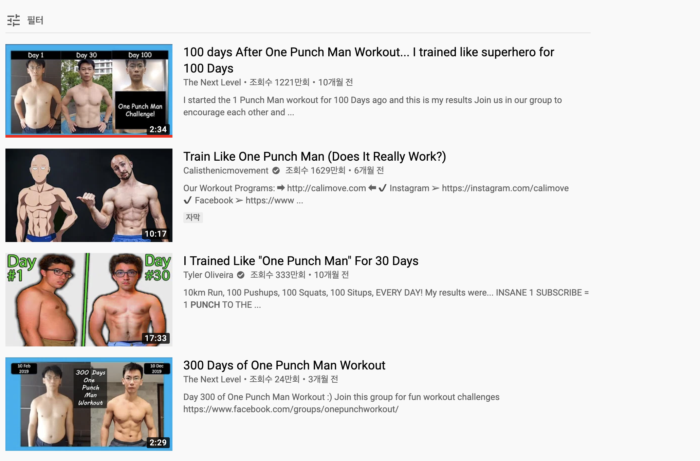

>인간은 스스로를 바꾸어 나갈수 있기에 강한 존재이다.

## 만화 캐릭터가 나를 운동하게 만들었다.

노력하는 주인공이 나오는 만화를 좋아하는 편이다. 노력의 결실로 정의로운 일들을 행하는 주인공을 보면, 현실의 답답함을 잊어 버릴수도 있고 지금 나의 노력이 헛되지 않을 것 이라는 희망을 가질 수 있기 때문이다. 

노력형 주인공 중에서 가장 인상 깊었던 캐릭터는 원펀맨의 주인공 사이타마다. 그가 강해진 방법이 다른 캐릭터들에 비해 매우 현실적이기 때문이다.

작중에서 누가 사이타마에게 강해진 비결을 물어보면 그는 이렇게 답한다.

**"아무리 괴로워도 난 3년만에 이렇게 강해졌다. 팔굽혀펴기 100회, 윗몸일으키기 100회, 스쿼트 100회, 그리고 달리기 10km!, 그걸 매일한다!"**

저 수련을 3년째 하루도 빼먹지 않고 한 결과 그는 설정상 누구보다도 강력한 파워를 가지게 되었다. 하루도 빼먹지 않고 매일 말이다. 

캐릭터의 매력에 빠져서 만화를 한참 보다보면, 나도 한번 저렇게 해볼까 하는 마음이 꿈틀거리기 시작한다. 궁금해서 찾아보니 많은 사람들이 이미 이 도전을 하고 있었다.

실제로 이 수련을 따래해본 사람들이 꽤 많았다. 사이타마라는 케릭터가 많은 사람들을 실제로 운동을 하게 만든 것이다. 

운동의 필요성을 느끼고 있었던 터라, 나도 나만의 원펀맨 첼린지를 해야겠다는 결심을 했다. 

## 하지만, 만화와 현실은 다르기에 조정이 필요하다.

만화를 좋아하지만, 세상은 만화같지 않다는 사실을 잘 알고 있다. 내가 저 수련을 그대로 따라하면 필시 여기저기 탈이나고 관절이 상할 것이다.지금 내 몸과 상황은 저 수련을 그대로 따라할 수 없다. 

사이타마에게서 배울 수 있는 것은 꾸준함에 대한 집착, 변할수 있다는 믿음이라고 생각한다. 저 수련 방식 자체가 의미가 있는 것이 아니라. 꾸준히 스스로를 단련했다는 것이 중요한 것이다. 

찾아보니 그대로 따라했을때 어떤 문제가 있는지 의사 선생님들이 설명해 주는 영상도 있다.

운동량은 점차적으로 늘려가야 하며, 관절에 무리가 느껴질 경우 운동의 강도를 낮춰야 한다. 그렇지 않으면, 근육이나 관절에 손상을 입을 수 있다. 그리고 윗몸일으키기는 척추에 부담을 주는 그리 좋지 못한 운동이다. 

그래서 나는 팔굽혀 펴기 50, 스쿼트 50, 바이시클 크런치 50회로 운동을 시작하기로 했다. 또한, 일주일에 하루는 운동을 안해도 되는 날을 둘 것이다. (러닝까지 하면 나의 의지력을 너무 많이 소모할 거 같아서 러닝은 제외 했다.) 그리고 매주 5회씩 점진적으로 매일 수행하는 개수를 증가 시킬 계획이다. 

## 동기부여 이후에는 규율이 필요하다. 동료를 이용하여 나를 강제하기로 해본다. 

어떤 일이던 마음을 먹은 뒤에는 그 일을 끝까지 해내기 위한 장치가 필요하다. 인간의 정신은 엔트로피의 법칙을 잘따르기 때문에 그냥 방치해 두면, 끝없는 혼란으로 치닫는다. 때문에 따를수밖에 없는 규율을 정하는 것이 필요하다. 

일단 매일 100개를 할수 있는 체력이 될때까지 첼린지를 계속해 보겠다. 현재 50개이니 10주 뒤에는 매일 100개를 할수 있게 될 것이다. 그리고 후기 글로 다시 찾아 오겠다.

또한, 매일 운동했다는 인증글을 러닝맨 카톡방에 올릴 것이다. 일주일에 2회 이상 내가 운동을 했다는 글을 올리지 않은 걸 나에게 제보하는 러닝맨 멤버에게는 1만원을 즉시 지급 하도록 하겠다.

**내 몸을 건강하게 만드는 것은 순수하게 노력으로만 할 수 있는 몇 안되는 일들 중 하나다. 이 기회에 더 건강한 신체를 가지게 되기를 희망한다.**

> 세상에 어떤 것도 제 마음대로 안돼요. 제 의지로 바꿀수 있는게 몸 밖에 없더라구요.   
-모델 한혜진

