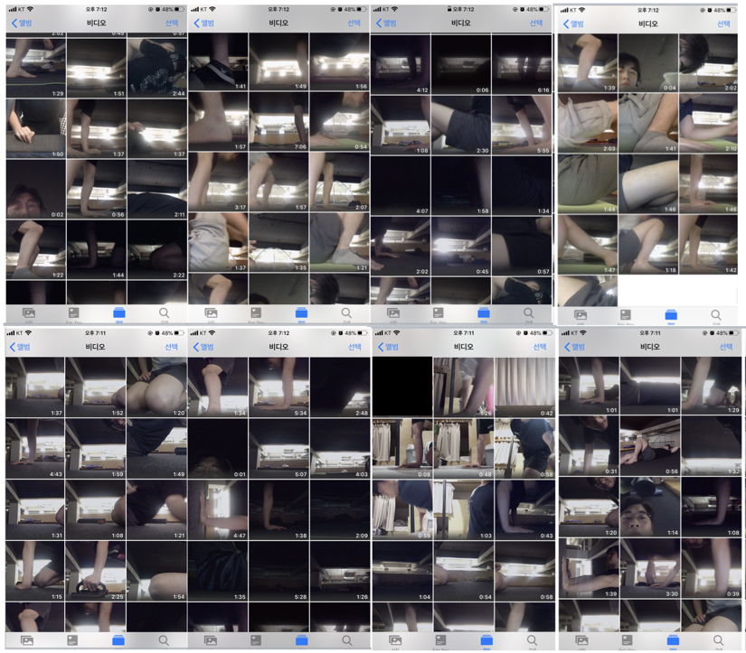

> 꾸준함은 물방울이 바위를 뚫는 것과 같다. 꾸준하면 언젠가는 반드시 된다.

## 결국 하루에 팔굽혀펴기 100개, 스쿼트 100개, 바이시클 크런치 100개를 하는 사람이 되었다
 
나는 유별나게 뛰어난 재능이 있는 것은 아니지만, 꾸준함으로 줄을 세우면 상위권에 들 자신은 있다. 빠르게 성취하지 못할 수 있다. 그래도 반드시 성취할 자신은 있다. 원펀맨 첼린지도 나의 꾸준함으로 성공적으로 마쳤다.

원펀맨 첼린지는 나에게 두 가지 의미가 있었다. **첫 번째는 운동으로 나의 체력을 증진 시키는 것, 두 번째는 나는 꾸준한 사람이라고 스스로에게 증명하는 것이다.**

첫번째 목표는 달성했다. 몸이 좋아졌고, 집중 할 수 있는 시간이 늘어난 것 같은 느낌이 든다. 처음에 50개를 힘들게 하던 내가 지금은 100개를 힘들게 하던 사람이 되었다.(사실 100개를 한번에 하는 건 아니고 50개, 20개, 20개, 10개 정도로 나누어서 한다) 어떻게 성공적으로 첼린지를 할 수 있었는지에 대한 분석은 이미 [이글](https://www.learningman.co/developstudyhabbit/)에 해 두었으니 오늘의 글에서는 생략하도록 하겠다.

두번째 목표는 꾸준히 한 운동이 육체뿐만 아니라 나의 장기적 인생에 도움이 되기를 바라며 붙인 의미다. 꾸준함이라는 능력은 인생의 어느 한 분야에 국한되지 않는다고 믿는다. 운동을 꾸준히 할 수 있는 사람이라면, 다른 것도 꾸준히 할 수 있다. 그게 바로 나다. 

단, 앞으로는 1주일에 4회로 운동 횟수를 줄이고자 한다. 솔직히 주 6회 매일 100개를 하는 것은 너무 힘들다. 내 에너지의 대부분은 개발하는데 사용하고 싶다. 그래도 운동은 해야 체력이 유지 될 거 같기에 1주일에 6일 하는 것에서 4일 하는 것으로 앞으로 축소 실시 하도록 하겠다.

아래의 사진은 내가 매일 러닝맨 멤버들에게 운동을 하고 인증한 동영상들을 모아 놓은 것이다.

## 개발도 꾸준히 하는 사람이 되고 싶다.

개발을 공부하면서 내가 천재가 아니라는 사실을 매일 깨닫는다. 복잡한 기술적 내용을 접하면 머리를 한대 얻어맞은 듯한 느낌이 든다. 여기서 물러나면 그 기술은 배울 수 없다. 반복해서 뜯어보고 다시 붙여보고 하면서 결국 이해해 내야 한다.

**이때 필요한 것은 꾸준히 하는 능력이다.** 하기 싫어도 한 번 더 뜯어보고 개발자의 의도를 파악해 보고 내 거로 만들어 보는 노력을 하는 것이다. 천재라면 그냥 보고 이해하고 즐기면 되지만 범인인 나로서는 꾸준히 하는 것밖에 이 난관을 헤쳐 나갈 도리가 없다.

남들이 쉽게 따라 하지 못할 정도로 꾸준히 하면, 그건 나만의 강점이 된다. 내가 하기 쉬운 정도로만 하는 건 남들이 쉽게 따라 할 수 있다. 나만의 강점이 될 수 없다. 힘이 들 정도로 꾸준히 해야 나만의 강점을 만들 수 있다. 누구나 할 수 있는 일을 아무나 못 하는 정도까지 꾸준하게 해내야 한다.

**내가 가진 자산은 딱 하나, 꾸준함이다.** 팔굽혀 펴기 한 개 더 하는 심정으로 개발을 하다 보면, 물방울이 바위를 뚫듯이 성장의 벽에 구멍을 낼 수 있을 것이다. 이 마음을 죽을 때 까지 유지하고 싶다. 

