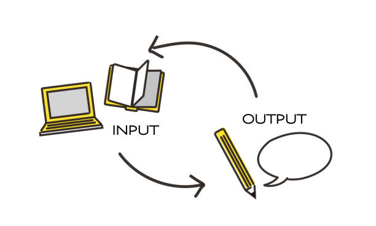
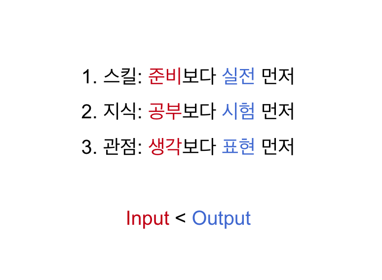
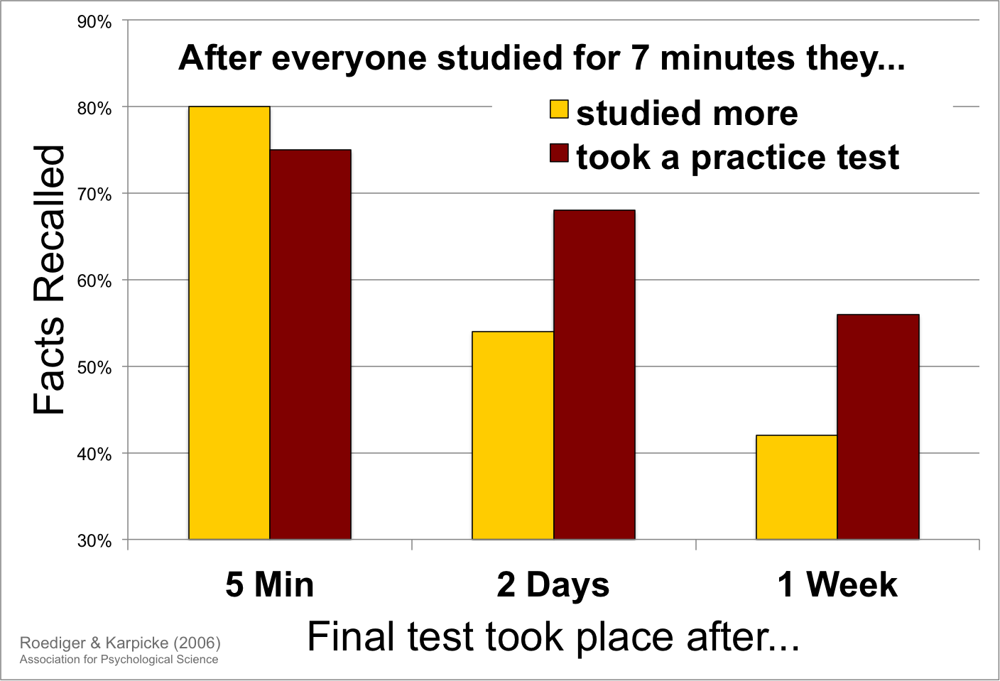
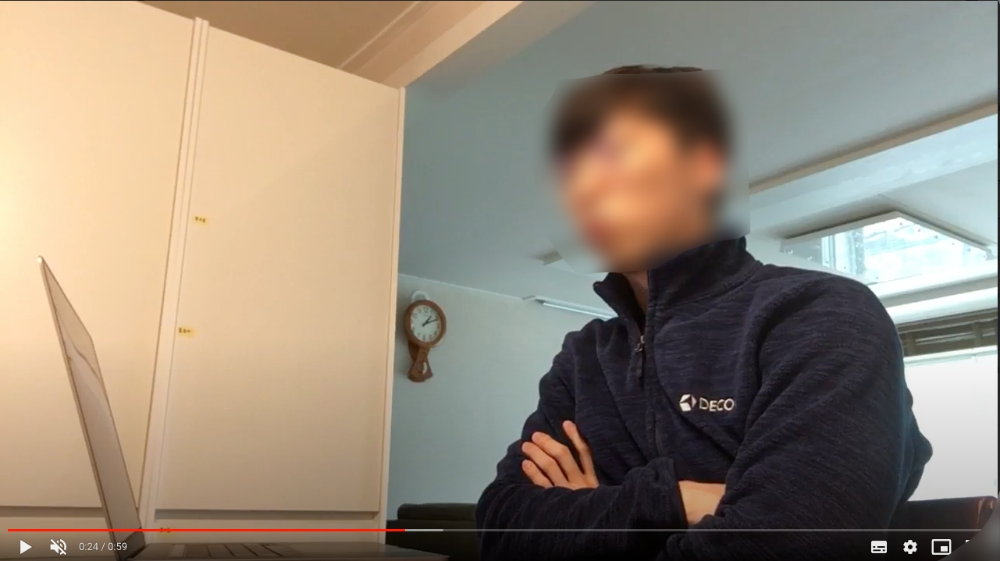

## 좋은 책이나 자료 좀 추천해주세요..?

가끔 이런 질문을 들을 때가 있다.

> 제가 IT업계 취직을 생각하고 있어요. 근데 관련 지식이 없어서... 업계 지식을 쌓기에 좋은 책이나 채널이 있을까요?

> 기획을 잘하고 싶어. 기획력을 키우는 데 도움이 됐던 책이나 자료가 있으면 추천해줘.

> 기사 쓴 걸 봤는데요, 어떻게 그렇게 많이 읽고 자신의 생각으로 소화하는지 궁금해요.

그때마다 나름 열심히 대답을 해주려고 노력한다. 이런 게 내용이 좋고, 이런 게 도움이 됐어요...

하지만 곰곰이 생각해보니, 가장 좋은 대답은 '질문을 바꾸는 것'이다.

> 빠르게 무언가 익히고 싶다면. 인풋이 아닌 아웃풋에 초점을 맞춰야 한다고 생각해요. 
> 그게 스킬을 습득하는 것이든, 지식을 쌓는 것이든, 나만의 관점을 만드는 것이든 말이죠. 

> 제 경험상 항상 아웃풋 중심의 노력을 해야 가장 효과가 좋더라고요.

> 어떻게 하면 좋은 인풋을 더 많이 넣을 수 있을까? 질문하지 말고,
> 어떻게 하면 좋은 아웃풋을 더 많이 꺼낼 수 있을까?를 생각해보면 어떨까요?

## 인풋을 먼저 찾는 사람들

사람들은 성장하고 싶은 욕구가 있다. 

그럴 때 본능적으로 '인풋'을 늘리려는 경향이 있다.  

사람들은 더 잘하기 위해서 더 많이 읽고 보고 들으려고 한다. 

좋은 노하우, 좋은 지식, 좋은 인사이트, 좋은 사례를 계속 찾는다.

**좋은 인풋을 많이 넣으면 아웃풋이 나온다**는 생각이다.

사실 나도 똑같다. 나도 상당히 성장 욕구가 강한 사람이고, 무척이나 인풋에 집착하는 사람이다.

특히나 나는 서점에 가서 책 쇼핑하는 걸 사랑하고, 별 일이 없을 때도 코세라나 유데미에 가서 강좌를 둘러보는 걸 좋아한다. 좋은 지식콘텐츠가 있다면 무조건 찾아가서 구독한다. 뭔가를 배우고 싶은 열망 때문이다. 

하지만 그런 경험을 통해 깨달았다. 진짜 빨리 배우고 싶다면 인풋이 아니라 아웃풋에 더 신경을 써야한다.

누군가는 생각할 것이다. 

>  인풋이 있어야 아웃풋이 나오는 거 아니야? 
>
> 아무것도 모르는데 어떻게 아웃풋을 내? 

물론 틀린 말은 아니다. 

**하지만 아웃풋을 뽑기 위해서 보고 듣고 읽는 것 (아웃풋 중심)과** 
**인풋을 넣으면 저절로 아웃풋이 나올 거라 여기는 것 (인풋 중심)은 완전히 다르다.**

자신이 무언가를 배웠을 때를 떠올려보자. 

우리는 보통 인풋 기반의 노력을 선호하고, 아웃풋 기반의 노력을 훨씬 적게 한다. 

직접 하면서 배워야 빠르다. 아는 걸 말로 설명해봐야 더 오래간다... 대부분 알고는 있다. 
그러나 잘 실천하지 않는다. 왜냐하면 아웃풋 기반의 노력은 상대적으로 불편하고 두렵기 때문이다. 

# 인풋 중심의 노력 vs 아웃풋 중심의 노력

다시 처음 나왔던 질문으로 돌아가자. 

> 제가 IT업계 취직을 생각하고 있어요. 근데 관련 지식이 없어서... 업계 지식을 쌓기에 좋은 책이나 채널이 있을까요?

여기서 질문한 사람은 **인풋 중심 노력**을 생각했다. 

- IT업계 소식을 알려주는 좋은 책이나 뉴스레터를 찾아 읽는 것. 

하지만 나는 그것보다 **아웃풋 중심 노력**을 추천한다. 

- 매일 IT업계 뉴스를 본인이 정리해서 올리는 SNS계정을 만드는 것. 

아웃풋을 내는 것을 강제 목표로 잡는다. 그러면 인풋은 자연스럽게 될 수 밖에 없다. 
하지만 그냥 읽는 것과, 아웃풋을 준비하기 위해 책과 뉴스를 읽는 것은 효율이 완전히 다르다. 

사진을 잘 찍고 싶다면, 사진 찍는 법 포스팅을 볼게 아니라,  내가 찍은 사진을 매일 올리는 인스타그램 계정을 만들거나 자기 사진으로 1달 뒤에 전시회를 열겠다고 공표하면 된다.

# 3가지 영역의 인풋과 아웃풋

아웃풋이라는 말이 상당히 추상적일 수 있다. 그래서 구체화해봤다. '아웃풋 중심'을 스킬/지식/관점으로 나눴다.

**준비, 읽기, 생각**은 인풋의 관점이고,
**실전, 시험, 표현**은 아웃풋의 관점이다.

우리는 배울 때 왼쪽의 단어들을 더 선호하지만, 
의도적으로 오른쪽 단어에 집중할 수록 더 얻는 게 많다.

하나씩 더 자세히 얘기해보자.

# 1. 스킬: 준비보다 실전 먼저

스킬에서 아웃풋은 '실전'이다. 

우리가 스킬을 익힐 때 **쉽게 빠지는 함정**이 있다. 

외국인과 영어로 대화하고 싶어하지만, 실제로 대화를 하기보다, 미드를 보거나, 학원을 가거나, 앱으로 퀴즈를 푼다. 

말을 잘 하고 싶어하지만, 실제로 많은 사람 앞에서 말을 하기보다는, 말하는 법에 대한 책을 읽고, 유튜브 영상을 본다. 

일을 잘하고 싶어하지만, 일단 그 분야에서 일해보기보단 관련 자격증 시험을 준비한다. 

왜냐하면 **실전에 나가기 전에,** **우리의 실력을 ‘준비’시켜야 한다**고 생각하기 때문이다. 

책, 강좌, 앱은 큰 위험부담 없이 내가 ‘잘 배우고 있다’는 느낌을 준다. 갑자기 실전에 뛰어드는 것보다 훨씬 편하다. 실전엔 '준비가 된 후에' 나가면 되겠지?

준비를 하는 것이 나쁘단 말은 아니다. 

그러나 마음에 손을 얹고 생각해보자. 

**실전을 회피하기 위해 ‘준비’에 집중한 적이 있지 않았던가?**

### 첫날부터 실전

효과적으로 학습하는 사람들은 항상 ‘실전부터 하라’고 강조한다. 일단 실전에서 부딪쳐보고 거기서부터 익혀야 진짜 스킬을 내것으로 만들 수 있다는 것이다. 'Learn by Doing'. 아웃풋 중심의 노력이다.

'3개월마다 한 언어 마스터하기' 프로젝트를 하는 베니 루이스라는 사람이 있다. 

베니가 말하는 언어 학습 원칙은 **‘첫날부터 실전’**이다. 

**공부하지 말고 일단 실전부터 하라고.** 책 보고 공부 -> 강의 듣기 -> 문제 풀기 -> 다 준비되면 가서 대화. 이런 식으로 하지 말라고 한다. 베니는 무조건 첫날부터 원어민한테 말을 건다.

이건 어떤 스킬이든 거의 다 적용되는 것 같다. 글을 잘 쓰고 싶으면 글쓰기 책을 읽는 것보단, 일단 글을 써야 한다. 사업을 잘 하고 싶으면 일단 창업을 해야한다. 비즈니스 영어를 잘하고 싶으면, 실제 일에서 영어를 써봐야 한다.

우리는 일단 지식을 머릿속에 넣고, 그걸 열심히 연습한 다음, 실전에 가는 게 학습이라고 어릴 때부터 배웠다. 

하지만 사실 반대가 더 맞을지 모른다. **실전에서 굴러보고 돌아온 다음, 부족한 부분을 연습하고, 필요한 지식을 찾아 머리에 넣는 것이다.**

### 준비보다 실전 먼저: HOW-TO 팁

1. **프로젝트 기반 학습.** 

무언가 배울 때 강좌나 책을 떼는 것을 목표로 하지 말자. 대신 나만의 프로젝트를 만들자. 직접 게임을 만들어보면서 프로그래밍을 배우는 게 좋은 예시다. 

이때 프로젝트는 [자신에게 지금 가장 필요하고 유용한 것을 하는 것이 좋다.](http://egloos.zum.com/agile/v/2807583)

2. **시뮬레이션 만들기.** 

어떤 경우엔 진짜 실전처럼 해보는 게 매우 어려울 수 있다. 그럴 때는 특정 부분만 떼내 비슷한 상황을 만들어 연습을 할 수도 있다. 

나의 예를 들어보자면, 나는 조회수가 잘 나오는 기사를 예측하고 싶었다. 하지만 매번 새로운 기사를 써서 예측 연습을 하기에는 시간이 너무 오래 걸렸다. 그래서 과거 데이터를 가지고, 시뮬레이션을 만들었다. 제목과 썸네일을 보고 [조회수를 맞춰보면서 연습을 했다.](https://www.learningman.co/practicereview/)

3. **자발적 책임 만들기.** 

어학연수가 언어 학습에 효과적인 이유가 뭔지 아는가? 실전을 '안 할 수가 없기 때문'이다. 

강제로 실전을 해내야만 하는 환경에 자신을 던져넣으면 빠르게 배울 수 있다. 앞서 예를 들었듯이 사진을 배우고 싶다면, 일단 전시회를 열겠다고 발표하자. 책을 쓰고 싶다면 일단 출판계약을 해버리자. 

[자발적 책임 전략은 조니 해리스에게서 가져왔다.]( https://brunch.co.kr/@bumgeunsong/105) 

# 2. 지식: 공부보다 시험 먼저

두 번째, '지식'에서 아웃풋은 '시험'이다.  음.. 적당한 단어가 없어서 시험을 썼는데. 꼭 공식적인 시험을 치라는 얘기는 아니다. 

**핵심은 떠올리기(Recall)다.** 배운 지식을 시험(테스트)을 통해 계속 꺼내서 리마인드한다는 의미다.

심리학자 제프리 카피크와 저넬 블런트의 연구를 보자. 특정 지식에 대해 시험을 보겠다고 한 다음, 각각 다른 방법으로 시험을 준비하게 했다.

---

1그룹. 교과서 한번 다시 읽기

2그룹. 교과서 여러 번 다시 읽기

3그룹. 자유 회상 (책을 덮고 그 안의 내용을 떠올리려고 애쓰는 것)

4그룹. 개념도 작성 (주요 개념을 적고 개념 사이 관계를 구조화)

---

각 학생에게 자신이 시험 점수를 잘 받을 것 같냐고 물어봤다. 

2번 그룹(여러 번 복습)이 **가장 자신감** **있었고**, 

1번 그룹(한번 복습)과 4번 그룹(개념도)이 **중간이었다.** 

3번 그룹(자유 회상)은 **가장 자신감이 낮았다.**

<u>**하지만 실제 결과는, 자유 회상이 가장 높았다.**</u> 다른 그룹보다 50% 이상 많은 것을 장기 기억했다.

(어떤 그룹에도 맞았는지 틀렸는지에 대한 피드백은 전혀 없었다. 피드백의 효과는 논외라는 뜻)

이 실험은 뭔가를 떠올려서 뽑아내는 것 자체가, 더 잘 기억하게 도와주는 현상을 증명한다. 머릿속에서 정보와 개념을 불러오려고 노력한 만큼, 장기 기억에 훨씬 더 잘 남는다.

이걸 **시험 효과(Testing effect)**라고 한다.

사전에 시험을 치면 기억 속에서 알고 있는 **내용을 떠올리려고 노력(Retrieval)을 한다. 이 행동이 학습효과를 올려준다.** (이외에도 시험 효과를 뒷받침하는 연구가 매우 많다. 학계에서는 정설로 받아들여진다. 자세한 내용은 ['어떻게 학습할 것인가'라는 책](https://www.aladin.co.kr/shop/wproduct.aspx?ItemId=49588358)을 참고)

문제는 이 방법이 ‘느낌적으로는’ 가장 안 좋게 느껴진다는 것이다. 사람은 학습 과제가 쉽게 느껴지면 뭔가를 배웠다고 느낀다. 고통스럽게 느껴지면 아직 배우지 못했다고 느낀다. 근데 잘 모르는 상태에서 뭔가를 떠올리려고 하면 고통스럽다.  

우리는 읽으면서 복습하는 걸 더 좋아한다. 충분히 습득한 다음에야, 배운 내용을 뽑아낼 수 있는 ‘준비’가 된다고 생각한다.

하지만 준비가 되었든 아니든, 뽑아내는 행위 자체가 학습과 기억을 강화한다.

그러니 지식을 쌓고 싶다면, 무언가를 계속 읽고 들으면서 머릿속에 넣으려 하는 것보다, 우선 알고 있는 지식을 자꾸 다시 되살려보고 떠올려볼 필요가 있다.

### 공부보다 시험 먼저: HOW-TO 팁

1. **플래시 카드와 SRS (Spaced Reptition Software).** 

플래시 카드란 우리가 흔히 아는 낱말 카드를 말한다. 앞면에 ‘Apple’, 뒷면에 ‘사과’라고 쓰여 있는 식이다. 배운 것을 복습하기 위한 용도로 많이 쓰인다. 

특히 적절한 간격으로 계속 플래시 카드 복습을 반복해서 떠올리면 장기기억에 매우 효과적이다. 이런 방법을 '액티브 리콜'이라고 한다. 액티브 리콜을 도와주는 앱이 SRS. 의대생, 법대생 등 공부량이 많은 대학생 사이에서는 유명한 방법. ([참고 글](https://brunch.co.kr/@jade/106))

2. **자유 회상.** 

[백지 복습법](https://www.learningman.co/algorithmstudychallenge/)이라고도 한다. 책을 읽거나 강의를 듣는다. 그다음 그걸 보지 않고 빈 종이에 기억나는 것을 모조리 적는다. 해보면 생각보다 괴롭다. 이렇게나 기억이 나는 게 없다니? 

그래도 일단 내가 기억하는 사실들을 모두 적어보면, 어떤 부분에 구멍이 뚫려있는지 알 수 있다. 무엇보다 그렇게 떠올려보는 것만으로도 책 내용, 강의 내용이 더 기억에 잘 남는다.

3. **질문 생각하고 읽기.** 

새 지식을 읽거나 볼 때, 내가 이걸 통해서 대답하고자 하는 질문을 먼저 떠올려본다. 물론 아직 내용은 모르는 상태다. 

하지만 일단은 머리를 굴려서 내용을 예측해본다. 얻고 싶은 답을 꺼내 본다. 그다음 내용을 읽거나 본다. 훨씬 더 흡수가 잘 된다.

# 3. 관점: 생각보다 표현 먼저

세 번째, 관점에서 아웃풋은 '표현'이다. 

단순히 '지식'을 쌓거나 '스킬'을 익히는 것이 아니라, 무언가를 기획하고 창조해야 할 때가 있다. 그럴 때 나는 곰곰이 생각하는 방식보다 **일단 말이나 글로 표현하는 방법을 선호한다.**

생각이 없어도 표현을 먼저 하다 보면 생각이 정리된다. 자신의 관점이 생긴다.

지금 이 글의 내용을 만들 때도 이 방법을 썼다. 처음엔 그저 ‘내가 알고 있는 학습법’에 대해서 쓰겠다는 생각만 있었다.

그러자 자연스럽게 인풋을 넣고 싶은 충동이 올라왔다. 학습법에 대한 책을 찾아볼까? 예전에 봤던 포스팅을 다시 찾아볼까? 유튜브 영상을 찾아볼까? 

내 머릿속에는 정리 안 된 생각들만 둥둥 떠다니고 있었다. 뭔가 이미 정리된 인풋을 넣고 싶다. 그러면 더 빠를 것만 같다.

하지만 경험상 **그런 상태라도 일단 표현을 시작해야 한다. 설익은 생각들을 어떻게든 꺼내어본다.** 한바탕 꺼내놓고 나니 뭔가 그림이 보이는 것도 같았다. 하지만 아직 감이 오지 않는다.

지인을 한 명 붙잡아 양해를 구했다. 잠깐만 들어봐달라고 하면서. 내가 쏟아낸 내용에 대해서 최대한 이 사람이 이해할 수 있게 설명해봤다.

이해가 안 되는 부분은 질문해달라고 했다. 내가 설명하는 모습을 영상으로 찍었다.

> 노트북 놓고 앞에 있는 사람에게 설명하는 중...

말을 하다 보니 나 스스로 정리가 됐다. 상대방이 어떤 부분을 헷갈리는지도 알았다.

다시 컴퓨터로 돌아와서 목차를 짰다. 아웃풋의 영역을 구체화해서, 3가지 (지식, 스킬, 관점)이라는 챕터를 만들어냈다.

우리는 생각을 잘 정리한 후에 전달하는 것이 맞다고 생각한다. 하지만 아니다. **‘뭐라도 전달하려고 노력’하다가 생각이 정리된다.** 자신만의 관점이 생긴다. 

창의적인 기획/생각을 하고 싶다면, 골똘히 생각하지 말고. 일단 설익은 표현을 먼저 하자.

### **생각보다 표현 먼저: HOW-TO 팁**

1. **콘텐츠 요약, 리뷰 쓰기** 

표현에 익숙하지 않은 사람들이 가장 쉽게 연습하는 방법이다. 책, 영화, 음악 등 자신이 보거나 들은 콘텐츠가 있다면, 거기에 대해 짧게라도 리뷰를 남긴다. 

혹은 뉴스나 책의 내용을 요약하는 것도 좋다. 감상할 때 떠오르지 않은 새로운 관점이, 리뷰를 쓰다 보면 갑자기 퐁퐁 올라오는 경험을 할 수 있다.

2. **다른 사람에게 설명하기** 

자신이 알고 싶은 내용. 기획하고 싶은 무언가가 있다면 일단 다른 사람에게 설명해보자. 내 머릿속에서 굴리기보다 맥락이나 배경지식이 없는 상대방에게 이해시키려고 노력하다 보면 훨씬 더 깔끔한 관점이 나오는 경우가 많다. 가르치는 사람이 제일 많이 배운다.

3. **프리라이팅**

[시간이나 양을 정해놓고, 아무런 비판없이 자유롭게 써보자.]() 머릿속이 잘 정리가 되어있지 않다하더리도 이해하고 있는 지식, 관련 생각들을 쏟아놓다 보면 또 다른 관점과 표현으로 연결이 된다. 여기서 핵심은, 쓰면서 내용을 판단하지 않는 것.

