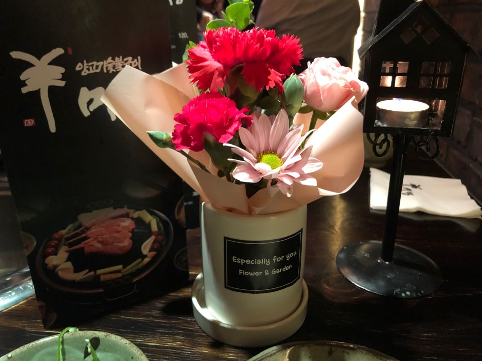

이번 어버이날, 비싼 식당을 예약했다. 부모님께 맛있는 식사를 대접했다. 생화 카네이션 화분을 하나 사놓고 부모님을 기다리고 있자니, 내가 다 기분이 좋았다. 

금요일이었고 비가 왔다. 엄빠는 차가 막히셔서 아주 늦게 도착하셨지만, 화는 나지 않았다. 밥 먹는 도중 말씀드렸다. "낳아주셔서 감사합니다." 아버지가 껄껄 웃으셨다. 어머니는 빙그레 미소 지으셨다.

나는 요새 돈미새(돈에 미친 새X)다. 근데 한 끼치고 비쌌던 양고기 저녁 값을 결제하곤 이런 생각이 들었다

>'내가 최근 한 지출 중에서 가장 잘 쓴 돈이다'

## 부모님 마음

사춘기 때는 이유없이 부모님이 엄청 싫었던 적도 있다. 요새도 때때로, 아무런 이유 없이 부모님의 관심이 짜증나기도 한다.

다만 몇 년 전부터는 부모님이 존경스럽다. 그 많은 역경과 고난을 이겨내시고 나같은 녀석을 키워내신게 대단하고 생각한다.

재수하던 시절, 할 수 있다고 등을 두드려주시던 손길. 창업한다고 촐랑거리는 나에게 걱정 반과 기대 반을 담아 하시던 말씀들. 직장 생활이 힘들어 주말마다 집에 박혀서 잠이 들면 안쓰럽게 쳐다보시던 눈길.

우울하고 행복하던 삶의 모든 순간들에는 부모님이 항상 뒤에 계셨다.

그 중에서도 내게 가장 강렬한 기억으로 남았던 순간이 두 개 있다. 

초등학교 5학년 때, 교회를 한참 열심히 다니던 시절이었다. 원주에 있는 큰 교회에서 다른 동갑내기 아이들과 함께, 성경에 관한 지식을 평가하는 시험을 봤다. 꽤 큰 시험이라 아주 많은 아이들과 경쟁해야 했었다.

운이 좋게도, 좋은 성적을 받았다. 시상식이 있었고 내 이름이 호명되자, 어머니는 '호우~'라는 하이톤의 고성(그거 아님)을 지르시며 조금 세게 내 등을 미셨다. 빨리 나가서 상을 받아오라는 극적인 표현이었다. 벌써 18년이 지난 일인데 아직도 어제 일처럼 생생하다. 

반면 아주 어두운 기억도 있다. 작년에 부모님은 나를 식탁에 앉혀놓고 말씀하셨다. 

>"아들, 아빠랑 엄마는 요새가 인생에서 제일 힘들다."

사업할 때는 걱정될 정도로 신이 나있던 아들이, 죽고싶다는 말을 주문처럼 외고 있으니 어련하셨을까. 나는 어느 순간부터 그런 말을 부모님 앞에서 내뱉기가 민망해서 그냥 죄송하다는 말로 대체했었던 것 같다. 

죄송하다는 말씀을 드릴 때마다 어머니는 자애로운 미소로 괜찮다고, 뭐가 미안하냐고 말씀하셨다. 평소 '니놈이 연애는 무슨 연애냐'며 그 시간에 공부나 더 열심히 하라시던, 표현이 조금 서투르신 아버지는 여자친구를 사귀어보는게 어떻겠냐는 말씀을 하셨다.

부모님의 인생에 가장 힘든 시기를 만든 것은 나였다. 나는 그 식탁에서 "엄마, 아빠, 저도 지금 제 인생에서 제일 힘들어요."라고 대답했지만 지금 생각하면 참 철없고 바보같고 그렇다.

뭐 여튼, 사업 실패와 직장 적응 실패 이후 삶의 의욕을 잃은 상황에서도 부모님은 나의 든든한 버팀목이 되어주셨다. 그래서 지금 이렇게 회복해서 러닝맨도 할 수 있다. 우리 엄빠 대단하신 것 같다.

**나라면 못했을 것 같다.** 진짜다. 그래서 부모님이 존경스럽다. 나같은 아들놈이 있었으면 얼마나 골치가 아플까. 앞으로 효도 좀 해야겠다. 

## 부모님 마음 갖기

이 글을 쓰기 위해서 부모님의 마음에 대해 생각해보았다. 부모님 마음은 **무한한 책임감**인 것 같다.

우리는 살아가면서 가정, 회사, 학교 등지에서 일정한 책임을 가지고 산다. 이 과정에서 평균보다 높은 책임 의식을 가지고 있는 사람들은 주변 사람들의 신뢰와 사랑을 받는다. 또 책임의식이 큰 만큼 성장도 더 빠르게, 많이 하는 것 같다. 

책임감은 맡은 책임에 대해 노력하게 만든다. 노력을 많이 하면 좋은 결과가 나올 확률이 높다. 그게 보고서를 쓰는 일이든, 우울한 아들을 위로해주는 일이든, 혹은 사업을 하는 일이든 말이다. 높은 책임감 - 많은 노력 - 큰 성장/성과. 이렇게 이어지는 것 같다.

책임감을 더 가지고 살아야겠다. 대충 대충 하고 넘기려는 자세를 항상 조심해야한다. 내가 맡은 일에 어떤 일이 일어나도 모두 나의 책임이라는 생각으로 임해야한다. 회사에서 보고서 쓸 때 대충대충 하지말자.

최근에 읽은 '신경끄기의 기술'이라는 꽤 괜찮은 책에, 책임감에 대한, 와닿는 구절이 있었다.

>"삶에 더 큰 책임감을 가질수록, 삶에 더 큰 영향력을 행사할 수 있다."

나는 내 삶에 큰 영향력을 행사하고 싶다. 책임감은 중요하다.

## 부모님 마음과 사업

사업을 할 때도 경험많은 선배들은 책임감에 대한 이야기들을 해줬었다. '비가 와도 눈이 와도 모두 나의 책임이라는 생각으로 일해야 한다.' 뭐 이런 식이었다.

최근 아주 좋은 조건에 인수된 어떤 AI 스타트업은 대표이사의 딸 이름을 써서 회사 이름을 지었다. 어떤 스타트업 대표들은 사업이 아이키우기 같다고 말하기도 한다.

이건 모두 결국 책임감의 이야기로 귀결되는 것 같다. 아이를 키우는 마음으로 모든 일에 임하면 큰 책임감을 갖고 일하게 될 것 같다.

다만 주의해야할 점이 있다. 큰 책임감을 갖는 것은 좋지만 결과가 나쁠 경우 너무 심하게 자신을 책망하는 것은 좋지 않다. 아니 나의 경우 정말 좋지 않았다. 

피드백 방식과 책임감은 전혀 다른 문제이다. 나쁜 결과에 대해서는 분명한 피드백이 필요하지만, 몸과 마음이 버틸 수 있을 정도로만 반성의 시간을 갖는 것이 무조건 더 좋은 것 같다. 

왜 과거에 내가 실패했을까를 곱씹는 것보다, 실패를 기반으로 다음에 어떻게 좋은 결과를 만들 수 있을지를 열심히 고민하는 것이 더 우월한 피드백 방식이라고 생각한다.

## 어버이날 마무리

일이든 관계든 나에게 주어진 모든 일에 부모님 마음으로 임하면 좋을 것 같다. 특히 내적/외적 성장을 추구하는 나에게는 **'부모와 같은 책임감'**을 갖는 것이 아주 좋은 전략이다. 부모님을 좀 본받도록 해야겠다. 이상 엄빠 자랑 끝.

엄마아빠 감사합니다~~~~~ 책임감 갖고, 노력해서, 폭풍성장하고, 효도하는 아들이 되겠습니다. 싸랑해용&#10084;