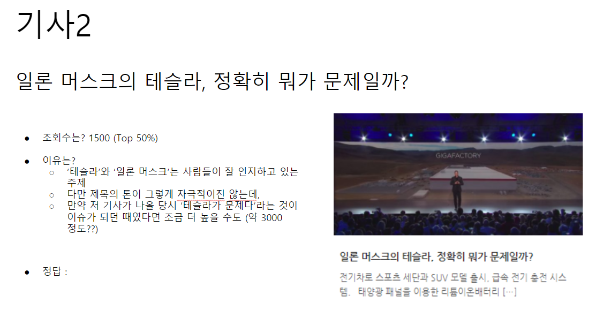
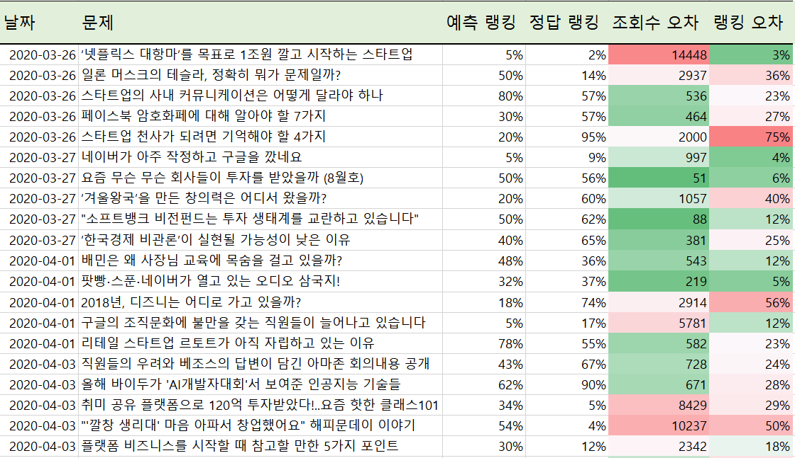
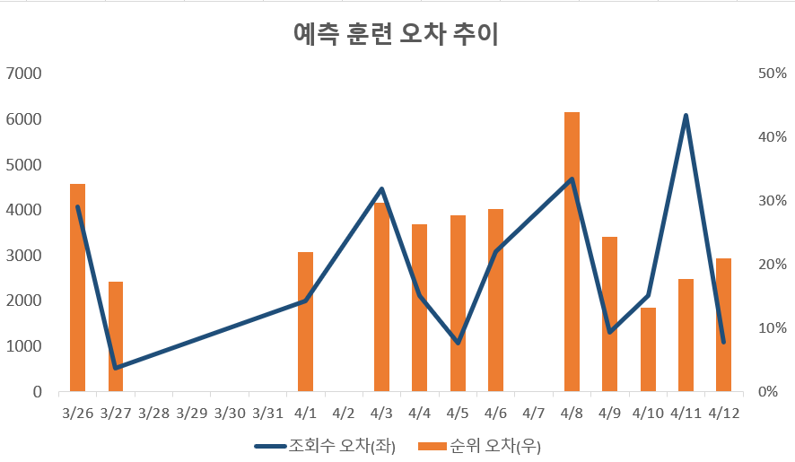
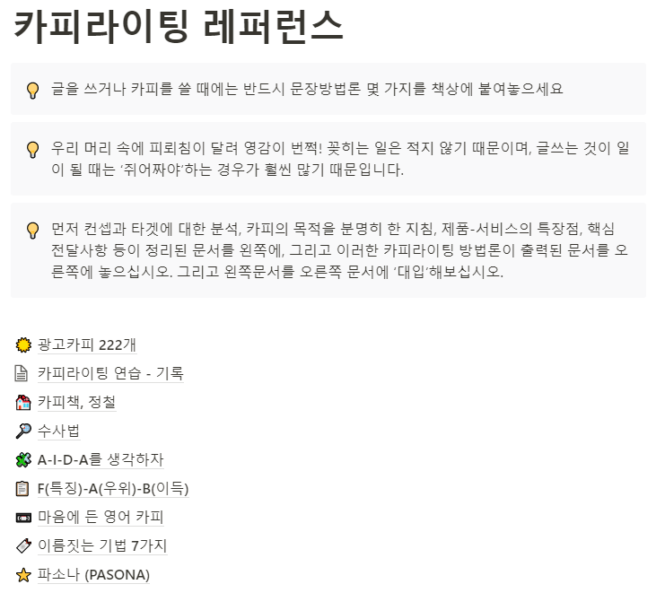
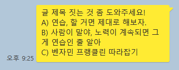
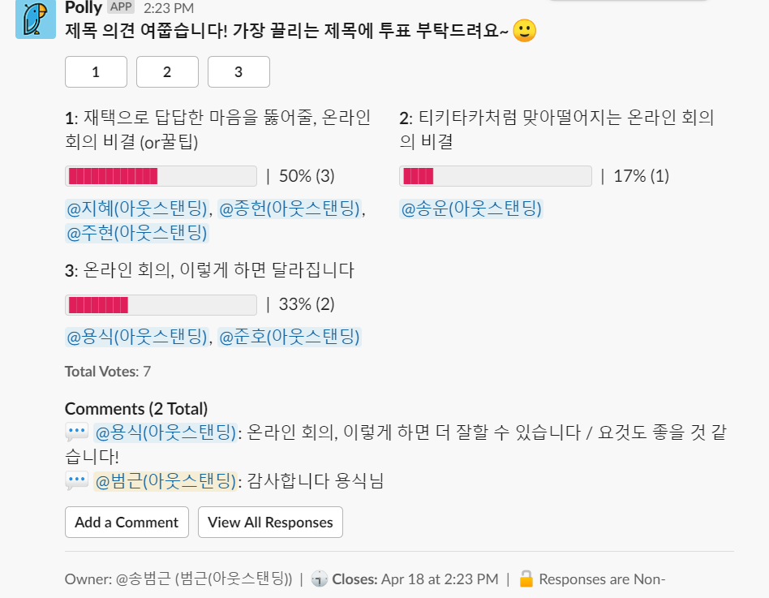

'벤자민 프랭클린 따라잡기'를 시작한 이유는 간단하다. 

> 수많은 고수들의 비결. '의식적 연습'을 나도 해보자!

내 목표는 글쓰기다. 글을 잘 쓰기 위한 의식적 연습을 해보기로 했다.

저번 글에서 말했듯, 벤자민 프랭클린도 처음에는 글을 잘 못 썼다. 하지만 글을 잘 쓰고 싶어서 남의 글을 다시 복원해보는 방법으로 의식적 연습을 했다. 나라고 못할 게 뭐가 있겠는가?

이렇게 호기롭게 시작했다. 1달이 지났다. 두가지 트레이닝을 진행했다. 조회수 예측력 트레이닝과, 제목 카피라이팅 트레이닝이다. 

솔직히 이 글을 어떻게 써야할까 고민이 많았다. 아직 그럴듯한 결과를 얻지 못했기 때문이다. 모르는 것만 더 늘어난 것 같기도 하다. 정말 최선을 다해서 연습했는지도 의문이다. 그래서 중간 점검 글을 쓴다는 게 조금 부끄럽게 느껴진다.

하지만 있는 그대로 써보려고 한다. 처음 생각한 것만큼 쉽지 않다는 것도, 중요한 배움이니까.

## 조회수 예측력 향상 트레이닝

조회수 예측 트레이닝 방법은 다음과 같다.

1. DB에서 기사 제목과 썸네일을 랜덤으로 가져온다.
2. 자신의 조회수 예측을 입력한다. (+이유)

3. 실제 조회수를 알려주고 맞았는지 틀렸는지, 오차는 얼마인지 알려준다.
4. 예측 오차의 추이를 시계열로 보여준다. 

## 자동화는 나중에, 일단 시작부터

이 훈련은 나름 구체적으로 계획했다. **바로 시작만 하면 된다고 생각했다. 하지만 그렇지 않았다.** 

실제 시작까지 약 10일 지체했다. 업무가 바빠 시간을 많이 내지 못하긴 했다. 하지만 더 큰 이유는 트레이닝 환경을 만드는 과정에서 드러났다. 여러 예상 못한 요소가 있었다.

처음엔 이 트레이닝을 코드로 구현하려 했다. 코드로 만들면 자동화가 되니까. 그렇게 어려운 인터랙션이 아니어서, 내 허접한 코딩 실력으로도 충분히 만들 수 있다고 생각했다. 

1. 내가 그나마 할줄 아는 프레임워크인 '루비 온 레일즈'로 웹앱을 하나 만든다. 
2. 데이터는 회사 GA에서 CSV 파일로 뽑아온다. 
3. 로컬에서 돌아가는 훈련 프로그램을 만든다. 

이게 계획이었다. 문제는 오랜만에 하다보니 개발 환경 설정에 많은 시간이 걸렸다. 레일즈도 설치하고, 기본적인 라이브러리 깔고... 등등. 그러다보니 벌써 며칠이 지나갔다. 

밍기적거리던 나에게 여친님이 '뭐하냐?'라고 물어보셨다. (참고로 여친님은 'Do it now'를 입에 달고 사는, 실행력의 화신) 

"내가 이러이러한 프로그램을 만들고 싶은데, 아직 개발 환경 세팅을 못했어ㅜ" 

"이걸 뭐 코딩까지 해? 일단 PPT나 엑셀로 만들어봐. 문제 고르는 것만 사람이 하면 되잖아. 내가 그건 해줄게."

"어... 그러네... (멍청)"

순식간에 구글 독스를 사용해서 문제지와 답변 기록 양식을 만들었다. 출제자가 기사를 5개 골라서, 썸네일을 붙이면 문제지 완성이다. 

나는 이걸 보면서 이 기사 조회수를 고민해본다. 최종 정답은 엑셀에 정리한다. 내 예측치와 실제 조회수간 오차가 자동으로 계산돼 나오게 했다. 마치 어렸을 때 하던 구몬 학습지 푸는 느낌이다.

## 데이터는 절대 깨끗하지 않다

두번째 장애물은 데이터였다. 내 답지는 5년치 기사 조회수 데이터였다. 그러나 자세히 보니 데이터 포인트가 잘못 들어가있는 경우가 꽤 있었다. 같은 기사에 조회수가 여러개 나뉘어 찍혀있다던가. Null 값이 들어가 있다던가.

문제 풀기를 멈추고 원인을 찾아봤으나, 나로서는 알기 어려웠다. 회사에 가서 개발자님께 데이터가 이상하다고 여쭤봤다. 그러자 개발자님은 "음 그러네요. 이건 아예 데이터 수집 시스템 자체를 손봐야 하는데"라고 하셨다. 사실 사내에서도 그렇게 정밀한 수치가 필요한 것은 아니다. 그래서 데이터값에 약간 노이즈가 있어도 그냥 두었나보다. 역시 데이터 분석은 전처리가 70%라고 하더니... 깨끗하길 기대하는 건 무리였다.

일단 단순한 해결책을 선택했다. 그냥 500 이하로 찍힌 잘못된 데이터 포인트를 싹 다 지워버렸다. 당장은 숫자가 엄청 정확한가는 그렇게 중요하지 않았다. 이 트레이닝이 잘 될지 해보는 게 우선이었다. 

잡(?) 데이터를 싹 지워버리니, 별 문제없는 데이터세트가 만들어졌다. 다시 문제를 풀러 가볼까?

## 비교를 통한 예측 - 분포 파악하기

문제를 3일차까지 풀었을 때 또 하나 배운 점이 있다. 예측을 잘 하려면 데이터 분포를 파악해야 한다. 어떤 기사를 보고, 아무런 사전 지식 없이 절대치를 예측하는 건 어렵다. 실제 예측을 해보니 이런 식이었다. 

1) 제목/썸네일에서 요소를 뽑아낸다. 이를 테면 기업의 이름이나, 썸네일에 들어간 표 같은 것. 

2) 비슷한 기사가 어느 정도 수준이었는지 떠올려본다. 그리고 상대적인 비교를 통해 순위를 예측한다.

3) 순위를 절대값으로 바꾼다. '상위 40%면 2200뷰 정도 되지' 이런 식이다. 

즉, 먼저 조회수 분포(순위별 조회수)를 알아야, 조회수의 절대값을 예측하는 게 한결 쉬웠다. 이 사실을 중간에 깨달았다. 

십분위 함수를 사용해, 전체에서 상위 1%는 얼마, 상위 5%는 얼마 이런 식으로 분포표를 만들었다. 이걸 옆에 놓고 조회수를 예측하니, 훨씬 쉽게 감을 잡을 수 있었다. 

## 그래서 결과는?

총 12번의 예측 트레이닝을 진행했다. 1회당 5개의 문제를 풀었다. 예측치와 실제 조회수 오차는 다음과 같다. 

**내 예측 오차는 전혀 유의미하게 줄어들지 않았다.**

김 빠지는 결과긴 하지만, 사실 당연할 수도 있다. 일단 12회는 그렇게 많다고 보기 어렵기 때문이다. 

또 '기사 조회수 예측하는 것'은 단순한 공식으로 설명될 수 없는 능력이다. 이건 이래서 2천, 이건 이래서 1만 5천. 이렇게 딱 맞추는 건 처음부터 기대하지 않았다. 

다만 많이 보다보면, 어떤 '직감'이 길러질 거라고 생각했다. 논리적 공식으로 설명은 못하는 '동물적 직감'은 전문가들이 많이 보여주는 특성이다. 다른 기자님만 봐도, 터질만한 소재를 남들보다 유의미하게 더 잘 맞추는 사람이 분명 있다. 

하지만 실제로 해보면 이제 정말 배울 수 있는 걸까 살짝 의심이 든다. 오차가 이랬다 저랬다 오르락 내리락한다. 내가 생각했던 조회수랑 완전히 다른 조회수가 나오는 걸 수십번 경험했다. 허탈했다. 

게다가 콘텐츠에는 이 트레이닝에 포함되지 않은, 많은 외부 변수가 영향을 미칠 수 있다. 당시 소셜 미디어 트렌드나, 기사를 누가 공유했는지 등등... 

흔히 말하듯이, 정말 조회수는 신이 내려주는 걸까? 주가처럼 본질적으로 예측 불가능한 걸까? 아직은 잘 모르겠다.

## 카피라이팅 트레이닝

두번째 카피라이팅 트레이닝. 이 훈련은 다음과 같이 진행했다.

1) 원고를 다 쓰고 나서, 서로 다르지만 마음에 드는 제목을 3가지 지어 본다. (이 때 카피라이팅을 도와주는 레퍼런스 자료를 참고한다.)

2) 3가지 중에서 내가 가장 좋다고 생각하는 것을 고른다. 

3) 주변 사람 5-6명에게 3가지 제목을 보여주고, 가장 끌리는 제목을 고르라고 한다. 

4) 남의 1순위와 내 1순위 제목을 비교해본다.

## 됐다 싶을 때 2개 더

일단 이 훈련의 확실한 효과는, 제목을 3가지 생각해보는 것 그 자체였다. 

평소엔 마음에 드는 글 제목이 하나 정도만 나오면, 약간씩 수정만 할 뿐 아예 새로운 걸 고민하진 않는다. 그러나 '그럴듯한 3개'를 반드시 만들어야 한다고 생각하니, 평소보다 훨씬 더 많이 고민하게 된다. 이 정도면 괜찮다 싶은 제목이 나와도, 한두 개 더 생각해보면서 더 좋은 게 나오기도 한다.

카피라이팅은 뮤즈가 알려주는 예술에 가깝다고 생각했다. 하지만 직접 해보니 생각보다 요령과 노력으로 짜내는 '기술'이었다. 쥐어짜면 나올만큼 나온다. 고통스럽긴 하지만. 

이렇게 노션에 방법론이나 참고 카피를 정리해뒀다. 이걸 본 게 카피 쓸 때 도움이 됐다. 다양한 수사법을 본다거나, 다른 카피를 살짝 비틀어보거나 하는 식으로 카피를 만들어내다보면 괜찮은 게 조금 나온다. 새로운 방식으로 생각하게 도와준다.

## 샘플이 너무 적다

 하지만 이 트레이닝도 문제가 있었다. 어떤 카피가 더 좋은지 투표해주는 사람이 너무 적었다. 카피란 건 정답이 있는 게 아니다. 개인 취향이 반영된다. 그래서 **'우월한' 카피인지 아닌지는 수백, 수천명 수준의 샘플이 있어야 통계적으로 유의할 것**이다. 

그런데 내가 짧은 시간 내에 투표를 받을 수 있는 사람은 5,6명 정도였다. 

이 트레이닝은 내가 공개적으로 쓰는 글 (=마감이 있는 글)에 적용했다. 그래서 제목을 붙일만큼 초고를 완성하고, 최종 발행까지 시간이 많이 없다. 사람마다 반응 시간이 달라서 짧은 시간 내 많이 모으기가 어렵다. 많은 사람에게 투표를 반복적으로 요구하는 것도 미안했다. 

샘플의 수가 부족하니까, A가 2표, B가 2표, C가 1표. 뭐 이렇게 나와버리면 뭐가 인기있는지 알기 어려웠다. 그리고 사람들이 더 좋다고 생각하는 것은 글 전체가 아니라 제목만 봐서이다. 

더 끌리는 제목이 있을 수도 있지만, 쓴 사람 입장에선 그게 전체 내용을 더 잘 의미하거나, 더 말하고자 하는 바를 담은 제목은 아닐 수 있다. 어그로가 조금 과도하다 싶으면 사람들이 많이 골라줬는데, 그냥 무시하고 간결한 제목으로 갈 때도 있었다.

## 해보고 느낀 점

- 생각보다 **실제 하는 과정에서 변수가 많이 발생**한다. 데이터나, 환경 설정 등등. 일단 완벽하지 않은 상태로 해보는 게 중요하다.
- 글쓰기 능력 자체가 정답이 있거나 정량적으로 측정할 수 있는 스킬이 아니어서, 의도적 연습을 잘 설계하기가 참 어렵다. 글을 잘 쓴다는 것은 워낙 주관적이다. 글의 인기는 글을 잘 쓰는 것외에도 수많은 변수가 작용한다.
- 연습이 **정말 효과가 있는지 판단하기가 어렵다**. **측정가능한 지표가 없다**는 점이 좀 아쉽다.
- 많은 글쓰기 책은 자유롭게 써라. 매일 일정한 시간에 써라 등등 인풋을 강조하는 조언이 많다. 체계적 방법론이라는 게 별로 없기 때문일까... 하는 의구심이 든다.
- 일단 카피라이팅 샘플을 어떻게 늘릴지, 조금 더 빠르게 예측력 향상 여부를 볼 수 있는 방법은 없는지 좀 더 고민해야할 것 같다. 

 
