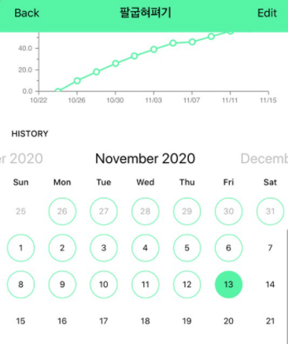

## 꾸준하지 못한 자여...

어느 순간 러닝맨의 기고 원칙이었던 '꾸준함'을 놓치고 있다.

아프다는 것도, 힘들고 피곤하다는 것도 결국 핑계에 지나지 않는다.

어느 순간 '좋은' 글을 3개 써야한다는 압박감에 시달리고 있다보니 스트레스만 늘고 글이 잘 써지지 않는다. 그래서 오늘은 짧은 글로 대신하고자 한다.

## 매일 팔굽혀펴기

여름 중순부터 슬럼프가 시작되었는데 쉴사리 나아질 기미가 보이지 않는다. 러닝맨 격주간 회고에 불참한 것도 여러 번이고 내 올해 유일한 자랑이었던 매일 일기도 몇 번 건너뛰고 그랬다. (그래도 다음날, 다다음날에라도 쓰기는 썼다.)

언제인지도 기억나지 않는 회고 컨콜에서, 든든한 러닝맨 동료인 eddy와 jesse는 슬럼프를 겪는 나에게 물 한모금 매일 마시기 챌린지를 추천해주었다.

이미 아침 저녁으로 약을 먹고 있던 터라 물마시기 챌린지는 솔직히 ea-sy했다. 근데 중요한 건 러닝맨 카톡방에 매일 인증을 못했다.

그래서 그 다음 주차 회고에서는 **1일 1운동** 미션으로 변경하고 카톡방에 인증하지 않으면 벌금을 부과하는 챌린지를 시작했다. 주간 운동 안한걸 지적한 러닝맨 동료에게 돈을 주는 방식.

성과는 아래와 같다.

<em>나름대로 꾸준히 하고 있다.</em>

매일 팔굽혀펴기 20개를 하다가 30개를 하다가 현재는 40개씩 하고 있다. 처음에는 너무 오래 운동을 안해서 20개 한꺼번에 하는 것도 정말 힘에 부쳤는데 매일 하다보니 몸이 조금씩 좋아지는 것 같다. 익숙해지니 한 주차에 10개 정도는 늘려야 운동을 좀 한 것 같다.

작은 일이지만 뭔가 해냈다는 생각이 든다.

사실 이 챌린지를 매일 꾸준히 한 내 자신의 동기는 무엇이었는가. 돈이 아까워서? 아니다. 하루를 조금 더 충실하게 살고 싶다는 내 자신의 오롯한 열망에서였다. 돈도 물론 중요하고 벌금을 주면 아깝겠지. 하지만 그런 것보다 슬럼프에 있는 내 자신에게 무언가 해냈다는 느낌을 주고 싶다는 생각이 더 큰 것 같다.

여전히 내 앞의 문제들은 명확하게 해결될 기미가 보이지는 않다. 허나, 이러한 작은 시도들이 내 자신을 버티게 만들어준다고 생각한다.

## 나의 문제

나의 문제는 너무나 큰, 어찌보면 비현실적인 꿈과 야망을 내 머릿 속에 장착하고 그러한 생각들 때문에 당장 오늘 하루를 충실히 보내지 못한다는 것이다. 그럼 그런 내 자신에게 또 실망하고 에너지를 낭비하는 악순환이 반복된다.

나도 나의 문제를 안다. 그냥 당장 오늘 하루에 집중하면 될 것을. 하지만 예전부터 그려오던 큰 꿈과 야망으로부터 내 자신은 쉽게 자유로워지지 못하는 것 같다. 개가 똥을 끊지...

나는 오늘 하루도 나에게 실망했다. 시간을 소중하게, 촘촘하게, 잘 쓰지 못한 내 자신이 조금 원망스럽다.

하지만 차차 개선이 이루어지면 좋겠다. 아니 이루어질 것이다.

요새는 몸의 건강과 정신의 건강에 신경 쓰고 있으니까 더 좋아지겠지? 내일도 화이팅이다.