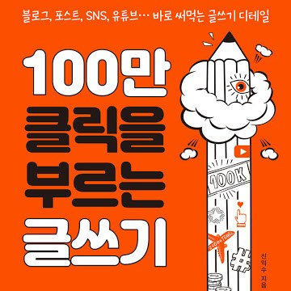

## 글을 잘 쓰고 싶다면

'나도 글 잘 쓰고 싶다. 어떻게 해야 하냐?' 이 질문을 종종 받는다. 좋은 글쓰기, 사실 답은 없다. 그나마 왕도가 있다면, [매일 꾸준히 쓰기?](https://www.learningman.co/writingeveryday/) 

하지만 마음 급한 사람들에겐 부족할 수 있다. '그런 거 말고, 당장 써먹을 수 있는 비법!' 이렇게 외친다면? 이렇게 답하겠다. **'문장을 끊으세요. 당신이 생각한 것보다 훨씬 짧게.'**

문장을, 짧게. 아무 글쓰기 책이나 펴보자. 십중팔구 맨 앞에 나온다. 아마 몇 안 되는 '아묻따' 글쓰기 법칙일 거다. 짧게 끊어치면, 놀랍게도 술술 읽힌다. 

## 100만 클릭을 부르는 글쓰기

내가 끊어치기를 제대로 배운 책이 있다. <100만 클릭을 부르는 글쓰기>. 네이버 포스트를 오래 담당해온 기자가 썼다. 철저하게 실용서다. 저자 스스로 초간편, 초얍실이라고 할 정도.

> 손가락 클릭의 간택을 받기 위한 실전 글쓰기 비기만 담았다. 분명 이런 소리 하는 분들도 있을 게다. 이게 무슨이게 무슨 정통 글쓰기냐. 전문기자라면서 이런 글쓰기 방식이 말이 되냐고.

> 미안하지만, 말이 된다. 왜냐. 이게 먹히니깐. 정통 글쓰기 세계에선 상상조차 할 수 없는 초간편, 초얍실, 초스피드의 모바일 글쓰기 방식에 수백만, 수억만의 엄지족들이 열광한다. 

> 그래서 감히 조언 드린다. 고상한 글, 멋진 글, 무게감 있고 진중한 글 쓰고 싶은 분들은 이 책 절대로 사지 마시라고.

> 허접 콘텐츠로도 간편하게, 얍실하게, 초스피드로 100만 클릭을 달성하고픈 분들만 이 책 사시라.

이 책의 글쓰기 조언은 조미료다. 허접한 재료에 조미료만 쳐서, 좋은 요리가 되진 않는다. 하지만 적정 수준의 조미료는 잘 쓰면 좋다.

## 기계적으로, 더 과감하게 

내게 가장 유용했던, 딱 한 챕터가 있다. 맨 앞에 나온다. 한번 읽어보자.

> 끊어쳐라. 누구나 안다. 문제는 '정도'다. 과연 어느 정도까지 끊어 쳐야 할까. 대부분 '주어+동사' 나열로 받아들인다. 

> 하지만 요즘 글쓰기, 달라졌다. 여기서 한 단계 더 업그레이드 끊어 치기가 이뤄진다. 그러니깐 이런 식. 

> 주어, 동사 나열도 길다. 동사+동사가 반복되거나, 단어+단어로 끊긴다. 인수분해로 문장을 끊을 수 있는 만큼 끊어놓는 거다.

> 세상에나. 그런데, 묘하다. 이런 끊어짐에 전혀 거부감이 들지 않는다. 필자가 쓴 여행기를 한번 볼까.

> [벗었다. 홀라당. 아니다. 수건으로 중요 부위는 가렸다. "괜찮겠어요?" 같이 온 기자가 다짐하듯 문는다. "뭐, 어때요" 애써, 담담한 척이다. 

>맞다. 이럴 땐 방법이 없다. 뻔뻔해져야 한다. 심호흡. 드르륵. 문을 연다. 무려 40년. 그 기간 학수고대하며 기다려왔던 판도라 상자, 남녀혼탕의 문. 

>그게 열린다. 아뿔싸. 그런데 이게 뭐야. 뿌옇다. 탕 안도, 물속도. 
><은밀하게 화끈하게 설탕 투어> 중]

> 그냥, 짧게 써야 한다는 인식 정도로는 안 된다. 그저 끊어야 한다. 딱딱. 기계적으로. 
> 글 잘 쓰는 기자 Top 3에 꼽히는 <한겨레> 출신 안수찬 기자의 표현을 빌리자면 '끊어 치기는 만병통치약'이다. 

이 챕터에서 배웠다. 나는 단순 '필요하다고 생각한 정도'만 끊는다. 대부분 그렇다. 자기 문장은 잘 못 끊는다. 아니, 이건 이런 의미가 있는 거고. 이건 이 문장이랑 연결되는 건데? 어떻게 끊나? 이런 생각이 든다.

하지만 그 정도론 안 된다. 과감해져야 한다. **좀 심한데? 정도로 끊어줘야 한다.** 그 때서야 술술 읽힌다.

모바일에서 읽힐 글을 쓰는가? 그렇다면 진짜 극단적 끊어치기가 효과만점이다. 모바일로 볼 땐, 정말 가볍게 읽혀야 한다. 그래야 눈길을 사로잡을 수 있다. 묵직하고 유려한 문장은 '뒤로가기'를 부른다.

이 책은 예시를 제대로 보여준다. 예시 기사는 시작부터 압권이다. "벗었다. 홀라당." 

쉼표, 의성어까지 아낌없이 써서 끊는다. 짧게 쓰라는 내용조차, 잘게 부서져있다. **근데 묘하다. 진짜 잘 읽힌다.** 단순히 짧게 쓰라고 조언만 하는 것보다, 훨씬 와닿는다. 

뒤로 갈수록 책 내용은 별로다. 하지만 이건 확실하다. 끝까지 쉽게 읽힌다. 내 생각엔 70% 이상은 끊어치기빨이다. 

굳이 책 인용까지 한 이유가 있다. 보기 전엔 얼마나 끊을 수 있는지 감이 안 오기 때문이다. 

나도 가끔 내 문장이 무겁다고 느낀다. 근데 잘 안 끊어진다. 그럼 이 책을 다시 꺼내서 읽어본다. 다시 원글을 보면, 끊을 데가 보인다.

## 문장 끊어치기, 시도해보자

다시 요점으로 돌아가보자. 이건 확실하게 말하고 싶다. **어쨌든 글을 잘 쓰려면 콘텐츠, 내용이 더 중요하다.** 난 그렇게 믿는다. 

하지만 누군가 내 팔을 붙잡고 이렇게 말했다고 하자. '당장! 지금 당장 쓸 수 있는 글쓰기 비법을 알려줘!' 내 답은 이렇다. 

**'아무것도 묻지도 따지지 말고, 문장을 있는대로 끊으세요.'** 

자, 독자들. 한번 시도해보자. 다만! 2가지 주의사항이 있다. 

1. 초고를 쓰면서 끊어치려고 하면 안 된다. 처음부터 짧게 쓰려고 하면, 생각이 막혀버린다. 일단 처음엔 줄줄 쓰자. 초안을 다 쓰고 나면, 그때부터 문장을 썰어본다. 
2. 정말 어색하다 싶을 정도까지 해야 한다. 

예시를 보자. 한 [네이버 블로그](https://m.blog.naver.com/PostView.nhn?blogId=recycle1310&logNo=221210556951&proxyReferer=https:%2F%2Fwww.google.com%2F)에서 가져왔다. 

> (원래 문장) 나는 날마다 쉬지 않고 블로그에 글을 쓰는데 실력은 늘지 않고 답보 상태인 것 같아 답답해서 포기해야 하나 생각하기도 했지만 열심히 쓰고 있다.

> (끊어치기1) 나는 날마다 쉬지 않고 블로그에 글을 쓴다. 실력은 늘지 않고 답보상태인 것 같다. 답답하다. 포기해야 하나 생각하기도 했다. 하지만 열심히 쓰고 있다.

내용은 똑같다. 하지만 읽기 훨씬 편하다. 이 정도면 꽤 훌륭하다. 하지만 여기서 더 나아가보자.

> (끊어치기2) 날마다 글을 쓴다. 실력은 답보상태. 답답하다. 포기해야 하나. 하지만 쓴다.

크으, 그렇지. 확 달라졌다. 묘한 리듬까지 느껴진다. 만약 이걸 소셜 미디어에 올렸다고 해보자. 같은 내용 다른 문장. 아마 2배는 따봉을 많이 받을 거다.

다들 원래 쓰는 글투가 있다. 억지로 끊으면 느낌이 이상하다. 특히 짧은 문장은 단정적이다. 말투가 강하게 느껴질 수도 있다. 쓰기 망설여진다. 

**하지만, 눈 딱 감고 다 떼어내자.** 쓰는 사람은 어색해도, 다른 사람은? 속이 편-안하다. 