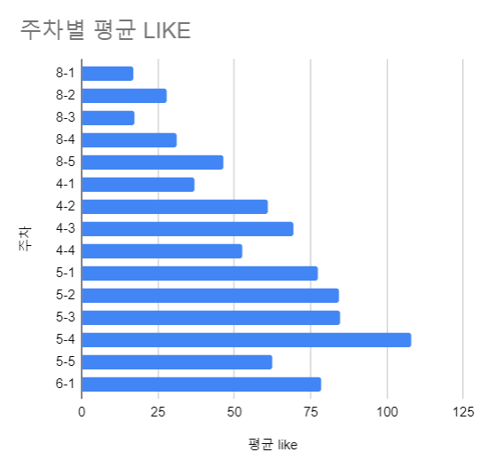
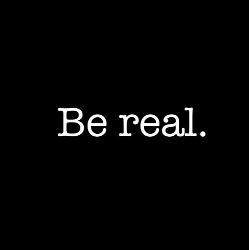

## 좋아요 받는 글쓰기 프로젝트 

내 2020년 목표는 글쓰기 실력을 높이는 거다. [명확한 목표가 필요하다](https://www.learningman.co/objective/)고 생각했다. 한 달 전에 측정 지표를 정했다. 페이스북 좋아요다. 목표는 주간 평균 100개. 

이전 글을 본 사람은 알겠지만 원래 목표는 70개였다. 하지만... 70개는 너무 빨리 달성해버렸다. 콘텐츠를 올리기 시작하자마자 2주 연속 70개를 넘었다. 

목표를 상향 조정했다. 좀 더 포부를 담아 100개라는 목표를 정했다. 매주 평균 100개라니... 고양이나 미녀 사진이 아니라면 매우 빡세다. 보통 사람이 올린 글에 100개가 찍힌 걸 본 적이 얼마나 자주 있는가? 하지만 해보니 완전 불가능해보이지도 않았다. 5월 한달 간 꾸준히 콘텐츠를 올렸다.

좋아요 수치를 보자. 

완벽한 선형은 아니지만, 목표를 세운 4월달부터 5월까지 꾸준히 평균 좋아요가 상승했다. 5월 4주차에는 일시적으로 100을 넘기도 했다! (비교를 위해 2019년 8월 데이터를 넣었다. 페북을 본격적으로 시작한 때다.)

꽤 고무적인 성과다. 내가 생각한 것보다 반응이 좋았다. 아직 안정적으로 평균 100개가 나오진 않지만, 업다운을 반복하면서 상승세를 타고 있다.

오늘은 중간 회고다. **잘한 것, 못한 것, 시도할 것**을 생각해봤다.

## 잘한 것: 매일 글쓰기

평소 매일 글을 쓴다. 매일 써놓고 그 중 공개하는 건 거의 없었다. 페이스북에는 주로 기사를 공유했다. 공유 1~2번에 내 글 1번 정도랄까? 그러다 이제 일주일에 2개 정도 꾸준히 글을 올렸다. 그게 다다. 평소 쓰던 비공개 글을 (물론 약간 검열을 가미해서) 올렸을 뿐인데 꽤 반응이 좋았다.

좋아요는 어디까지나 '내가 좋은 글을 쓰고 있는가'를 측정하기 위한 지표였다. 좋아요 100개를 달성하겠다고 무슨 마케팅을 하고 해시태그를 넣을 건 아니었다. 

따라서 목표를 세우고 내가 한 노력은 아주 심플하다. 그냥 더 자주 올렸다. 

아침 일찍 일어나고, 매일 안 빼먹고 글 쓰고, 쓴 글 중에서 최소 2개를 다듬어서 페북에 올렸다. 5월 한달 동안 특별히 다르게 한 건 없다. 이 3가지를 했을 뿐이다. 잘한 것 같다. 꾸준히 유지하면 계속 좋아요는 올라갈 듯 하다.

## 못한 것: '내 이야기'가 없는 포스팅

몇몇 게시물은 30 이하의 좋아요를 받았다. 크게 평균을 깎아먹었다. 포스팅을 자세히 들여다봤다. 낮은 포스팅은 왜 낮을까? 높은 포스팅은 왜 높을까?

**형식 측면**에선 텍스트, 이미지, 링크 공유가 있었다. 이 중 **외부 링크를 공유한 게시물**은 평균적으로 좋아요가 낮았다. 페이스북이 아웃링크를 싫어하기 때문에 도달률에서 페널티를 준다고 알고 있다. 

물론 백퍼센트는 아니다. 같이 쓴 텍스트가 좋으면 좋아요가 꽤 눌리기도 한다. 그래도 많아야 60개 정도가 한계다. 외부 링크는 최대한 자제하기로 했다. 하더라도 이미지를 따로 올린 다음, 텍스트 링크를 첨부하는 방식을 쓸 거다.

**내용 측면**에선 중요한 변수가 하나 있었다. 바로 **'내 이야기'가 얼마나 많이 들어있는지**다. 사람들은 '나'를 주어로 쓴 내용을 좋아한다. '요즘 A 회사가 잘 나간다고 한다'는 약하다. '나는 이 회사가 잘 될 것 같다' 혹은 '내가 이 회사 제품을 써본 적이 있다'는 이야기가 더 힘이 있다. 

아웃스탠딩 기사체로 그냥 기사 요약을 쓰면 좋아요가 낮다. 내 의견 없이 남의 글에 대한 감상만 쓰면 좋아요가 낮다. 

반대로 말하면, '내가 아 SNS에 이런 것까지 올려야 하나. 쪽팔린데'라는 생각이 안 들수록 좋아요가 높다. 특히 블록체인 판에 대한 개인적인 경험담 (많이도 아니고 아주 약간)을 섞거나, 직장인이 되고 달라진 소비 생활을 쓴 콘텐츠들이 좋아요를 많이 받았다. 

깨달았다. 사람들은 남의 개인적인 이야기를 좋아한다. '자기는 굳이 공개적으로 말하고 싶지 않지만, 누군가 나와 비슷한 생각을 하고 있다'고 느낄 때 좋아요를 누르는 게 아닐까 싶다.

## 시도할 것: 가장 사적인 글 올리기

페이스북에서 좋아요란 결국 관심과 공감이다. 공감을 불러일으키고 싶다면, 더 솔직해져야 한다. 즐겁고 자랑할 만한 일을 솔직하게 말하긴 쉽다. 하지만 요즘 내 고민, 내 약점, 내 가치관, 내 판단 같은 주제는 보통 사람들이 잘 말하고 싶어하지 않는다.

어떤 사람은 그걸 진정성이라는 말로 표현하기도 한다. 한 블로그에서 본 글이다.

>  소셜 미디어에서 영향력은 진정성에서 온다. 글의 진정성은 어디에서 느껴지나? 자신의 삶을 솔직하게 드러낼 때 나타난다. 
>
> 많은 사람들이 페이스북을 자신 이미지 관리 정도로 사용을 많이 한다. 글쓰는 당사자의 진짜 모습을 솔직히 드러내는 사람들은 의외로 많지 않은 것 같다. 
>
> 그 사람이 어떤 일을 하고 살아가는지? 살면서 느끼는 내적 갈등은 무엇인지? 
>
> 고뇌에 대한 부분은 드러내지 않고 자신의 삶을 포장하는 듯 하다. 

열정의 기름붓기를 창업한 이재선님도 [좋은 콘텐츠를 꾸준히 만들기 위한 첫번째 습관](https://outstanding.kr/creatorhabit20200312/)으로 '사적인 것에서 시작하라'는 말을 했다.

>새로 들어온 마케터들에게 '공감이 가는 카피를 써야 한다'고 말하면,
>대부분 '아주 뻔하고 당연한' 문장들을 써냅니다.
>
>하지만 생각해보세요. 우리가 
>
>공감이란, 너무나도 당연하고 뻔한 무언가가 아니라, 오히려 아주 아주 개인적이고 사적인 것에서 나온다는 것이죠.
>
>**“가장 개인적인 것이 가장 창의적인 것이다.”**
>
>봉준호 감독이 아카데미 시상식에서 한 말입니다. 영화계의 거장 마틴 스콜세지 감독으로부터배운 한 문장이라며 언급했죠. 
>
>저는 콘텐츠를 제작하는 사람으로서 이 말이 진리라고 생각합니다. 하지만 공감을 끌어내는 비결은 아이러니하게도 ‘완전히 사적이 되는 것’입니다.

그러니 바나나 우유를 팔아야 한다면, 바나나 우유 참 맛있죠? 라는 글을 쓰면 안 된다. 내가 어떤 순간에 바나나 우유가 끌렸고, 바나나 우유와 관련된 나만의 기억은 없는지를 글로 옮겨야 한다. 그러다보면 참신하면서도 끄덕여지는 문장이 나오게 된다.

**이번 달엔 더 개인적이고 사적인 글을 쓸 거다.** 오그라들고 쪽팔리는 글을 올리자. 내가 무엇을 좋아하는지. 무엇을 싫어하는지. 어떤 기억이 있는지. 어떻게 평가하는지 등등. 

솔직히 이 다짐을 쓰면서도 거부감이 든다. 아직도 글을 올리고 나면, 누군가의 심기를 건드린 건 아닐까 하고 심장이 벌렁거린다. 

하지만 그 거부감도 올리다보면 익숙해지더라. 무엇보다 목표를 세웠으면 체면이고 뭐고 따질 게 뭐가 있나. 나중에 부담스럽더라도, 해보고 그만두면 되는 거다. 
 
결론. 정리해보자.

- 매일 글 쓰고, 다듬어서 올리는 걸 계속한다.
- 더 사적인 글을 올린다. 

6월달엔 '공감'을 더 많이 가져오겠다. 그럼 이만.
