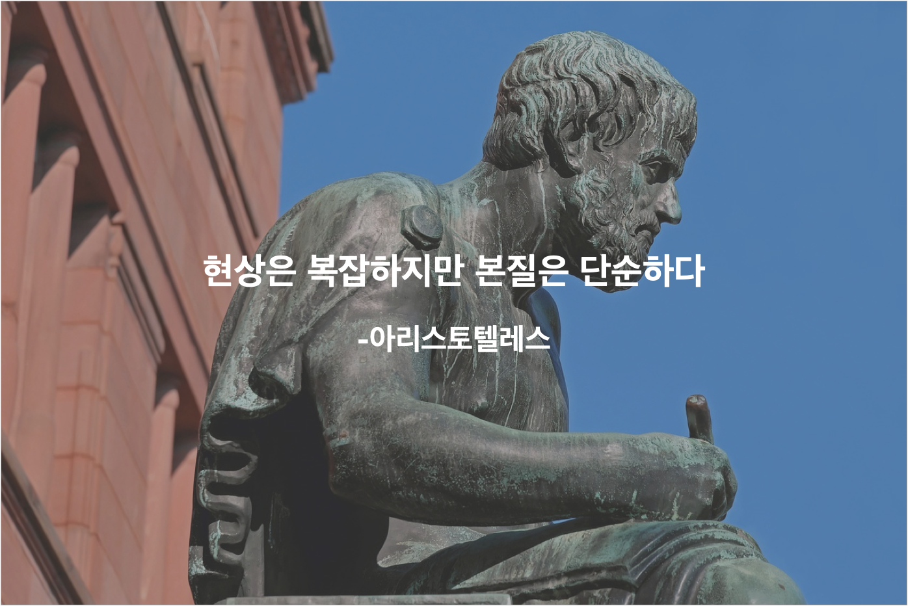

## 본질이 뭔지 느끼고 나면 문제는 생각보다 어렵지 않다

아리스토텔레스가 말한 것처럼, 복잡해 보이는 현상이라도 그 본질은 의외로 단순한 경우가 많다. 본질을 파악하고 체화 한다면, 현상은 자연스럽게 따라온다. 그러므로 단순한 본질이 과연 무엇인지 깨닫는 것이 우리 인생의 여러 문제를 훨씬 단순하게 만들어 줄 수 있다. 

요즘나의 최대 화두는 알고리즘 공부다. 코로나 때문에 시험이 연기되어 1달만에 테스트에 통과하고 말겠다는 도전이 흐지부지 되었지만, 내 실력이 확실히 이전보다 많이 성장했음을 느낀다.

문제를 푸는데 자신감이 생겼다. 이전보다 어려운 난이도가 책정된 문제를 비교적 더 쉽게 풀수 있게 되었다. 얼마전에 본 프로그래머스 모의고사에서는 참여한 3031명 중 130등을 했다. (대단한 등수가 아닐 수 있지만, 1달조금 넘는 기간동안 이뤄낸 성과로는 만족할만 하다고 생각한다.)

알고리즘 문제를 많이 풀면서, 알고리즘 문제의 본질을 스스로 새롭게 정의할수 있었던 것이 최근 나의 실력향상에 큰 도움을 준 것 같다.  

## 알고리즘의 본질은 문제 해결방법을 생각해 내는 것이다

알고리즘과 자료구조는 컴퓨터 공학의 기초다. 이는 데이터를 어떤 방식으로 적재하고 활용하는지를 다루는 학문이기 때문에 이에 대한 이해가 없으면 제대로된 프로그래머 취급을 받기 어렵다.

이러한 알고리즘 지식과 자료구조로 주어진 문제를 풀어내는 것이 알고리즘 테스트다.

이것이 통념적으로 받아들여지는 알고리즘의 정의다. 정의를 듣자마자 공부해야 할것들이 얼마나 많을까하는 생각이 들며 머리가 꽉 막히는 느낌이다. 

컴퓨터 관련 전공이 아닌 나는 위와같은 정의를 떠올리면 나는 뭔가 불리하다는 생각을 지울수가 없었다. 그래서 더 위축되었던 것 같다. 

그러나, 알고리즘을 위해 기본적인 지식들(문법, 반드시 알아야 하는 몇가지 알고리즘 페턴)을 익히고 나서, 나는 알고리즘 테스트의 본질이 위의 정의와는 다소 다르다는 것을 알게되었다. 

**알고리즘 문제의 본질은 해결방법을 생각해 내어 컴퓨터에게 명령을 내리는 것 이었다.** 컴퓨터에게 명령을 내리기 위해서 어느정도의 지식은 필요하지만 더 중요한 문제는 해결방법을 생각해 내는 것이었다.

명령을 내릴정도의 지식은 누구나 쌓을 수 있어 시험에서 차별성을 드러내기 어렵다. 복잡한 문제의 실마리를 잡고 풀어가는 부분에서 시험의 변별력이 생긴다. 

알고리즘의 본질을 생각하기로 정의하자 자신감을 가질수 있었다. **어려운 문제에 대해 생각하는 것은 내가 좋아하는 것이고 그렇다면 전공자들에 비해서 내가 이걸 못할 이유가 없다는 자신감이 생겼다.** 

## 알고리즘에서 배운 좋은 생각 습관을 일상에도 적용해 보려 한다

생각에 집중하면서 알고리즘을 공부하다 보니, 몇가지 사고 방식이 문제 풀이에 크게 도움이 되는 것을 느끼게 되었고, 이러한 생각 습관은 일상의 다른 어려운 문제를 해결하는 데에도 효과가 있을 것 같다는 생각을 하게 되었다. 

내가 느끼기에 제일 효과가 좋았던 사고 습관들은 아래와 같다. 

- **별거 아니라고 생각한다.**

    - 문제 해결은 기세다. 쫄면 절대 이길수 없다. 문제 못 푼다고 죽는 것도 아니다. 그냥 언젠가 해결될 문제일 뿐이다. 별거 아니라고 생각하며 문제를 기선제압 하자.
- **가능한 한 작은 문제로 나누어 작은 부분에만 집중한다.**
    -  복잡하고 어려운 커다란 문제는 사실 아주 작은 문제들이 여러개 연결되어 있는 경우가 많다. 만만하게 해결할 수 있는 사이즈가 될 때 까지 문제를 쪼개보자. 

    - 그리고 쪼개진 그 한조각에만 집중한다. 인간의 정신력은 한곳에 집중되었을 때 놀라운 힘을 발휘한다. 쪼개서 집중하면 정신력을 가장 효율적으로 사용할 수 있다.
- **생각을 먼저하고 행동한다.**
    -  급조한 해결책은 복잡한 문제를 해결하지 못한다. 오히려 시간만 잡아먹는 경우가 빈번히 발생한다. 급할수록 돌아가야 한다. 

    - 최소한 이 해결책으로 끝까지 갔을때 어떻게 될지에 대한 대략적인 그림을 가지고 있어야 한다.
- **제일 간단한 방법으로 문제를 풀어 보고 그후에 고친다.**
    - 아예 생각을 안하는 것도 문제가 있지만 생각에만 몰두해서 아무것도 하지 못하는 경우가 생기면 안된다. 비효율적이더라도 핵심적인 문제를 해결할 수 있는 답을 내보고, 그걸 고쳐서 더 좋은 해답을 만드는게 훨씬 효율적이다.
- **스스로를 격려한다.**
    -  여려운 일이 생기면 포기하고 싶은건 인간의 본성이다. 이 때 마음속으로 '00아 조금만더 해보자' 라고 말해보자. 내가 나한테 하는 말은 심리적으로 엄청난 효과가 있다. 펜싱선수 박상영이 할수있다를 3번 외치고 올림픽 금매달을 딴 것이 이 효과를 증명해 준다. 
- **다른 지식을 끌어들여 생각한다.**
    - 어떤 지식이 체화되기 전 까지는 의식적으로 기억 영역에서 지식을 꺼내서 문제 해결에 이용해야 한다. 스스로 답을 떠올리기 어렵다면, 책에서 읽은 내용, 다른 사람에게 배운 내용 등 을 의식적으로 하나씩 떠올려가며 여기에 어떻게 적용할 수 있는지 생각해 보는것도 좋다.

인생을 살다보면 복잡한 문제를 해결해야 하는 상황에 자주 처하게 된다. 그럴때 알고리즘을 풀며 배운 생각 습관이 도움이 되어줄수 있기를 바란다. 