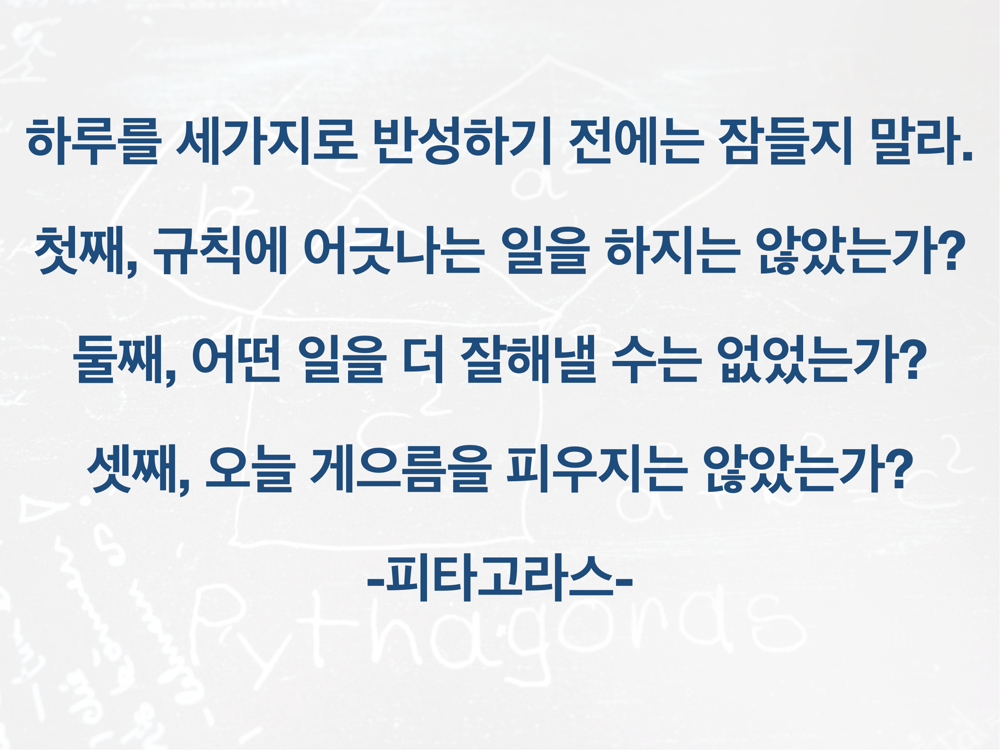

## 나, 잘살고 있니?

지금 가는 방향이 맞는 방향인지에 대한 고민을 많이 하는 편이다. 어떤 행동을 왜 하는지에 대한 생각을 하려고 노력하고 있다. 매일 방향성을 점검하는 것도 중요하지만, 따로 시간을 내어 내 삶의 방향성을 한번쯤 점검해 보아야 길을 잃지 않고 옳은 방향으로 갈 수 있다. 전속력으로 틀린 방향으로 질주해 봐야 소용없다. 고생 끝에 얻은 보물이 나에게 가치가 없으면 그건 정말 슬픈 인생이다.

2020년 7월도 끝나간다. 조금 늦은 감이 있지만, 2020년이 절반정도 지나간 기념으로 2020년, 내가 어떻게 살아왔는지, 앞으로 어떻게 살 것인지에 대한 생각을 조금 해보기로 한다.

## 원래 생각, 실제로 일어난 일, 앞으로 할 것, 배운점

2020년 초에 상상했던 내 인생과 실제 살아온 인생은 달랐다. 2020년에 이루고자 하는 목표는 커리어, 몸건강, 정신건강 3가지 카테고리로 나눌 수 있다. 각 카테고리에 따라 원래 생각, 실제로 일어난 일, 앞으로 할 것에 대해서 생각해 보자.

### 커리어

#### 원래 가지고 있던 생각

코딩 테스트 준비를 열심히 할 것이다. 그리고 그렇게 준비한 시험을 통과할 것이다.
정부주도 코딩 교육프로그램에 들어가 월 100만원씩 받으며 편하고 재밌게 공부할 것이다. 괜찮은 회사에 들어가기엔 내 실력이 아직 많이 부족한 것 같으니, 저 프로그램을 수료하면 괜찮은 회사에 들어가 더 배울 수 있을 것이다.

혹시 저 프로그램에 합격을 못하면 학원을 다니자. 다들 학원에서 배운다음에 취업하더라...

#### 실제로 일어난 일

준비했던 시험에 어처구니 없게 [떨어졌다](https://www.learningman.co/algorithm%20retrospect/). 근데, 시험을 준비하면서 내 실력이 많이 성장했다. 시험은 떨어졌지만 자신감은 붙었다. 제일 어렵다는 카카오의 코딩테스트도 합격했다.

대기업에 몇 곳에 지원했고 떨어졌다. 떨어지면서 어디를 보완하면 가치있는 노동력이 될 수 있는지 알았다. 학원을 다니지 않아도 개발자 커리어를 내힘으로 시작할 수 있다는 확신을 얻었다. 프로그램 안되면 학원에 가려는 계획을 취소했다.

스타트업들에 지원했고 3군데 에서 합격 오퍼를 받았고 1곳에 입사하기로 했다. 입사조건도 관대하다. 일하면서 많이 배울 수 있을 것 같다. 스타트업에서 배울 수 있는 것들을 최대한 배워서 성장할 생각에 설랜다.

#### 앞으로 할 것

Learning by Doing을 극적으로 해낼 것이다. 성공적인 직장 생활을 위해서는 반성하는 습관을 가지는 것이 제일 중요하다. 반성은 하루의 복습이다. 코딩 테스트 실력이 폭발적으로 상승할 수 있었던 중요한 비결은 [철저한 복습](https://www.learningman.co/algorithmstudychallenge/) 이었다. 반성하면 더 잘할 수 있게 된다.

자기전 하루 30분 이상은 무조건 하루를 반성하는데 사용하는 습관을 들여보기로 다짐해 본다. 구체적인 아웃풋이 있어야 습관을 트래킹하기 좋으니, 개인 노션에 반성록 페이지를 하나 만들어서 하루에 하나씩 반성일지를 채울 것이다. 공개는 하지 않는다. 누군가 본다고 생각하고 반성하면, 진짜 부끄러운 일들을 반성하지 않을 우려가 있기 때문이다.

**커리어가 계획대로 흘러가지는 않았지만 본질적인 목적은 달성했다.** 2020년 커리어의 본질은 개발 실력 상승이다. 프로그램에 들어가기 위해 실력 성장을 크게 경험했고, 실력을 크게 높일 수 있는 좋은 기회를 붙잡았다. 계획이 틀어졌더라도 개발실력 상승이라는 본질을 놓치지 않으려 노력했기에 부끄럽지 않은 전반기를 보냈다고 자부한다.

### 몸건강

#### 원래 가지고 있던 생각

[원펀맨 첼린지](https://www.learningman.co/onepunchretrospect/)를 하고 몸이 좋아진 상태를 유지할 것이다. 매일 까지는 아니더라도 일주일에 3~4일은 운동을 하며 체력과 아름다운 몸을 유지할 것이다. 여유가 생기면 유산소 운동도 같이 할 것이다.

#### 실제로 일어난 일

원펀맨 첼린지가 끝나고 2번 운동한게 전부다. 목표를 이루고 나니, 그 힘든 일을 더 해야겠다는 의지를 끌어 올리기 힘들었다. 매일 아침 요가를 하고는 있지만, 심박수가 올라가는 운동이 필요하다고 생각한다.

#### 앞으로 할 것

다시 운동을 해야 하는데, 이전과 같은 첼린지 방식은 지속하기가 어렵다. 첼린지로 내 한계를 매일 깨부숴 나가는 일은 상당한 의지력을 소모한다. 한계를 깨는 의지는 공부하는데 쓰고 싶지 몸 키우는데 쓰고 싶지 않다.

가급적이면 의지력이 조금 드는 방식으로 나를 운동 시키고 싶다. 일단 유산소 운동이 왜 좋은지, 살을 빼는게 왜 좋은지에 대해 잘 써놓은 책을 한권 읽어야 겠다. 설득력있는 책을 읽고 설득이 되면 큰 의지 없이 운동을 시작할 수 있다. 책을 한권읽고 의지력 소모가 덜한 방식으로 운동을 꾸준히 해 나갈 것이다.

### 정신건강

#### 원래 가지고 있던 생각

매일 명상을 할 것이다. 좋은 일이 있어도 나쁜 일이 있어도 크게 흔들리지 않는 평안함 마음의 자세를 연습할 것이다. 그래서 항상 은은한 감사와 행복이 영혼에 스며든 사람이 될 것이다.

#### 실제로 일어난 일

일주일에 3일 정도 명상을 했다. 명상 좋다는 거 알지만, 시작하기가 왠지 시간이 아까웠다. 명상을 하려고 핸드폰으로 음악을 켜려는 중 다른 유투버의 컨텐츠를 본 뒤 명상을 안하고 다시 일을 시작한 적이 많았다.

법륜스님의 즉문즉설을 많이 들었다. 잦은 불합격으로 인한 마음의 동요를 가라앉히기 위해서 였다. 효과는 굉장했다. 인간의 괴로움은 90% 욕심에서 비롯한다는 사실을 깨달았다.

법륜스님에게 질문을 하는 사람들은 나보다 2만배 정도 기구한 삶을 살고있었다. 나의 괴로움이 얼마나 작은 괴로움인지 깨달았다. 그들의 괴로움도 욕심이 만들어낸 것이라는 것을 강연을 들으며 깨달았고, 내 괴로움을 다스릴 실마리를 잡았다.

#### 앞으로 할 것

명상을 더 꾸준히 할 것이다. 같이 명상하는 그룹에 들어갔다. 같이 하는 사람들이 있으면 더 시간을 내어 명상을 하고 더 성숙한 삶의 자세를 가질 수 있을 것이다.

운동과 마찬가지로 명상가이드 책을 한권 읽고 명상의 좋은점에 대해 설득 당해볼 것이다.

## 솔직히 나쁘지 않았다

내가 예상했던 것처럼 삶이 흘러가지는 않았다. 그래도 목표를 잃지 않으려 노력했고, 각각의 목표를 이루거나 목표의 본질적 목적에 한걸음 더 다가섰다. 아직까지는 썩 괜찮은 2020년이다.

남은 2020년, 더 성장하고 더 행복한 내가 될 수 있기를 바란다.
