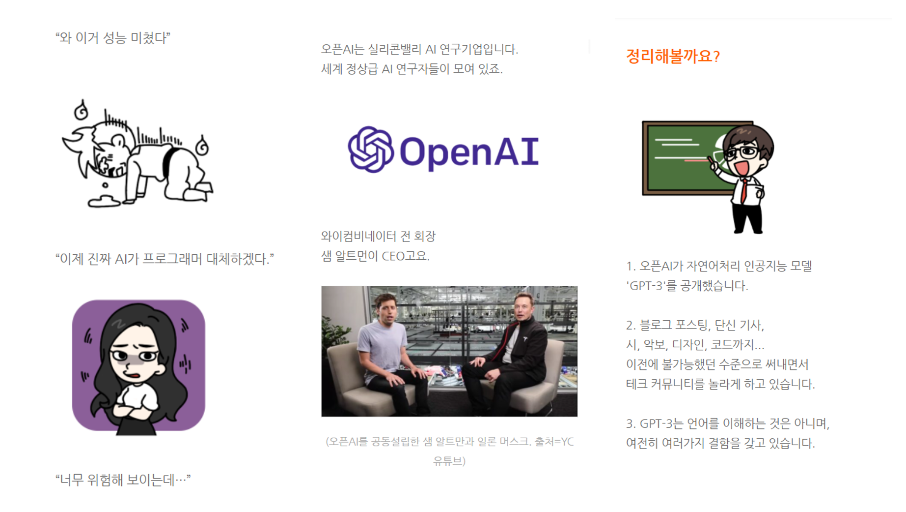
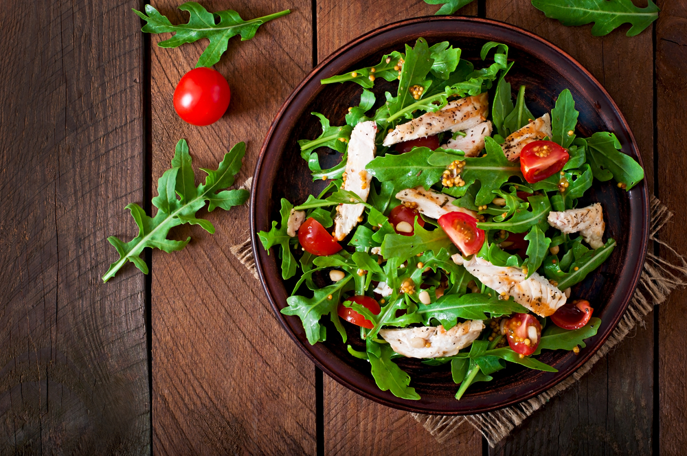

## 유료와 어울리지 않는 가벼움?

1년 반 전.

"뭐, 기자가 됐다고? 갑자기? 어디 기자인데?"

"아웃스탠딩이라고... 이런 기사를 써요. 구독료를 내야 볼 수 있는 유료 매체에요."

"허허... 이게 기사라니 신기하네. 이런 블로그 포스팅 같은 걸 사람들이 돈 내고 본다고?"

처음 이직했을 때. '...아웃스탠딩?' 이라고 묻는 사람들에게 아웃스탠딩을 설명하면, 대개 이런 반응이 나왔다. 

> 흠... 이게 언론사..? 이게 기사?' 

사실 그렇게 생각할 만했다. 이모티콘도 막 튀어나온다. 대화체도 나오고, 줄바꿈도 많이 하고. 프로페셔널하다고 느껴지지 않는 이미지와 디자인.  

막연히 '유료 기사'라면 진중하고 전문적이어야 할 것 같다. 대부분 '깊이있음'과 '쉽고 재미있음'은 반비례한다고 생각하니까.

나도 그랬다. 아마 나도 아웃스탠딩 기사를 처음 봤을 땐 그렇게 생각했을 거다. '이런 기사에 돈을 낼까? 너무 가벼워 보이는데'

하지만 놀랍게도 아웃스탠딩은 언론업계에서도 정말 몇 안 되는 뉴스 유료화의 성공 사례다. 많은 미디어 스타트업의 롤모델이기도 하다. 

## "퇴근하면서 각 잡고 읽기 싫거든"

예전에 대형 IT기업 이사님을 만난 적이 있다. '아웃스탠딩 잘 읽고 있다. 저번에 이 기사도 읽었고, 어제는 이 기사도 읽었다...'' 라고 하셨다. 인사치레로 하는 말은 아닌 것 같아 반가웠다. 

"왜 아스 기사를 읽으세요?"

"다른 기사는 잘 안 읽혀요. 난 보통 퇴근하면서 뭘 많이 보는데. 막 어렵고 딱딱한 기사 읽고 싶지가 않거든요. 하루종일 일하고 지쳤는데 눈에 들어오지가 않잖아요? 근데 아스 기사는 부담없이 읽힌다니까."

멘탈 에너지가 많이 없는 퇴근길. **너무 부담스럽지 않게, 쉽게 스크롤을 내려가면서 읽을 수 있기 때문에 읽는다는 말**이었다. 동시에 업무와 자기계발에 필요한 지식도 얻고.

이 이사님 말고도 많은 분들이 이런 얘기를 해줬다. 퀄리티가 좋다라고 말하는 사람도 있었지만, 대부분 솔직한 사람은 아웃스탠딩의 '가벼움' '부담없음' '재미있음'을 얘기했다.

신기하지 않은가? 내가 취재하면서 만난 분들은 모두 지식 수준이 높고, 지식과 정보에 대한 열망이 강한 사람이었다. IT기업에서 높은 자리에 있거나 알려진 창업가들. 왠지 하버드 비즈니스 리뷰나 뉴욕타임즈를 읽을 것 같은 느낌이 뿜뿜 나는 사람들이다.

**하지만 그런 사람들도 쉽고 가벼운 컨텐츠를 선호한다.** 비록 지식과 정보를 얻는 목적으로 보는 뉴스라 할지라도 그렇다. 일단 손이 가는 컨텐츠, 가볍게 볼 수 있는 컨텐츠, 출퇴근길 틈틈이 볼 수 있는 컨텐츠를 본다.

## '쿠킹'의 중요성

이전까지 내 마음엔 은연중 이런 믿음이 깔려있다. 

> 가벼움, 쉬움, 재미있음 = 수준낮은 내용. 얕은 지식. 

아웃스탠딩 같은 기사에는 돈을 안 낼 것 같다고 생각한다. 

지식 수준이 높은 사람으면 가볍고 쉬운 콘텐츠를 안 볼 거라고 생각한다. 

**그러나 실제는 그렇지 않다.**

퀄리티와 재미는 전혀 반대가 아니다. **요즘 시대 진짜 고퀄 콘텐츠는 가벼움, 쉬움, 재미를 빼놓을 수 없다.** 그렇지 않으면 일단 읽히지도 못한다. 

어찌보면 가볍고, 어찌보면 유치하고, 어찌보면 수준을 깎아먹는 것처럼 보인다 해도. 일단 쉽고 재미있어야 한다. 그래야 읽힌다.

> 아무리 건강식이라도, 일단 맛은 있어야 하는 것처럼

현업에 있는 사람들은 흔히 **'쿠킹한다'**라는 표현을 쓴다. 어렵거나 재미없는 재료도, 쉽고 재미있게 요리한다는 뜻이다. 카피를 매력적으로 쓰든, 스토리텔링을 맛깔나게 풀든. 물론 원재료가 가진 영양가를 최대한 잃지 않아야 한다.

실제로 기사를 쓰면서 쿠킹을 많이 시도하고 연습했다. 기사에 추상적인 내용이 나오면 반드시 시각자료를 넣었다. 없으면 PPT로라도 만들었다. 유치하더라도 상황을 설정했다. 이모티콘과 대화체를 최대한 활용했다. 조금이라도 스토리텔링할만한 부분은 최대한 강조했다. 

이 경험을 통해 나는 두가지를 실감했다. 같은 내용이라도 쿠킹에 따라 읽는 사람의 수가 달라진다. 원래 내용의 깊이를 잃지 않으면서 쉽고 재미있게 바꿀 수 있다. 나는 쿠킹이 정말 중요하고 가치있다고 믿게 되었다.

## 세상 사람들이 좋은 콘텐츠를 더 많이 읽도록 하려면

콘텐츠를 쉽고 재미있게 만드는 일은, 내 인생 목표와도 연결된다.

내 인생의 목적이 뭐지? 라는 질문에 정답은 이거! 라고 생각한 적은 없다. 하지만 가끔 '왜 이 일을 하고 있지'라는 현타가 올 때면,  종종 그런 질문을 스스로에게 해보곤 했다. 그러면서 조금씩 덧대고 쌓아온 문장이 있다.

> 세상 사람들이 더 똑똑하게, 지혜롭게, 의미있게 살 수 있도록 돕는 콘텐츠를 창조한다.

오랫동안 내 마음속에 있던 문장이다. 어떤 일을 하더라도 결국에는 저 목표를 향해서 가고 있으면 된다고 생각한다. 그닥 구체적이진 않지만, 인생의 나침반 삼고 있는 문장이다.

바로 **'쉽고 재미있게 콘텐츠 만들기'는 저 문장을 실현하기 위한 중요한 역량**이다. 

콘텐츠가 사람들의 인생을 바꾸려면, 많은 사람들에게 읽혀야 한다. 

그러려면 쉽고 재미있어야 한다.

## 책의 영양가와 만화의 맛을 버무린다면

얼마 전, 기자를 그만두었다. 퇴사는 아니고... 정확히 말하면 자회사에서 본사로 직무 이동했다. 이제 논픽션 웹툰을 만드는 TF에서 기획자로 일한다. 교양, 자기계발, 경제경영 도서 등 지식콘텐츠를 기반으로 웹툰을 만드는 팀이다.

'내가... 웹툰을?' 처음 대표님한테 제안을 받았을 땐 어리둥절했다. 사실 나는 웹툰보단 책을 즐겨본다. 그림을 그려본 적도 없고. 게다가 지식형 웹툰이라니, 그런 게 있었던가?

하지만 설명을 듣자. 왠지 모르게 끌렸다. 

누구나 아는 사실이겠지만, 사람들은 더 이상 책이나 글을 많이 읽지 않는다. '책' 시장은 점점 침체되고 있는 반면, 웹툰 시장은 폭발적으로 성장하고 있다. 사람들의 콘텐츠 입맛은 바뀌어가고 있다. 

책이라는 그릇에 담긴 지식을, 만화라는 매체에 맞게 잘 옮겨낼 수 있다면 어떨까? 어쩌면 지식 콘텐츠도 카드뉴스 이상의 새로운 포맷을 입을 수 있지 않을까? **책의 영양가와 만화의 맛을 잘 버무린 새로운 레시피를 만들 수 있다면 정말 멋질 것 같다.**

이런 기대로, 나는 고민 끝에 '예스'라고 대답했다. 웹툰의 세계에 뛰어든 것이다.

**물론 처음 기대와 달리, 현실에는 너무나 어려운 벽이 많다.** 웹툰은 엔터테인먼트 장르다. 성인 대상의 지식형 웹툰? 일단 딱 떠오르는 성공 사례가 거의 없다. 아무도 해보지 않은, 혹은 여태까지 도전한 사람들이 모두 철수해버린 어떤 개척지에 와있는 느낌도 든다. 

1-2년 가지고 될 일은 아니라는 느낌도 든다. 막막할 때면 한 우물을 팔 걸 그랬나? 이리저리 노력을 흩뿌리면서, 뭐 한가지를 진득이 못하는 인간인가? 이런 자책을 하기도 한다. 

그렇지만 도전할 만한 일이라는 믿음은 여전하다. 깊이있는 콘텐츠를 쉽고 재미있게 만드는 것은 내가 인생을 걸고 해보고 싶은 일이다. 웹툰이, 혹은 이 경험이 거기로 가는 하나의 길이 될 수 있다고 믿는다. 

새로운 세계를 여행하는 건 재미있다. 앞으로 종종 고군분투기를 적어봐야겠다.
