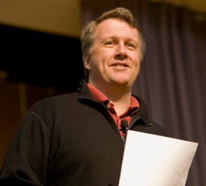
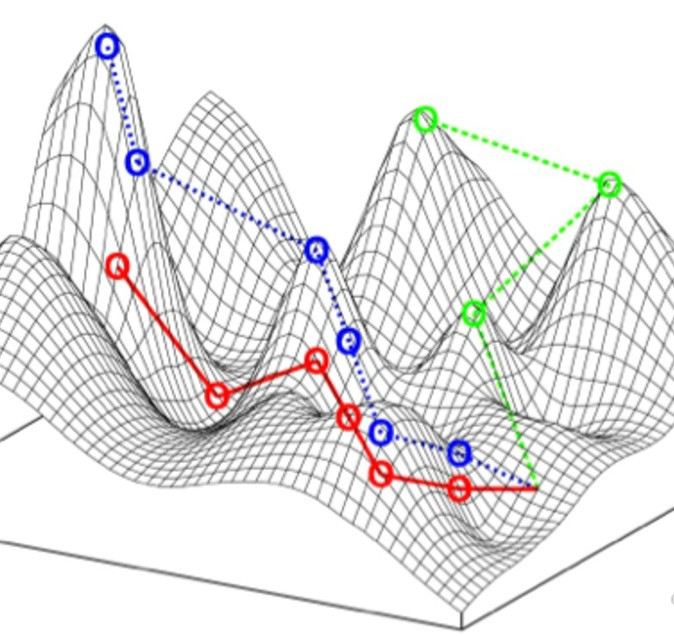

## 1. 일찍 시작해서 한 우물을 파야 성공한다는 생각을 버려라.

타이거 우즈는 7개월 때부터 골프채를 갖고 놀았다. 두살 때 방송에 출연해 골프를 쳤다. 여덟 살 때 아버지를 이겼다. 타이거 우즈의 아버지는 아들이 골프를 위해 선택되었다는 걸 알고, 세살 때부터 언론 기자한테 대답하는 법까지 가르쳤다고 한다.  

라즐로 폴가르는 조기 교육계에서 가장 유명한 인물일 것이다. 라즐로는 제대로 된 교육만 한다면 아이를 천재로 키울 수 있다고 믿었다. 그는 자신의 자녀를 가지고 수십년 간의 원대한 실험을 시작한다. 딸을 체스 챔피언으로 만들기로 마음먹은 것이다. 

2살 때부터 체스를 가르쳤고, 자신이 고안한 교육 프로그램으로 홈스쿨링을 했다. 결과는? 

첫째 딸 수잔은 여성 최초로 그랜드 마스터에 지위에 올랐으며, 소피아는 그랜드 마스터보다 한 단계 낮은 국제 마스터가 되었다. 

셋째 유디트가 가장 뛰어났다. 15살의 나이로 최연소 그랜드마스터가 되었으며 남녀 통합 세계 랭킹 8위까지 올라갔다.

폴가르 가족이나 타이거 우즈의 스토리를 듣다보면, 우리는 은근히 선입견을 갖게 된다. 어릴 때부터 목표를 정하고, 한 우물에 매진해야 최고의 자리에 오를 수 있다고. 일찍 시작해서 '1만 시간의 연습'을 채워야 한다고 말이다. 

하지만 사실이 아니다. 그 이야기들은 매력적이기 때문에 널리 알려진 것 뿐이다. 

좀 더 깊이 살펴보면 이야기는 더 모호해진다. 위대한 성공을 한 사람들 중에서는 그런 깔끔한 길을 따라가지 않는 사람이 훨씬 더 많다. 

타이거 우즈와 라즐로 폴가르가 의도적 연습을 통해 최고가 된 것은 맞다. 

하지만 체스나 골프는 비교적 규칙이 일정하고 피드백이 빠르고 정확하다. 즉, 학습하기 좋은 환경이다. 이런 환경에선 경험과 반복 훈련을 많이 쌓는 조기 전문화가 효과를 볼 수 있다. 외과 의사, 회계사, 포커 선수 등등도 마찬가지다.

세상은 그렇게 단순하지 않다. 대부분은 규칙이 모호하거나 불완전하다. 피드백도 늦거나 부정확하다. 반복되는 패턴이 있는지도 모른다. 그래서 조기 전문화가 오히려 역효과를 가져올 때가 많다.

음악, 예술, 스포츠, 경영, 과학 분야에서 잘 나가는 사람들의 과거를 보면, 남들보다 한참 늦은 나이에 시작하기도 하고, 전혀 다른 분야에서 시작해 넘어오기도 한다. (노벨상 수상 과학자들은 일반 과학자들보다 자기 분야 이외의 취미가 있을 확률이 22배 높다!)

그러니 한 마디로 요약하면 이렇다. **뒤쳐진다고 느끼지 마라.** 일찍부터 한 우물을 파야만 성공할 수 있다는 생각을 버려라. 당신은 당신이 어디로 나아가고 있는지 조차 모를 수 있다. 

대신 실험을 해라. 기꺼이 배우고 수정하자. 필요하다면 완전히 포기하고 방향을 틀자.  비효율을 감수하자. 자신의 경험을 폭넓게 확장하자. 

**- 데이비드 엡스타인, <[늦깎이 천재들의 비밀](http://www.yes24.com/Product/Goods/90175929)>에서** 

## 2. 목표에서부터 거꾸로 하지 말고, 지금 보이는 가능성에서부터 앞으로 해나가자

> 앞으로 뭘 하고 싶니?

사람들은 여러분에게 항상 이걸 물을 겁니다. 그러니 여러분은 답을 알아야 하는 거고요. 

만약 제가 고등학교로 돌아가서, 누군가 저에게 그런 질문을 한다면, 저는 "어떤 선택지가 있는지 배우는 것''을 하고 싶다고 말하겠습니다. 

인생에서 하고 싶은 일을 선택할 때 그렇게 서두를 필요가 없습니다. 당신이 뭘 좋아하는지 부터 발견하면 됩니다. 무언가 잘하고 싶다면, 당신이 좋아하는 것을 해야하니까요.

'내가 좋아하는 것'을 아는 것만큼 쉬운 게 어디있냐고 생각할지 모르겠습니다. 하지만 실제로는 어렵습니다. 

사실 여러분은 어떤 직업이 실제로 어떤지 정확하게 알지 못합니다. 의사가 되는 것은 TV에서 보는 것과 완전히 다릅니다. 

심지어 어떤 직업은 아예 존재하지도 않죠. 제가 10년 간 했던 일들은, 제가 고등학생 때에는 존재하지도 않았습니다. 세상은 빠르게 바뀌고 있습니다. 이런 세상에서 고정된 목표를 갖는 건 좋은 생각이 아닙니다.

많은 졸업 연설에서 이런 말을 합니다. 

> "꿈을 포기하지 마라." 

무슨 말인진 알지만, 별로 좋은 방식이 아닙니다. 미리 세운 계획을 가지고, 끝까지 버티라는 뜻이기 때문입니다.

**목표에서부터 필요한 것을 거꾸로 (backward) 해나가는 대신에, 지금 보이는 유망한 가능성에서부터 앞으로 (forward) 나아가세요.** 

그것이 가장 성공한 사람들이 실제로 하는 방식입니다. 

'포기하지마'식 졸업 연설 접근법에서는, 20년 뒤에 내가 무엇을 할지 정하고 나서, 그러려면 지금부터 뭘 해야 할까? 라고 묻습니다.

하지만 저는 미래의 무언가에 얽매이지 말라고 하고 싶습니다.

현재 내 앞에 놓여진 선택지를 살펴보고, 그 선택지 다음에 나한테 더 좋은 기회를 줄 수 있을만한 것을 고르세요.

**- 폴 그레이엄, <[그 때 알았더라면 하고 나중에 바라게 될 것](http://www.paulgraham.com/hs.html)>에서**

## 3. 목적지를 정하는 대신, 경사 상승법을 사용하자.

경사 상승법 (gradient ascent). 도달할 수 있는 최고점을 빨리 찾아내는 문제를 해결하기 위해, 수학자들이 쓰는 알고리즘이다. 렌즈, 무선 센서망, 정보 검색 시스템 등에 사용되는 원리이기도 하다.

간단히 설명하면 이렇다. 우리는 정상이 어디인지, 전체 지도가 어떻게 생겼는지 잘 알지 못하는 상황이다. 이 때 정상으로 올라가려면 어떻게 해야할까. 

출발지점에서 근처의 모든 경사지를 둘러본다. 어떤 경사의 기울기가 가장 가파른지 파악한다. 그쪽 경사지를 타고 올라간다. 거기 멈춰선 후에 다시 주변을 둘러본다. 더 가파른 경사지를 찾는다. 

이 단순한 과정을 되풀이하다보면, 점점 높이 올라가서 최고점에 다다르게 된다.

자신만의 길을 찾아 성공한 다크 호스들. 그들은 자신의 커리어에서도 이런 경사 상승 알고리즘을 사용했다. 

일단 자기에게 가장 맞는 전략을 고른다. 그러다가 잠시 멈춰 서서 둘러보며, 그 장소에서 보이는 더 좋은 전략(기울기가 높은 경사)을 살핀다. 없으면 계속 전진하고, 있으면 그쪽으로 옮겨 타기를 반복한다. 

그럴 때마다 완전히 새로운 산으로 도약하게 되기도 한다. 그 산이 전혀 예상하지 못했던 더 높은 정상으로 데려다 줄 수도 있다.

이 방법이 인생에 더 유용한 이유는 단순하다. **모든 사람은 자신의 우수성으로 향하는 지형이 다르기 때문이다.** 

만약 모든 사람이 똑같은 지형을 가졌다면, 그냥 꼭대기에 내비찍고 정해진 길로 열심히 가면 된다. 

하지만 사람마다 동기와 장점의 패턴이 모두 다르다. 즉, 산봉우리와 계곡이 모두 다르게 생겼다. 그러므로 자신의 잠재력을 최대한 끌어내는 길도 모두 다르다. 

이런 상황에서, 나는 X 지점에 꼭 도달하겠어! 라고 선포한 다음에 무작정 그 방향을 향해 가는 것은 좋은 방식이 아니다.

경사 상승법을 받아들이면, **우리는 목적지를 몰라도 목적지에 다다르는 법을 터득할 수 있다.** 

언젠가는 우리 자신만의 정상에 오를 거라는 자신감이 생기는 것이다. 지금 자신에게 가장 가파른 경사가 어디인지 집중하기만 하면 된다.

**- 토드 로즈 & 오기 오가스, <[다크 호스](http://www.yes24.com/Product/Goods/77251201?OzSrank=1)>에서**

