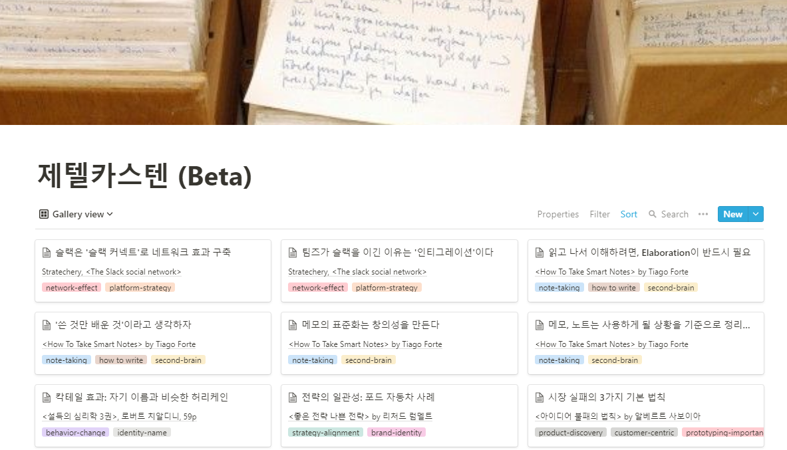

## 고민이 있다, 꽤 오래전부터

책 읽는 걸 좋아한다. 아니 책 말고도 웬만한 지식 콘텐츠는 다 좋아한다. 온라인 아티클, 유튜브 영상, 팟캐스트, 뉴스레터 등등. 누가 시키지 않아도 새로나온 책, 몰랐던 지식, 흥미로운 콘텐츠는 항상 찾아본다.

**하지만, 대부분 잊어버린다.** 당연한 일이다. 사람 뇌엔 한계가 있으니까. 

그런데 너무 아까웠다. 물론 콘텐츠는 재미로 보는 것도 있다. 그치만 어쨌든 지식은 써먹으라고 배우는 거 아닌가.

예전에 분명히 봤던 내용인데, 기억 안 나서 또 읽는 경우도 있고. 책을 읽으면서 생각이 퐁퐁 솟았는데, 나중에 써먹으려고 보면 기억이 안 난다. 심지어 내가 떠올린 생각도 그렇다. 가끔 노트 앱을 들춰보다, 예전에 적어둔 생각을 보고 놀라기도 한다.

올 한 해 글을 많이 쓰다보니, 아쉬움이 더 컸다. 어떤 글이든 세상에 이미 존재하는 주장과 지식들을 잘 편집하고, 내것으로 소화하는 일이다.  

백지에서 글을 시작하려고 하면 참 어렵다. 그럴 때 섭취한 지식을 바로바로 찾아볼 수 있다면 참 좋겠다. 내가 읽은 게 그렇게 적지 않은데 말이야. 막상 글 쓸 때 써먹는 재료는 10분의 1도 안 되는 것 같다.

> 어떻게 하면 내가 읽고 들은 지식을, 내가 쓰는 글에 잘 써먹을 수 있을까?

이게 고민이다.

## 물론 메모 앱을 쓴다

이럴 때 방법은 뭘까? 에버노트나 노션, 구글킵 같은 앱이 떠오른다. 

물론 다 쓰고 있다. 오래전부터 에버노트를 써왔고, 나름 많은 메모를 적었다. 근데 단순 메모한다고 써먹는 건 아니다. 메모의 단(층위)도 각각 다르고. 분야도 다르고. 파편화되어있다. 다시 읽으면서 써먹는 경우가 많지 않았다.  

인터넷에서 파워 유저들의 사용법을 보면서, 알파벳을 넣은 태그도 붙여보고, 노트북도 3단 구조로 정리해봤다. 그러나 조금 하다가, 항상 실패했다. 

이미 있는 메모들의 양이 너무 많았다. 일일히 사후에 정리하려니 금방 지쳤다. 마치 책이 만권쯤 있는데, 도서관처럼 분류하려고 하면 엄두가 안나는 것처럼. 이렇게 분류한다고 내가 정말로 써먹을까하는 의구심도 들었다. 

메모는 두서없이 하나씩 쌓여갔다. 다시 안 읽는 게 태반이었다. 고민은 해결하지 못했다.

## 제텔카스텐: 스마트하게 기록하는 방법

그러다 '[How to take smart notes'](https://fortelabs.co/blog/how-to-take-smart-notes/)란 글을 읽었다. [동명의 책](https://www.amazon.com/How-Take-Smart-Notes-Nonfiction-ebook/dp/B06WVYW33Y)을 정리한 글이다.

주제는 '**우리 뇌의 한계를 보완해줄, 노트 기록 시스템**을 만드는 법'이다. 학생, 연구자, 논픽션 작가들이 타겟 독자다. 

이 글을 읽으며, 뽐뿌가 솟아올랐다. 내가 고민해온 문제점을 정확하게 짚고 있었다. 단순히 적고 묻어두는 메모가 아니라, 내가 무언가를 창조하는 일에 활용하는 메모가 되어야 한다고. 그렇게 하고 싶다면, 이런이런 원칙과 테크닉을 써야한다고 알려줬다.

이 책의 방법론은 **'제텔카스텐'**을 기초로 하고 있다. 제텔카스텐을 만든 사람은 니클라스 루만이다. 1927년부터 1988년가지 살았던 독일 사회학자다. 루만은 엄청난 다작가였다. 약 30년간 58권의 책을 썼다. 

그의 비결은 뭐였을까. 종이 인덱스 카드와 나무 박스를 사용한, 자신만의 지식 관리 시스템이었다. 독일어로 제텔은 노트, 상자가 카스텐이다. 그래서 제텔카스텐(zettelkasten)이라는 이름이 붙었다.

## '제텔카스텐' 만드는 법

제텔카스텐은 지식을 하나의 카드로 표준화하고, 각 카드를 엮어 네트워크로 만든다. 루만이 했던 방법을 간단하게 요약해본다.

- 책을 보다가 기억하고 싶은 (써먹고 싶은) 부분을 종이 인덱스 카드에 적는다.
- 이 때 그냥 베껴쓰면 안 된다. 자신이 중요하다고 생각하는 부분을 골라, 자기 말로 요약해서 써야 한다.
- 뒷면에는 나중에 찾아볼 수 있게 출처를 적는다. 이 카드를 레퍼런스 노트(Reference note)라고 한다.
- 일상생활에서 떠오르는 생각이 있을 때도 카드에 적어둔다. 이건 플리팅(Fleeting note)라고 한다.
- 1주일에 한번 정도, 쌓인 노트를 쭉 읽어본다. 여러 노트를 보면서, 다음과 같은 질문을 던진다.
  - '이 아이디어가 내가 알고 있는 것과 어떻게 연결되지?'
  - '이 아이디어를 다른 방법으로 설명할 순 없을까?'
  - 'X 아이디어는 Y 아이디어에게 어떤 의미가 있을까?'
- 그러면서 떠오른 생각을 다시 인덱스 카드에 적는다. 이걸 퍼머넌트 노트(Permanent note)라고 한다.
- 퍼머넌트 노트는 이미 있는 퍼머넌트 노트와 연결한다. 서로 관련있는 노트에 번호를 매긴 뒤, 박스 안에 바로 뒤 순서로 끼워넣는다.
- 나중에 글을 쓸 때가 되면 박스를 열어 노트를 읽어본다. 
- 노트를 조합하고, 아이디어를 추가해 글의 개요를 잡는다.

## 지식을 기록하고 연결하는 '두번째 뇌'

제텔카스텐이 해결하려는 건, 내가 고민하던 바로 그 문제였다. 난 글을 잘 쓰기 위해 내 뇌의 기억과 처리 능력의 한계를 극복할, 두번째 뇌가 필요했다. 이런 시스템이 있으면 2가지 장점이 있다.

**첫째, 글을 쓰기가 쉬워진다**

백지 상태에서 처음부터 글을 쌓아올린 건 어렵다. 하지만 내가 무언가를 쓰려고 할 때 재료로 쓸 수 있는 아이디어 조합들이 항상 준비되어있다면, 글의 개요를 잡거나, 주장에 근거가 필요하거나, 재미있는 사례가 필요할 때. 언제든지 꺼내쓸 수 있다.

**둘째, 창의적인 생각에 도움이 된다**

> 창의성은 그냥 무언가를 서로 연결하는 거야 
> (Creativity is just connecting things) 
>
> -스티브 잡스

창의성을 논할 때 꼭 등장하는 것이 **연결, 편집, 다르게 보기. 낯선 조합** 등이다. 없던 걸 만들어내는 게 아니라, **이미 가진 것을 참신한 방법으로 연결하는 것**이 창의성이라는 거다. 나도 이 말에 동의한다. 

하지만 머릿속에서 아이디어를 연결시키는 일은 쉬운 게 아니다. 메모를 하면, 더 많은 아이디어를 기억하고, 그것을 내 의식과 떨어뜨려 객관적으로 관찰하게 해준다. 다양한 아이디어를 충돌시키고 연결하게 돕는다. 그러면서 새로운 글감, 새로운 주장을 뽑아낼 수 있다.

## 제텔카스텐에서 뽑은 '두번째 뇌 만들기' 원칙

니클라스 루만의 방법을 그대로 따라할 필요는 없다고 생각한다. 하지만 제텔카스텐이 기초로 하고 있는 핵심 원칙은 새겨둘만 하다. 내가 가장 공감한 원칙을 3가지만 꼽아본다.

1. **무언가를 읽고, 내것으로 만들려면 반드시 내 언어로 풀어 설명해야 한다**

보거나 읽었다고 내 것이 되지 않는다. 많은 양의 정보를 섭취해도, 어차피 대부분은 잊어버린다. 의미있는, 써먹을 수 있는 지식으로 바꾸려면 반드시 내가 개입해야 한다. 번역, 정리, 요약해서 내가 쓰는 말로 다시 설명해야 한다. 

더 나아가 내가 아는 것과 잘 들어맞는지, 다른 주장과는 어떻게 다른지 적어야 한다. 이걸 머릿속에서 하긴 어렵다. 그래서 글쓰기가 중요하다. 

글쓰기는 단순히 머릿속으로 생각한 결과를 기록하는 행위가 아니다. 그 반대다. 기록을 하면서, 생각이 일어난다. 내 머릿속에 깊게 들어온다. 

따라서 내 지식의 양은 '얼마나 많은 정보를 소비했나'로 측정해선 안 된다. 내 지식의 양은 '읽고 들은 정보를 기반으로, 내가 얼마나 쓰고 공유했는가'로 측정해야 한다.

2. **메모는 주제가 아니라 사용하게 될 맥락으로 정리한다**

보통 메모를 하면 그 메모와 관련된 주제(topic)를 기준으로 분류한다. 예를 들어, 메모 앱에 관한 글이라면 '생산성(productivity)'에 넣고, 금리에 관한 글이라면 '경제(Economics)' 라고 분류하는 식이다. 

그렇게 하면 나중에 써먹을 수 없다. 주제나 소주제로 분류하면, 어떻게 활용해야할지 감이 오지 않는다. 점점 노트가 늘어났을 때 양에 압도당하게 된다. 주제로 분류하면 의미있는 연결을 보지 못한다.

맥락(context)를 기준으로 분류해야 한다. 맥락이란 '이 메모를 다시 봐야할 상황'을 뜻한다. '이 노트를 내가 다시 본다면 어떤 상황일까?'를 생각하자. 어디서 왔는지가 아니라, 어디로 가야할지를 생각해 분류해라.

이 방법은 생각할 시간이 좀 필요하다. 바로 떠오르지 않을 수 있다. 재테크에 관한 메모를 봤는데, 나중에 정치 얘기를 하면서 쓸 수도 있기 때문이다. 그러나 정답은 없다. 너무 완벽하게 붙이려고 하진 말자. 

3. **표준화가 창의성을 만든다.**

저자는 인덱스 카드를 물류업계에서 쓰는 '컨테이너'에 비유한다. 컨테이너 그 자체는 그냥 상자일 뿐이다. 박스 자체에는 신비로운 힘이 없다. 하지만 전세계 물류망에서 전부 이 표준을 쓰는 순간, 어마어마한 변화를 만들었다. 국제 무역을 엄청나게 효율화시켰다. 표준화된 컨테이너는 [세계 경제사를 바꾼 발명품](https://dbr.donga.com/article/view/1203/article_no/7393)이다.

우리가 평소에 아이디어를 기록하는 방법도, 국제 물류만큼 엄청 파편화되어있다. 우리는 밑줄을 치기도 하고, 책 빈 공간에 쓰기도 하고, 웹 기사를 스크랩하기도 하고, SNS에서 나중에 보기를 하기도 하고, 휴대폰 메모 앱에 짧게 휘갈겨 적기도 한다. 단순히 형식뿐만이 아니다. 가공하는 방법, 정보의 단도 모두 다르다. 그러니 이 메모를 다시 들여다보고 써먹으려면, 엄청난 시간과 노력이 든다.

하지만 노트 형식과 가공 과정을 표준화해두면, 나중에 정리하고 연결하기가 쉬워진다. 진짜 중요한 과정에 집중할 수 있다. 어디가서 어떻게 정보를 찾아야할지 명확하다. 

## 나만의 제텔카스텐, 베타 버전

나도 직접 '두번째 뇌'를 만들어가보기로 했다. 원칙을 활용하되 종이 인덱스 카드를 굳이 꼭 따라할 필요는 없다고 생각했다. 내 라이프스타일과 워크플로우에 맞춰 적절한 시스템을 만들면 된다. 

어플리케이션을 뭘로 쓰지 싶어서 검색해봤다. 'How to take smart note' 책이 나온 이후로 해외 생산성 커뮤니티에서 좀 이슈가 되었나보다. 유튜브 영상도 많고, 제텔카스텐을 위한 소프트웨어도 여러 개 나와있었다. Roam research라는 프로그램이 유명해서 봤는데 너무 복잡하고 비쌌다. 

그냥 노션으로 하기로 했다. 일단 나에게 익숙하고 추가 비용이 없다. 제텔카스텐에 최적화되어있진 않지만, 그래도 충분히 많은 기능을 지원한다. 

처음부터 완벽하게 체계를 짜려는 마음을 경계했다. 체계가 없어서 문제인 경우보다, 처음부터 완벽하게 하려다가 막상 진행은 못하고 흐지부지 되는 경우가 더 많다. 

얻고자 하는 효과와 내가 투입할 수 있는 에너지를 고려해, 적정하고 지속가능한 방식을 찾아야 한다.

**내가 시도하기로 한 방법은 다음과 같다.**

- 좋은 책을 하나 정한다. (혹은 영상, 아티클) 예전에 읽은 책이어도 좋다. 그 책을 1~2주간 들고 다니면서, 메모를 한다. (대상을 정하는 에너지를 줄일 수 있음)
- 메모할 때 제목은 문장형으로 쓴다. 책 내용을 그대로 적지 않고, 나름대로 요약 정리해 적는다. 가능한 300자를 넘지 않도록 한다. (지식을 내 것으로 체화하기 위한 방법)
- 태그는 '나중에 쓸 글의 주제'으로 단다. 이 메모를 나중에 글에 써먹는다면, 그 글의 주제는 무엇일까라고 생각해본다. 2단어를 합쳐 쓴다. 예를 들면, Platform-strategy나 Howto-write 같은 식이다.
- 프로퍼티 칸에 노트의 출처, 연관된 노트를 적는다. 
- 1주일에 한번씩 노트를 읽어본다. 내용을 수정하거나, 다른 노트와 연결하거나, 노트 여러개를 결합해 새로운 노트를 만들어낸다.
 

처음에는 별 티가 나지 않지만, 메모 수가 1000개가 넘어가면 굉장한 효과를 볼 수 있다고 한다. 한번 꾸준히 채워봐야겠다. 나중에 글 쓰는 데 술술 활용되는 날이 오면 좋겠다.

 
