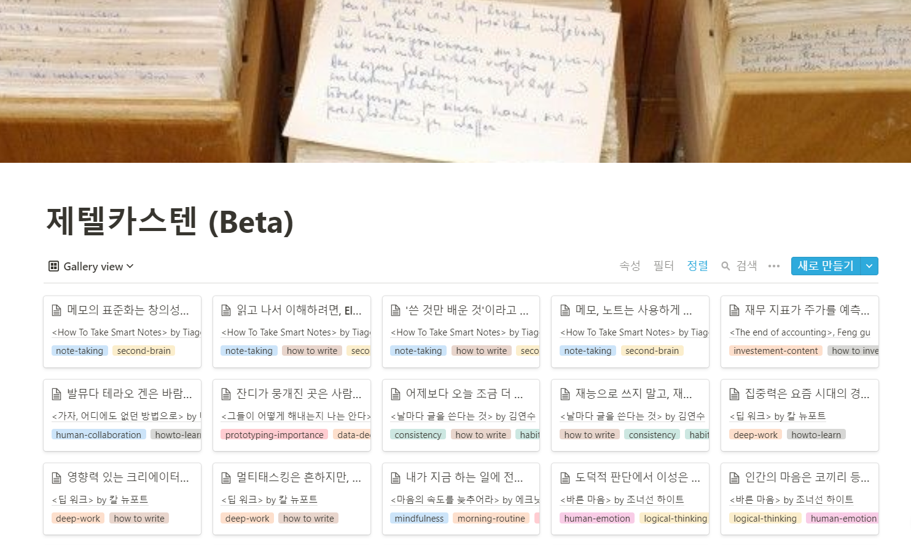
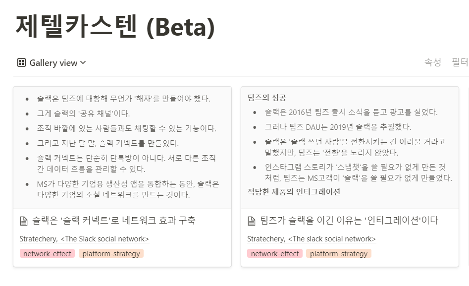
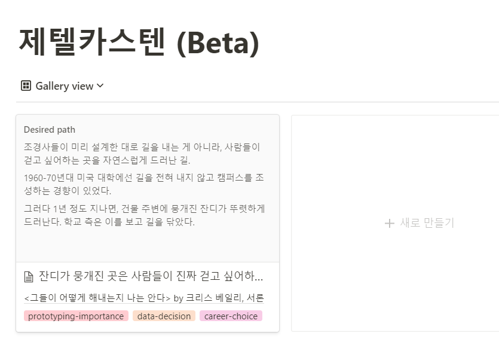
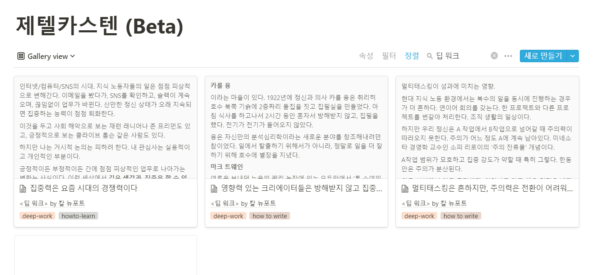
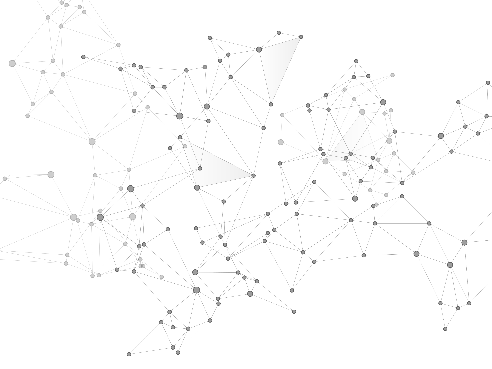

제텔카스텐 프로젝트를 시작한 지 약 1달이 지났다. 그 동안 느낀 점 5가지를 간단하게 정리해본다.

 

## 1. 기록, 요약만으로도 효과가 크다

> 무언가 읽기 <<< 읽고 기록하기 <<< 기록을 내 말로 요약하기

제텔카스텐 카드를 기록하는 방법. 읽으면서 '이 부분 좋은데'하는 곳을 찾는다. 그 부분을 컴퓨터에 옮겨적는다. 적은 내용을 내 말로 요약한다. 

이 과정을 반복하면, 눈으로 읽은 건 생각보다 별 의미가 없다는 걸 알게 된다. 기록을 해보면, 읽으면서 놓친 부분이 정말 많다. 요약을 해보면, 한번 읽었따고 제대로 이해한 게 아니란 걸 깨닫는다. 

읽기와 기록과 요약 사이에는 엄청난 차이가 있다. 읽고 나서 기록과 요약 단계까지 가면 더 깊은 생각이 솟아나고 이해가 깊어진다. 입력(Input)이 아니라 출력(Output)이 반드시 나와줘야 학습 효과가 있다. 머리로는 알고 있던 내용. 하지만 제텔카스텐을 해보니 더 실감난다.

물론 제텔카스텐의 주목적은 차후 활용에 있다. 하지만 카드 작성은 단순히 그 목적을 위한 따분한 준비만은 아니다. 카드를 작성 과정에서 꼭 해야하는 기록, 요약만으로도 꽤 많은 영감을 받는다.

## 2. 카드를 작성하다 글감을 찾기도 한다

지난 한달 동안 제텔카스텐 덕분에 쓴 글도 꽤 된다. 기록, 요약을 하다가 글감이 생각난 경우다. 

 

뉴스레터 'Stratechery'에서 슬랙 분석 글을 봤다. 메모했다. 할 땐 별 생각 없었다. '어디 써먹을지는 잘 모르겠지만, 흥미롭다, 기록해두자'는 기분이었다. 이 내용만으로는 완전한 글이 되긴 부족했다.

하지만 카드를 메모한 덕분에, 그 후 우연히 잔디 이사님을 만났을 때, 요즘 슬랙 어떤 것 같으세요?  라는 질문을 자연스럽게 할 수 있었다. 업계 전문가시니까 당연히 재미있는 이야기를 많이 해주셨다. .

또 그 다음 날에는 '슬랙이 반독점 법으로 팀즈를 고소했다'는 뉴스도 나왔다. 그 뉴스도 새로운 재료로 보였다. 마치 눈사람 만들 때 처럼, 눈덩이를 하나 뭉쳐두니까, 점점 새로운 눈이 붙어서 커져갔다.결국 모아진 눈덩이를 정리해 '앞서가는 팀즈 vs 받아치는 슬랙, 협업 툴 전쟁 승자는?'라는 기사를 쓸 수 있었다. 

 

'그들이 어떻게 해내는지 안다'라는 책을 한번 훑어봤다. 생산성에 관한 책이었는데 다 읽지도 않았다. 다만 서론에 저자가 쓴 이야기 하나가 눈에 들어왔다. 디자이어드 패스(Desired path)라는 개념이었다. 흥미로워서 제텔카스텐에 메모해뒀다. 

나중에 인스타그램 1일1글을 쓸 때였다. '내 커리어는 어디로 가게 되는 걸까' 불안하고 고민이 많던 날이었다. 갑자기 그 디자이어드 패스 얘기가 떠올랐다. 인생에도 디자이어드 패스 접근법을 적용하면 좋겠다라는 생각이 문득 들었다.. 실제로 그렇게 살고 있는 건 아니지만. 그렇게 살고 싶다는 마음을 담아 짧은 글을 올렸다. 

 

'글쓰기는 환경빨이다'를 쓸 때도 제텔카스텐이 도움이 됐다. 맨 처음 이 글의 소재는 '2주 간 집중 글쓰기를 한 내 경험에 대한 회고'였다. 하지만 집중 기간 자체는 별로 재미있는 게 없었다. 

고민해본 결과, '집중할 수 있었던 이유'에 초점을 맞추기로 했다. 그게 '글쓰기 환경'이었다. 이 전에 '딥 워크'라는 책과, '생각하지 않는 사람들'을 읽고 몇 개를 메모해뒀다. 환경이 어떻게 생각에 영향을 미치는 지에 대한 내용이었다. 이 메모를 활용해서 글을 뒷받침할 수 있었다.

## 3. 주로 책에서 본 '공감하는 주장'을 메모한다.

난 대부분 논증이나 설명이 담긴 글을 쓴다. 그러다보니 아무래도 논증을 메모하는 경우가 많다. **뾰족하고 일리있는 주장들.**  

<바른 마음> : '감정은 이성의 하인이다' 

<사피엔스> : '역사의 쓸모는 예측이 아니라 상상력이다' 

<생각하지 않는 사람들> : '기억의 아웃소싱은 일견 좋아보이지만, 장기기억을 해친다

내가 동의하는 주장도 있고, 아닌 주장도 있지만 모두 일리있고 생각해볼만한 주장들이다. 노트의 70% 정도는 이런 유형이다.

**실험 결과**도 있다. 흥미로운 실험 결과는 글쓸 때 근거로 활용하기 매우 좋다. 수해 기부자들은 자기 이름과 비슷한 허리케인일 때 기부를 더 많이 하는 경향이 있다든지, 책을 읽기 전에 목적 질문을 떠올리게 하자 학습 효율이 향상되었다든지 하는 식이다. 

**에피소드**도 있다. 넷플릭스라는 이름이 탄생한 썰. 발뮤다 창업자 테라오겐이 자연풍 선풍기를 개발한 에피소드. 이런 건 딱 명확한 주제 의식이나 교훈이 있는 건 아니다. 다만 이야기에 울림이 있어서 적어놓는다. 나중에는 어떤 의미를 부여할 수도 있으리라 생각하면서.

그러나 '재미있음' 기준으로 적지는 않는다. 나중에 잘 활용될 수 있는 지식만 밀도높게 담고 싶기 때문이다. 

재밌거나 감명깊은 구절을 다 적을 수 있지만, 양이 불필요하게 많아질 수 있다. 그러면 나중에 연결하거나 활용하는 데 오히려 어려울 수도 있다 싶었다. 일단은 보수적으로 접근한다. 명확한 핵심 포인트가 있는 내용만 카드로 남긴다.

## 4. 아직 카드의 연결에서 영감을 받지는 못했다.

기록과 요약을 통해 카드를 하나 만든다. 말했듯이 이 과정에선 효과를 느끼고 있다.  

그리고 나선 다른 노트들을 다시 한번 훑어보면서 연결되는 내용이 있는지 보고 연결한다. 아직 연결과 충돌에선 글감을 얻진 못했다. 

내가 뭔가 연결하는 행위를 적극적으로 안 해서일까? 아니면 단순 카드가 부족해서일까? 지금 카드 개수는 50개 정도다. 아직 적은 숫자기는 하다. 

점을 찍고, 선을 몇 개 그었다. 아직 어떤 무늬나 그림이 나오기에는 조금 선 개수가 부족한 것 같다. 그러나 생각보다 노트 하나를 쓰는 데 시간이 많이 걸린다.

 

## 5. 노트 하나 쓰는 데 20-30분 걸린다.

사실 그냥 책을 메모한다고 생각하면 금방 끝날 것 같다. 직접 해보니 최소 20분이나 걸렸다. 책을 읽는 시간을 빼도 그렇다. 

하나의 카드를 만드는 과정은 꽤 할 일이 많다. 

책 내용을 한번 베껴적는다. -> 짧게 요약한다 -> 원문을 지운다 -> 태그를 단다 -> 출처를 단다 -> 다른 노트에 링크를 건다. 

요약이나 연결할 땐 은근히 생각을 좀 해야한다. 시간이 꽤 걸릴 수밖에 없다.

인터넷에 보니 노트 개수가 1000개가 되면 진짜 효과를 느끼기 시작한다고 한다. 1달에 50개면 좀 속도가 느리다. 

그래도  지금 목표는 '하루에 카드 하나'로 잡았다.  장기 프로젝트일수록, 시작은 가볍고 꾸준하게 하는 게 좋다. 팔굽혀펴기도 갑자기 하루 100개는 못한다. 하지만 하루 하나씩 하는 습관을 들이고 나면 그 다음부터는 계속 늘려갈 수 있다. 

제텔카스텐은 아직 내 몸에 습관화되지가 않았다. 일단 '하루 하나'라는 작은 목표로 유지하는 중이다. 조금 더 익숙해지면 속도를 늘릴 필요는 있어보인다. 
